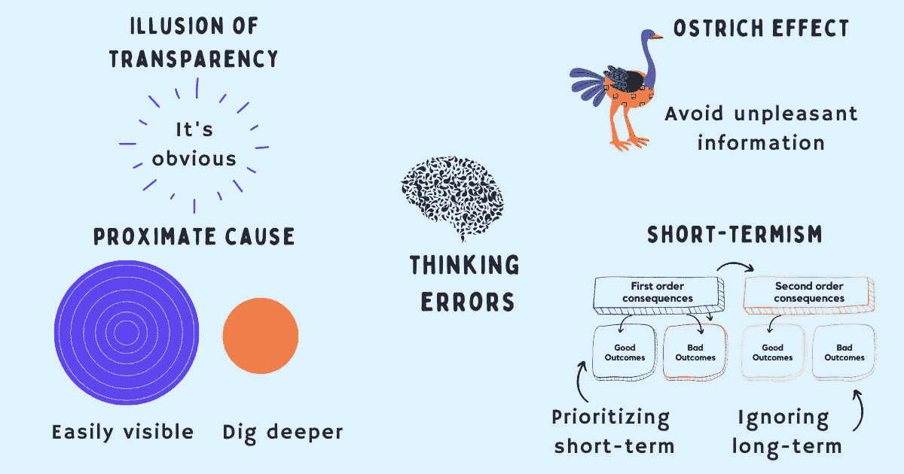

# 无效领导者的 4 个思维陷阱

> 原文：<https://betterprogramming.pub/4-thinking-traps-of-ineffective-leaders-7802b0ae5ce2>

## 思维错误是人类的一个普遍现象。让我们了解要警惕的陷阱，并学习如何避免它们

鸣谢:作者

领导也是时不时会犯错误的普通人。虽然有些错误无关紧要或具有轻微的负面后果，但其他错误可能对组织及其人员造成潜在的危害和损害。

这些错误大部分都是无意的——它们源于思维错误、走捷径和没有使用正确的思维模式。当领导者没有停下来反思的时候，他们会做出糟糕的选择和糟糕的决定，伤害到员工的生产力和整个组织的绩效。

有效的领导者并不完美——他们和其他人一样面临着同样的局限和偏见。他们也在与常见的思维陷阱和偶尔的判断失误作斗争。然而，他们并没有让他们的头脑来引导，而是关注他们如何思考，如何做决定，以及他们可以做些什么来纠正他们的错误。

以下是 8 个最重要的思维陷阱，他们要警惕并尽量避免:

1.  透明的错觉
2.  近因
3.  短期主义
4.  鸵鸟效应
5.  古德哈特定律
6.  眼镜蛇效应
7.  黑白思维
8.  单凭直觉

我们来详细说说。

# 透明的错觉

那些认为他们的想法、需求和感受对其他人来说是显而易见的领导者，在他们的交流中不会清晰明确。

透明错觉是一种谬误，它让他们高估了自己与他人交流思想和情感的效率。

> 我们总是知道我们的话意味着什么，所以我们希望别人也知道这一点。阅读我们自己的作品时，在我们对自己真正意图的理解的指引下，意图的解释很容易到位。很难理解一个必须盲目解读、只受文字引导的人。不要急于指责那些误解了你非常清楚的句子的人，无论是口头还是书面的。很有可能，你的话比你想象的更模棱两可——埃利泽·尤德科夫斯基

## 如何避免透明的错觉

为了避免透明错觉的影响，请记住:

1.  人们无法读懂你的心思，预测你需要什么。
2.  人们对你的关注比你想象的要少得多。
3.  别人不能正确地猜测你在想什么或感觉什么。
4.  你对某事的体验和别人对它的看法之间有差距。
5.  对你来说显而易见的事情对别人来说并不那么明显。

明确说出你想听到的内容。确保其他人和你一样理解，提出问题来验证你的理解，寻求一致，并经常重复重要的内容。

## 透明错觉的例子

工程副总裁 John 肩负着一项重要的业务里程碑任务。当与他的团队交谈时，他专注于他们需要实现的具体结果，而没有明确地分享为什么该项目需要特别关注，或者为什么他害怕达不到目标。他对这个项目感到紧张，因为它涉及一定的风险，但没有大声说出来，也没有与他的团队讨论。

透明的错觉让他认为其他人的想法和感受和他一样，但后来当他发现自己的想法对他来说很明显，而对其他人来说没那么明显时，他感到失望。

# 近因

当工作中发生错误和差错时，什么引起了领导的注意——立即导致它发生的事情(近因)或为什么会发生的背后的真正原因(根本原因)？

接受就在他们面前的貌似合理的解释是很容易的。但如果不深入挖掘，他们会浪费时间解决表面问题，而忽略需要他们关注的真正原因。

## 如何避免近因

使用“五个为什么”技术从近因分析转移到确定根本原因。这项技术由丰田章男设计，在丰田汽车公司制造方法的发展过程中被使用。

询问错误发生的原因，并将答案作为下一个问题的前提。重复整个过程五次，以深入挖掘问题的实际原因。通过重复“为什么”五次，问题的本质和解决方法就变得清晰了。

## 近因示例

卡罗尔正在领导新的商业计划。已经超过承诺的最后期限两周了，卡罗尔不耐烦地等待着好消息。当她询问是什么导致了延迟时，她被告知“工程师们比预期花费了更长的时间。”

在这种情况下，近因似乎是工程延误，但这只是故事的一部分。为了找出真正的根本原因，让我们使用五个为什么技巧:

1.  问:“为什么项目在承诺的时间表之后交付？”答:工程师花的时间比预期的要多。
2.  问:“为什么工程师需要比预期更多的时间？”a:他们不得不修改一些需求。
3.  问:“为什么需要返工？”答:产品团队在两者之间改变了需求。
4.  问:“为什么产品团队改变了需求？”答:他们做出的某些假设不再正确。
5.  问:“为什么他们不在项目开始前验证这些假设？”a:他们假设最小的努力，以防需求后来改变，并且没有为它做计划。

# 短期主义

当领导者专注于短期结果、短期补救措施和短期结果时，他们就无法进行长期规划。

短期思维，也称为短期主义，提供了即时的满足感和暂时的放松，并给人一种进步的错觉。这很诱人，因为它需要更少的认知资源、时间、努力和资源来实现。然而，它让领导者对未来毫无准备。从长远来看，为现在优化而不考虑未来实际上可能是昂贵的。

> 未能考虑二阶和三阶后果是许多痛苦的糟糕决定的原因，当第一个次等选择证实了你自己的偏见时，这尤其致命。在你提出问题和探索之前，永远不要抓住第一个可行的选择，不管它看起来有多好——雷伊·达里奥

## 如何避免短期主义

短期主义源于以长期收益为代价优化短期痛苦的倾向。避免这种思维方式的一个强有力的心智模式是[二阶思维](https://www.techtello.com/second-order-thinking/)。它通过思考未来的后果来揭示我们的决定的含义。

要发展二阶思维技能，请遵循以下步骤:

1.  记下你想到的第一个解决方案及其直接的正面和负面影响。这是你的一阶思维。
2.  然后问“这个决定的未来后果是什么”来评估第二、第三级……第 n 级后果。对于每一个决定和水平，写下相应的积极和消极。
3.  问问题，越来越多的问题，从这些问题中学习:

*   这个决定会给我带来什么风险？
*   我的决定如何影响他人？
*   别人对我的决定怎么看？
*   为什么我觉得我的决定是对的？
*   我可以应用[奥卡姆剃刀](https://www.techtello.com/occams-razor/)来寻求更简单的解决方案吗？

4.选择二阶和三阶结果为正的决策，即使第一阶可能不是正的(短期痛苦有利于长期收益)。

5.识别并运用反馈回路。它可能对你当前的决定没有帮助，但随着时间的推移，它会使你做出更好的决定。

## 短期主义的例子

卡米拉担心，如果她不能很快雇人，她的项目将被推迟。她采访了罗恩，他似乎很适合当前的项目。然而，他缺乏处理更高层次职责的关键技能和经验。

她没有考虑组织的未来需求而雇佣某人，而是决定让 Ron 加入进来，以后再解决这个问题。一开始做得很好的罗恩，一旦工作的复杂性增加，就开始挣扎。短期主义使卡米拉优先考虑她的短期需求，而不考虑她的决定对未来的影响。

在这种情况下运用二阶思维可以帮助卡米拉避免这个致命的错误。通过考虑职位的未来要求，她可以意识到最好继续寻找，找到更合适的人。

# 鸵鸟效应

鸵鸟在感觉到危险时会把头埋在沙子里，认为只要它们避开危险足够长的时间，危险就会过去。

当处理令人不快或不受欢迎的信息，引起强烈的负面情绪反应时，领导者可能会假装这些信息不存在，像鸵鸟一样把头埋在沙子里。

拖延一些重要的事情会带来巨大的代价和更糟糕的后果——简单的问题在被忽视足够长的时间后会变成更复杂的情况，使情况变得更糟，以后更难处理。

## 如何避免鸵鸟效应

为避免对不良信息做出不利反应:

1.  小步前进。我们的大脑并不认为一小步是一种威胁。
2.  问有力的问题。伟大的问题能够解开关键信息，帮助你做出更好的决定。
3.  学会拥抱不适。把它看作是你在伸展、拓展你的技能和做一些有价值的工作的标志。
4.  提醒自己，拖延问题不会让它消失，只会让它变得更糟。

## 鸵鸟效应的例子

门迪是 SaaS 一家公司的产品总监。她在团队中的一个高绩效员工最近表现不佳。有很多抱怨说，他大喊大叫，贬低别人来完成工作。但是她没有给出这个人需要的反馈，而是一直拖延。如果给予这样的反馈，他可能会离职，这种担忧让门迪完全回避了这个话题。

就像鸵鸟一样，她希望问题会消失，如果她只是回避足够长的时间。然而，让冲突得不到解决，并且不对这个人设定行为预期，只会让情况变得更糟。多名团队成员决定辞职，因为他们拒绝忍受有毒的工作环境。

> 在生活和商业中，盲点最少的人会赢。消除盲点意味着我们看到现实，与现实互动，并更接近理解现实。我们想得更好。更好地思考就是找到简单的过程，帮助我们从多个维度和角度解决问题，让我们更好地选择适合我们的解决方案。为正确的问题找到正确的解决方案的技能是智慧的一种形式

在这篇文章中，我已经涵盖了前 4 个思维错误。下一篇文章将讨论剩下的 4 个。

## 摘要

1.  思维错误是人类常见的一部分。然而，作为一名领导者，一些错误可能会对组织及其员工造成损害。
2.  有效的领导者有意识地关注他们如何思考和决策。他们小心可能导致判断错误的思维陷阱。
3.  透明的错觉会妨碍他们有效地交流，因为他们认为自己的想法和感觉对别人和对自己一样明显。
4.  当工作中出现错误时，将近因误认为根本原因会阻碍领导者深入挖掘并揭示真正的原因。
5.  短期主义导致短期思维，这使得领导者在没有长期规划的情况下优化短期目标。这不仅成本高昂，而且让他们没有做好应对未来需求的准备。
6.  当领导者表现得像鸵鸟一样，把头埋在沙子里以避免处理不愉快的信息时，问题会变得更糟，而不是消失。

在 Twitter 上关注我，了解更多故事。这篇报道最初发表在 https://www.techtello.com 的 T2。