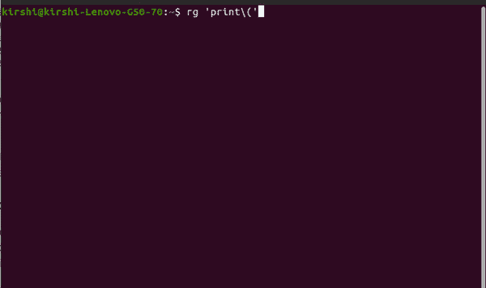

# 4 款节省时间的 Linux 工具，改善您的工作流程

> 原文：<https://betterprogramming.pub/4-time-saving-linux-tools-to-improve-your-workflow-54604d574d53>

## 一组方便的 Linux 工具，用于加速日常任务


[Jr Korpa](https://unsplash.com/@jrkorpa?utm_source=medium&utm_medium=referral) 在 [Unsplash](https://unsplash.com?utm_source=medium&utm_medium=referral) 上拍照

如果您在 Linux 上工作，您经常遇到的任务可能包括递归搜索目录以查找文件、查找系统进程、管理多个终端会话以执行并行操作，等等。

在本文中，我将向您展示一些强大的 Linux 工具，它们可以使日常任务变得更加容易。

*本文中的例子是在 Ubuntu 上试用的。*

让我们检查一下！

# 1.HSTR

HSTR 是一个简单灵活的工具，可以帮助你搜索历史命令。它带来了改进的`bash` / `zsh`命令完成。

它允许你管理你的命令历史。例如，您可以删除过时的命令或收藏您喜欢的命令。

要在 Ubuntu 21.10+中安装它，只需运行以下命令:

```
sudo apt install hstr
```

语法如下: *hstr +关键字。*

## 运行中的工具

让我们假设我们想要找到最近执行的`curl`命令:


执行 hstr 命令来查找 curl 命令

您可以使用箭头键浏览列表，并按下 **Enter** 运行所选命令。

如您所见，这使得查找和运行您想要的命令变得非常容易。

# 2.Fkill

Fkill 是一个方便的跨平台工具，可以删除进程。

毫无疑问，您对 Linux 内置命令`kill`很熟悉。Fkill 是终止进程的一个更快的替代方法。例如，它减少了终止进程的步骤。它提供模糊搜索，帮助您更快地找到流程。

您可以使用以下命令安装它:

```
npm install --global fkill-cli
```

## 运行中的工具


fkill 在行动(来源[https://github.com/sindresorhus/fkill-cli](https://github.com/sindresorhus/fkill-cli))

请注意，它只列出了用户拥有的进程。没有 root 权限的人将无法看到系统进程。

# 3.里格雷普

Ripgrep 是另一个出色的跨平台工具，它允许你使用正则表达式模式递归搜索文件夹。

根据几个[基准测试报告](https://blog.burntsushi.net/ripgrep/)，ripgrep 明显快于其他搜索工具，如`git grep`、`ugrep`等。

它继承了标准的`grep`功能，比如显示搜索结果的上下文，彩色高亮显示匹配项等。有价值的优势是它在支持 Unicode 的同时速度更快。

主要功能包括以下内容:

*   众多的文本编码支持，如 UTF-8，UTF-16，拉丁-1，GBK，EUC-JP，Shift_JIS 等。
*   在压缩文件中搜索。
*   现成的搜索和替换功能。
*   自定义配置——您可以通过将`RIPGREP_CONFIG_PATH`环境变量指向配置文件的文件路径来创建自己的命令设置。
*   搜索特定的文件类型，如`.js`。或者，它可以通过创建自己的匹配规则来搜索自定义类型。
*   它会自动跳过 gitignore 规则、二进制文件和隐藏文件/目录。
*   处理 PDF 提取，解密，自动编码检测。

要在 Ubuntu 上安装它，请运行以下命令:

```
$ sudo apt-get install ripgrep
```

阅读解释清楚的[官方指南](https://github.com/BurntSushi/ripgrep/blob/master/GUIDE.md)找到所有语法和支持的动作。

## 运行中的工具



使用 ripgrep 搜索文件和文件夹中的模式

# 4.Tmux

Tmux 是一个方便的工具，允许你在一个终端上管理和切换多个程序。它还允许您将屏幕分割成可调整大小的窗格。当您想要比较数据或跟踪并行任务时，这很有用。

另一个有益的特征是会话是持久的。如果你的网络连接不可靠，突然断线，你也不用担心。Tmux 将继续在后台运行，稍后您可以从离开的地方继续。

默认的命令前缀是`ctrl+b`组合键。

例如，要从当前会话中分离，请按:

```
Ctrl+b d
```

您还可以运行`tmux`命令来完成以下任务:

*   列出会话:

```
tmux ls
```

*   选择要重新附加到的会话号:

```
tmux attach-session -t 5
```

*   终止会话:

```
tmux kill-window -t 1
```

## 运行中的工具


在 tmux 中执行多个任务

Tmux 提供了更多的命令和选项，所以我鼓励您访问它的 [man](https://man.openbsd.org/OpenBSD-current/man1/tmux.1) 页面来了解更多信息。

# 结论

在本文中，我向您展示了一些可以应用到日常工作中的实用工具。您可以利用这些轻量级工具为您完成工作，而不是自己实现功能。

我希望你喜欢这个。

感谢您的阅读，下次再见！