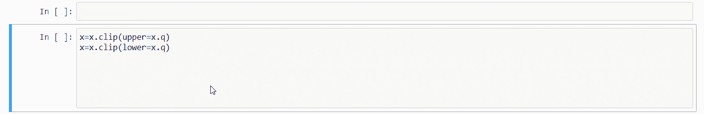
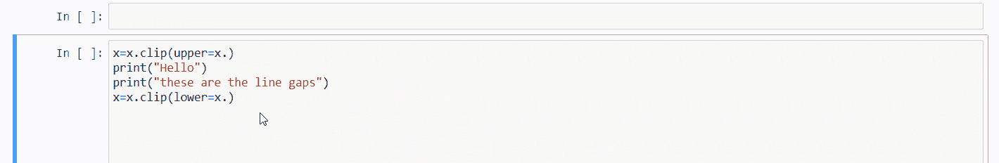
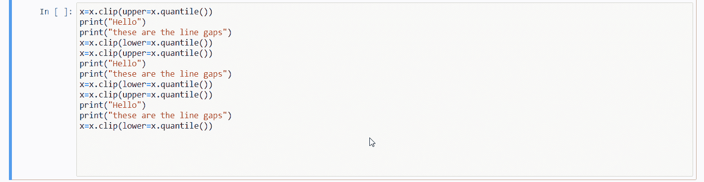
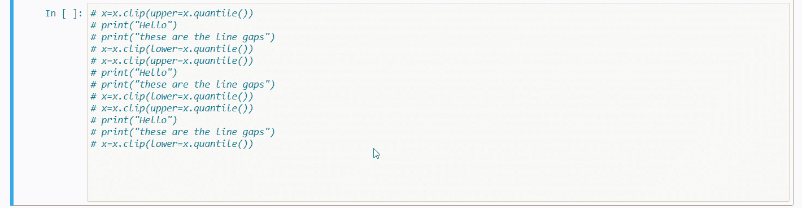
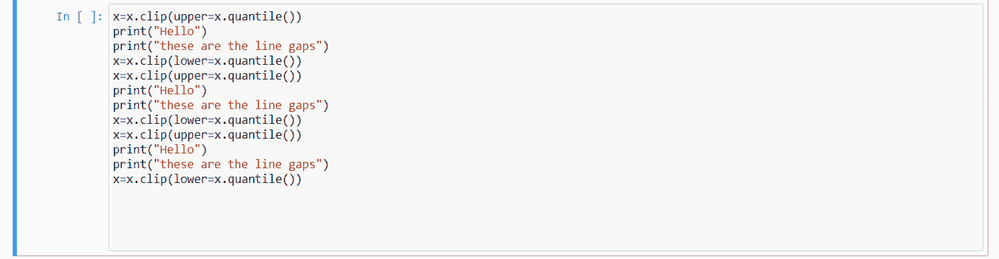
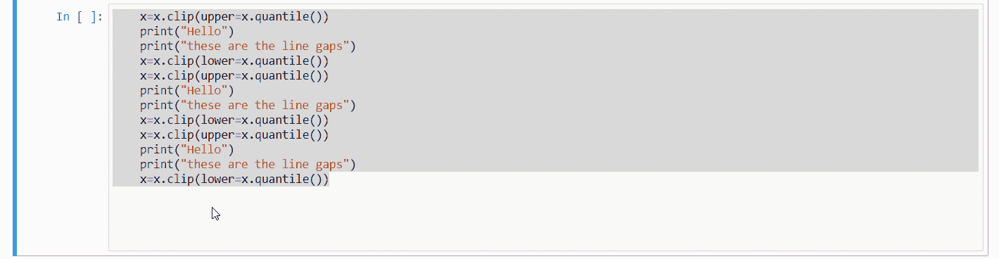

# Python 程序员的 4 个省时快捷方式

> 原文：<https://betterprogramming.pub/4-time-saving-shortcuts-for-python-programmers-2f5c1ec4fff8>

## 多行编码，保持适当的范围，等等

米切尔·霍兰德在 [Unsplash](https://unsplash.com?utm_source=medium&utm_medium=referral) 拍摄的照片。

当程序员不得不重复同样的事情时，他们经常会感到沮丧，即使在拥有循环功能之后。我发现了一个很酷的技巧，可以减轻重复的任务。我是 python 程序员；我将分享关于 python 编程的技巧。虽然，这一招可以用在其他编程语言上。

Python 是程序员和数据科学家最好的编程语言之一。然而，当我们在项目或任何应用程序开发中实际使用重复性任务时，我们经常会对它们感到恼火。那些任务会消耗我们大部分的优质工作时间。

本文将介绍一些键盘快捷键，每个 Python 程序员都应该使用它们来节省大量时间。它们已经过 Jupyter Notebook 和 Sublime Text 的全面测试，运行良好。因此，我们需要一个支持 Python 的 IDE 来使用它们。

# 1.同时在多行上编码

通常，我们必须同时编写相似的代码。做同样事情的一种方法是复制粘贴线条，然后在每个地方单击以编辑线条的剩余部分。

更好更省时的方法是使用`ctrl+mouse click`。看看下面的 GIF:

按住 Ctrl 键，然后单击要写相同内容的行。

这些变化可以发生在随机的地方。以下是您如何在随机位置进行更改:

在任意地方重复

# 2.单行多行注释

要注释一组代码行，我们通常使用多行字符串。在大多数情况下，多行字符串不适合，因为我们可以随意取消注释任何一行。这将中断多线串的流动。

要做到这一点，我们有一个捷径:`ctrl+/`。它将在所选区域进行单行注释:

Ctrl+/用于在选定区域中添加注释

这难道不是一条绝妙的捷径吗？否则，你可能不得不点击每一行，并在开始时一直使用`#`。

另一方面，如果您想要取消注释已注释的部分，那么使用相同的快捷方式，我们可以实现相同的事情:

Ctrl+/取消对所选部分的注释

很简单。

# 3.保持适当的范围

所有编程语言都有适当的方式来维护代码段的范围。大多数语言使用花括号(`{}`)来定义范围。Python 不是其中之一，因为它使用空白或缩进来以另一种方式遵循相同的作用域传统。

空白有时令人恼火，因为我们无法跟踪任何一行代码是否缺少任何一个空格。为了处理这个问题，我们可以利用`tab`键盘键来完成任务:

按 tab 键来设置所选段的空白

# 4.删除段中的空白

在本文中，这个快捷键大部分时间与第三个快捷键一起使用。我们还有一个键盘快捷键来取消注释代码的选定部分:

Shift+tab 删除缩进

# 结论

本文到此为止。我们讨论了四种键盘快捷键，它们可以为 Python 中的重复任务节省时间。

我们已经看到了如何在多个地方同时书写，添加单行多行注释，以及通过单击一个按钮来添加和删除缩进。

我希望你喜欢这个教程。谢谢你的阅读！