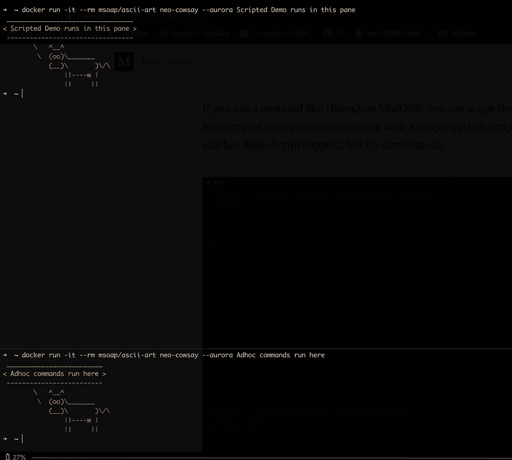
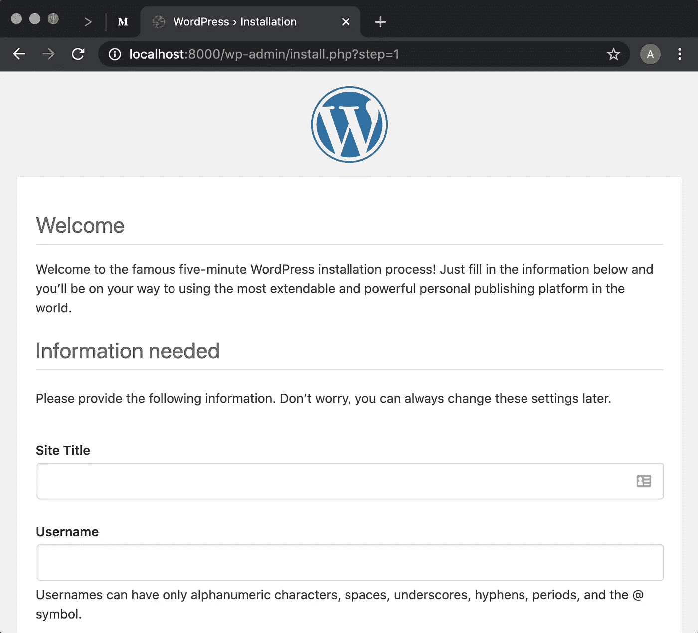
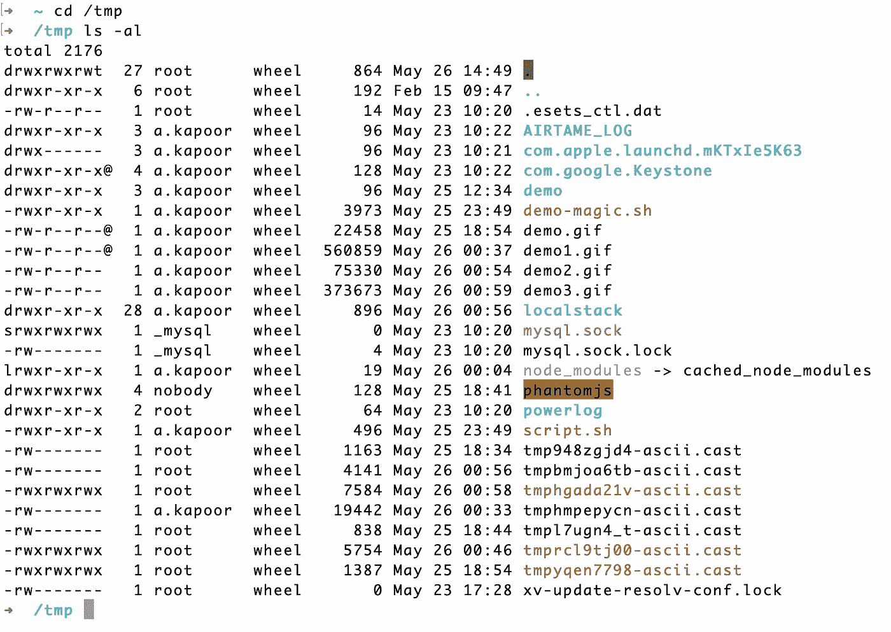
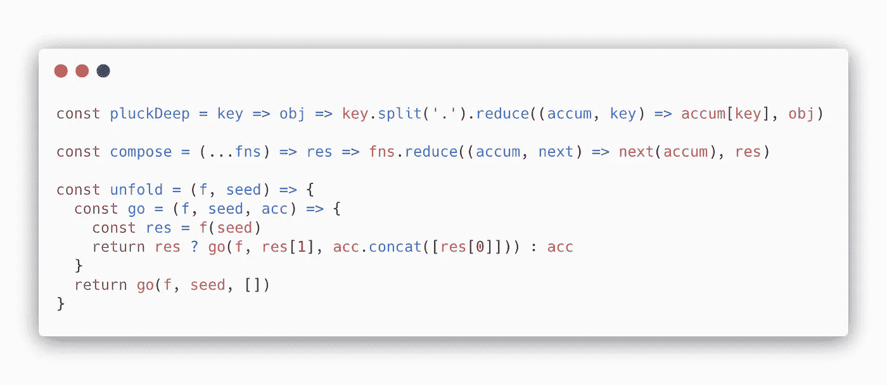

# 做好技术演示的 4 个技巧

> 原文：<https://betterprogramming.pub/4-tips-for-giving-great-tech-presentations-58375dde44c4>

## 提示 1。自动化您的终端，但仍有控制权


照片由[萨姆·巴耶](https://unsplash.com/@sbk202?utm_source=unsplash&utm_medium=referral&utm_content=creditCopyText)在 [Unsplash](https://unsplash.com/s/photos/lecture?utm_source=unsplash&utm_medium=referral&utm_content=creditCopyText) 拍摄

技术演示可能会很棘手。在规定的时间内发表演讲，可靠的 Wi-Fi 连接完全在你身边，你的终端字体大小对所有人都可见，现场无缝演示就像否定[墨菲定律](https://en.wikipedia.org/wiki/Murphy%27s_law)。

然而，您仍然可以通过一些简单的技巧来管理所有这些，这些技巧在过去的许多年里对我的 IT 职业生涯帮助很大，这也是我今天打算在这篇文章中分享的内容。

谈到技术演示，有两个主要目标:

*   你做了一个引人入胜的演讲，并及时结束，包括问答
*   观众离开时对主题有了更好的理解

让我们从什么可以帮助你实现这些目标开始。

# 1.自动化您的终端，但仍有控制权

你不想浪费任何宝贵的时间输入错误，甚至更糟的是，当观众看着你输入冗长的、容易出错的命令时，你不想浪费任何宝贵的时间。另一方面，利用演示过程中的每一秒钟来展开有意义的对话是非常重要的。

## 使用受控命令触发器编写演示脚本

如果你的脚本命令能在你说话的时候自动在控制台上输入，那不是很好吗？这有利于显示正在执行的实时命令，以及每次都正确地执行它们。此外，这是一个比录制的演示更好的选择。

我强烈推荐的一个很棒的项目是[演示魔术](https://github.com/paxtonhare/demo-magic)。它支持以下功能:

*   模拟打字
*   在演示中隐藏命令，但实际上在后台运行它们
*   运行真正的命令或只是假装这样做

演示-神奇的脚本示例(伪造网络连接)

`pe`打印并执行命令。`p`打印但不执行，`wait`等待用户按下`<Enter>`。

## 使用“watch”定期运行任意命令

有时，您希望继续运行一个命令来突出显示不断变化的输出。避免通常的“键入、执行命令、说话”的循环，而是开始使用`watch`命令。它在大多数 Linux、Mac 和 Windows 环境中都可用，是这类场景的必备工具。

`watch -n <interval_in_seconds> <command>`


以预定义的时间间隔自动运行任意命令

一些实用程序，如`kubectl`(与 Kubernetes 集群交互的实用程序)已经支持内置的类似`watch`的功能，您可以使用:`kubectl get pods --watch`。

## 规划您的终端布局

避免在不同的终端窗口/标签之间切换。一个对我来说很有效的方法是在主窗格和一个较小的辅助窗格中进行 80/20 水平分割，其中包含脚本命令。这有助于拥有一个专用的演示区域和一个较小的窗格，当演示正在进行时，它基本上是您可能想要运行的任何特殊命令的游乐场。这对于回答演示过程中的任何疑问很方便，同时不会中断脚本的执行。



在演示期间使用不同的窗格

如果你使用一个终端，比如 MacOSX 上的 iTerm2，你可以引导你的整个显示设置(窗口、标签、窗格、会话、字体大小等等。)[使用简单的 Python 脚本](https://iterm2.com/python-api/)(仅供参考:iTerm2 中的 AppleScript 支持现已弃用)。

## 避免别名

对`kubernetes get pods -n default`使用类似`kgp`的命令别名可能会让你看起来很酷，但对观众没有任何帮助。相反，在屏幕上运行完整的命令总是更好，因为它有助于更加清晰。对于使用 demo-magic 的脚本演示，您不需要输入完整的命令。

# 2.不要相信 Wi-Fi——在本地提供一切

除非您要求不能在本地运行/模拟，否则最好不要依赖互联网连接。有了大量的技术创新，在本地机器上创建环境变得非常简单。让我们看一些例子:

## 在本地机器上需要 AWS 云吗？

有了像 [localstack](https://github.com/localstack/localstack) 这样的项目，在本地运行一个全功能的 AWS 云栈是非常容易的。你应该不再需要真正访问像 S3，EC2，SSM，Lambda 等服务。，用于演示或演示。


在本地运行 AWS 云堆栈

## 需要虚拟化的可重复堆栈？

[Docker Compose](https://docs.docker.com/compose/) 使得在您的本地环境中定义和生成定制的应用程序栈作为容器变得非常容易。从数据库到应用服务器到消息代理——凡是你能想到的，你都有可能在 Docker Hub[上找到 Docker 镜像。](https://hub.docker.com/)

这种虚拟环境的好处是您的整个演示堆栈变得可重复，这意味着您可以非常容易地拆除一切并从头开始重建。此外，在不同的机器之间移动只需要复制这个模板文件，然后您可以在其他地方启动整个环境——想象一下您的笔记本电脑在演示开始前拒绝启动！

例如，在本地机器上运行类似 WordPress 的东西，就像下面的模板文件一样简单:

```
version: '3.3'services:
   db:
     image: mysql:5.7
     volumes:
       - db_data:/var/lib/mysql
     restart: always
     environment:
       MYSQL_ROOT_PASSWORD: somewordpress
       MYSQL_DATABASE: wordpress
       MYSQL_USER: wordpress
       MYSQL_PASSWORD: wordpresswordpress:
     depends_on:
       - db
     image: wordpress:latest
     ports:
       - "8000:80"
     restart: always
     environment:
       WORDPRESS_DB_HOST: db:3306
       WORDPRESS_DB_USER: wordpress
       WORDPRESS_DB_PASSWORD: wordpress
       WORDPRESS_DB_NAME: wordpress
volumes:
    db_data: {}
```

并运行命令:`docker-compose up -d.`

几秒钟之内，你就可以在浏览器上使用 WordPress，并在本地运行 MySQL 数据库:



Wordpress 安装——使用 Docker 编写

## 事情可能仍然会有所不同，所以准备好重置脚本

在你的机器上准备一个重置脚本总是有帮助的。将它添加到您的系统`PATH`中，以便能够从任何地方触发它。例如，您可以进一步扩展它，以接受像`./reset-demo kill-containers`或`./reset-demo restart-mysql`这样的参数。

# 3.视觉连接

## iTerm 配置文件

对于日常工作，您可能已经习惯了 iTerm 或笔记本电脑上其他终端的不同工作设置。然而，对于演示来说，最好是创建一个临时概要文件。配置文件让您可以灵活地设置附加属性，如字体大小、背景等。

要创建新的配置文件，请转到首选项>配置文件>，然后单击+按钮。稍后，您可以从菜单栏>配置文件><profile_name>中激活配置文件。</profile_name>

最后一排的观众会感谢你的终端配置:

*   Font (any): Consolas，Lucida Consoleor Monaco(粗体)
*   字体大小:14pt — 18pt
*   背景:白色



字体和颜色布局，可读性更好

记住，每一秒都是宝贵的，你不需要浪费任何时间在诸如“最后一排的每个人都能读完吗？”这样的问题上

提示:如果您计划在演示后分享幻灯片，请将您的字体使用限制在所有机器上常见的字体。

## 少即是多

无论如何都要避免的事情是在你的幻灯片上有大量的文本，然后阅读它。相反，应该关注重要的数据点和演示中值得分享的亮点。如果你需要包含大量的文字内容，最好在演示结束后与观众分享，并快速浏览内容。

## 代码片段

您可能需要包含代码片段以供讨论。如果你没有使用 IDE，而只是想要一些图像/嵌入内容，我可以强烈推荐 [Carbon](https://carbon.now.sh/) 。



带碳的代码片段

# 4.最后，备份是好的

任何可能出错的事情都会出错，因此备份总是能帮你解决问题。

除了不依赖于互联网可用性之外，请记住执行以下操作:

*   准备一份 PDF 格式的幻灯片
*   用像[asci NEMA](https://asciinema.org/)这样的工具记录你的终端演示。

我希望上面的建议能增加你现有的知识，并帮助你在未来有效地进行演讲。一如既往，听听你的经历或你可能用过的其他工具会很棒。

下次见， *tschüss* ！