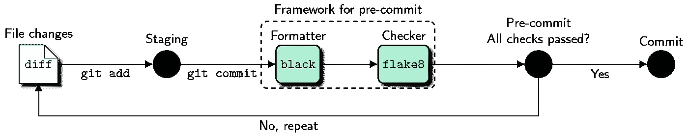
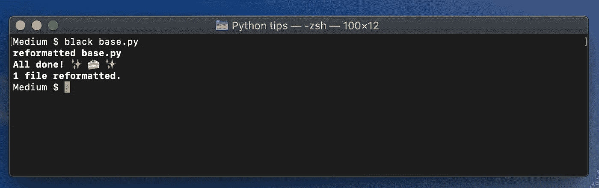
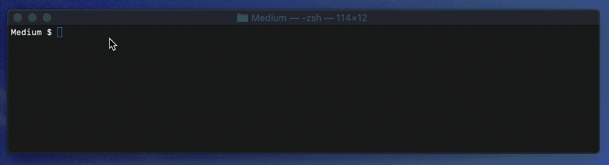
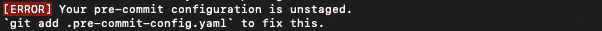
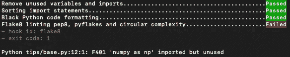

# 在 Python 中自动化干净代码的 4 个技巧

> 原文：<https://betterprogramming.pub/4-tips-to-automate-clean-code-in-python-527f59b5fe4e>

## **使用预提交 Git 挂钩，通过这些林挺和格式化工具**自动化 Python 代码风格

****

**整合了 black 和 flake8 的 Git 协议。图片由 [lj miranda](https://ljvmiranda921.github.io/notebook/2018/06/21/precommits-using-black-and-flake8/) 提供。**

**你是否梦想*永远不用*担心格式化你的 Python 代码？在这篇文章中，我将与你分享如何自动化干净的编码原则。**

*   **用`flake8`、`isort`和`mypy`林挺你的代码。**
*   **用`black`格式化你的代码。**
*   **预提交 Git 挂钩**
*   **自动化 Git 格式化程序挂钩。**

# **林挺你的代码**

**林挺是运行质量控制工具的过程，该工具对源代码进行静态分析，以检查潜在的错误。**

**Python 的风格指南是 PEP-8。验证是否遵循 PEP-8 风格指南的一个流行的林挺工具是`flake8`。它可以通过 pip 安装，并且可以很容易地用`**$** flake8 python_code.py`运行。输出显示了源代码和 PEP-8 风格指南之间的所有差异。**

****

**Python 脚本的 flake8 林挺。**

**可以通过几个可安装 pip 的包来增强，以增加对特定警告的支持。`autoflake`删除未使用的导入语句，`pep8-naming`检查变量命名约定，如 snake_case，`flake8-docstrings`为 NumPy 或 Google 风格的文档字符串启用林挺。`isort`是另一个流行的林挺工具，用于对您的进口报表进行排序。**

**您可以在项目的`setup.cfg`、`tox.ini`或`.flake8`中移除对特定警告或错误的支持，或者使用命令行参数。**

```
--max-line-length=120
--ignore=D100,D104,E203,E402,E501,W503
--docstring-convention=googleD100: Missing docstring in public module
D104: Missing docstring in public package
E203: Whitespace before ‘:’ (interferes with **black** formatting)
E402: Module level import not at top of file
E501: Line too long (82 > 79 characters)
W503: Line break occurred before a binary operator
```

**我更喜欢将最大行长度增加到 120 个字符，使用 Google 风格的 docstrings，忽略上面的警告和错误。错误`E203`干扰了我的首选代码格式化工具`black`。**

**如果您使用 Python 类型提示用变量类型注释函数参数，您可能也会对`mypy`感兴趣，这是 Python 的一个可选静态类型检查器，旨在结合动态(或“duck”)类型和静态类型的优点。**

# **格式化您的代码**

**格式化不同于林挺，因为它确实用遵循样式指南的源代码来改变源文件。**

**`black`是一个流行的 Python 格式化程序。这是一个符合 PEP-8 的固执己见的格式化程序，它可以就地重新格式化整个文件。它可以通过 pip 安装，并且可以很容易地用`**$** black python_code.py`运行。**

****

**Python 脚本的黑色格式。**

**`black`也使用配置文件或命令行参数来处理异常。我使用的唯一参数是`--line-length=120`来遵守 flake8 行长度例外。**

# **预提交 Git 挂钩**

****

**预提交 Git 管道。作者 GIF。**

****

**整合了 black 和 flake8 的 Git 协议。图片由 [lj 米兰达](https://ljvmiranda921.github.io/notebook/2018/06/21/precommits-using-black-and-flake8/)提供。**

**Git 钩子脚本是附加在 Git 协议上的脚本。它们也是我们自动化的基础。您可以指示 Git 挂钩在提交或推送到 Git 存储库之前执行林挺和格式化工具。因此，他们确保您的项目的参与者遵守一个干净的编码标准。**

**在提交给代码评审之前，它们可以很方便地识别简单的问题，并且可以“预提交钩子”用 Python 中的`pre-commit`包实现。**

```
**$** pre-commit install
```

**预提交框架使用一个`.pre-commit-config.yaml`来指定运行哪些钩子。在`repos`键下，您可以添加存储库并指定使用该存储库中的哪些钩子。**

**让我们将`flake8`、`isort`、`mypy`和`black`添加到我们的预提交配置中。确保首先包括`black`格式，然后用`flake8`检查 PEP-8。请在[预提交的网站](https://pre-commit.com/#adding-pre-commit-plugins-to-your-project)上找到顶层配置的参数和挂钩的描述。**

**对预提交配置进行更改时，确保使用`**$** git add .pre-comit-config.yaml`进行准备，以避免以下错误:**

****

**未分段的预提交配置。图片由作者提供。**

**无论出于什么原因，如果您不希望执行预提交挂钩，请确保在提交时使用`--no-verify`命令行参数。**

```
**$** git commit --no-verify
```

# **自动化 Git 格式化程序挂钩**

**如果其中一项检查失败，预提交框架就会中断，如下所示。避免手动检查每个错误或警告的一个解决方法是指示 Git commit 工作流中的格式化程序就地重新格式化文件。**

****

**薄片 8 失败**

**这可以通过 bash 命令`entry`来完成，它通过运行钩子来自动提交修改，然后在同一次提交中存放更改的文件。它仅适用于格式化程序`autoflake`、`isort`和`black`，因为它们可以选择就地重新格式化源代码。**

**请注意，自动提交修改更容易出错，因为格式化程序可能会实现不需要的更改。在这些钩子的末端运行一个测试套件可以确保源代码不会中断。**

**在下面找到更多干净的编码、文档和自动化技巧👇**

**[](https://towardsdatascience.com/five-tips-for-automatic-python-documentation-7513825b760e) [## 自动化 Python 文档的五个技巧

### 用这五个自动化步骤和预提交 Git 挂钩在 MkDocs & Material 中创建漂亮的 Python 文档

towardsdatascience.com](https://towardsdatascience.com/five-tips-for-automatic-python-documentation-7513825b760e)**