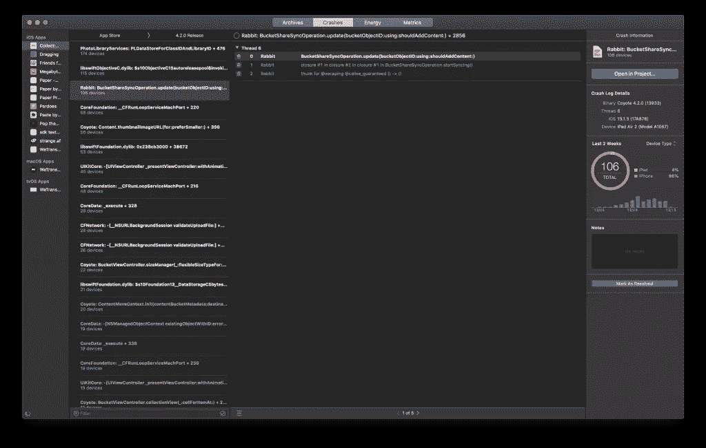
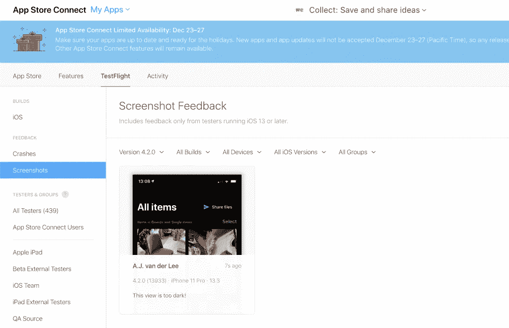
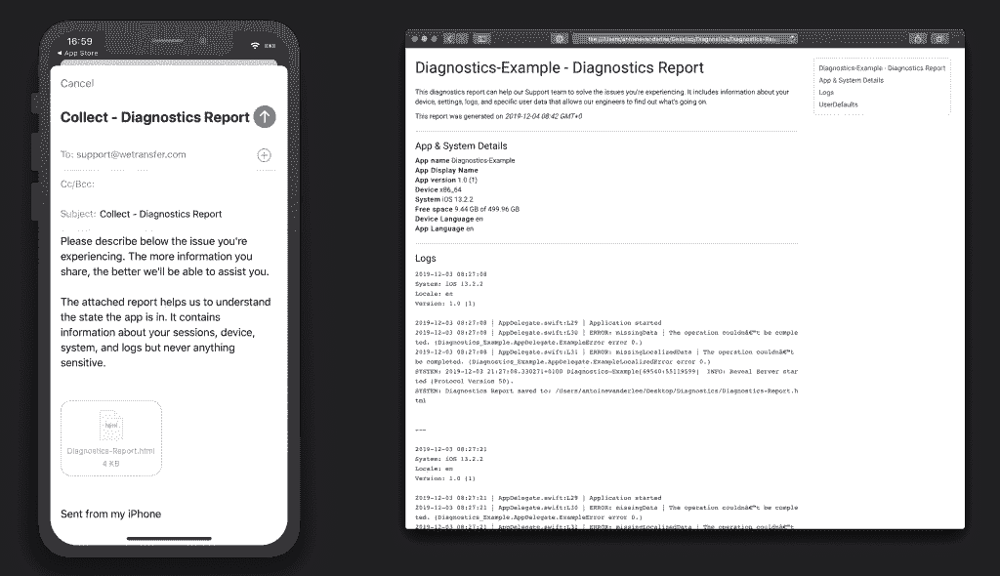

# 让修复崩溃和错误变得更容易的 4 个技巧

> 原文：<https://betterprogramming.pub/4-tips-to-make-it-easier-to-fix-crashes-and-bugs-472f1f9c067d>

## 优化您的工作流程并节省时间


由[迈克尔·波德格](https://unsplash.com/@jammypodger7470?utm_source=unsplash&utm_medium=referral&utm_content=creditCopyText)在 [Unsplash](https://unsplash.com/s/photos/bugs?utm_source=unsplash&utm_medium=referral&utm_content=creditCopyText) 拍摄的照片

每个应用程序都有性能问题、崩溃和需要修复的错误。尽管我们尽了最大努力，但我们总是会遇到不可预见的问题。即使你的应用在你的设备上流畅运行，所有测试都成功，QA 为你的构建开绿灯。

因此，我们都可以使用一些技巧来更好地为未知的未来做准备。通过收集正确的信息，修复大多数即将出现的错误和崩溃应该会容易得多。

# 1.崩溃报告工具

修复崩溃都是从深入了解应用程序中发生的崩溃开始的。

最简单的方法是进入`Xcode ➞ Organizer ➞ Crashes`。您可以选择您的应用程序及其最新版本，以深入了解已发生的崩溃:



Xcode 管理器中发生的崩溃概述

这里很棒的一点是，Xcode 允许你通过点击右上角的蓝色按钮直接跳转到导致崩溃的代码:*在项目中打开…* 。

您可以直接开始修复崩溃，在 Xcode 中为崩溃添加注释，并使用右下角的*标记为已解决*按钮将其标记为已解决。

## 将崩溃报告工具与分析相结合

Xcode 内置的崩溃报告工具在大多数情况下都很棒。

然而，使用像 [Firebase](https://firebase.google.com/) 或 [Instabug](https://www.instabug.com/) 这样的工具还是有好处的。这些工具将使用报告的分析，通过显示崩溃前的最新跟踪事件，让您深入了解再现路径。

# 2.与您的客户联系

修复常见错误的最有效方法之一是与您的客户联系。

您的客户在现场使用您的应用程序，他们最清楚什么是错的，什么不是。最重要的是，如果一个应用程序的性能不尽如人意，最终用户会非常沮丧。

通过创建一个 [TestFlight](https://developer.apple.com/testflight/) 用户组，你可以开始早期测试你的应用程序的新版本。TestFlight 有一个内置的报告工具，用户可以报告任何发现的错误。

用户可以通过截图，点击*完成*，点击*分享测试版反馈*来访问。他们可以添加注释并分享反馈截图:


试飞反馈报告工具。

该反馈将在 App Store Connect 的 TestFlight 页面中结束，其中包含各种有用的信息，如电池信息、磁盘空间、应用版本和系统版本:



App Store Connect 中的试飞反馈概述

显然，这只是与你的用户建立联系的方式之一。做同样事情的其他想法:

*   创建一个活跃的 Twitter 帐户，允许用户回复您。
*   添加应用内聊天功能。
*   建立了一个带有反馈表单的支持页面。

# 3.允许用户共享诊断报告

在某些情况下，您会与用户取得联系，但您仍然无法解决报告的问题。您有即将到来的崩溃，但是您不知道这些崩溃中的哪一个与特定用户报告的问题相关。

在这些情况下，在应用程序中提供一个选项，让用户共享特定于其案例的诊断信息是非常有用的。我们已经将此构建到 WeTransfer 的 [Collect 中，在其中我们允许用户报告一个问题以及一个诊断报告。](https://collect.bywetransfer.com/)

我们已经创建了一个名为 [WeTransfer Diagnostics](https://github.com/WeTransfer/Diagnostics) 的开源框架，可以非常容易地将其添加到您的应用程序中。它允许您创建包括以下内容的报告:

*   设备信息。
*   系统信息。
*   系统日志。
*   用户默认键。

除此之外，您还可以轻松添加自己的定制见解，帮助您解决特定于您的应用的问题。



WeTransfer 的诊断框架示例

这个框架的伟大之处在于，您还可以轻松地记录最终会出现在报告中的错误:

```
/// Support logging simple `String` messages.
DiagnosticsLogger.log(message: "Application started")

/// Support logging `Error` types.
DiagnosticsLogger.log(error: ExampleError.missingData)
```

这将使修复特定于用户的问题更加容易，让您和用户都更加开心。

显然，您应该考虑敏感数据和 GDPR 合规性。只共享解决问题真正需要的数据，尽量避免共享私人数据。

# 4.与用户相关的崩溃

大多数崩溃报告工具都允许您设置特定的用户标识符。

这允许您过滤掉特定用户的崩溃。您甚至可以将其作为超链接添加到您的自定义诊断 HTML 报告中，以直接打开包含特定于该用户的所有崩溃的网页:

```
static var firebaseCrashesURL: String {
    guard let identifier = Tracker.userIdentifier else { return "Unknown" }
    return "<a href=\"https://console.firebase.google.com/u/0/project/your-project-name/crashlytics/app/ios:your.bundle.identifier/search?time=last-seven-days&type=crash&q=\(identifier)\" target=\"_blank\">\(identifier)</a>"
}
```

这个例子为报告特定问题的用户创建一个链接，直接打开 Firebase 中报告的崩溃。

一定要确保对标识符进行哈希处理，这样它就符合 GDPR 标准，不会暴露任何获取特定于用户的私有数据的方法。

# 结论

就是这样！让你对即将到来的问题有更好准备的四个建议。加快您的 bug 修复工作流程，创造更多时间来构建新功能，而不是修复 bug。

谢谢！