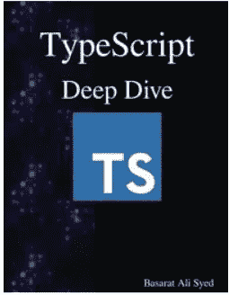
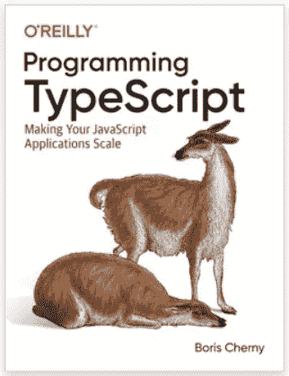
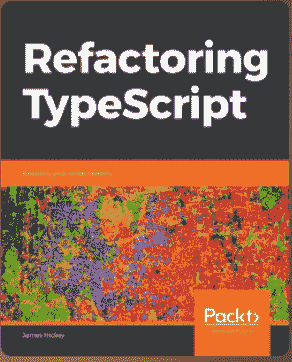
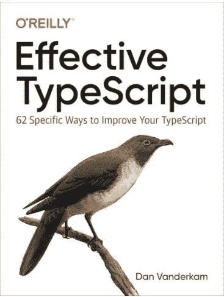

# 用这四本书将你的打字技能提升到一个新的水平

> 原文：<https://betterprogramming.pub/4-typescript-books-that-i-recommend-bee7f6767272>

## 掌握打字稿的最佳书籍

照片由 [Aaron Burden](https://unsplash.com/@aaronburden?utm_source=unsplash&utm_medium=referral&utm_content=creditCopyText) 在 [Unsplash](https://unsplash.com/s/photos/books?utm_source=unsplash&utm_medium=referral&utm_content=creditCopyText)

在我的 TypeScript 学习之旅中，我有幸钻研了关于这个主题的各种书籍。

但是为什么要选择书籍而不是看似无穷无尽的在线资源呢？答案很简单:虽然在线教程提供了快速方便的答案，但书籍提供了更深入的理解和对细节的关注，而这些在别处是找不到的。把在线教程想象成快餐——方便，但缺乏实质内容。另一方面，书籍就像美食体验——它们提供了无与伦比的质量和享受。因此，如果你真的想掌握 TypeScript，我强烈建议你挑选一些这些精心挑选的读物。

以下四本书是我的推荐。我已经把这些书从头到尾读了一遍，并经常翻阅。阅读这些书不仅对我的打字稿学习有用，而且很有趣。

我们一个一个来看。

# 打字稿深潜

作者[巴萨拉特·阿里·赛义德](https://basarat.com/)是一名澳大利亚的软件开发人员，也是 TypeScript 和微软 MVP 的主要贡献者。这本书有多种语言版本，可以免费获得。

这本书从 JavaScript 特性更新开始，接着是 NodeJs、浏览器、模块和 TypeScript 主题。

文笔实用简洁。有几个部分有点太简短了，但总的来说，内容是准确的，有足够的细节和清晰的示例代码。我发现自己经常回头去参考某个特定的概念。

这不是一本给完全初学者看的书。它更像一本有提示和技巧的书。我最喜欢的部分是“ [TypeScript 的类型系统](https://basarat.gitbook.io/typescript/type-system)”一章。他以深刻的洞察力解释了一些困难的类型概念。例如，我受到他的类型流概念的启发。

对于有一些 JavaScript/TypeScript 背景的开发人员来说，这本书是一个很好的资源。

# 编程打字稿

在这四本书当中，《TypeScript 编程:让您的 JavaScript 应用程序具有可伸缩性》对 TypeScript 进行了最全面的介绍。这也是一本适合所有水平的程序员的书。

这本书从编译器、类型等基础知识的概述开始。然后讨论更高级的主题，包括异步编程、错误处理和类型系统特性。在本书的最后，它还谈到了更实际的主题，如如何将 TypeScript 与您喜欢的前端和后端框架一起使用。

它涵盖了大部分有深度的主题。同时，风格随性却简洁。我最喜欢的部分是关于高级类型和类型驱动开发的部分。即使作为一个对这个话题很了解的人，我还是学到了一些新东西。

对于有一些 JavaScript 知识的初学者来说，这本书可以成为你学习 TypeScript 的起点。对于有经验的 TypeScript 开发人员来说，这是一本容易阅读和复习的书。有了适量的幽默，也就不无聊了。

# 重构类型脚本

我在做一个重构项目的时候买了这本书。我确实从这本书中学到了一些新技术。

这是一本愉快而轻松的 120 页的读物，采用“问题优先”的方法，专注于解决一系列代码重构问题。在每章的开始，显示了带有一些代码味道的代码片段。然后识别坏代码，并通过几轮增量应用修复。大多数章节都提到了设计模式。

尽管示例代码是在 TypeScript 上下文中提供的，但大多数技术也适用于其他语言，如 C#或 Java。换句话说，更多的是关于重构而不是 TypeScript。

这是一本非常实用的书，适合各个层次的程序员。Refactoring TypeScript 对于初级读者和有经验的开发人员来说是一本有用的书。如果您从事过真实世界的重构项目，您会对一些例子产生共鸣，并学到一些新技巧。

# 有效打字稿

与其他书相比，这是一本非常[不同的书](https://effectivetypescript.com/)。它没有涵盖基本概念。如果你是 TypeScript 的初学者，这本书不适合你。但是如果您有一些打字经验，并且希望了解更多关于最佳实践的知识，这是一个很好的资源。

如副标题所示，它包含 62 个具体项目。这些项目就像食谱或建议。它们解释得很清楚，很具体，也很可行。第一次看的时候，我被这六十二条惊呆了。作为一名开发人员，我知道它们来自真实的实践，可以应用到我们的日常工作中。我发现自己多次重温了一些条目，这些建议和例子有助于加深我的打字稿知识。

这是有经验的 TypeScript 开发人员的必读之作。

# 结论

我希望这篇文章能鼓励你至少读一本这样的书。阅读其中任何一本，你都会有所收获。

完整的链接列表在这里。

*   [打字稿深潜](https://basarat.gitbooks.io/typescript/)
*   [编程打字稿](https://www.oreilly.com/library/view/programming-typescript/9781492037644/)
*   [重构打字稿](https://www.packtpub.com/product/refactoring-typescript/9781839218040)
*   [有效打字稿](https://effectivetypescript.com/)

如果你喜欢这篇文章，你可能也喜欢阅读我的另一篇打字稿文章。

 [## 你应该知道的 6 个打字系统技巧

### 我从使用 TypeScript 的打字系统中学到了什么

better 编程. pub](/6-typescript-typing-system-tricks-you-should-know-5aa39bda8049) 

快乐阅读！