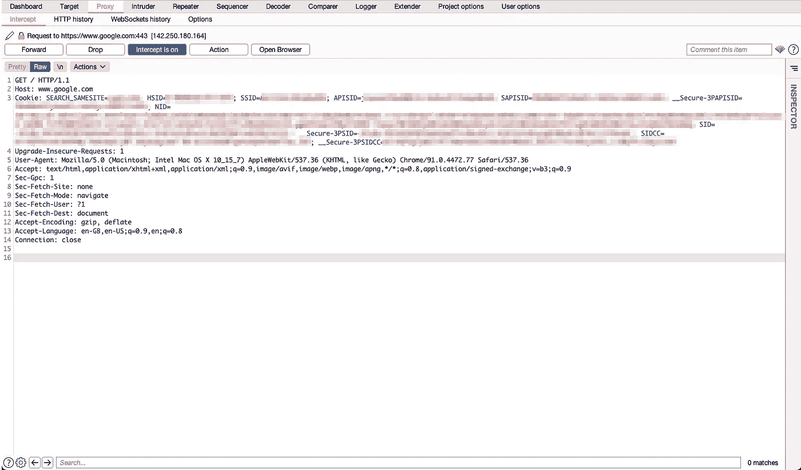
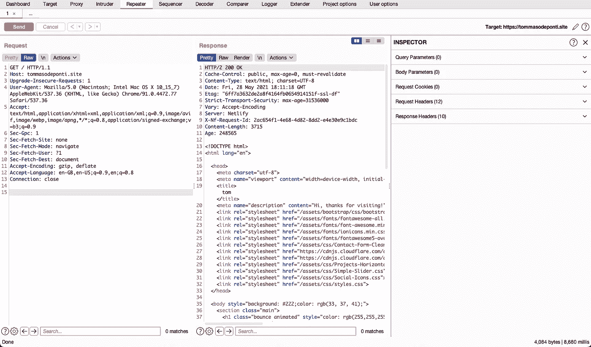
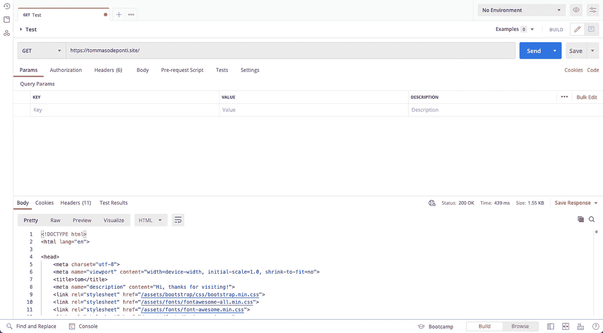
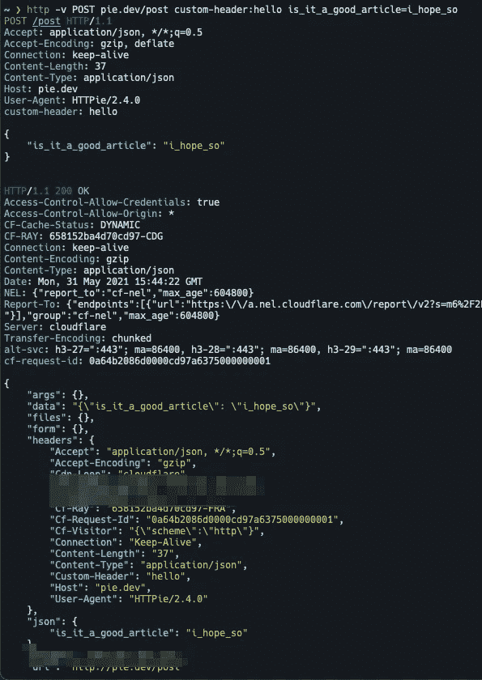
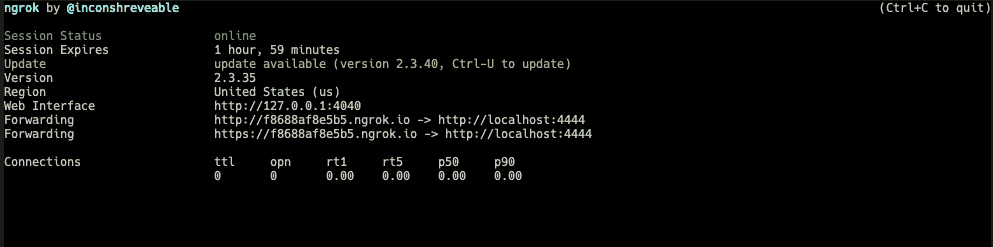

# 每个 Web 开发人员都应该知道的 4 个被低估的工具

> 原文：<https://betterprogramming.pub/4-underrated-tools-every-web-developer-should-know-c4fa2a029ee7>

## 我每天用于测试和编程的工具


Ernesto Velázquez 在 [Unsplash](https://unsplash.com?utm_source=medium&utm_medium=referral) 上的照片

正如我在其他文章中提到的，既是开发人员又是安全研究人员让我在这两个领域和我的工具箱中都有几个优势。今天，我将向开发人员展示，你可以用来帮助自己进行 API 和 web 开发的所有最佳工具是如何被大多数开发人员忽略的。本文将涵盖安全研究人员和 bug 赏金猎人使用的工具，这些工具对于编程来说也变得非常棒，此外还有您可能已经在使用的工具的提示和技巧。有什么好吃的？所有这些工具都是免费/免费增值的！

# 打嗝套房社区/专业

第一个也可能是这个博客最有用和最重要的工具是[打嗝组曲](https://portswigger.net/burp)。它由 PortSwigger 开发，作为应用程序测试人员的首选工具，在 bug 猎人中广受欢迎。这可能是我在安全研究和编程中使用最多的工具。这就是为什么我今天把它带给你们，开发者们:相信我，它比其他工具(Postman，Firecamp 等)更有效。

这是因为，即使它最初仅仅是为了安全测试而构建的，它也已经成为调试 API、认证/授权机制等的极好工具。我目前正在为我在过去几个月中构建的 SaaS 项目构建 API，在尝试了所有可能的 API 调试客户端(Postman、Fiddler、Firecamp、失眠症、Paw)之后，我可以肯定地说，Burp 可以更快、更干净地完成工作。另外，在最近的更新中，外观和可用性都有了很大的改进，变得更好了。

忘记在设置 cookies 和长标题时发疯，或者与 POST、PUT 和 PATCH 请求的主体斗争。对请求有一个粗略的概述会使它容易一百倍。在本文中，我将只介绍一些我个人认为对开发有用的方面。如果你想对这个工具有一个清晰的概述，有很多关于它的写得很好的博客。

## 代理人

您可能希望设置的第一件事是拦截来自浏览器或应用程序的流量的代理。一旦你这么做了，你通过代理服务器发出的每个请求都会被记录在 Burp 上。例如，这是一个被 Burp 拦截的示例请求:



从那里，您可以继续修改请求，拦截和修改响应，等等。如果您关闭拦截功能，您将无法实时修改请求和响应，但它们都将记录在 HTTP History 选项卡中:


## 中继器

这绝对是我最喜欢的应用功能:重放修改的请求。您可以从拦截器中选择一个请求，并将其发送给转发器。从那里你可以随意修改并重放它。这是 API 和 web 调试的关键特性，也确实存在于我谈到的其他工具中。然而，下面是我对 Burp 的“简单性”如何战胜 Postman 的解释，例如。

这是 Burp 的 repeater 标签的样子:



在左边，我们有可修改的请求；右边是对我们请求的响应。您看到请求是如何原始的了吗？嗯，它可能不如在标题、cookies 和正文中组织的那样简洁，但是请相信我，当您习惯了它之后，能够修改整个原始请求会变得更加高效，并且可以更好地了解请求的实际情况。现在让我们来看看《邮差》:



要修改这个请求，我必须仔细检查每个选项卡(参数、授权、标题和正文),而不是像编辑代码一样轻松地编辑我们的请求，包括拥有一个集成的 as-you-type 美化器。你开始感觉到不同了吗？

## 其他打嗝工具

除了代理和中继器，Burp 还提供了许多其他有用的工具:集成解码器、请求比较器、集成模糊器、自动转换 cURL 命令中的请求，等等。

此外，其最大的特点之一是扩展标签。从那里你可以下载几个由社区开发的插件，它们可以以各种可能的方式帮助你。例如，如果您正在调试一个 GraphQL API，您可能希望在 QL 中安装[。或者如果你正在使用 SAML，你可能想试试](https://github.com/doyensec/inql) [SAML 消息编辑器](https://github.com/PortSwigger/saml-editor)。确实有很多有用的插件。

请花时间学习使用这个工具；绝对值得。

# mitmProxy

如果他们不使用终端工作，你是什么也不做的开发者吗？嗯，我也有好消息告诉你: [mitmProxy](https://mitmproxy.org/) 是 Burp 的命令行替代品。即使它没有提供 Burp 所能提供的所有功能，但对于调试来说仍然很方便。

就我个人而言，我并不把它作为手动调试的首选，但是当谈到自动调试/测试时，mitmProxy 提供了一个很棒的 Python API。这就是我使用这个伟大的开源工具最多的地方。例如，这是使用其 Python API lools 的示例代码(摘自 [mitmProxy 官方网站](https://mitmproxy.org/)):

```
from mitmproxy import http

def request(flow: http.HTTPFlow):
    # redirect to different host
    if flow.request.pretty_host == "example.com":
        flow.request.host = "mitmproxy.org"
    # answer from proxy
    elif flow.request.path.endswith("/brew"):
    	flow.response = http.HTTPResponse.make(
            418, **b**"I'm a teapot",
        )
```

# HTTPie

这是我最喜欢的工具之一。你可能已经用过 cURL 了，我打赌你们很多人还在用。嗯，cURL 真的是一个很棒的工具，我也在用。但是你试过 [HTTPie](https://httpie.io/) 吗？它的简单是完美的——看一看:



通过一个简单的命令，我们发送了一个带有自定义头和干净的 JSON 主体的请求。这就是为什么我慢慢地用这个好工具代替 cURL。另外，请查看突出显示语法:)。

当你在测试一个简单的 API 端点时，它就派上了用场，因为打饱嗝会显得有些过火。此外，我发现自己多次使用它来自动化调试端点列表的过程。

# 掌握开发者工具

我知道你已经用过了，但是相信我，你需要掌握它们。

开发工具简直太棒了；他们有如此多的功能与一个漂亮的用户界面相结合。它们对前端、后端和 API 开发人员都很有用。

假设您有时已经使用过它们，并且知道它们的基本功能(例如，控制台/网络/资源/元素选项卡的功能)，下面是一些您可能想了解的更高级的内容:

*   断点、日志点和条件端点:这些对于调试客户端 JS 代码非常有用。
*   掌握网络选项卡:那个选项卡很有用，非常有用。您应该去那里玩一下节流和用户代理。(如果您正在构建一个多平台应用程序，您应该注意最后一点。)
*   Lighthouse:它可以帮助您提高性能，应用最佳实践，创建更好的 SEO，等等。

# Ngrok

当在本地开发时，与您的团队/经理分享进展可能是痛苦的:每次都必须部署它是一种选择，但是真的，这是一个好的选择吗？

这就是 [Ngrok](https://ngrok.com/product) 派上用场的时候了。它所做的简单而有效。给定机器上的一个本地端口，Ngrok 将创建一个临时地址为您的 http://localhost:specified _ port 服务。例如，如果我的 Django web 应用程序在我的本地主机上的端口 4444 上提供，并且我想与我的团队快速共享我的进度，我会这样做:

```
ngrok http 4444
```

结果如下:



现在，如果有人打开 https://f8688af8e5b5.ngrok.io，页面会提供我的 localhost: 4444 的内容。在免费计划上，有一些限制，比如每分钟的请求数量，但我发现这个工具对于快速共享工作非常有用。