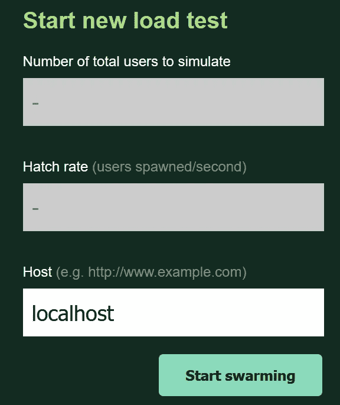
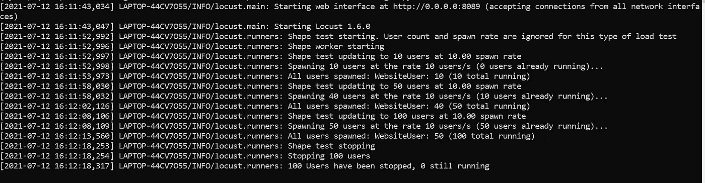
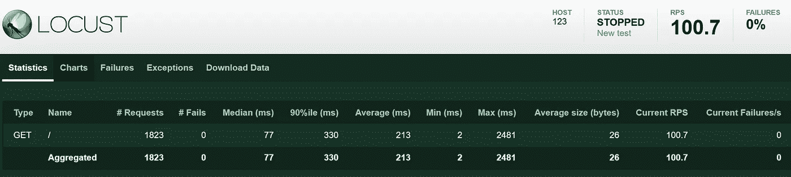
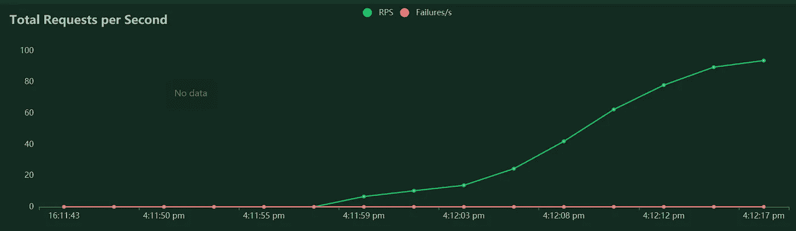
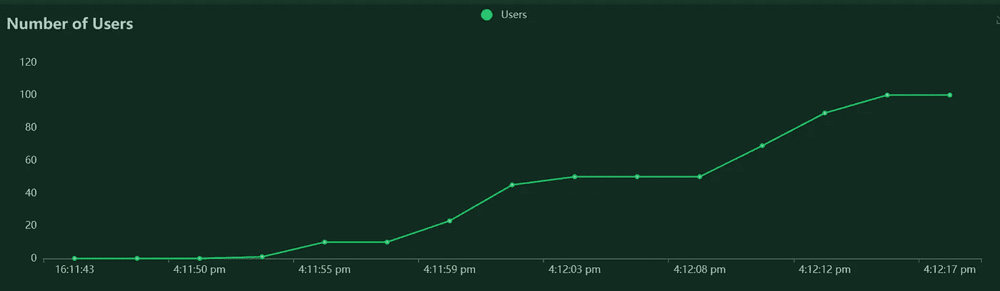

# 蝗虫的 4 个有用的高级功能

> 原文：<https://betterprogramming.pub/4-useful-advanced-features-in-locust-ea3b63df415e>

## 加强您的负载测试游戏


照片由 [Clément Falize](https://unsplash.com/@centelm?utm_source=unsplash&utm_medium=referral&utm_content=creditCopyText) 在 [Unsplash](https://unsplash.com/s/photos/swarm?utm_source=unsplash&utm_medium=referral&utm_content=creditCopyText) 上拍摄

之前，我已经在[Locust 简介:Python 中的一个开源负载测试工具](/introduction-to-locust-an-open-source-load-testing-tool-in-python-2b2e89ea1ff)中介绍过 [Locust](https://locust.io/) 的初学者指南。在本文中，让我们更深入地了解 Locust 中的四个有用的高级特性:

*   顺序执行任务
*   生成自定义负载形状(基于时间的阶段)
*   使用其他自定义客户端
*   并行运行任务

事实上，上面提到的所有特性都不是新的，在 Locust 包中已经存在很长时间了。了解这些特性有助于改进您的负载测试，并使您的生活更加轻松。

让我们继续下一节，开始安装必要的 Python 包。

# 设置

Locust 的安装步骤现在简单多了，但它需要 Python 及以上版本。强烈建议您在继续安装过程之前创建一个新的虚拟环境。

## 蝗虫

激活虚拟环境并运行以下命令来安装 Locust:

```
pip install locust
```

然后使用以下命令(大写 V)验证您的安装:

```
locust -V
```

您应该会看到版本号，如下所示:

```
locust 1.6.0
```

# 顺序执行任务

默认情况下，每个生成的用户将:

1.  随机选择一个任务
2.  执行它
3.  基于`wait_time`睡一会儿
4.  冲洗并重复

如果你正在测试一个有序的或者层次化的网站或者应用程序，你将不得不依靠循环和控制语句来完成。

或者，你可以利用`SequentialTaskSet`来帮你。你需要做的就是导入`SequentialTaskSet`并在你的`User`类中创建一个继承它的类。看看下面的代码片段:

我将按顺序运行所有任务，从`first_task`开始，然后是`second task`。

事实上，您可以通过任务装饰器指定 weightage 来多次执行任务。

```
# execute once
@task# execute 5 times
@task(5)
```

假设您的代码中有以下结构:

它将依次执行以下命令:

*   `first_task`曾经
*   `second_task`五次
*   `third_task`曾经

# 生成自定义负载形状

有时候，您可能希望在某个时间增加或减少用户数量，以模拟不同类型的测试，比如峰值测试。在这种情况下，您不能仅仅通过更改用户数和种子率来实现这一点。幸运的是，Locust 提供了一个`LoadTestShape`类，可以根据您的需要来控制用户数量和产卵率。

您所需要做的就是创建一个继承`LoadTestShape`的新类，并定义一个名为`tick`的函数，该函数返回一个包含以下项目的元组:

*   用户计数
*   产卵率

也可以返回`None`停止测试。看看下面的示例代码:

## 基于时间的阶段

除了 Locust，我过去还介绍过另一个叫做 [k6](https://k6.io/docs/) 的负载测试工具。

*   [K6 介绍:一个 API 负载测试工具](/an-introduction-to-k6-an-api-load-testing-tool-132a0d87827d)
*   [用 k6](/load-testing-websockets-with-k6-feb99bf75798) 负载测试 WebSockets

在进行测试时，它提供了基于时间的阶段，允许您执行不同类型的测试:

*   烟气试验
*   负荷试验
*   尖峰测试
*   负荷试验
*   浸泡试验

您可以模拟相同的基于时间的阶段功能，如下所示:

请注意，这里的持续时间代表一个时间戳(进入下一阶段已经过去了多少秒)，而不是持续时间长度。在这种情况下，它将:

*   从 0 个用户开始，产卵率为 10，直到第 5 秒
*   继续以 10 个用户的速度繁殖，直到 15 秒达到 50 个用户
*   继续以 10 个用户的速度繁殖，直到 25 秒达到 100 个用户
*   结束阶段并下降到 0 用户

您可以通过运行以下命令来测试上面的脚本:

```
locust -f <file_name>.py
```

web 用户界面可在以下位置访问:

```
http://localhost:8089
```

对于具有自定义加载形状的脚本，禁用总用户数和填充率。



作者图片

单击“开始群集”按钮后，您应该会得到以下输出。



作者图片

与持续运行的普通负载测试不同，一旦脚本完成所有阶段，它将自行停止。



作者图片

第二张图中的请求总数应该如下所示:



作者图片

看一下用户数量图，它表明用户在特定的时间间隔内如预期的那样增加了。



作者图片

你可以在官方的 GitHub 库找到更多的例子。

# 使用其他自定义客户端

Locust 中的一个核心客户端是`HTTPUser`类，这意味着通过 HTTP 进行负载测试 API。它基于请求模块。事实上，您可以扩展它来测试其他系统。话虽如此，你必须使用 [gevent](http://www.gevent.org/) 友好的库，否则它会阻塞正在运行的蝗虫进程。

请注意，Locust 不支持标准的 Python 异步。因此，您必须对其进行修补，以使用 gevent，而不是 asyncio 等基于异步的模块。看看官方文档提供的以下 gRPC 客户端示例:

假设您想要基于 HTTPX 包创建一个新的`User`类来加载测试 HTTP/2 API。你需要做的就是创建相应的 [HttpxClient](https://github.com/locustio/locust/blob/55525a50240704fcb48bc24fb8e7ba417995af09/locust/clients.py) 和 [HttpUser](https://github.com/locustio/locust/blob/55525a50240704fcb48bc24fb8e7ba417995af09/locust/user/users.py) 用`httpx`替换`requests`。

# 并行运行任务

在 Locust 中并行运行任务不是那么简单，因为它不支持标准的异步。如果您正在寻找并行运行任务的解决方案，您可以利用 gevent 的`Pool`或`Group`为您创建`greenlet`。

```
from gevent.pool import Groupgroup = Group()
group.spawn(lambda: print("1"))
group.spawn(lambda: print("2"))
group.join()
```

[gevent 的 spawn 函数](http://www.gevent.org/api/gevent.html#creating-greenlets)接受:

*   一个可调用的函数(你也可以使用 lambda 表达式。)
*   一个参数名
*   夸尔斯

以下代码片段说明了如何并行执行两个调用来测试 HTTP API:

# 结论

让我们回顾一下你今天所学的内容。

本文首先介绍了蝗虫包中的四个高级特性。

它继续通过`pip install`安装所有需要的 Python 包。

之后，它进入了实施过程。它展示了一些按顺序执行任务的代码片段示例。除此之外，它还详细解释了如何生成定制的负载形状，比如基于时间的阶段测试。

此外，本文还讨论了如何为 gRPC 实现您自己的定制客户端。最后，它提供了一个通过 gevent 运行任务的简单解决方案。

感谢您阅读这篇文章！请查看我的其他文章，了解更多与负载测试相关的教程。

# 参考

1.  [Locust.io —文档](https://docs.locust.io/en/stable/)
2.  [locust . io—sequential taskset](https://docs.locust.io/en/stable/tasksets.html#sequentialtaskset-class)
3.  [Httpx —文档](https://www.python-httpx.org/)
4.  [GitHub —针对 HTTP/2 服务器的蝗虫支持测试](https://github.com/locustio/locust/issues/264)
5.  [GitHub —蝗虫阶段示例](https://github.com/locustio/locust/blob/master/examples/custom_shape/stages.py)
6.  [GitHub —蝗虫并行任务](https://github.com/locustio/locust/issues/198)