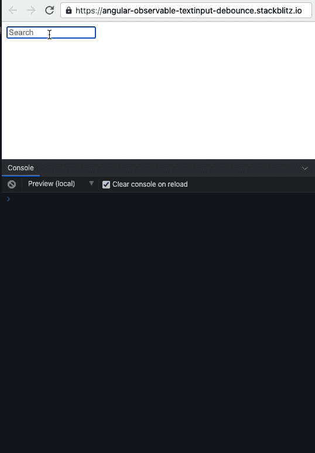
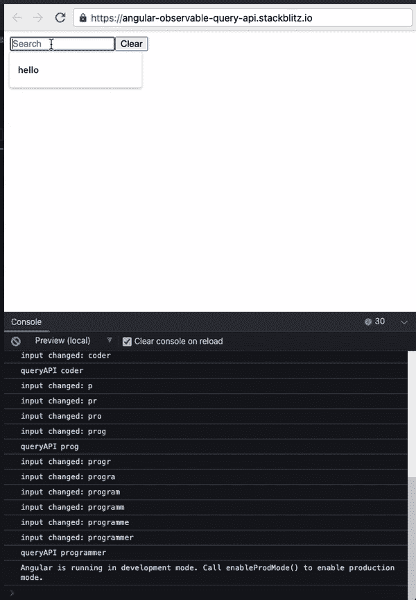
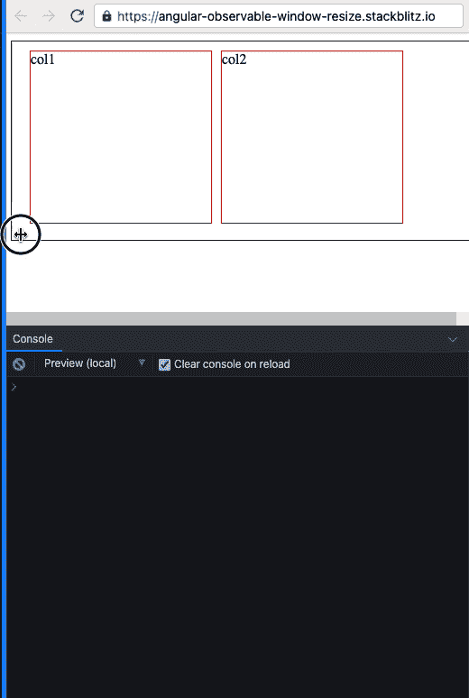

# 4 种有用的反应式编程实现风格

> 原文：<https://betterprogramming.pub/4-useful-reactive-programming-implementations-5b17d6fe53d3>

## 使用 RxJS 和 Angular 构建 web 应用程序


图片来自[咖啡豆](https://pixabay.com/users/coffeebeanworks-558718/?utm_source=link-attribution&utm_medium=referral&utm_campaign=image&utm_content=2017978)来自 [Pixabay](https://pixabay.com/?utm_source=link-attribution&utm_medium=referral&utm_campaign=image&utm_content=2017978)

这篇帖子是我之前关于 RxJS 操作符的[帖子的后续。我将直接跳过在构建 web 应用程序中使用反应式编程的实际例子。](https://javascript.plainenglish.io/reactive-programming-using-rxjs-operators-6b803c0ed7de)

我所有的代码示例都使用 RxJS 和用 TypeScript 编写的 Angular。每一部分都将以最终结果的 GIF 开始。

# 按钮点击事件

我先举一个简单的例子。我们有一个按钮，当它被点击时会触发一个事件——这是 web 开发中的一个日常用例。


作者的按钮点击示例。

发出事件的按钮将被视为具有事件流的可观察对象。让我们来看一个按钮，当它被点击时会打印到浏览器控制台。

```
<button id="mybutton">Click me</button>
```

我们将首先从按钮初始化一个可观察对象，我们可以为点击事件订阅它。

```
const observableButton: rxjs.Observable = rxjs.fromEvent(document, 'click');
```

为我们初始化的可观察对象订阅一个函数。该函数应该打印到 web 控制台。

```
observableButton.subscribe(e => {console.log(e.type)});
```

作者的代码示例。

# 来自文本输入更改的事件

让我们以搜索输入字段为例。我们正在输入字段中键入文本。文本中的每个变化都会引发一个事件。我们的前端代码将在适当的时候调用一个搜索 API，而不是在每次发生变更事件时调用。



输入作者更改截屏。

让我们从接受搜索文本输入的 HTML 输入标签开始。

```
<input type="text" [(ngModel)]="data" (ngModelChange)="inputChanged($event)" placeholder="Search" name="data">
```

我们搜索文本的每一个变化都会触发`inputChanged()`方法。

然后，让我们将搜索主题观察者初始化为一个(适当命名的) [RxJS 主题](https://rxjs.dev/guide/subject)。

```
searchSubject$ = new Subject<string>();
```

我们的`inputChanged()`方法将打印到 web 控制台，并将事件对象发送给我们的搜索主题观察者。

```
inputChanged($event) {
    console.log("input changed: ", $event);
    this.searchSubject$.next($event);  
}
```

我们将在我们的观察器中使用`debounceTime`,这样就不会在每次输入文本发生变化时触发我们的 API 调用函数。我们的 API 调用函数在输入事件流在指定时间内停止后被调用。

```
ngOnInit() {
    this.searchSubject$
      .pipe(debounceTime(200))
      // replace this with a search API call
      .subscribe(x => console.log("call search API: ", x));
}
```

试用 StackBlitz 中的代码示例。尝试移除`debounceTime`并观察其表现。

作者的代码示例。

# REST API 请求

让我们通过查询 Reddit 搜索 API 来扩展我们之前的“来自文本输入更改的事件”示例。然后，我们的示例页面将显示从 API 中检索到的 meme 图像。



作者截屏。

为了方便起见，我们通过添加一个清除按钮来扩展 HTML 代码。该按钮清除输入文本。

```
<input
  type="text"
  [(ngModel)]="searchString"
  (ngModelChange)="inputChanged($event)"
  placeholder="Search"
  name="searchString"
/>
<button (click)="searchString = ''">Clear</button>
```

因为我们现在将处理一个 API 请求，所以让我们使用 Angular 的 HTTPClient。

```
import { HttpClient } from '[@angular/common](http://twitter.com/angular/common)/http';
```

并连接我们将调用 Reddit API 的方法。

```
queryAPI(searchString) {
    return this.http
      .get(`[https://www.reddit.com/r/memes/search.json?q=${searchString}`](https://www.reddit.com/r/memes/search.json?q=${searchString}`))
      .pipe(map(result => result['data']['children']));
}
```

因为我们现在将在页面上显示搜索结果，所以让我们初始化结果 Observable。

```
results$: Observable<any>;
```

我们目前在`searchSubject`中使用了两个新的操作符。`distinctUntilChanged()`确保我们只在搜索主题发生变化时触发事件。而`switchMap()`将“切换”到一个新的可观测值——这就是`queryAPI`方法。在我之前关于反应式编程的[帖子](https://javascript.plainenglish.io/reactive-programming-using-rxjs-operators-6b803c0ed7de)中，我也用示例代码覆盖了 switchMap。

```
ngOnInit() {
    this.results$ = this.searchSubject$.pipe(
      debounceTime(200),
      distinctUntilChanged(),
      switchMap(searchString => this.queryAPI(searchString))
    );
}
```

现在我们有了结果可观察集，让我们在 HTML 代码中使用它来显示我们的 API 搜索结果。我们遍历 API 调用的响应，并显示每个结果元素的图像。

```
<div *ngFor="let result of results$ | async">
  <div
    *ngIf="result.data.thumbnail != 'default' && result.data.thumbnail != 'self'"
  >
    <a [href]="result.data.url">
      
    </a>
  </div>
</div>
```

您可以在下面的 StackBlitz 中找到完整的代码。

作者的代码示例。

# 移动响应网站布局

observables 的另一个优秀应用是在 web 应用程序中实现移动响应。例如，我们的网站为桌面视图显示两个垂直列，为移动视图显示两个水平行。



作者截屏。

让我们从观察到的窗口大小变化开始。

```
resizeObservable$: Observable<Event>;
```

使用 RxJS 的`fromEvent`，我们可以监听窗口调整事件。

```
this.resizeObservable$ = fromEvent(window, 'resize');
```

现在我们有了一个 resize Observable，让我们订阅它。一旦我们订阅了窗口调整大小事件流，我们现在就可以访问每个调整大小事件的窗口大小。在调整窗口大小时，我们将根据当前的窗口大小改变我们网站的布局。

```
ngOnInit() {
    this.resizeObservable$ = fromEvent(window, 'resize');
    this.resizeSubscription$ = this.resizeObservable$.subscribe(e => {
      if (window.innerWidth <= 400) {
        this.renderMobileView();
      } else {
        this.renderDesktopView();
      }
    });
}
```

我们的渲染移动和桌面方法将改变布尔值`mobileView`。

```
renderMobileView() {
    console.log('render mobile view');
    this.mobileView = true;
  }renderDesktopView() {
    console.log('render desktop view');
    this.mobileView = false;
}
```

使用`mobileView`布尔值，我们可以改变 HTML 元素的 CSS 类。更改 CSS 类意味着我们可以轻松地在移动和桌面视图之间切换。

```
<div class="container" [ngClass]="{
  'mobile': mobileView,
  'desktop': !mobileView}">
  <div class="col1">col1</div>
  <div class="col2">col2</div>
</div>
```

StackBlitz 中提供了完整的示例代码。

作者的代码示例。

我希望这对您有所帮助，并且您可以在构建下一个 web 应用程序时应用它！

如果你喜欢这篇文章，你可能也会喜欢:

[](/9-useful-functional-programming-solutions-you-can-learn-with-typescript-and-node-2eab5ba097f0) [## 您可以学习的 9 个有用的函数式编程解决方案(在 TypeScript 和 Node 中)

### web 开发人员易于理解的编码示例

better 编程. pub](/9-useful-functional-programming-solutions-you-can-learn-with-typescript-and-node-2eab5ba097f0)