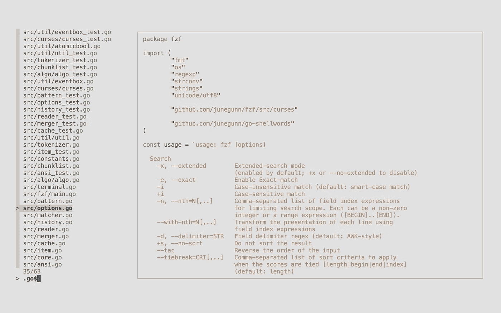
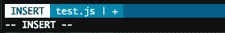
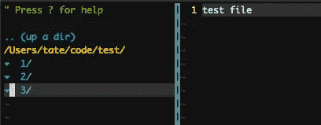

# 4 个 Vim 插件来提高你的编程效率

> 原文：<https://betterprogramming.pub/4-vim-plugins-to-boost-efficiency-6922add12e83>

## Vim 是*令人敬畏的*，但是你只能得到你投入的东西

照片由[布雷克·康纳利](https://unsplash.com/@blakeconnally?utm_source=unsplash&utm_medium=referral&utm_content=creditCopyText)在 [Unsplash](https://unsplash.com/s/photos/programming?utm_source=unsplash&utm_medium=referral&utm_content=creditCopyText) 上拍摄

默认情况下，它只包含最基本的东西，可以绕过其他臃肿的 [IDE](https://en.wikipedia.org/wiki/Integrated_development_environment) ，您应该切换的理由不胜枚举，但是如果您仍然需要朝着正确的方向前进，这里有 [*3 个您应该使用 Vim*](https://medium.com/better-programming/3%C2%BD-reasons-why-you-should-be-using-vim-8202360afa3) *的理由。*

有时您需要 Vim 没有提供的功能。这就是插件发挥作用的地方。下面我列出了一些非常有用的 Vim 插件，你应该花点时间在上面。

带上你最喜欢的插件管理器(我的[病原体](https://github.com/tpope/vim-pathogen))，让我们开始吧！

# 1.维姆逃犯

《Vim 逃犯》高居榜首，不仅因为它与《病原体》([蒂姆·波普](https://github.com/tpope))出自同一作者之手，还因为它实用而有效。这个插件让 Vim“Git aware”。

想象一下，你正在用 Vim 编辑一个源文件，你看到了一些奇怪的东西。

*“谁写的！?"你问自己，想知道为什么任何一个头脑正常的人会造出这样一个令人憎恶的东西。自然地，如果文件在源代码控制中，您可能首先使用`git blame`来查看作者是谁。*

如果你使用的是 Vim 逃犯，你甚至不用退出 Vim 就能看到作者。您甚至不必丢失当前的行号！您可以简单地发出`Gblame`，然后在左侧弹出一个作者列表，向您显示违规的开发人员。神奇！

# 2.模糊查找器

[fsf](https://github.com/junegunn/fzf) 是模糊搜索！

不知道那是什么？好吧，想想你上次忘记什么东西在哪里或者是什么东西。你记得名字的前几个字符，但不知道在哪里见过。

是在`lib`里吗？这个奇怪的存储库深处的 15 个目录呢？

模糊查找器让您搜索“近似字符串”的名称，并得到最接近的结果。这是它在 Vim 中的样子:

资料来源:github.com/junegunn/fzf

如果你想深入了解这背后的模糊逻辑是如何工作的，可以看看[朱利安·特雷山羊](https://medium.com/u/ee41e5f07ab8?source=post_page-----6922add12e83--------------------------------)的文章: [*模糊字符串匹配介绍*](https://medium.com/@julientregoat/an-introduction-to-fuzzy-string-matching-178805cca2ab) *。*

安装 fzf 非常容易，特别是如果你使用 Vim Plug，但是如果你是在病原体方面，就需要多几个步骤。按照 fzf GitHub 的说明进行操作，你很快就会进行模糊搜索。

# 3.光线

Lightline 非常简单明了。它将 Vim 底部的状态栏替换为一个主题化的版本，您可以对其进行定制。使用 Lightline 的一个直接好处是，您可以更直观地了解当前的编辑模式。

Lightline 中的插入模式。

Lightline 是高度可定制的。有了这个插件，你可以在 Vim 的底部添加你自己的页脚功能。

想知道你在哪个 Git 分支上？**搞定！**

想让 shell 脚本的文本输出显示在底部吗？**当然！**

你甚至可以随心所欲地改变颜色和主题。Powerline 是默认主题，这对于大多数 Vim 主题来说看起来很棒，但是您可以很容易地更改为其他几个主题。

# 4.纳特树

NERDTree 插件提供了一些其他 ide 认为理所当然的东西。今天，如果你使用任何现代的 ide，比如 Visual Studio Code、Atom 或 Sublime Text，那么默认情况下你可以访问目录树。

在 Vim 中，添加目录树是通过添加这个神奇的插件来完成的。NERDTree 已经存在了一段时间，可以说是 Vim 事实上的树插件。

根据您的开发风格，您可以用许多不同的方式触发 NERDTree，但是最简单的方法是将它映射到一个组合键，树就会弹出来。

书呆子在左边。

没有鼠标，我如何浏览这棵树！？

不要担心！NERDTree 非常直观，如果你已经在 Vim 中使用了窗格和拆分，那么你就可以轻松自如了。您可以在树和主窗口之间来回切换，一切如常。像文件中的文本一样在树中上下导航。当你准备好编辑一个文件的时候，点击回车。

当我带你浏览一些最有用的 Vim 插件时，我希望你喜欢和我在一起。如果你使用 Vim 已经有一段时间了，你可能会遇到一些更有趣的插件。请在评论中告诉我你最喜欢的是什么。