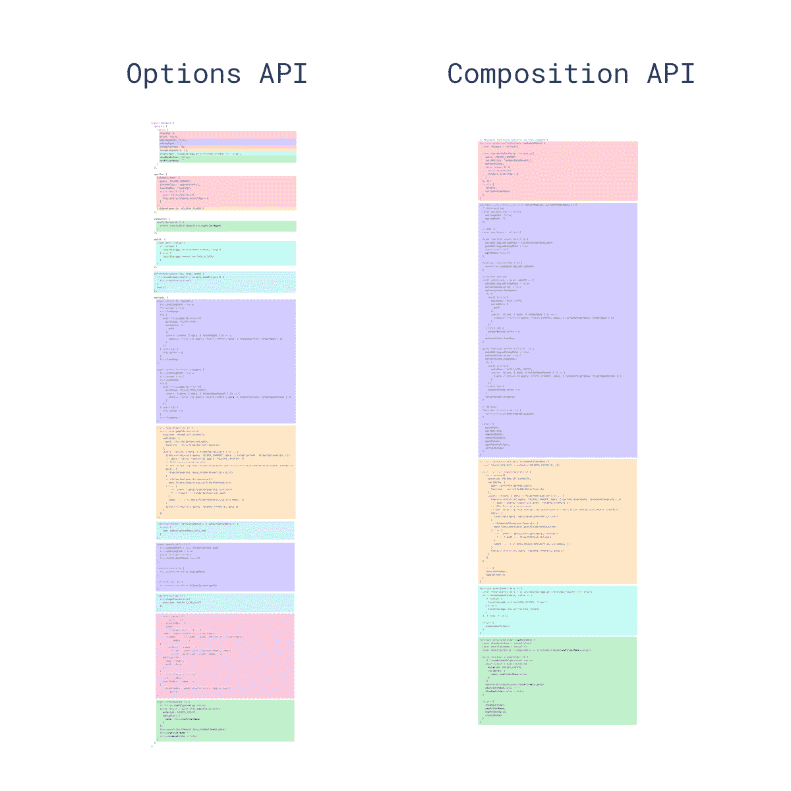

# 你应该知道的 4 个 Vue 3 合成 API 技巧

> 原文：<https://betterprogramming.pub/4-vue3-composition-api-tips-you-should-know-70f68a4d626e>

## 随着 Vue 3 Alpha 的推出，许多开发人员正在尝试新的变化——最大的变化是组合 API


[金伯利农民](https://unsplash.com/@kimberlyfarmer?utm_source=medium&utm_medium=referral)在 [Unsplash](https://unsplash.com?utm_source=medium&utm_medium=referral) 上拍摄的照片

随着 Vue 3 Alpha 的推出，许多开发者正在尝试新的变化——最大的变化是组合 API。

我花了一些时间研究新的复合 API，并学习如何实现它。这里有一些事情需要一点时间来弄清楚。希望它能为您节省一些设置时间。

到本文结束时，您应该对复合 API 以及如何在项目中实现它有了更多的了解。

# 1.正确使用它来保持有条理

组合 API 的主要好处是能够更有效地组织和重用代码。

以前，在 Options API 中，单个特性的代码会跨不同的组件选项进行分离。现在，一切都在一个地方。



建议的设计模式之一是在单独的函数中编写代码，返回您想要公开的属性，然后将它们包含在您的设置方法中。

这对于创建更具可读性的组件来说非常棒。此外，这意味着您甚至可以将功能提取到单独的文件中，并在任何需要的地方导入它们。

# 2.何时使用参考或反应

因为 Composition API 直接公开了 Vue 的 reactivity API，所以我们有两种不同的方式来创建 reactive 数据:`ref`和`reactive`。

虽然`reactive`用途更广，但这些物体一旦被破坏或扩散就会失去反应。为了解决这个问题，你可以使用`toRefs`方法，将每个对象属性转换成它自己的反应`ref`。

如果您想更深入地了解反应性何时丧失，那么 [Composition API RFC](https://vue-composition-api-rfc.netlify.com/#ref-vs-reactive) 是一个很好的起点。

# 3.您可以在设置()中访问 Props

在 Vue 2 中，我们可以使用`this.*propName*` *在组件的任何地方访问 props。*

Options API 和 Composition API 之间的一个巨大区别是我们使用了`setup()`方法。安装程序对`this`的访问权限不同于我们的选项 API 方法。

虽然这对于访问组件数据和方法来说不是问题，因为它们将在我们的 setup 方法中定义，但是当试图引用组件的 props 时，它确实会引起问题。

幸运的是，我们的设置方法接受组件的 props 作为它的第一个参数。

```
export default {
	setup (props) {
		console.log(props)
	}
}
```

使用这个语法，我们现在可以在 setup 方法中访问组件的 props。这意味着我们的数据、方法、计算值等等可以使用对 props 的引用。

只要记住道具是只读的，永远不要改。

# 4.setup()也有一个上下文参数

除了接受 props 作为参数之外，`setup()`还有第二个可选参数:公开 Vue 实例的三个属性的上下文对象。

1.  `attrs` —组件的属性。
2.  `slots` —一个组件的插槽。
3.  `emit` —允许我们从该组件发出一个事件。

我们可以像这样访问这个上下文对象:

或者，如果我们不需要整个上下文对象，我们可以析构它。

# 结论

当 Vue 3 正式发布时，新的最佳实践、技术和设计模式肯定会在未来出现。但是现在，这些只是我希望在开始使用 Composition API 时就知道的一些事情。

希望你学到了一些东西，对新的变化感觉更舒服。

编码快乐！