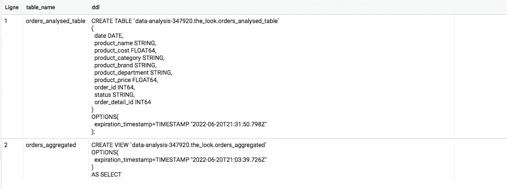
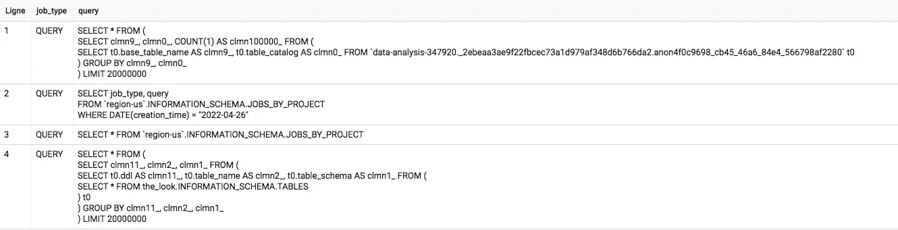
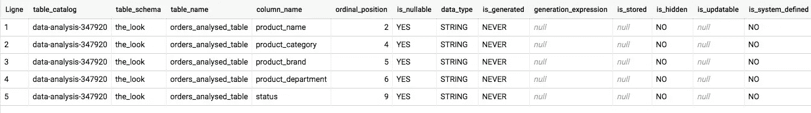
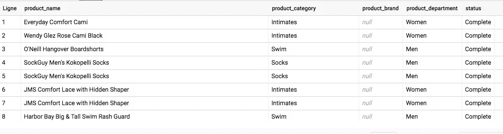
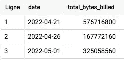

# 大型查询元数据可以帮助您的 4 种方式

> 原文：<https://betterprogramming.pub/4-ways-big-query-metadata-can-help-you-2cdf3b899fbc>

## 获取有关表、作业等的数据


照片由[亨特·哈里特](https://unsplash.com/@hharritt?utm_source=medium&utm_medium=referral)在 [Unsplash](https://unsplash.com?utm_source=medium&utm_medium=referral) 上拍摄

定义元数据的一种常见方式是“关于数据的数据”。在 Big Query 中，元数据非常有用和方便，因为它被组织在一系列名为`INFORMATION_SCHEMA` **的视图中。**

下面是如何使用大查询元数据的四个例子。

# 1.重新创建表格

您是否曾经连续创建了 10 个表，然后意识到在其中的每一个表中都错误地命名了一列？幸运的是，`TABLES`元数据视图可以提供帮助。

```
SELECT table_name, ddl 
FROM the_look.INFORMATION_SCHEMA.TABLES
```

这个请求将为您提供用于创建表的 DDL(**D**ATA**D**definition**L**anguage)查询。然后，您可以复制粘贴 DDL 语句并对其进行编辑，以重新创建您的表。



# 2.访问历史

“历史记录”选项卡仅允许您访问上周执行的作业。幸运的是，您可以通过使用`JOBS`视图来跨越这些限制。

```
SELECT job_type, query
FROM `region-us`.INFORMATION_SCHEMA.JOBS_BY_PROJECT
WHERE DATE(creation_time) = "2022-04-26"
```



# 3.动态选择列

假设您只想从表中选择字符串列。不幸的是，标准 SQL 不允许动态选择列。这就是`COLUMNS`视图派上用场的地方。

通过查询视图，我们可以获得所需列的概述:

```
SELECT *
FROM the_look.INFORMATION_SCHEMA.COLUMNS
WHERE table_name = "orders_analysed_table" AND data_type = "STRING"
```



然后，我们可以使用脚本铭文将列名存储到一个变量中，并显示动态查询的结果:

```
 DECLARE select_query STRING;
EXECUTE IMMEDIATE
"""SELECT STRING_AGG(column_name, ",")
FROM the_look.INFORMATION_SCHEMA.COLUMNS
WHERE table_name = "orders_analysed_table" AND data_type = "STRING"
"""
INTO select_query;
EXECUTE IMMEDIATE FORMAT("""
SELECT %s
FROM the_look.orders_analysed_table
""", select_query)
```

这个查询的作用是:

*   声明一个字符串类型的变量
*   执行查询以获取表中的字符串列，并将其存储在前面的变量中
*   用变量格式化选择查询并执行它



# 4.监控您的成本

当试图监控您的成本时，元数据也可以派上用场。你可以使用`JOBS_TIMELINE`视图来检查你支出的变化。

```
SELECT DATE(job_creation_time) AS date, SUM(total_bytes_billed) AS total_bytes_billed
FROM `region-us`.INFORMATION_SCHEMA.JOBS_TIMELINE_BY_PROJECT
WHERE DATE(job_creation_time) >= "2022-04-01"
GROUP BY 1
ORDER BY 1
```



想更进一步？为什么不使用大型查询时间序列模型来预测下个月的账单字节数呢？

如果您想了解更多关于 BQ 元数据的信息，您可以查看 [INFORMATION_SCHEMA 文档](https://cloud.google.com/bigquery/docs/information-schema-intro)以获得更多信息。