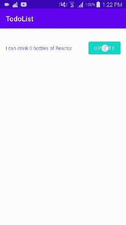

# Android 中有效的对象通信

> 原文：<https://betterprogramming.pub/4-ways-of-implementing-effective-communication-between-activities-fragments-and-objects-in-88f54ed7f4f6>

## 接口、依赖注入等等


Volodymyr Hryshchenko 在 [Unsplash](https://unsplash.com?utm_source=medium&utm_medium=referral) 上拍摄的照片。

面向对象编程是当今几乎所有伟大应用的基础。由于其巨大的灵活性，它已经成为许多开发人员选择的设计模式。

使面向对象编程如此伟大的原因之一是能够在对象之间传递数据，并且有许多不同的方法可以做到这一点。作为一名 Android 开发人员，我遇到过许多新手——其中大多数是我的实习生——他们不能正确地进行对象间的通信。这促使他们编写大量样板代码，使得他们的工作很难管理和扩展。

在本文中，我将介绍四种使用 Kotlin 有效实现基于 Android 的对象间通信的方法，但是这些方法也可以用于其他编程语言，只是实现的语法略有不同。

# 1.接口

不涉及所有复杂的技术细节，在面向对象编程中，接口是程序员让不同的对象实现或能够以各种方式使用相同方法的一种方式(这种技术也称为多态性)。使用接口的最佳方式之一是使用它来监听对象状态的变化，执行一些任务，或者检测一个动作并对其做出响应，这通常是为了通信。

## 在 Android 中使用界面进行通信

在 Android 中，最推荐的对象间数据通信方式是使用接口作为对象状态变化的监听器，或者报告某个动作已经发生。侦听此更改的对象是实现接口的对象，然后通过使用依赖注入将其作为参数传递给要侦听的对象。

这种带有接口的技术最适合活动和片段之间，以及活动/片段和适配器之间的通信。

## 待办事项列表示例(活动/适配器通信)

我们以一个待办事项 app 为例。有一个`TodoActivity`，这个活动有一个`RecyclerView`，它必须用数据库中的待办事项列表信息填充。`RecyclerView`只能通过使用自定义`RecyclerView.Adapter`来显示该信息。`RecyclerView.Adapter`需要与`TodoActivity`通信，以监听项目选择等动作，并长按`RecyclerView`中显示的任何待办事项，以便当这些动作发生时`TodoActivity`可以访问适配器中的项目。

TodoItemActionListener.kt

`TodoActivity`实现`TodoItemActionListener`接口并覆盖该接口的所有方法。

TodoActivity.kt

在`TodoActivity`的`onCreate()`方法中，`RecyclerView`被正确初始化，并且`TodoItem`对象从数据库中获取并添加到将用于填充`RecyclerView`的`ArrayList<TodoItem>`中。

用`ArrayList`、作为上下文的活动以及作为`TodoItemActionListener`的活动来初始化`TodoItemsAdapter`。

TodoRecyclerAdapter.kt

类似地，上面的实现可以用活动/片段和片段/片段来完成。在下面关于注入的部分，我将演示如何向片段传递或注入复杂的参数。

# 2.依赖注入

在面向对象编程中，依赖注入是向需要或依赖所提供的资源来实现其预期目的的对象提供资源的过程。

依赖注入是您在创建接受参数的构造函数以及为对象中的变量创建 setter 方法时一直在做的事情。

在 Android 中，注入是将信息传递给片段或定制适配器的最佳方式之一。

## 待办事项列表示例(从 TodoActivity 向 TodoFragment 传递数据)

在 Android Studio 中，片段的默认实现假设您通过自定义片段对象的实例来创建片段，并且只能通过在片段实例化时使用 Bundle 对象来向它们传递数据，但是如果您不喜欢这种实现，也可以不遵循它。您可以使用自己选择的设计模式以许多不同的方式实现您的片段。

在这个例子中，`TodoActivity`必须向`TodoFragment`传递或注入一个`ArrayList<TodoItem>`，这样您就可以在片段中使用它。对`TodoFragment`进行了修改，在其主构造函数中加入了一个`ArrayList<TodoItem>`。

TodoFragment.kt

TodoActivity.kt

在执行`onCreateView()`方法之前，`TodoFragment`接收`ArrayList<TodoItem>`初始化。如果您想使用`ArrayList<TodoItem>`来填充`RecyclerView`，那么您可以在片段的`onViewCreated()`方法中完成。

我的依赖注入实现非常简单，只是为了解释一些基础知识。考虑使用 [Dagger 库](https://developer.android.com/training/dependency-injection/dagger-android)进行所有最佳实践的依赖注入。

# 3.单例类

在面向对象的编程中，单例类是这样一个类，它只保存自身的一个实例，并提供对该实例的简单访问，以便处理其他对象。单例类总是有相同的实例，因此在应用程序中的任何时候都有相同的状态。单例类也可以从应用程序的任何地方访问。这两个特性使得单例类成为在整个应用程序中以双向方式传递数据的极好方式。

当我演示完它的使用时，如果您的用例需要的话，singleton 模式肯定会成为您在应用程序中实现通信时的首选模式。

所有的单例类通常都有签名方法`getInstance()`，它返回单例类的静态实例。

## 更多优势

*   单例类可以实现接口。
*   单体类可以通过依赖注入作为参数传递给其他对象。
*   单例类可以多态处理，所以你可以有多个实现。

实现单例模式的一个很好的理由是，如果您需要在代码的许多部分同步数据，并在整个应用程序中保持一个中心控制点。

## ***示例(跨多个活动同步用户数据)***

在这个例子中，用户数据是从云中的数据库获取的，并保存在一个名为`UserDataHolder`的单例类的实例中。`ActivityA`和`ActivityB`通过这个 singleton 类的实例访问这个用户数据，而不需要再次从云中的数据库请求用户数据，也不需要`ActivityA`通过`Intent`将数据传递给`ActivityB`。

在 Kotlin 中，单例类的创建被简化了。你只需要在创建一个类的时候使用`object`关键字来使它成为一个单例。`init{}`方法第一次初始化类，并且总是返回一个实例。

UserDataHolder.kt

通过调用`UserDataHolder` singleton 类中的`getUserData()`和`updateUserData(user:UserModel)`方法，`ActivityA`和`ActivityB`可以轻松地共享和更新相同的数据，从而优化通信。

ActivityA.kt

活动 B.kt

# 4.数据绑定

数据绑定，有时也称为视图绑定，是将显示元素(例如，用户界面控件或视图)与填充它的信息相连接的过程。这种连接使得信息可以自动提供给所需的视图或目的地，而不需要任何额外的代码。在实现 MVVM(模型-视图-视图-模型)设计架构的应用程序中，数据绑定是非常常见的事情。

数据绑定通常负责以下事项:

*   显示最新数据。
*   处理用户事件。
*   对布局变量调用操作。

要向 Kotlin Android 项目添加数据绑定，您必须在项目的应用程序级`build.gradle`文件的顶部添加`apply pulgin:'kotlin-Kapt'`，并在应用程序级`build.gradle`文件的 Android 配置部分添加`data Binding{enable true}` 。

## ***示例(TodoActivity 视图与 ViewModel 绑定)***

要在`TodoActivity`中实现数据绑定，必须将`activity_todo.xml`布局文件转换为数据绑定布局。为此，右键单击根元素，选择“显示上下文操作”，然后选择“转换为数据绑定布局”这将把布局转换成一个带有`<data>`部分的数据绑定布局，该部分将存放布局变量，这些变量将被绑定到布局其余部分的视图。

`activity_todo.xml`有一个 ID 为`status`的`TextView`和一个 ID 为`update_status`的按钮。每次按下按钮，`TextView`中的文本必须改变，指示状态更新。在这个例子中，我们将通过使用数据绑定和一个`ViewModel`来实现这个功能。

首先，从将`activity_todo.xml`布局文件转换成数据绑定布局开始。在 Android studio 中，这很容易做到，只需右键单击根元素，选择“显示上下文操作”，然后选择“转换为数据绑定布局”

[**activity _ todo . XML**](https://gist.github.com/CodeBoy722/bd51bfe93293f9137dbfdfbae5384626#file-activity_todo-xml)

[**todoviewmodel . kt**](https://gist.github.com/CodeBoy722/38d8b2f8fa1c7d6197b245af01caf599#file-todoviewmodel-kt)

`TodoViewModel`保存了`activity_todo.xml`绑定的所有布局变量，因此在`activity_todo.xml`的`<data>`部分添加:

```
<data> 
  <variable name="viewModel" type=”com.android101.todolist.data.TodoViewModel”/> 
</data>
```

现在在`activity_todo.xml`中，将状态`TextView` 的`android:text`值设置为`android:text="@{viewModel}"`，将 update_status 按钮的`android:onClick`值设置为:

```
android:onClick=”@{()->viewModel.onUpdate()}”
```

在`TodoViewModel`中，status `TextView`绑定的 status 变量是一个可观察的字符串，每次点击 update 按钮都会改变。这种变化将反映在`TextView`的状态中。

这个机制是通过使用`[LiveData](https://developer.android.com/topic/libraries/data-binding/architecture?hl=es-419#livedata)`实现的:

```
val status: LiveData<String> = Transformations.map(_state){                                     it ->  "I can drink $it bottles of Reactor"                           }
```

每次用户点击更新按钮，可观察值`Int _state`增加，这触发可观察字符串状态的更新:

```
fun onUpdate() {                               
_state.value = (_state.value ?: 0) + 1                           
}
```

为了总结一切，在`TodoActivity`中，为`TodoViewModel`创建一个变量。在`onCreate()`方法中，初始化一个新的绑定变量，将其`LifecycleOwner`设置为`TodoActivity`，将其`binding.viewModel`设置为您的`TodoViewModel`变量。

[TodoActivityBinding.kt](https://gist.github.com/CodeBoy722/4baf5abbf50f1ccef3b41908552c9368#file-todoactivitybinding-kt)

## 结果



数据绑定

# 结论

android 中的对象通信有很多种类型，但是创建流畅无缝的应用程序的秘诀是根据你的应用程序架构，在最需要的地方应用正确的对象通信形式。在这一点上，快乐的编码。