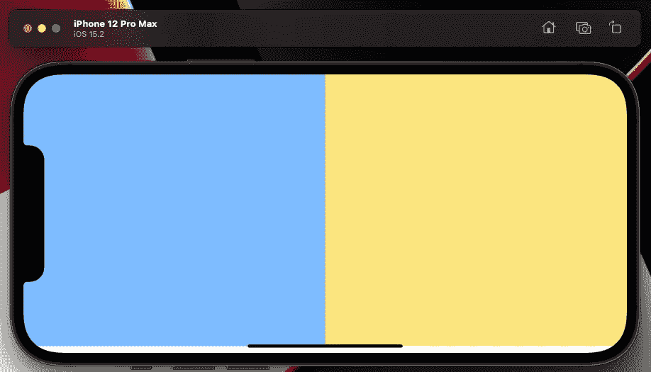
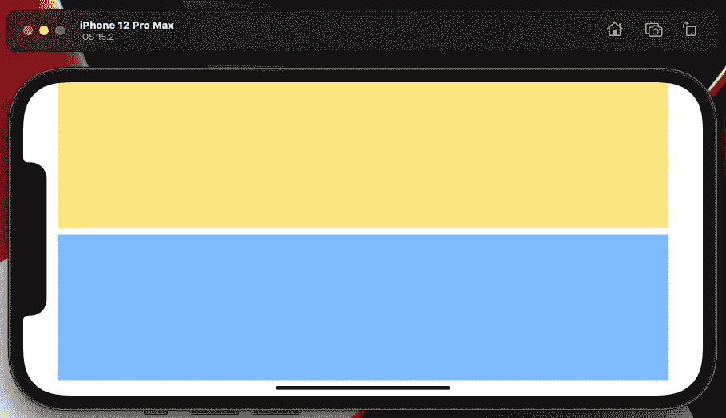

# 在 SwiftUI 中构建相同界面的 4 种方法

> 原文：<https://betterprogramming.pub/4-ways-to-build-the-same-interface-in-swiftui-acc783b6d536>

## SwiftUI 中的布局解决方案


哈尔·盖特伍德在 [Unsplash](https://unsplash.com/s/photos/layout?utm_source=unsplash&utm_medium=referral&utm_content=creditCopyText) 上拍摄的照片

几十年前，第四代语言风靡一时——非常少即是多的想法。这个概念是将编码简化到每个人都可以做的程度。我怀疑这是他们开发 SwiftUI 时考虑的一个原则。

但是有一个代价是复杂度更低，也就是灵活性更低。编译器假设的越多，编码者的选择就越少。

因此，正是带着这种想法，我想尝试开发一个简单的界面来做相反的事情，从最简单的解决方案开始，然后向最复杂的方向发展。不要担心，我不打算将 SwiftUI 接口移植到 uik it——但我想看看如果需要的话，我能从 SwiftUI 收回多少控制权。

# 案情摘要

所以我的简报很简单。我有两个矩形代表我的界面——一个需要在纵向和横向模式下工作的界面。请和我一起探索四种解决方案，来构建同一代码的更复杂版本——也就是更灵活的版本，您可以根据自己的需要进行调整。界面需要像这样，一个蓝色方块和一个黄色方块，不管设备的方向是什么。



正确的解决方案

## 使用现成的 SwiftUI

好的——所以如果你用最简单的方法解决这个问题——你会失败。失败，因为默认情况下，SwiftUI 代码会这样做。



错误的解决方案

类似这样的代码。

```
**struct** Basic1: **View** {
  **var** **body**: **some** **View** {
  // Default is a VStack
    **Rectangle**()
      .**fill**(Color.yellow).**opacity**(0.5)
    **Rectangle**()
      .**fill**(Color.blue).**opacity**(0.5)
  }
}
```

问题是，默认行为假设布局总是以这种或那种方式流动——因此控件和数据的集合排列在垂直界面或水平界面上。

## SwiftUI 中的 if/else 块

当然，如果有两种方法，最简单的解决方案是 if/else 块。SwiftUI 中完全支持的结构，唯一的复杂性是检查 trait 集合的环境变量。

正如他们所说，ACA Marche 工作得非常好，按照我们想要的方式安排事情，但正如我在开始时所说的那样，也许我想要更多——对如何实现它有更多的控制。

# 在 SwiftUI 中使用基本对齐指南

如果你想在 SwiftUI 中有更多的控制，你需要第三个布局容器；你需要 ZStack。虽然如果你开箱即用，你会再次失败，因为它只是把一切都放在默认的中心。你也需要给它一些布局指南。你需要这样的代码。

当你把它与之前的相比时，看起来相当可怕，我们从 16 行增加到 64 行。也就是说，这也工作得很好，并最终给你更多的控制，同时仍然给我们足够的空间来摆脱那些困扰复杂布局的可怕的 UIKit 约束。

# 在 SwiftUI 中使用高级对齐指南

布局指南很好，我刚刚提出的解决方案也很有效，但你知道还有一个选项可以走得更远，给你自己更多的灵活性，这是一个很大的选项。

一个解决方案，我全力以赴，把数字线加倍，再做一遍。不过，公平地说，我不需要那份通知。我只是为了更好地衡量它。有了这段代码，你不仅可以像所有其他的布局一样在两种布局之间转换，而且如果你愿意，你几乎可以混合 n 匹配它们，也就是半转换；也许一个布局保持垂直，而第二个保持水平。

# 使用几何阅读器

最后，我将带着这个解决方案回到那些可怕的坐标地图。我认为这是一个如何不这样做的例子。当不太清楚是哪四个分支时，逻辑独自去计算它执行哪个代码位。

除了我之前的担心之外，事实上这个解决方案在我的脑海中做了太多的数学运算，以至于无法确定它的可扩展性。

在我看来，最好的答案是使用基本对齐指南；其他的代码我觉得更容易理解。所有这些都让我想到了这篇文章的结尾。我希望你能像我写这本书一样喜欢读它，并从中学习到一些新的东西。