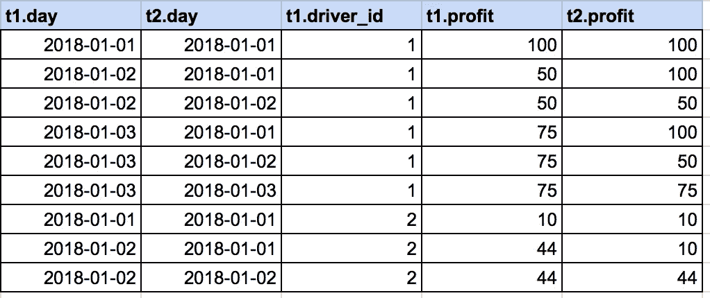

# 使用 SQL 计算累计的 4 种方法

> 原文：<https://betterprogramming.pub/4-ways-to-calculate-a-running-total-with-sql-986d0019185c>

## 描述和解释“添加”到你的武器库中的方法

克里斯·贾维斯在 [Unsplash](https://unsplash.com/search/photos/addition?utm_source=unsplash&utm_medium=referral&utm_content=creditCopyText) 上的照片

在 SQL 中计算累计/滚动和是一项有用的技能。

对于报告，甚至在开发应用程序时，它经常会派上用场。也许你的用户可能想看到他们获得的积分或他们赚到的钱的累计。像 [SQL](https://www.theseattledataguy.com/how-to-write-better-sql-advanced-sql-episode-1/) 中的大多数问题一样，有多种方法可以解决这个问题。

您可以使用分析函数、自联接或跟踪运行总和的聚合表。让我们来看几个例子。

如果你想看视频形式的解释，请直接跳到底部。

# 加入我们的时事通讯

在继续滚动之前，为什么不加入我们团队的时事通讯，了解数据科学、数据工程和技术的最新动态！[在这里了解更多](https://seattledataguy.substack.com/)。

# 使用解析函数

使用分析函数是计算累计最简单的方法。分析函数允许您按特定字段对数据进行分区。例如，在这种情况下，我们可以通过 driver_id 和 month 来分解滚动总和。这将给我们按客户和月份的运行总数。所以每个月都会从 0 重新开始。

请参见下面的查询，了解如何使用分析函数:

这可能有助于比较司机每月每天带来的利润。您可能能够发现某种趋势，并帮助您注意到不良驱动程序，或者使用它来生成驱动程序的性能报告。

他们可以很容易地在不同的日子之间切换，看看他们在一个月的某一天赚了多少。

然而，在面试中使用分析功能有时会让面试官问你是否知道解决问题的不同方法。这并不是说你的答案是错的，只是他们可能对你的想法感兴趣。

# 使用自联接

解决累计问题的另一个选择是使用自连接。自联接是指将表联接到自身。与对所有值使用“=”的典型连接不同，我们将对多个值进行连接。首先，我们将正常地加入驾驶员 id 和月份/年份，然后我们将加入旅行的日期。当我们加入旅行日期时，我们将使用> =符号。这将联接一个表中大于另一个表中的所有日期。

因此，如果我们看下面的查询，我们会看到这个基本结构。这比仅仅使用解析函数要稍微复杂一点。如果你能自己想出这个，干得好！

下面是数据在子查询中的样子。如果您注意到 t1.day 字段在 t1.day 大于 t2.day 的日期中有重复值，那么您可以在 t1.day 进行聚合并获得累计值。

# 在 Select 子句中使用子查询

我们看到的最后一种计算累计的方法是在 select 语句中使用子查询。这与自联接有一些相似之处，只是自联接发生在 select 语句内部。这通常是不可取的，因为使用这种方法通常会强制查询重新扫描表中存在于原始表中的每一行。这往往是非常低效的，但我们觉得对所有可能的选择有一个大致的了解总是好的。

# 设计一个表来跟踪滚动总和

除了使用直接的即席查询，另一种选择是设计一个表来跟踪运行总数。这个设计看起来像什么将根据目标的不同而不同。目标很可能是填充应用程序或仪表板。根据需求改变整体设计。如果我们保持简单，就像上面的例子，我们有一个用户每月的滚动总和，那么你只需要插入一个新的行，如果是相同的月份和年份，就追加上一个值。

这将限制动态的容易程度。例如，如果您决定要查看每三个月的运行总数，该怎么办？

有什么想法吗？

有几种方法可以解决这个问题，包括上面的一些方法。我们会让你仔细考虑的！

我们正在关注一个解决问题的系列，很想知道你正在努力解决什么问题，或者你希望看到什么问题得到解决。如果您有任何疑问，请立即联系我们！