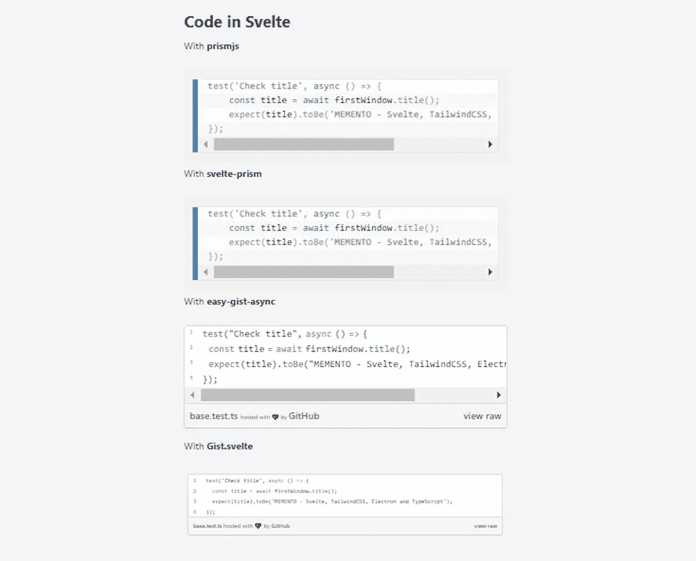
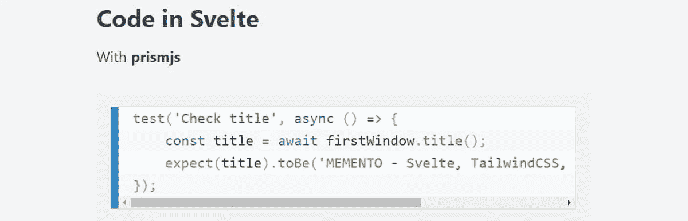
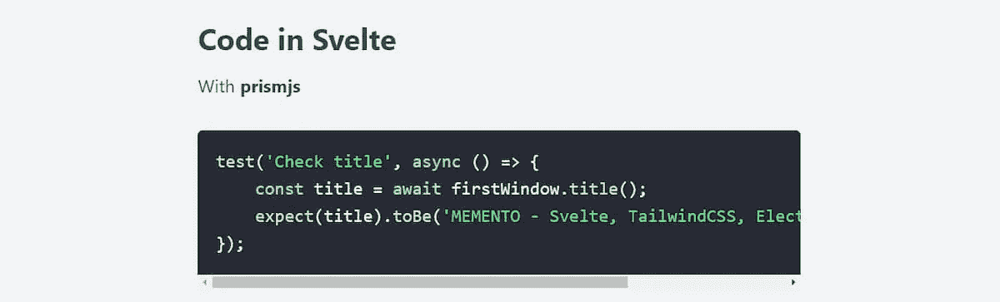
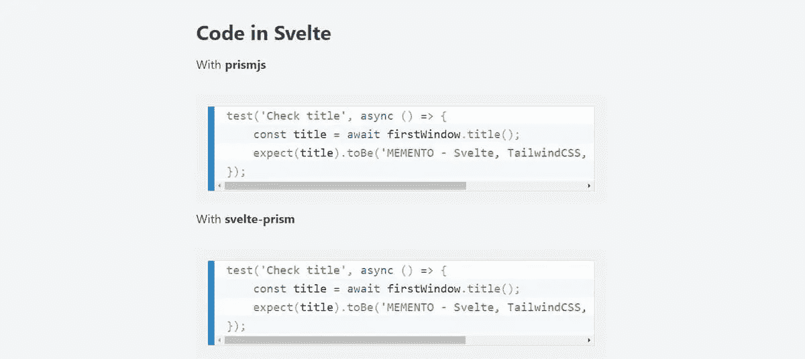
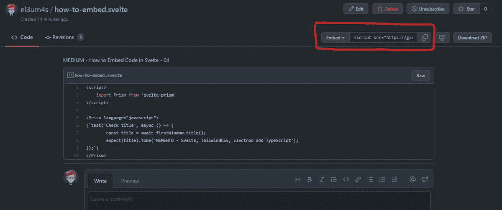
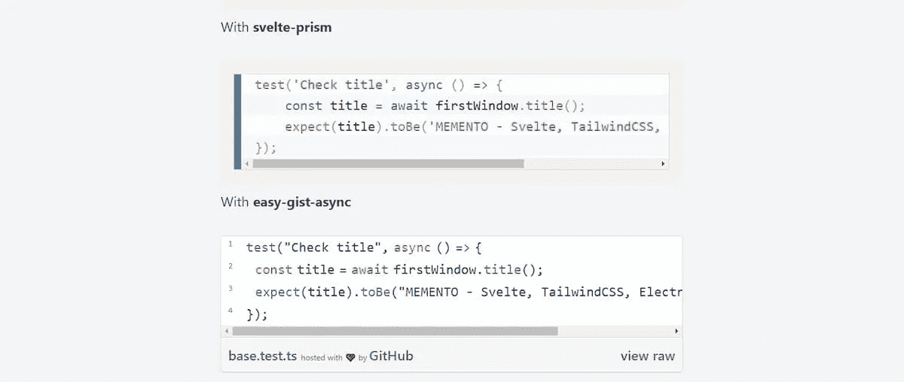
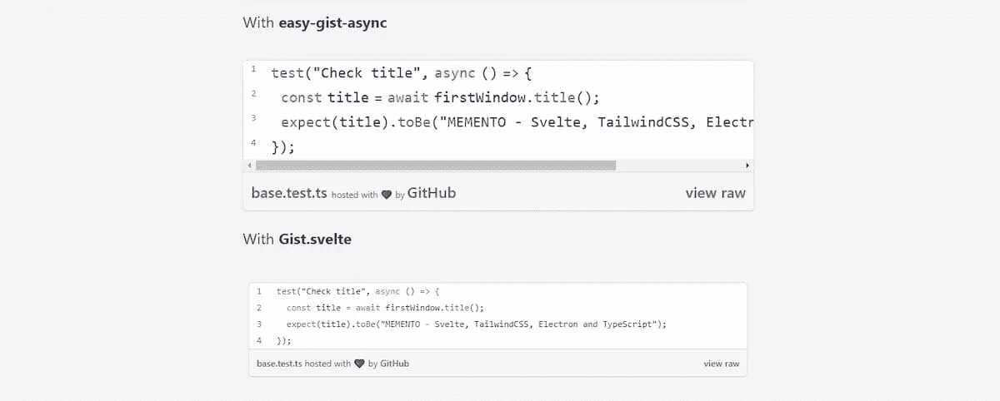

# 在 Svelte 中嵌入代码的 4 种方法

> 原文：<https://betterprogramming.pub/4-ways-to-embed-code-in-svelte-5f40b5fa50ba>

任何人都可以使用


Joshua Woroniecki 在 Unsplash 上拍摄的照片



迟早，我将不得不完全重写我博客的代码。两年前，我从 WordPress 转到 Jekyll——这是一个不错的选择。但是我越是深入研究苗条身材，就越是好奇我能做些什么。我迷上的最后一件事是如何显示苗条的代码片段。令我惊讶的是，这似乎不是一个非常深入的话题，但我认为我已经找到了四种对我有用的方法。

# 棱镜和苗条

第一种方法是直接在减价页面上使用 [Prismjs](https://prismjs.com/) 。作为一个例子，我使用我的[MEMENTO—SvelteKit&GitHub Pages](https://github.com/el3um4s/memento-sveltekit-and-github-pages)。在这个项目中，博客页面是`md` (markdown)文件。文件夹中的每一页都是来自一个假想博客的帖子。代码是用所谓的`code fencing`显示的:

我希望代码看起来像这样:

怎么做？首先，我使用以下代码将 Prism 导入到我的模板中:

```
npm i -D prismjs
```

我可以直接在一个细长的文件中使用，但最好只在`__layout__`文件中插入一次。这样，每段代码都会以相同的方式出现在博客的每篇文章中。



基于博客主题，我可以改变用来显示代码的主题。我也可以使用自定义主题，也许是`Dracula`。为了使用它，我用命令导入 [prism-themes](https://www.npmjs.com/package/prism-themes) :

```
npm i -D prism-themes
```

然后我在文件中导入主题:

```
import "prism-themes/themes/prism-dracula.css";
```



# 细长棱镜

第二种方法是使用一个细长的组件:[细长棱镜](https://github.com/jakobrosenberg/svelte-prism)。这个由 [Jakob Rosenberg](https://github.com/jakobrosenberg) 开发的组件非常方便，如果你在扩展名为`.svelte`的文件中工作的话。为什么？因为在这种情况下，我不能使用三个反勾号序列。

我安装组件，如下所示:

```
npm i -D svelte-prism
```

然后我导入`svelte-prims`

最终结果与第一个示例几乎相同:



# **使用** easy-gist-async 将 GitHub Gist 嵌入到 Svelte 中

第三种方法是使用 [GitHub Gist](https://gist.github.com/) 来显示各种代码片段。优点是能够展示更美丽的东西。主要的缺点是要显示的代码位于 post 之外，这使得编辑起来有点复杂。

通常，创建一个要点，然后用右上角的按钮复制导入代码就足够了:



问题是要使用的代码是这样的格式:

```
<script src="https://gist.github.com/el3um4s/b2ce146321ba67d7420f2a14f1a38544.js"></script>
```

这涉及到向一个苗条的页面添加另一个 js 脚本。但是 Svelte 只接受每个组件一个脚本元素。因此，我将创建一个新组件。

我发现有两种方法可以做到这一点。第一种是使用 npm [easy-gist-async](https://www.npmjs.com/package/easy-gist-async) 包，它可以用下面的命令安装:

```
npm i -D easy-gist-async
```

然后我创建一个`AsyncGist.svelte`组件，如下所示:

我在页面上使用新组件，如下所示:



结果取决于组件导入到的页面的样式。定制外观可能是一件好事，但对于我所需要的来说，这是一个问题。

# Gist.svelte

最后一种方式是我对这个[svelte.dev/repl](https://svelte.dev/repl/2d4d41df9f404b2d896bb81c55cb75c0?version=3.44.0)的改造。想法是在导入的脚本周围创建一个 HTML 框架:通过这种方式，原始的样式得以保持。与原始代码相比，我添加了一种机制来根据内容改变框架的大小。我觉得更方便，更有用。

我使用下面的代码创建了`Gist.svelte`组件:

我在我的页面上使用它，如下所示:

我得到的结果如下:



最后，我可以将所有这些技术一个接一个地放在一起，得到这样的结果:


感谢阅读！敬请关注更多内容。

***不要错过我的下一篇文章—报名参加我的*** [***中邮件列表***](https://medium.com/subscribe/@el3um4s)

[](https://el3um4s.medium.com/membership) [## 通过我的推荐链接加入 Medium—Samuele

### 阅读萨缪尔的每一个故事(以及媒体上成千上万的其他作家)。不是中等会员？在这里加入一块…

el3um4s.medium.com](https://el3um4s.medium.com/membership) 

*原载于 2021 年 11 月 1 日 https://blog.stranianelli.com**T21*[。](https://blog.stranianelli.com/how-to-embed-code-in-svelte-english/)