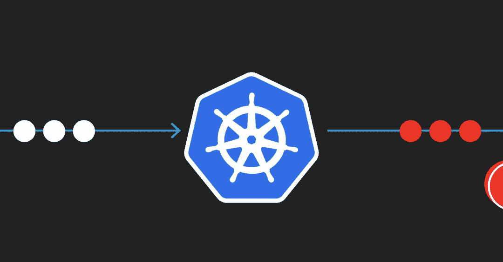
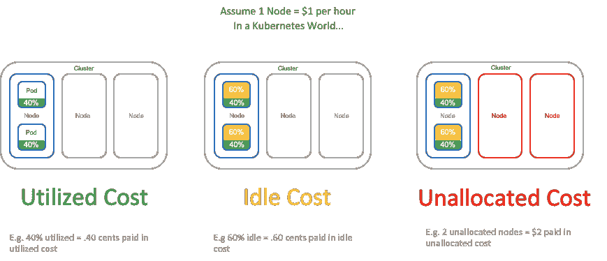

# 优化 Kubernetes 云成本的 4 种方法

> 原文：<https://betterprogramming.pub/4-ways-to-optimize-kubernetes-cloud-costs-41e93892d05c>

## 确保你只花你需要的钱

作者照片。

迁移到 Kubernetes 不能保证降低云成本。本文分享了如何在 Kubernetes 中管理容器化应用程序的成本。

无论您使用的是 AWS 弹性容器服务(ECS)还是任何风格的 Kubernetes，这些内容都可以帮助 FinOps 团队取得成功。管理云成本的核心原则是了解我们基于云的工作负载的运营模式。容器技术允许应用程序在共享计算资源上独立运行，但这在成本可见性、资源优化和预算方面带来了挑战。

注意，在 ECS 中，容器和服务实例相当于 Kubernetes 中的 pod 和节点。我们将在本文中使用 Kubernetes 术语。

# Kubernetes 提供了什么？

Kubernetes 及其其他发行版是一个容器编排平台。容器运行一个应用程序，它们使用容器映像来定义运行应用程序所需的所有资源。Kubernetes 通过将一个或多个容器分组为一个 pod 来管理这些容器。这些单元可以在计算节点集群中进行调度和扩展。

然后名称空间提供了一种组织不同 Kubernetes 资源的方式，比如 pod 和部署。名称空间可以模拟一个组织的结构，因此每个团队都有一个名称空间，或者为开发人员的沙盒环境提供一个名称空间。

# 如何优化 Kubernetes 工作负载

在上一篇文章中，我们讨论了云成本的[贡献者](https://harness.io/2020/06/a-developers-guide-to-cloud-cost/)，以及工作负载如何贡献已利用、闲置和未分配的成本。未分配和闲置成本是浪费，代表未充分利用的群集资源。请注意，在未分配的情况下，您已经保留了没有活动工作负载的节点。

作者照片。

在 Kubernetes 中优化工作负载时，需要考虑不同的策略。让我们更详细地讨论这些。

# 为 pod 配置服务质量

通过指定容器的配置，可以确保 pod 具有固定或最小数量的节点资源。Kubernetes 调度程序使用该配置将 pod 分配给集群中的节点。这些配置为 Kubernetes 中运行的 pods 提供了不同的服务质量(QoS)等级:有保证、可突发和尽力而为。每个类别都是根据您如何配置资源限制以及对计算和内存资源的请求来分配的。

有保证的服务质量等级确保 pods 具有所请求的设定数量的 CPU 和内存。可突发的资源分配将使 pods 仅在需要时访问更多资源，而尽力而为则允许 pods 在节点上有容量时运行。

我建议查看 Kubernetes 文档,了解如何利用每个类。通过对工作负载采用不同的 QoS 等级，您可以获得更高的利用率。

# 配置 Kubernetes 调度程序

Kubernetes 调度程序监视新创建的没有分配节点的 pod。调度器负责为它发现的每个 pod 找到最佳的节点分配，它通过两个步骤来完成:过滤和评分。

筛选步骤决定了可以调度 pod 的节点集。节点关联性指的是在一组节点上运行的 pod 的偏好或要求。在 Kubernetes 中，你还可以*污染*一个节点来击退一组 pods，然后应用*容忍*来允许 pods 调度到具有匹配污染的节点上。这是将一组计算资源分配给组织中的一个团队的绝佳方式。

评分步骤确定剩余节点的等级，以评估最合适的 pod 放置。kube-scheduler 将 pod 分配给具有最高等级的节点。如果有多个节点得分相等，kube-scheduler 会随机选择其中一个。

有两种受支持的方式来配置调度程序的过滤和评分行为。我建议查看调度配置文件和调度配置文件，以确定什么对您的工作负载最有意义。参见 [Kubernetes 文档](https://kubernetes.io/docs/concepts/scheduling-eviction/kube-scheduler/)。

# 垂直和水平调整大小

最后的建议是考虑调整你的资源。在垂直调整中，我们改变节点的大小。如果您正在运行高可用性工作负载，而 pod 需要在不同的底层节点上运行，则您可能需要垂直调整规模。很多时候，这会导致更高比例的闲置成本，例如，我们的节点实例可以有 12 个核心，但您的 pod 只使用了 6 个核心。如果您有一个高可用性的服务，它运行一个应用程序的两个实例，那么运行每个节点的 50%的成本都会造成浪费。

在水平调整中，您可以更改集群中的节点数量。如果集群中没有足够的利用率或工作负载，水平合理调整是有益的。但是，目前为止您只能水平缩减，因此，或者，您可以在不使用计算资源时(例如，在周末)关闭或降低计算资源。

无服务器架构和容器也为您处理资源分配，因此您只需为您使用的资源付费。尽管如此，如果无法访问预留的基础架构，就很难针对不同的工作负载进行优化。

# 利用云成本可见性

管理 Kubernetes 和基于容器的工作负载的成本与管理任何其他云工作负载一样重要。这篇文章分享了如何优化你的 Kubernetes 消费。优化的一个主要组成部分是可视性。