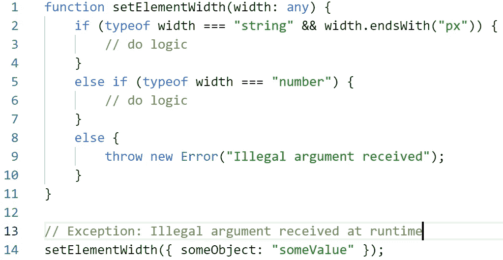
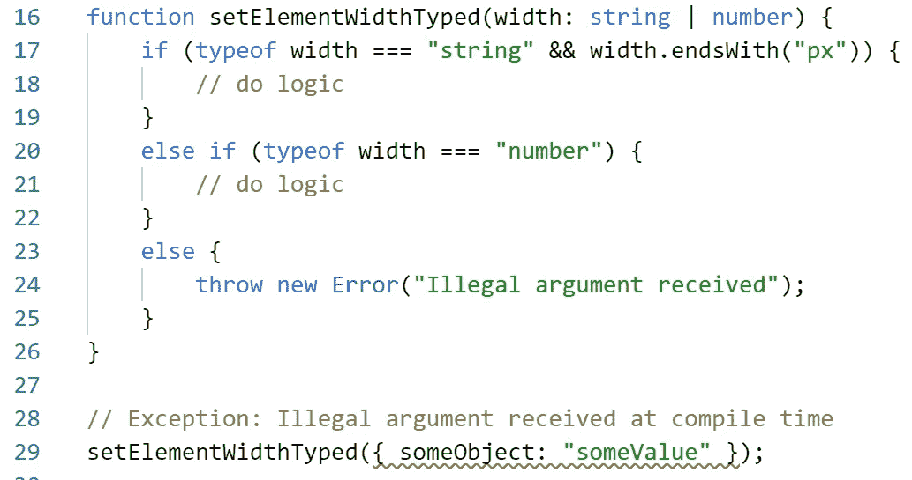
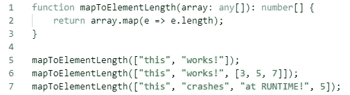
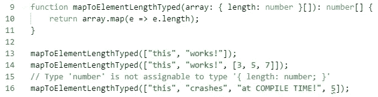
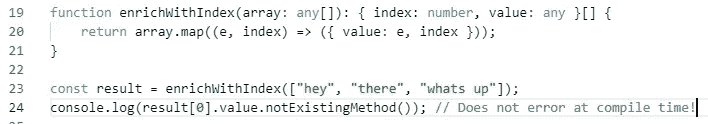
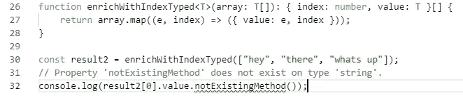

# 替换 TypeScript 中“Any”的 4 种方法

> 原文：<https://betterprogramming.pub/4-ways-to-replace-any-in-typescript-5470b8d8357d>

## 替换 any 关键字以受益于强类型

照片由[丹尼尔·莱维斯·佩鲁西](https://unsplash.com/@yogidan2012?utm_source=unsplash&utm_medium=referral&utm_content=creditCopyText)在 [Unsplash](https://unsplash.com/s/photos/confusion?utm_source=unsplash&utm_medium=referral&utm_content=creditCopyText) 拍摄

适应 TypeScript 可能需要一段时间，尤其是如果您来自弱类型背景，比如 JavaScript。

在寻找灵活性的时候，一个简单的方法就是选择退出斗争，使用`any` 关键词。有时，也许它实际上可能是(几乎)正确的选择，但通常情况下，可以避免使用`any`关键字，用更合适的类型来代替。

我们的目标应该始终是在编译时生成错误，而不是让它们在运行时发生。使用 TypeScript，我们可以遵从[快速失效原则](https://medium.com/@christian.ppl/introduction-to-the-fail-fast-principle-in-software-development-865ccab28979)。

# **联合类型**

您遇到的最基本的用例之一是，当您编写一个接受多种类型的函数时，它会诱使您使用任何一种类型。

比方说，您正在编写一个设置元素宽度的函数。您希望这个宽度要么作为一个以单位结尾的字符串(例如 px)提供，要么您的函数可以接受一个数字。

因为你的函数接受的参数类型是多种类型中的一种，你可能会错误地使用`any`，它看起来像这样:

显然，这对我们的类型安全没有帮助，*任何*东西都可以传递给函数。

这就是工会类型来救援！

使用竖线，我们可以组合不同的类型，在我们的`typeof`检查(类型保护)之后，TypeScript 自动检测到我们现在分别在处理一个字符串或一个数字。这也给我们带来了自动完成和其他智能感知特性的好处。

# **处理数组**

考虑下面的函数，它接受一个数组并将每一项映射到它的长度。数组中的元素可以是字符串或其他数组，但是数字会在运行时导致错误，因为它们没有长度属性。

那么，我们如何改进这个例子，摆脱`any`类型呢？我们唯一的标准是我们的`array`参数是一个包含长度属性元素的数组。

因此，我们的对象可以有其他属性，但是 Typescript 只允许我们检查对象的一部分。我们只要求`array`是一个列表，但是每个条目至少包含一个 number 类型的长度属性。

这立即使我们的代码不仅更健壮，而且更清晰。

如果开发人员阅读了我们的代码或者想要使用我们的函数，他们将能够理解数组的元素必须是包含长度属性的类型。

# **使用泛型**

但是，如果我们有一个函数，它接受任何类型的元素数组，并将它们包装到一个包含它们在数组中的索引的对象中，那会怎么样呢？使用`any`，它可能看起来像这样:

在上面的例子中，问题变得很明显:因为我们正在使用`any`，在调用函数之后，我们丢失了输入信息。

但是这一次，我们真的不在乎我们的函数收到了什么，而是不想返回`any`。使用[类型脚本泛型](https://www.typescriptlang.org/docs/handbook/generics.html)我们可以克服这个问题:

# **未知笼罩何**

如果您发现自己处于上述提示不适合您的用例的情况，您仍然不应该使用`any`！类型`unknown`及其好处经常被忽视。

`any`的问题在于它允许我们做任何我们想做的操作。`unknown`是类型安全的对应物，它强制开发人员在使用前添加检查(类型保护)或强制转换变量。

一些典型的检查包括`instanceof`和`typeof`操作符。处理`unknown`或 union 类型的另一种优雅的方式是利用[用户定义的类型保护](https://www.typescriptlang.org/docs/handbook/advanced-types.html#user-defined-type-guards)，这在本文中没有进一步讨论。

因此，下面的代码在编译时会给你一个错误，但是只有当你使用`unknown`而不是`any`时:

希望这篇文章能让你在以后的项目中摆脱`any`类型，享受更多的类型安全。感谢阅读！

所有的例子都可以在这个 [TypeScript Playground](https://www.typescriptlang.org/play/#code/GYVwdgxgLglg9mABAZwKZQKIBtUFtVhQDqMAJlABYAUA7mZQFyICGYAngJSIDeAUIgMQxgiKlDYAHVHBF1yFRAF5liAETIoAJxhgA5qsQAyQ4jmUAdAVLISlKqokAPVRy59BHxAHoviUnEQsOF0YCH5BAF9wgVQsNCERMUlpWXoFZUU1MBBcACNUTRceaM8fPwCgkLCPKI9Y+PdPAUpNOBpEMFR2jE1WzXsASSwcXWYsFk1dHIIoRE1UCFQYADdUUhcAbhKoqN4yjEdFiVgEJiGRsYmp-EI5haXV0hZZzXBYfF40TBwb4jSqbgoOD4ADyuQAVgsoEx1MDUAA1MYgVAGCIcLa8UCQE5IL7YPAzEjyAAqyVItDSTA02j0iAAPh0cvlNG4SsJROIpDJTGklCp1FodPojCYzBRLGBrLZqA5nK5ik0BGV-IFgqFtiV6qgEhzktyxXzMqpsnkCkVGk1lRU1dVIpq4tqLZ4Wm0Ol1ED0+oNhqhRuNmJNprd5osVmtNhrdvtDqhjvAwGcfX6rkGXvcw09mLMIMCJDAcIh3qhPuh8b8iZRSVJyYDkHCwZDoDC6-hEVhkaj0bxMeBoPHELhmBJiXAyzMADIEXR2AOaZhsJisNgAbQAuhwmCbmWuFYJ5lAQJokLP5+ZBxIqNrFAA+RCocw4PSULu7c8jseESdP6jL1SUGDIKoAA0ag0HAmgANbIAAhKo65bG+o4-BOU52L+-6ASBqhgZBMHAYgy4AMwgQArCBADsq7wbwiEflAX7Tj+f4UAB+GqBAc7IBQqCYWoWaIAASgAqgAcsSAwALIYLBpHUT22L9rRyGfqhFBVmsVAnguPCBKpm5MgUiARGuG6Mqamg7k6+6HsevSnuel5KLe96PoxL7dkpBIqd+6nkuhLG8dh4FQbB1Geb8DGVmSVD+axWE4SF+FEaRFFUV2ZTqYgADkW4FFlQjIB0cCzMwyDIDAuhgMwuQFlAASctqWWAq5jBmcyGxGVlNFDu+yn0apvkxcxcVqBxpXcYF-EAMIghJAAKAzjhgiDiVJMmICRcnyX2CB3mA2gQBQ0oDJKqCOJpdnaUuJlMICOikGd+nmSByxIqgi7sEZlklNZR4THObBnkOVCXiB91nVwN6iICr3tu9d5g6djhGa4Wy7DmYAaHcyAgFgsyZAQB1HTAlAnQ952-txbBsZQBQovFFBZoVIASHBXYY3WOAPsEVDzDjePLgADKu5iw8i5hgMVBwAbAegSegFBwOSqPeL4AAicA8UVswFH0zyIDmuB5rVMD4NB3ZYjtSCE6ExOk0jvkADzEteF0A0wxI3Tp4OOE9zIvW9Htfauu4CL9tkA0DF6g0ISOQ7eAKIGL8OoIj5Mo+5vAc2m-NQAATEoe1E8dDvRZTqDU1htPzGxNCM1AzOs9RZRza0UiaOI2WS5gjgy0K8uUEr+X+Fr3d3r3WO7Q12XUkKWXmFnCCcy5PN87j+dCyLycS1LE+y7oA+K8r6JAA) 中找到。