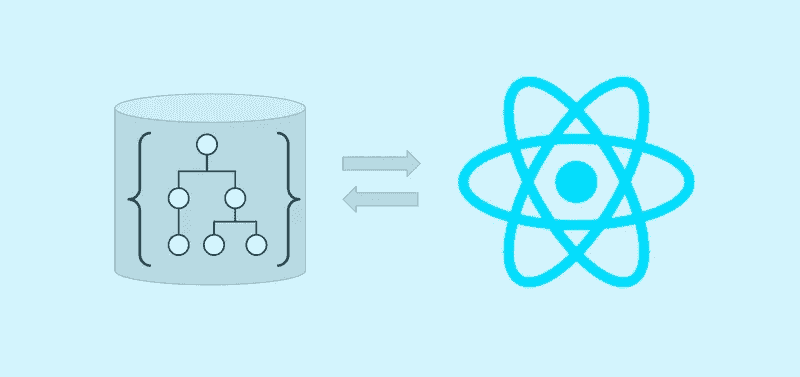
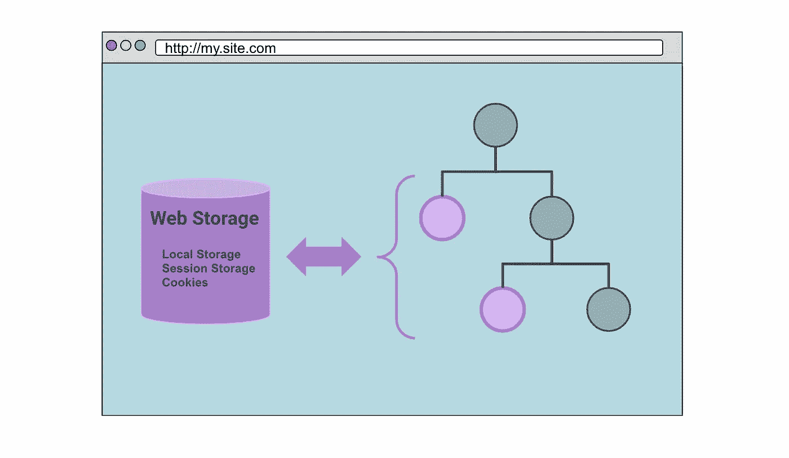
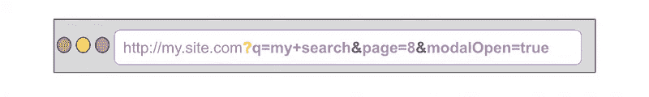

# 简化 React 状态的 4 种方法(不使用 React)

> 原文：<https://betterprogramming.pub/4-ways-to-simplify-react-state-by-not-using-react-b73070b1ea4f>

## 如何用原生浏览器实现简化应用程序状态？

管理应用程序状态的非反应式生命周期机制。

如果我告诉您，您不应该在 React 生命周期中存储所有数据，会怎么样？React 中有许多使用内置浏览器 API 和非生命周期方法的工具，对于正确的用例来说非常强大。

这是我想向您展示在 React 中简化状态而不需要“全局状态”工具的方法的系列文章的第二部分。查看[上一部分](/stop-using-global-state-6-ways-to-manage-state-in-react-c53ac9503e96)中关于在 React 生命周期中存储状态的提示

# 存储类型

我们将重点介绍 React 应用程序中存储和访问数据的四种机制:

1.  网络存储:本地存储、会话存储和 Cookies
2.  URL 和路由器状态
3.  React 引用:React 生命周期之外的状态
4.  浏览器存储

最后还有奖金！

# 1.网络存储

在 React 应用程序中访问 web 存储。

利用本地存储、会话存储和 cookies 等本机浏览器机制是持久化和共享状态的最佳选择，因为它们可以跨所有现代浏览器工作，并且您不需要安装任何新的依赖项来使用它们。

# 局部存储器

对于给定的来源，本地存储跨浏览器会话持续存在— *“来源”是主机名、协议和端口的组合。*

由于其跨浏览器会话的持久性，当数据不需要存储在数据库中时，本地存储是跨页面呈现持久化数据的好方法。它可用于跟踪 JWT 认证令牌、通知是否已被打开等。

它遵循键值格式，并且只支持字符串值。如果使用`JSON.stringify`或其他方式将数据字符串化，您仍然可以存储复杂的对象。

关于本地存储的更多信息:[https://developer . Mozilla . org/en-US/docs/Web/API/Window/local storage](https://developer.mozilla.org/en-US/docs/Web/API/Window/localStorage)

# 会话存储

会话存储与本地存储非常相似，主要区别在于它只在同一个浏览器会话中存在。它在同一会话的页面刷新中保持不变，但在不同会话(新选项卡、窗口)中保持不变。这种方法对于不太持久的存储很有用，例如跟踪用户会话的指标。

会话存储的 API 几乎与本地存储相同:

关于会话[存储](https://developer.mozilla.org/en-US/docs/Web/API/Window/sessionStorage)的更多信息

# 饼干

Cookies 是存储在客户端计算机上的文本文件中的数据。通常，它们用于维护无状态 HTTP 调用之间的有状态数据。例如， [CSRF 令牌](https://owasp.org/www-community/attacks/csrf)，登录信息，偏好，主题，语言等。服务器可以在 HTTP 响应中使用`Set-Cookie`指令来设置 cookies。

浏览器可以使用`document.cookie`直接读写 cookies。它看起来像一个字符串，但行为像一个 getter/setter 函数:

Cookies 在现代水疗和 Jamstack 应用程序时代并不流行，但它们经过了实战检验，在正确的情况下非常有用。

关于 [cookies](https://developer.mozilla.org/en-US/docs/Web/HTTP/Cookies) 的更多信息。

*注意:为了遵守*[*GDPR*](https://www.privacyaffairs.com/gdpr-cookie-consent-violations/)*的规定，您需要小心地将非必要的数据存储在 cookies 中，并首先征求您的用户的同意。* [*严格来说，网站运行所需的必要 cookie*](https://www.cookieyes.com/cookie-consent-exemption-for-strictly-necessary-cookies/)*都是豁免的——比如会话 id、CSRF 令牌等。*

# 2.URL 和路由器状态

您可以在页面的 URL 中存储大量信息。当您希望您的用户与其他人共享 URL 时，这非常有用。URL 可以知道每次打开相同链接时呈现应用程序的确切状态。这就是为什么当你试图将它们复制到一些应用程序中时，你会看到很长的 URL。

*   您可以通过在 URL 末尾添加一个`?`来以键值格式存储 [URLSearchParams](https://developer.mozilla.org/en-US/docs/Web/API/URLSearchParams) 。
*   您可以通过使用`&`分隔多个参数来包含它们。
*   根据您的应用，您可能需要使用`encodeURIComponent()`和`decodeURIComponent()`来编码和解码参数，以处理特殊字符。
*   `[query-string](https://www.npmjs.com/package/query-string)`是一个有用的 npm 包，可以帮助管理搜索参数的复杂性。

使用`react-router-dom`你还可以在应用程序中导航时传递状态。当一个页面需要知道前一个页面的一些信息，或者您想要用获取的数据预先填充它时，这是很有帮助的——比如当从一个列表页面导航到一个细节视图时。

您可以将状态作为常规的 JavaScript 对象传递给`history`，或者在使用`Link`时传递:

# 3.反应参考

Refs 更适合访问 DOM 元素进行直接操作，比如编程聚焦:

但是，您也可以将数据存储在 ref 中，并在组件的渲染生命周期之外使用它。这意味着对它的更新不会触发重新渲染。

*注意:在 React 之前，将一些数据直接存储在 DOM 元素的自定义属性中是很常见的——这在今天仍然是可能的。*

Refs 适用于跨渲染持久化的可变值，如跟踪点击计数、性能指标或间隔/超时 id。

`useRef`:[https://reactjs.org/docs/hooks-reference.html#useref](https://reactjs.org/docs/hooks-reference.html#useref)

# 4.浏览器存储

这些并不特定于任何框架，对于大多数典型的用例来说可能更高级，但是它们为管理客户端的大型数据问题提供了非常强大的机制。以及对基于原生浏览器 API 的开发的潜在未来的一瞥。

# 索引 b

Web 存储是一种在 React 之外使用浏览器本机功能持久化状态的极好方式，但是它在可以存储的数据量方面受到限制。主要用例是用于少量的会话相关数据。

IndexedDB 也是一种原生浏览器功能，但旨在解决在客户端存储较大数据集的问题。它是一个事务数据库系统，类似于基于 SQL 的 RDBMS——但是具有 JavaScript 对象的友好性，因为您只需一个`key`就可以存储和访问数据。它在所有现代浏览器中都可用。

关于[索引数据库](https://developer.mozilla.org/en-US/docs/Web/API/IndexedDB_API)的更多信息

# 缓存存储

CacheStorage 是另一个本地浏览器 API，用于存储和检索网络请求和响应。顾名思义，CacheStorage 是缓存从后端服务获取的数据的绝佳选择。它在引擎盖下使用服务人员，并且可以在所有现代浏览器中使用。

关于[缓存存储的更多信息](https://developer.mozilla.org/en-US/docs/Web/API/CacheStorage)

# 奖金！不要存储在客户端

我们已经讨论了在浏览器中存储数据的机制，在[第一部分](/stop-using-global-state-6-ways-to-manage-state-in-react-c53ac9503e96)中，我们讨论了在 React 生命周期中存储数据的技巧。

这两种解决方案都只是大局的一部分。我们的应用程序通常依赖数据库来存储跨浏览器会话的持久状态。数据库是事实的来源——那么为什么不把你所有的状态都存储在那里呢？

在 SPAs 和现代浏览器出现之前，这是你存储 web 应用程序状态的方式。浏览器中的任何更改都将被发送回服务器，并保存在内存或数据库中。这极大地简化了客户端代码，使得页面加载速度更快，对用户的响应更快。

然而，它需要为每一个变化生成 HTML，所以当需要大量交互时，应用程序很快就开始感到笨拙。这就是 SPAs 和现代 web 技术的力量——在浏览器中高效地创建复杂的交互，而无需重新生成 HTML。

今天，结合现代 SPA 模式，您仍然可以将客户端之外的状态存储在数据库中。事实上，如果您有流畅的 API 体验，这可能会极大地简化您的一些状态和数据需求。有许多工具和模式可以帮助您将客户端的一些复杂性转移回服务器端。像服务器端渲染或后端对前端(BFF)服务器这样的技术。

GraphQL 实现非常适合这种用例，因为它为您的客户端提供了一种使用查询语言查询和修改数据的方法，而无需每次都创建新的 REST APIs。

# 最后的想法

状态管理是一个困难的问题——但是创建流畅的 web 应用程序以最好地服务于您的最终用户是至关重要的。始终对存储应用程序状态的方式和位置持批评态度。记住，没有什么是一成不变的。不断地重构和重新架构对软件项目的寿命是有益的。

我希望这有助于您更加批判性地思考如何在 web 应用程序中最好地存储数据。

我很乐意收到你的来信。请在评论中告诉我你的想法。你在州政府遇到过什么样的挑战？你最喜欢的状态模式是什么？

*原载于*[*https://oskari . io*](https://oskari.io/blog/stop-react-global-state-part-2)*。*