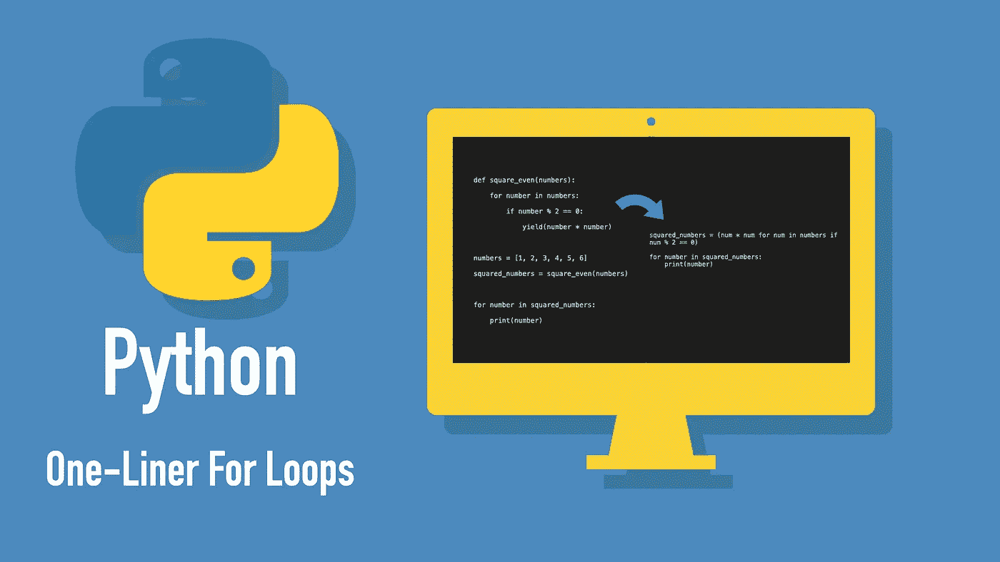

# 用 Python 写一行循环的 4 种方法

> 原文：<https://betterprogramming.pub/4-ways-to-write-one-liner-for-loops-in-python-e8c1db903ce2>

## 用简洁的简写方式遍历列表、字典、集合和生成器，而不牺牲可读性



作者照片。

在 Python 中，你可以通过使用*理解*把你的`for`循环变成一行程序。

Python 支持对主要序列类型的四种不同类型的理解:

*   *列出理解*
*   *词典释义*
*   *集合理解*
*   *发电机理解*

所有的理解看起来都非常相似，而且简单易懂。事不宜迟，让我们看一些如何在 Python 中使用理解的例子。

# 列出理解

让我们从基于现有列表创建一个新的数字列表开始，去掉所有的负数。显然，您可以使用一个`for`循环来解决这个任务:

输出:

```
[4, 7, 19]
```

但是你也可以通过使用列表理解使整个`for`循环更短、更可读、更专业:

```
new_nums = [num **for** num **in** numbers **if** num > 0]**print**(new_nums)
```

输出:

```
[4, 7, 19]
```

恭喜你。您在不牺牲可读性的情况下保存了四行代码。

总结一下，下面是*清单理解*的大致结构:

```
output_list = [expression **for** var **in** input_list **if** condition]
```

为了清楚起见，`if condition`是可选的。例如，考虑使用列表理解来平方`numbers`列表:

```
squares = [num * num **for** num **in** numbers]
```

# 词典释义

惊讶吧，惊讶吧:Python 也有遍历字典的简写方式。这就是所谓的*字典理解。*

## 示例 1:从列表中创建字典

假设您想从一个`numbers` *列表*中创建一个*字典*。在新字典中，一个数字是一个*键*，而*值*是该数字的字符串表示。此外，您希望仅包含偶数:

输出:

```
{10: '10', 20: '20', 30: '30', 40: '40', 50: '50'}
```

这工作得很好。但是通过使用*字典理解*，一行代码就能搞定一切:

```
dict = {num: str(num) **for** num **in** nums **if** num % 2 == 0}**print**(dict)
```

输出:

```
{10: '10', 20: '20', 30: '30', 40: '40', 50: '50'}
```

## 示例 2:对现有字典进行操作

再来看一个*字典理解*的例子。在这个例子中，您有一个通过平方所有数字来更新的字典。

让我们用*字典理解*:

```
data = {'a': 1, 'b': 2, 'c': 3, 'd': 4, 'e': 5}squared = {k:v*v **for** (k,v) **in** data.items()}print(squared)
```

输出:

```
{'a': 1, 'b': 4, 'c': 9, 'd': 16, 'e': 25}
```

这就对了。

你又一次能够用一行代码编写一个更简单的`for`循环，而丝毫不牺牲可读性。

综合起来看，*字典理解*的基本结构是这样的:

```
{ key:value **for** (key,value) **in** dict **if** *condition* }
```

当使用字典理解时，记得将表达式放在`{}`中，而不是`[]`中。

# 集合理解

*集合理解*与*列表理解*、类似，但适用于集合。

作为一个例子，让我们将一个*列表*中的所有偶数移动到一个*集合*中。下面是`for`循环方法:

输出:

```
{24, 62, 14}
```

然而，使用*集合理解，*事情变得更加简单:

```
filtered_nums = {num **for** num **in** numbers **if** num % 2 == 0}print(filtered_nums)
```

输出:

```
{24, 62, 14}
```

集合理解的结构类似于列表和字典理解的结构:

```
output_set = { expression **for** var **in** input **if** condition }
```

记住用`{}`代替`[]`。

# 生成器理解

最后，让我们介绍一下*发电机的理解。*与其他理解类似，*生成器理解*提供了一种使用生成器的简写方式。

假设您想要对一个*列表*中的所有偶数求平方，并删除所有奇数。

`for`循环方法:

输出:

```
4
16
36
```

这工作得很好。但是有了*生成器理解*，你可以忘记创建生成器的`square_even`方法，只使用一行代码:

```
squared_numbers = (num * num **for** num **in** numbers **if** num % 2 == 0)**for** number **in** squared_numbers: 
    print(number)
```

输出:

```
4
16
36
```

生成器理解的基本结构是:

```
output_gen = ( expression **for** var **in** input **if** condition )
```

请记住将表达式放在`()`内，而不是`{}`或`[]`。

# 结论

在 Python 中，可以通过使用理解将`for`循环变成一行程序。

有四种理解:

*   *列表理解*
*   *字典理解*
*   *设定理解*
*   *发电机理解*

感谢阅读。我希望这些信息对你有用。

# 资源

 [## 文件

### 欢迎光临！这是 Python 3.9.1 的文档。

docs.python.org](https://docs.python.org/3/)