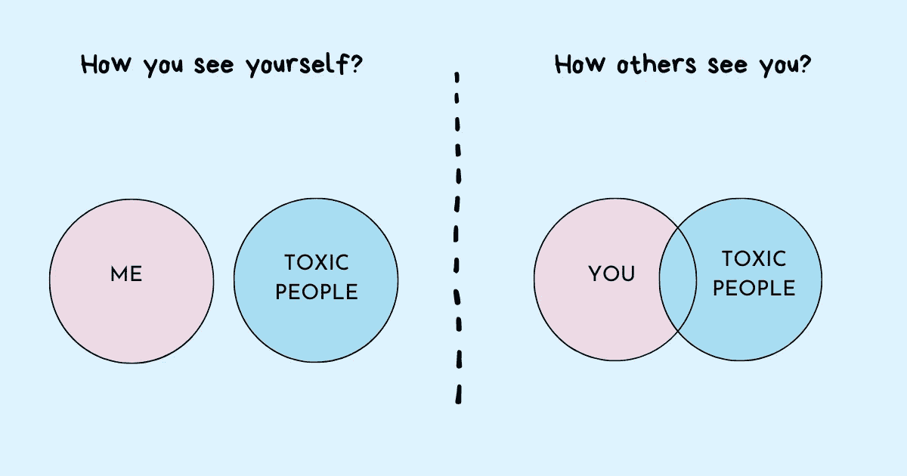

# 你在不知不觉中造成有毒工作环境的 4 种方式

> 原文：<https://betterprogramming.pub/4-ways-youre-contributing-to-a-toxic-work-environment-without-realizing-it-bc6b6fb780a6>

## 识别并纠正影响员工福利的细微行为

鸣谢:作者

我共事过的一些最毒的经理根本不知道他们正在促成一个有毒的工作环境。除此之外，与这些经理交谈令人愉快，他们似乎真心实意地关心自己的员工。然而，外表上的东西与他们团队内部的东西并不一致。他们的良好意图并不总是转化为正确的行动。

他们的行为根植于关于毒性成因的错误假设。

当想到有毒的工作环境时，大多数明显的例子都会浮现在脑海中:

*   强迫性的，微观管理的老板，控制着工作时间的每一个方面。
*   有脾气问题的攻击性行为，欺凌弱小，贬低他人，或在他人面前使其尴尬。
*   关闭人们和他们的想法。批评他们大声说话，告诉他们保持安静，低下头，做好自己的工作。
*   太多[人讨好](https://www.techtello.com/stop-being-a-people-pleaser/)，徇私舞弊，搞办公室政治。
*   人们提倡长时间工作，并认为这是成功的必要条件。
*   高度竞争，鼓励不道德的做法，不惜一切代价赢得胜利。只要对员工有利，他们愿意把其他人扔到公共汽车底下。
*   反社会行为，如冷酷无情、愤世嫉俗、不尊重他人或撒谎欺骗他人。
*   意见分歧被视为不尊重的表现。
*   指责游戏和骂人是常态。

透过这种极端的毒性镜头，大多数[经理](https://www.techtello.com/what-type-of-manager-are-you/)放弃了他们也可能促成一个*的想法:“感谢上帝！我不在这个名单上。唷！”*虽然这些有害行为可能是最受关注的，但还有其他微妙的行为，即经理做或不做的事情也会导致有害行为。

这些无益的行为可能不会得到太多的关注，因为它们不一定会让人发疯，也不一定是工作中极度紧张的原因。然而，它们对员工的福利有影响。

> “有才华的员工加入一家公司可能是因为该公司有魅力的领导、丰厚的福利和世界级的培训项目，但该员工在那里呆多长时间以及他的工作效率取决于他与直接主管的关系。”
> 
> ——马库斯·白金汉(Marcus Buckingham)在《首先，打破所有规则:世界上最伟大的经理人有哪些不同的做法》

不满的员工每年给公司造成数十亿美元的损失。你不想成为造成这种成本的人，尤其是如果你认为自己不是从事有毒行为的人。

因此，即使你是一个真正关心员工的优秀经理，也要接受你的行为可能会无意中导致有害工作环境的想法。有自知之明并表现出接受现实的意愿有助于你认清自己在支持有毒文化中扮演的角色——即使是以很小的方式——并制定策略与之斗争。

你的行为甚至可能鼓励其他人阻止有毒文化在你的公司生根发芽。

# 你造成有毒工作环境的 4 种方式

## **1。未能超越结果**

经理工作的很大一部分是通过推动结果来推动组织前进。如果经理被结果蒙蔽了双眼，以至于看不到产生这些结果的行为，会发生什么呢？

每个人都喜欢团队中有一些拥有非凡工作能力的人，但是如果你的[高绩效员工](https://www.techtello.com/high-performers/)不容易相处并且表现出惹恼他人的行为该怎么办？如果他们是团队中的毒源呢？

当人们犯错误时，他们可能很容易激动，期望别人按照他们的速度工作，发表讽刺性的言论，挑战他们的智力，贬低他们的技能，或者当事情没有按照他们预期的方式发展时贬低他们。

> “有时候，真正有才华的人听说他们有多伟大已经很久了，他们开始觉得自己真的比其他人都优秀。他们可能会对他们认为愚蠢的想法傻笑，当人们口齿不清时翻白眼，并侮辱他们认为不如他们有天赋的人。换句话说，这些人都是混蛋。许多人可能会想，“这家伙太聪明了，我们不能失去他。“但不管你的混蛋有多聪明。急躁对有效团队合作的成本太高了。混蛋很可能会从内部撕裂你的组织。”
> 
> ——雷德·哈斯汀斯在《没有规则的规则:网飞和重塑文化》中

作为一名经理，你自己可能不会表现出不良行为，但你会助长有毒的工作环境，因为你会让那些以让他人感觉不好为代价而取得巨大成果的人得逞。换句话说，选择什么都不做，就是选择支持该行为。当你对问题员工无所作为时，你传达的信息是“这种行为是可以接受的，任何人都可以逃脱惩罚。”

根据您在团队中的参与程度，您可能是:

*   被动促成者:被动促成这些行为，没有注意到它们，也不知道它们对团队的影响。
*   主动促成者:通过延迟行动积极促成此事——等待更多证据，忽略[冲突](https://www.techtello.com/managing-conflict/)，担心失去它们。你也可以通过说服自己事情并没有那么糟糕，或者它们太微不足道而没有被注意到，来使情况合理化。

**作为一名经理，你应该做些什么？**

接受罗伯特·萨顿的建议。他在《好老板，坏老板:如何成为最好的……并从最坏的情况中吸取教训》中写道

> “消极的互动(以及招惹它们的害群之马)会在亲密关系中产生如此大的冲击力，因为它们会分散注意力，消耗情感，让人泄气。当一个团队做相互依赖的工作时，烂苹果会拖累并感染其他所有人。不幸的是，坏脾气、肮脏、懒惰和愚蠢是非常容易传染的。最好的老板不仅仅是给员工充电，招募和培养精力充沛的人。它们消除了负面影响，因为即使是几个害群之马和破坏性行为也会破坏许多好人和建设性行为。”

过于关注结果也会让你忽视团队中表现不佳的人，认为他们不值得你关注。这会影响团队的士气，因为其他人觉得被拖累了，无法弥补他们的懈怠，并认为缺乏责任感是他们的经理不关心公平或在团队中建立卓越的迹象。

有毒的高绩效者或容忍低绩效者对团队造成的整体损害是非常昂贵的。它扼杀了人们的学习和成长，并很快成为员工离职的原因。

## **2。以身作则**

在面试一家初创公司时，招聘经理曾告诉我“我没有自己的生活，但我希望你有自己的生活。你不需要像我一样全天候工作。”回想起来，我知道他真的很关心他的人民，总是把他们最好的意图放在心上。但是，这还不够。

他对自己组织的热情很有感染力。他的行动比他的话更有分量。当他一边说“回家”一边留下来自己解决问题时，这实际上传达了“我希望你留下来解决这个问题”的信息当他周末来办公室面试候选人时，不是一次或两次，而是几乎每隔一周，我有点认为这也是我工作的一部分。当他在非正常时间发邮件时，虽然不希望我在那个时间回复，但在早上又发了一封，问我做了什么来解决这些问题，我整晚都睡不着。

雄心勃勃，看着他整天工作，对与错之间的界限开始模糊。尽管我努力过着平衡的生活，但我发现自己总是在继续工作和回家与家人团聚之间纠结。

他的毒性让我无法平衡。我本可以多次说“不”，但我一直说“是”现在，我可能不能因为他对我的影响而责怪他。然而，这个例子提醒人们，尤其是那些处于权力和权威地位的人，没有意识到他们的行为和行动对他人的影响。

当他们要求别人拥有平衡的生活时，他们听起来可能很酷，但除非他们首先做到，否则他们组织中的任何人都不会明白。他们不能以一种方式工作，并期望他们的员工采取不同的行动。无论对错，每个人都效仿他们的经理的态度和行为。像我这样的一些人只做了一小会儿，就意识到这对他们不好，并在为时已晚之前退出，而其他人则陷入了太深太深的毒性之中。

约翰·马可·格林，一位 IT 极客和一位作家曾经写道:“有毒的人把自己像煤渣砖一样绑在你的脚踝上，然后邀请你在他们有毒的水里游泳。”

也许是时候让你做一个现实的检查，看看你是否是那些人中的一员。

## **3。提供过多保护**

工作环境可能很残酷，尤其是当人们不尊重他人的时间和生产力时。过多的会议、冲突的请求和信息超载会损害团队的生产力。当员工没有时间坐下来[长时间专注于](https://www.techtello.com/managing-distractions/)时，他们真的无法完成任何高质量的工作。

干扰对生产力是毁灭性的。经理越能接受琐碎和不必要的干扰，他们的团队就能做出更好的工作。

在这种环境下，好的管理者会很自然地为他们的员工充当挡箭牌。保护他们不被请求淹没，屏蔽与他们无关的信息，让他们远离任何可能分散他们工作注意力的事情。

然而，开始时健康的保护往往会变成有害的行为，破坏团队的成长。当经理们不知道该在哪里划线时，他们往往会走极端。

由于不知道如何区分健康和不健康的互动，他们阻止了他们的人获得必要的曝光。他们的团队可能获得了卓越的技术，但却没有学到其他有价值的技能，如有效的沟通、冲突解决或授权。

他们总是充当调解人的角色，却未能授权给员工自己做决定，这造成了一个有害的工作环境。在许多情况下，他们也无法分享对完成工作有价值的信息。

这不仅阻碍了团队实现卓越，而且对管理者自身的生产力也有负面影响。他们花越来越多的时间保护员工，而花在推动团队前进的工作上的时间却越来越少。

## **4。抗拒改变**

一些经理鼓励人们畅所欲言，有健康的[分歧](https://www.techtello.com/agree-to-disagree-vs-disagree-and-commit/)，甚至在团队内部讨论新想法，这让他们对自己的经理感觉良好——但是当要做出选择时，他们坚持现状。

他们倾向于一贯有效的方法，而不是在未知的新举措上下赌注。对失败的低容忍度和对风险的厌恶使他们无法接受组织内的挑战性机会。

> "抵抗是这个星球上最有害的力量."
> 
> —史蒂文·普雷斯菲尔德

当经理们不能灵活地改变，并阻止其他人学习和适应他们周围的变化时，他们就会造成一个有害的工作环境。

# 摘要

1.  有毒的人很难识别自己的有毒行为。
2.  经理们很容易通过忽略也会导致有毒工作环境的微妙行为来相信自己没有毒。
3.  那些容忍团队中的不良行为，不看结果的管理者会破坏团队的士气。
4.  处于权力和权威地位的人没有意识到他们的有害行为是如何感染那些试图效仿他们的人的。
5.  当管理者无法在充当挡箭牌和封锁有价值的信息之间找到平衡时，他们就无法授权团队取得成果。
6.  对变革的抵制会把人们拉下来，阻止他们适应组织的要求。

在这里注册我的免费简讯。

*原载于 2021 年 6 月 3 日 https://www.techtello.com**的* [*。*](https://www.techtello.com/contributing-to-toxic-work-environment/)