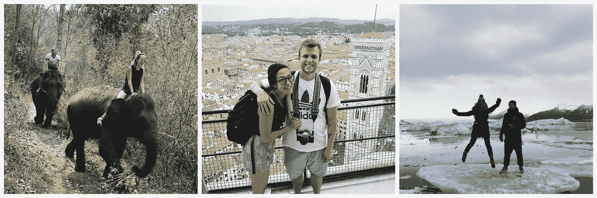
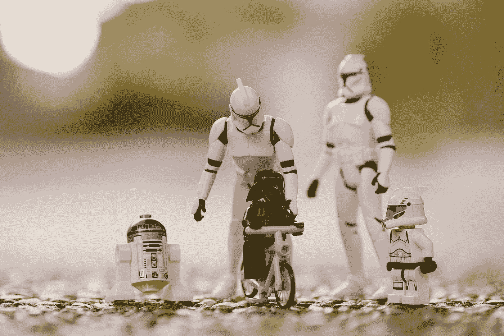

# 为什么我没有去大学读软件工程

> 原文：<https://betterprogramming.pub/4-years-ago-i-decided-to-be-a-self-taught-developer-instead-of-college-bdd5284e9f84>

## 我做错了吗？

莎伦·麦卡琴在 [Unsplash](https://unsplash.com?utm_source=medium&utm_medium=referral) 上的照片

当我用手指在笔记本电脑键盘上快速移动时，键盘发出咔哒咔哒的声音。我只剩下 30 秒了。

“必须尽快完成，”我想。

在做了几个收尾工作后，我点击“回车”，看到一个弹出窗口出现在屏幕上。

> 警报:检测到恶意软件！请安装新的防病毒更新！

在弹出菜单下面有两个按钮:“更新”和“取消”。就像我练习的那样。

过了一会儿，我听到门开了，走廊上传来脚步声。我关上笔记本电脑，踮着脚走到房间对面的文件柜前，开始翻找文件，好像在寻找什么重要的东西。

我的同事佩妮溜达到拐角处，径直走向放在柜台上的笔记本电脑。我的脉搏因期待而加快。眼角的余光，我看到了她打开笔记本电脑时发出的警告。

佩妮什么也没说，她读了警报，并迅速点击了“取消”。我咬着自己的舌头——我最不想做的事情就是在无意的窃笑中暴露自己。一个新的警报出现在佩妮的屏幕上，打破了沉默。

> 警告:检测到新病毒！立即关闭！

一个红色的危险符号伴随着文本，强调明显的危险:

迈克尔·盖革在 [Unsplash](https://unsplash.com?utm_source=medium&utm_medium=referral) 上拍摄的照片

“什么鬼？”彭妮低声自言自语。

她立即关闭了她的笔记本电脑，屏幕一变黑就砰的一声关上了屏幕。我咬我的舌头更难，但无济于事。我让出一个低沉的鼻息，变成了一阵笑声。

“这是你吗？”佩妮转向我说。我点点头。她沮丧而宽慰地叹了口气。

“你真的不该这么做。我们和病人一起工作。如果他们认为我们的电脑被感染了，那就不好了。”

“是啊，你说得对。抱歉。我不会再这样做了。”我叹了口气，虽然我坚持不懈的微笑揭示了我的真实感受。*成功了！我高兴地对自己说。*

几分钟后，我的另一个同事拿着她的电脑走进房间。她睁大眼睛，寻求保证。

“你们谁能帮忙？我觉得我的电脑有问题。”

我看着佩妮，她正怒视着我。“那是最后一个，我保证。”

这发生在 2016 年 4 月，但我最近发现自己对那一天反思了很多。有两个主要原因。

首先，这是一段让我充满自豪感的回忆。诚然，我写的脚本没什么特别的，可能会让我陷入 HIPPA 的麻烦中。但这是除了我之外，第一次有人使用我写的代码。

第二个原因是因为发生在四年前。为什么这段时间很特别？因为正是在这份工作中，我不得不做出一个艰难的决定，这个决定将在那段时间里影响我的生活。

# 两条路分叉了

当时，我在一家理疗诊所做技术员。工资没什么可夸耀的，也没有任何晋升机会。但就其本身而言，这是一份不错的工作:达到目的的一种手段。

我知道我不会在那里呆太久。但我也不会放弃，直到我找到一个使命。一些激励我不断提高自己的事情。一些能帮我实现我想要的生活的东西。

我在编码中发现了它。

照片由 Unsplash 上的 this engineering RAEng 拍摄

编程对我来说很有意义。这既符合逻辑又富有创造性。这是一种欢迎新手但很难掌握的手艺。我想把这作为我的职业。问题是怎么做？

直到有一天，我的同事打开她的电脑发现一个可疑的弹出窗口，我都是自学的。我经常在午休和下班后练习和学习。当我决定把这作为我的职业时，我看到我的前路分成了两条截然不同的道路。

我要继续自学编码吗？还是应该上大学？

相信我，这是个艰难的选择。虽然我一直在免费自学，但获得学位的想法很诱人。

我住在西雅图，离华盛顿大学只有一箭之遥。如果你不知道的话，[华盛顿大学拥有全国最好的计算机科学项目之一](https://www.usnews.com/best-graduate-schools/top-science-schools/computer-science-rankings)。西雅图本身也是世界上一些最大的科技巨头的所在地。

西雅图|照片由[菲利佩·加尔文](https://unsplash.com/@fng137?utm_source=medium&utm_medium=referral)在 [Unsplash](https://unsplash.com?utm_source=medium&utm_medium=referral) 拍摄

事实上，我接触过的很大一部分病人要么是软件工程师，要么是计算机专业的学生。我经常和他们谈论他们的工作和学习。谁知道一天坐在电脑前八个小时以上姿势不良会导致身体疾病？

当我处于十字路口时，我问一些与我共事的病人，他们是如何找到第一份工作的，他们是否认为获得学位是找到工作的最佳途径。

毫不奇怪，大多数工程师都有计算机科学血统。学生们都认为学位，或者至少是证书，是获得梦寐以求的第一份工作的最佳途径。

我同意他们的观点。顶尖的计算机科学教育与知名科技公司的实习相结合，将打开任何就业大门。这是一个简单明了的计划。然而，在我做出决定之前，我需要考虑如果我走这条路，未来四年的生活会是什么样子。

如果我选择攻读学位，毫无疑问，我将获得一流的教育，并极大地推动我的职业生涯，但这是有代价的。从学费来看，四年的时间我要花掉将近 45，000 美元的学生贷款。

毫无疑问，我将不得不贷款——我几乎身无分文。毕竟，我还在努力偿还我第一个学位的债务。第二次去上大学会给我留下大约 70，000 美元的账单。虽然还在五位数，但一想到要累积这么多债务，我就心跳加速。

但是更可怕的因素是时间承诺——四年。

在 [Unsplash](https://unsplash.com?utm_source=medium&utm_medium=referral) 上 [NeONBRAND](https://unsplash.com/@neonbrand?utm_source=medium&utm_medium=referral) 拍摄的照片

对于一个没有生活负担的 18 岁单身来说，这不是问题。事实上，这是意料之中的。然而，对于一个快 30 岁的人来说，4 年的时间对于暂停生活来说是一个永恒。

我第一次喜欢上大学的时候。我留下了美好的回忆和朋友。但是我不再是 18 岁或者单身了。我刚刚和我的女朋友搬进来，我们正在享受我们生活的新篇章。我不想强迫她再次过上挨饿的大学生活。

# 开辟我自己的道路

所以当所有这些想法在我脑海中盘旋时，我做了决定。我拒绝了与我共事的病人的明智建议，一头扎进了自学路线。

一想到要探索未知世界，我就感到恐惧。我不知道有谁成功地自学了编程，更不用说找到一份自学工程师的工作了。

但我也有兴奋和希望的迹象。在我学习的几个月里，我取得了突飞猛进的进步。如果我能在不到四年的时间里开始我的职业生涯，哪怕只有一点点机会，也是值得的。任何节省下来的时间都将是与家人共度的额外时间——享受我的劳动成果。

这就是事实。

在认定我不可能上大学后，我开始自学。

克拉克·蒂布斯在 [Unsplash](https://unsplash.com?utm_source=medium&utm_medium=referral) 上拍摄的照片

我收集我的技术病人的大脑，直到我最终放弃全职研究。我和我的女朋友搬到了纽约市，我注册了每几个在线课程和教程。直到我选定了[发射中心](https://launchschool.com)。

从那以后，生活变得模糊不清。编程、记笔记和(不那么)罕见的视频游戏休息。一直坐在我纽约的小公寓里。

我最初的希望是在四年内找到我的第一份工作，开始我的职业生涯。通过专注的学习、练习和塞尔达的力量，我能够在两个小时内完成。

自从有了第一份工作，生活就变得一片模糊。

因为另一个版本的我会坐在教室里增加他的学生贷款，所以我还清了我所有的贷款。虽然大学版的我可能会在十年来最糟糕的就业市场中毕业，但我得到了提升，成为了项目负责人。

虽然我为自己职业生涯的里程碑感到自豪，但我更为能与家人共度的时光和经历的冒险感到自豪。在过去的四年里，我驾车穿越了整个美国。

我公路旅行的照片

我去过几个国家。

其中三个国家(泰国、意大利和冰岛)

在约塞米蒂国家公园向我一生的挚爱求婚。

在约塞米蒂国家公园求婚

与此同时，另一个版本的我却在埋头读书。

# 那么我的选择正确吗？

如果你读到这里，你大概能猜到我的答案是肯定的**。**

四年前，我在一家理疗诊所工作，用假病毒捉弄我的同事。我每天都在治疗软件工程师，同时幻想着拥有他们的生活。现在，我是他们中的一员。

不仅如此，自学编程让我的职业生涯起步更快，也让我有更多时间陪伴家人。我不会拿它来交换任何东西。

照片由[张家瑜](https://unsplash.com/@danielkcheung?utm_source=medium&utm_medium=referral)在 [Unsplash](https://unsplash.com?utm_source=medium&utm_medium=referral) 上拍摄

但是让我说清楚，这是我的正确选择。我冒了一次险，并获得了回报。并非所有做出同样选择的人都如此幸运。这篇文章是生存偏差的定义，不应该被看作是规定性的。

对于那些学习编程的人来说，你可能不得不决定要么自学，要么获得文凭，要么介于两者之间。如果你在这个位置上，不确定该朝哪个方向走，我有一些建议。

提醒自己你的目标和你生活的哪些方面最有意义。—利用这一点来做决定。在这个过程中，我学到的最重要的一课是不要牺牲对你来说最重要的东西。

不要担心别人找工作更快或者起薪更高。闯入科技不是重要的部分。关键是你到了这里之后要做什么。

[*订阅我的个人资料*](https://medium.com/subscribe/@SunnyB) *如果你想在我上传新故事时得到通知。*