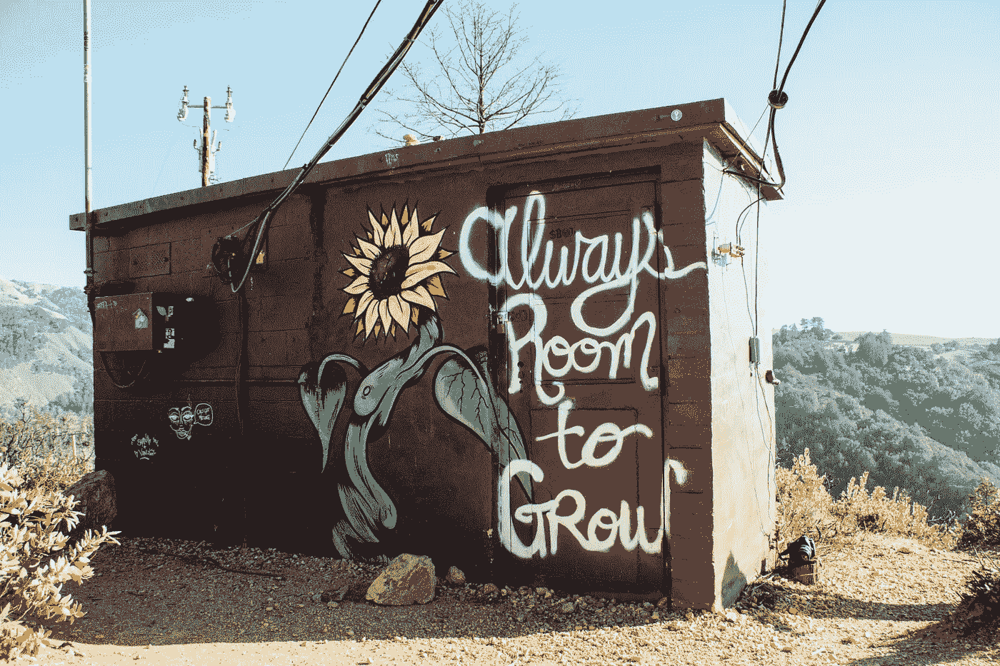

# 老师、领导、书呆子和小丑——我的四个高级开发人员

> 原文：<https://betterprogramming.pub/4-years-with-these-4-senior-developers-part-1-11dc08db34af>

## 我从他们每个人身上学到了什么

凯尔·格伦在 [Unsplash](https://unsplash.com/s/photos/development?utm_source=unsplash&utm_medium=referral&utm_content=creditCopyText) 上的照片

> "如果说我看得更远，那是因为我站在巨人的肩膀上."—艾萨克·牛顿

你的高级开发人员可以成就你，也可以毁掉你。

在我四年的职业开发生涯中，我见过这四位高级开发人员，以及他们不同的个性和处理事情的方式。

让我把他们介绍给你，分别是老师、领导、书呆子和(最后，但绝对不是最不重要的)小丑。

我分享这些是为了让你了解他们，像我一样从他们身上学习，并为你未来的旅程做好准备。这是一个很好的资源，你在书本和新兵训练营里都找不到。

# 关注进步

不要盯着别人的生活:眼睛盯着你的目标。

你可能忙着看邻居的花园，而不是种植自己的。这是我们需要改掉的坏习惯之一。

我们有时会把精力用在错误的事情上，而不是用在更有成效的活动上。

我们有了这个新项目。它是由一个外部开发团队构建的，大概有 25 个以上的开发人员。然后，在计算它的进度时，基于所有需要的需求，它完成了 40%。

你猜怎么着？这项工作交给了一个四人小组。我们的团队。

那次见面后，我们疯了。我们抱怨很多，比较东西。我们给出了所有行不通的可能原因。

我们不确定结果会是什么。所有的栈需求对我们来说都是全新的，我们战战兢兢，惊慌失措，因为我们知道我们有一个严格的期限。

进步是实现甚至无法实现的目标的黄金通行证。

## 领导者

这位资深开发人员告诉我们，要把事情看得更像机遇，而不是障碍。如果我们决定迎接所有这些挑战，那么几年后，所有这些经验和新获得的技能都将成为我们的财富。

所有这些都发生在九个月前，看看我们的进展，哦，天哪，我们还没有完成。但这次经历教会了我一件事，那就是我打算在 2024 年实现的全栈梦想，现在越来越近了。我能从骨子里感觉到。

再过几个月，或者一年，我知道它会开花结果——我的朋友，那是令人惊叹的时刻之一。

如果我们只选择看到好处，看到在障碍和困难的另一边等待着我们的成功，而不是把它们视为问题，那么我们的生活将永远不会一样。

埃隆·马斯克也是这一理念的忠实信徒。不管他有多成功，他都努力工作。每一个目标的实现都会让你离更大的目标更近一步。

而现实是没有别的办法。大事只能通过做小事来完成，一次做一件小事，把事情分解，比如一周做一个专题。每月做一个小项目，一年下来你会有 12 个项目。

到达 Z 点的唯一方法是弄清楚如何把东西从 A 点带到 B 点，以此类推。世界就是这样运转的，不是靠等待奇迹。

所以，每当你面临一个非常大的障碍时，把它分成几个部分。一旦你揭开真正的问题，你会惊讶地发现它是多么容易。

# 你的工具箱

在选择筹码时，你必须经常问自己这样一个问题:我拥有什么？我为什么拥有它？

留意你放在工具箱里的东西。有目的地选择，有计划地建设。说到这一点，与其过度劳累，不如智取。

选择聪明永远不会错。这是我独自生活多年所学到的。

## 书呆子

这位资深开发人员从来没有忘记提醒我们，不仅要建设自己的未来，还要开动脑筋。

> "没有勺子和叉子这种东西，只有叉子."

这是我从他那里听到的最喜欢的一句话，当时他教导我们不要只专注于一个领域。他说，我们已经工作了足够长的时间来接受成为一个多开发者，而不仅仅是关注前端或后端或 DevOps。我们必须了解从零开始到部署，再到管理应用程序的不同版本的一切。

作为开发人员，我们必须学习技能和工具。但是，成为一名高级开发人员的基础是我们必须理解一切是如何联系的。

无论你是刚刚开始还是已经工作多年，在选择你想要添加到工具箱中的工具时，一定要记住要聪明。在你开始学习一项技术之前，确保它是有意义的。

问问你自己:“这个工具或技术适合或帮助我工具箱里的其他工具吗？这能与我的堆栈一起工作吗？把这个加到我的工具箱里有意义吗？”

# 害怕是正常的——但是克服它

要么你管理你的一天，要么你的一天管理你。无论哪种方式，你都必须做出选择。

无论你在做什么项目，无论你参加什么学习或训练营，只要尽你最大的努力，不管有多小。

你今天种下的每一样东西，都要知道你以后会收获的。所以确保你种植的水果和你期待的一样。

你在控制中。你选择把精力花在什么上，你如何度过你的时间，肯定会在未来得到什么。

## 小丑

我合作的第一个高级开发人员是最差的。

他不教，他不关心，他只是简单的无视。

当时我和其他七名初级开发人员一起工作。大多数开发人员刚从大学毕业，还有我，对我的第一份开发工作非常兴奋。

每当我们问他问题时，他只是笑着说“自己想办法”

即使这个问题是有根据的，即使这个问题是关于以前的一个项目，甚至是公司的一些事情:“找另一个部门的人。”他是个灾难。

我们挣扎了很久。

他没有分享旧版本的代码，他希望我们自己开发新版本。我们很挣扎，因为所需的技术甚至不是开源的，也没有提供培训，没有资源，只有基本的文档。那时候我的字典里没有文档记录，太糟糕了。

但话又说回来，我必须弄清楚，试着向别人学习，并在接下来的几年里依靠自己和有限的资源进行学习。

这是我职业生涯中非常具有挑战性的时刻。你不知道我有多少次想放弃。但我继续前进。我只是不停地出现。我很害怕，但成为一名开发人员对我来说很重要。不管当时我有多羞愧，不管我觉得自己有多愚蠢，我还是出现了。

害怕是正常的，感觉愚蠢也是正常的。每个初学者都是这样开始的——我们需要从某个地方开始才能到达。

他可能是我见过的最差的资深开发者，但他教会了我最重要的一课。

**几天后请继续关注第二部和第三部。**

非常感谢您的阅读！