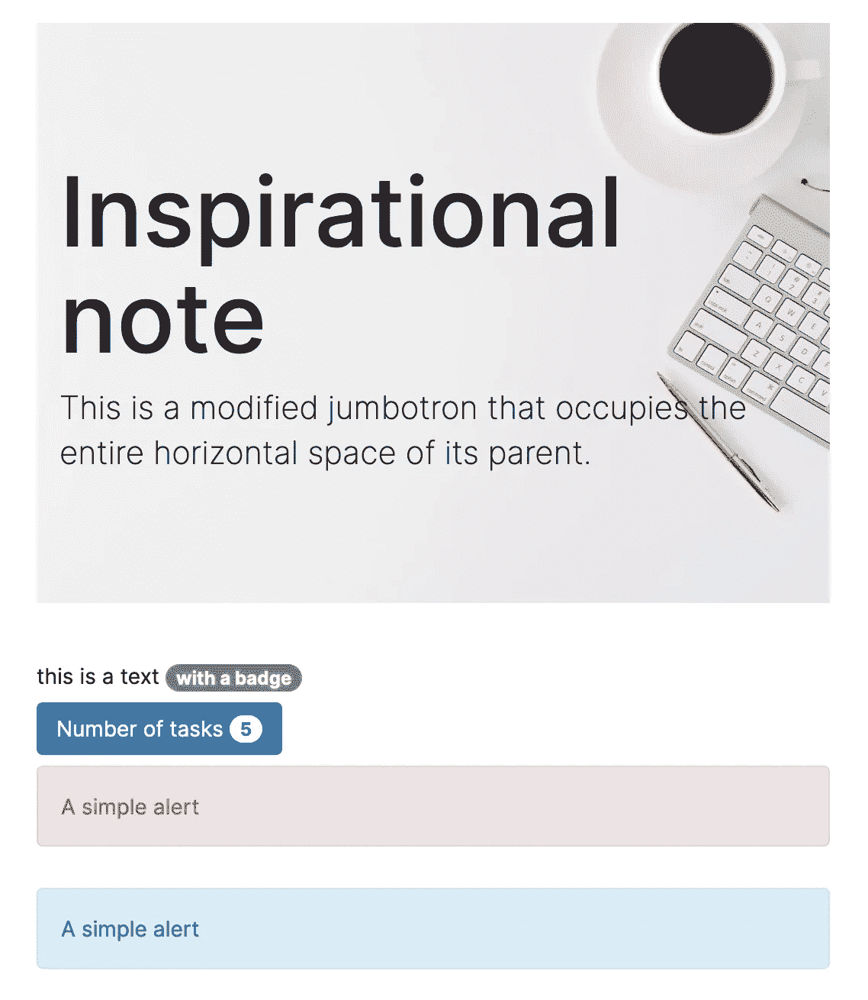
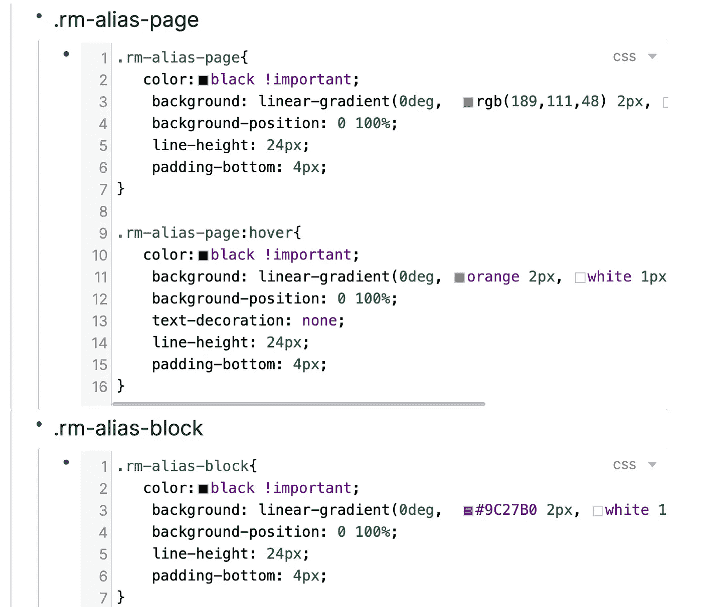
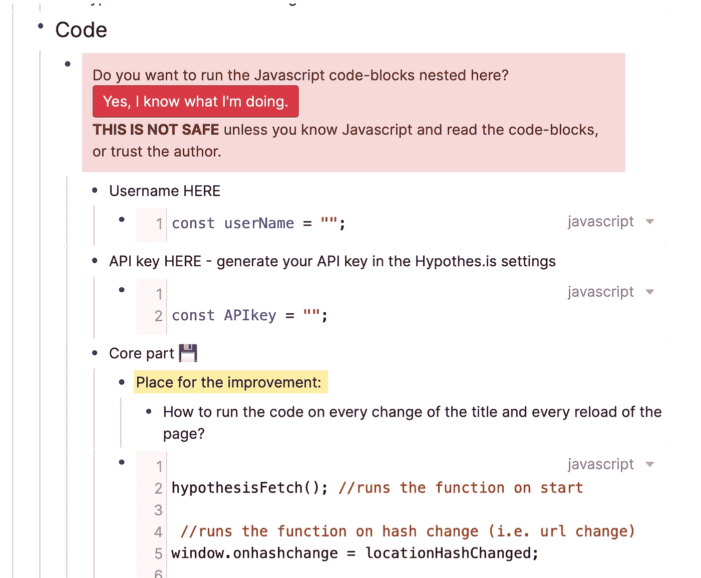
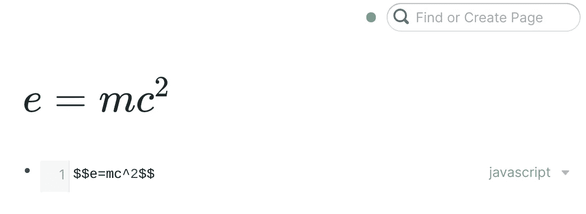
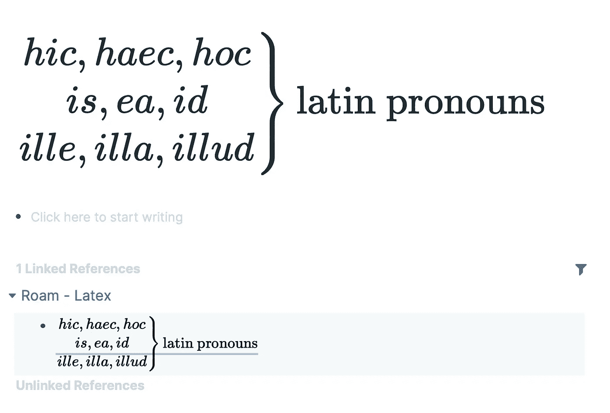
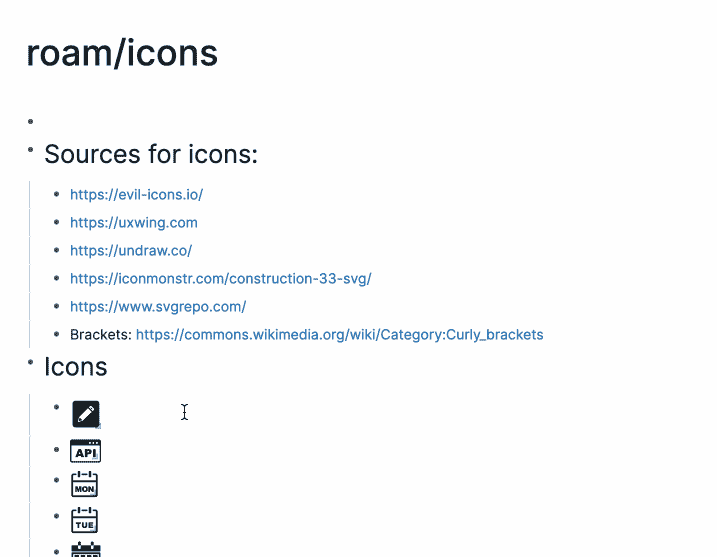
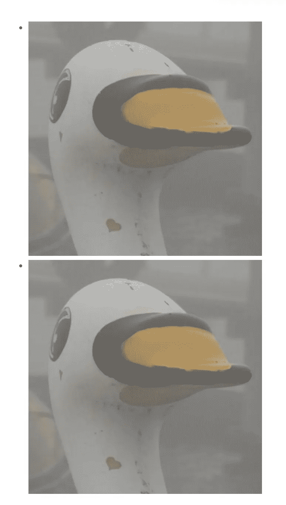
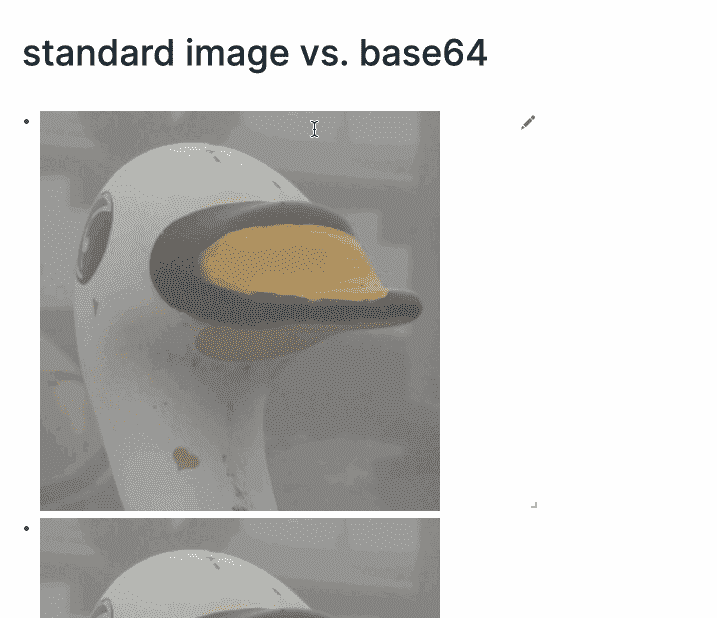
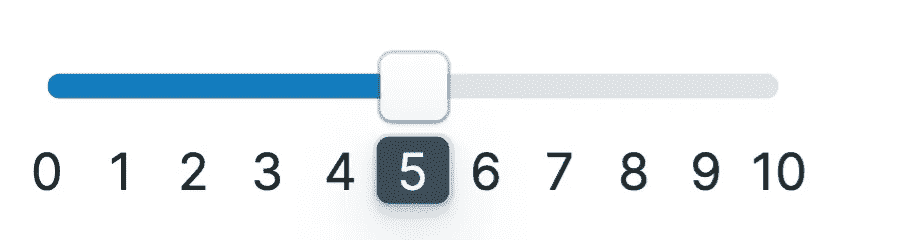
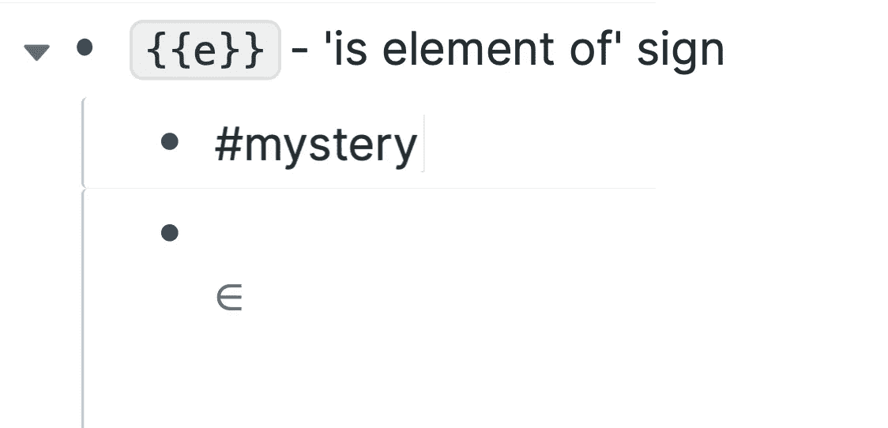

# Roam Research 中你可能不知道的 6 个不寻常、隐藏或意想不到的功能

> 原文：<https://betterprogramming.pub/5-1-weird-hidden-and-unexpected-features-in-roam-research-that-you-might-not-know-6e7419efab70>

## 你可能不需要它们，但是它们很有趣


扎卡里亚·奥西在 [Unsplash](https://unsplash.com?utm_source=medium&utm_medium=referral) 上的照片

在我们开始之前，要记住一件事:Roam 目前(2020 年 10 月)处于测试阶段。我将要向你描述的内容在下一个版本中可能会有所不同，或者完全停止工作！这意味着:尝试这些怪异和隐藏的功能，以免为时过晚。所以快点吧！

# 1.以嵌套的方式重新创建您的互联网和代码

不是开玩笑(也不是小鸭)，Roam 是一个超级强大的工具，基本上可以让你再造互联网。它支持万维网的所有三个基本构件:用于结构的 HTML 元素、用于定制样式的 CSS 和用于交互性的 JavaScript。



在漫游中重建你的网络(图片来源:作者)

如果你想学习如何做，可以看看我的关于 CSS for Roam 的系列文章([第一篇](https://medium.com/@catominor3/roam-with-style-8a18c216d338)、[第二篇](https://medium.com/@catominor3/css-for-roam-2-lesson-ed89d0419a01)、[第三课](https://medium.com/@catominor3/css-for-roam-3-lesson-eef0aa29b9dc))和 JavaScript for Roam ( [简介](https://catominor3.medium.com/javascript-for-roam-introduction-f19f82ca297))。

然而，奇怪的或者至少不寻常的是，您实际上可以将编程与大纲结合起来。这就赋予了 Roam 一种怪异的超能力，成为一种编程 IDE(集成开发环境)的类型，可以让你把自己的思维和编程结合起来。这适用于 CSS:



在 Roam 中组合 CSS 和块

但更重要的是，它可以和 JavaScript 一起工作。在一个块中定义一个变量，并在另一个块中使用它。或者使你的函数可折叠。只需将预制的代码片段插入到代码中。有这么多选择。



混合 JavaScript 和块

# 2.在没人想到的地方使用乳胶

在 HTML 出现之前，在 CSS 和 JavaScript 出现之前，就有了 TeX 和 LaTeX——伟大的排版标记语言。后者仍在使用。就连你这种不起眼的 Roaman 小鸭，也曾经在多年前用 LaTeX 做硕士论文。我对它又爱又恨( *Odi et amo…* )。然而，如果你是做数学的，你可能会喜欢并且需要它。Roam 目前并不支持整套 LaTeX 命令，而是使用名为 [KaTeX](https://katex.org/) 的实现，专注于排版数学的子集。

现在有趣的部分:通常在漫游中，特殊代码在页面标题中不起作用。写在那里，什么也没发生。写`{{kanban}}`，又没什么。但是乳胶是特殊的。注意，这也是唯一一个使用`$$`而不是预期的`{{}}`的短代码。这意味着你可以用你喜欢的数学函数调用你的页面，比如 e=mc^2:



您可能很难在自动完成中找到它，但它会很漂亮。或者更好的是，制作一个小图表，并学习一些基本的拉丁语(作为一个 Roaman，你可能需要它！):



你想选择学习一门罗曼语言吗？

换句话说:


这是一个很酷的页面标题！

# 3.释放键盘的力量(点)

Roam 中有许多隐藏的快捷方式没有得到官方记录，如果你不是 Roam 的联合创始人 Conaw White-Sullivan 的热心 Twitter 粉丝，你可能不知道它们。例如，有一些特殊的快捷方式可以让你在漫游中像在 EMACS 一样移动(还有许多其他地方，通过特殊的插件):

然而，可能对我来说最有趣的是一个快捷方式，它允许你从一个打开的块移动到下一个，基本上是创建一种 PowerPoint 演示。只需将幻灯片内容放入不同的块中，放大第一个块，然后按住“ctrl+c”并按“m”移动到下一个块


使用 ctr+c+m 从一个嵌套块移动到另一个嵌套块

你可以在 [Roam-tricks](https://roamresearch.com/#/app/roam-tricks/page/OE16pbHJn) 上找到各种记录在案和未记录在案的快捷方式的详细列表。

# 4.给图像命名

这个很有用但是不明显。如果您上传或链接一个图像进行漫游，您将看到以下代码:

```

```

如你所见，第一部分由一个空的`[]`组成。你可以给它起个名字，例如:

```

```

为什么？通过这样做，您可以在使用`(( ))`搜索块时简单地找到您的图像。

你甚至可以更进一步。我有一个特殊的漫游页面叫做`roam/icons`。在那里我存储了各种图标，并给它们起了以下名字，比如:``。然后，我可以快速找到它们，并在任何我想要的地方再次使用它们。



给图像命名

# 5.将图像放入它们的基底(64)

关于图像还有一个技巧。你可能知道，图像和其他数据都保存在所谓的 [Firebase](https://firebase.google.com/) 中。它们只受到复杂的 URL 地址的保护。这其实也不是完全不好。复杂的 URL 地址也是一种密码(假设没有谷歌机器人会找到它)。然而，你可能仍然会对把你的图片放到 Roam 中感到不舒服，特别是因为现在还没有办法把它们从 Firebase 中删除。实际上，你失去了对它们的控制。

其中一个解决方案是使用一个像 [fast.io](https://fast.io) 这样的外部地方来保存你的文件。概念是一样的——受 URL 保护，但至少你可以删除你的图片。太好了！

然而，你还可以做另外一件事:将你的图像转换成 base64。这是什么？基本上，它将图像的二进制数据(所有这些 0 和 1)转换成文本表示(也就是带有阿拉伯数字的拉丁字母)。如果你想把你的图像编码成文本，这是很好的选择，因为它在显示器上看起来比 0 和 1 更紧凑。

让我们来看看这两幅美丽的图像。他们可能看起来一样。他们可能看起来像一只鸭子。他们实际上可能是一只鸭子！



其中一只鸭子被保存为 base64 格式。两只都是鸭子。

然而，如果我们看看他们的代码，我们会发现他们之间的巨大差异:



标准图像与 Base64

上图是到 Firebase 存储的典型链接，而下图是一个很长很长的字符串。这也是 base64 的缺点，它可能会降低数据库的速度。另一方面，在某些情况下，您可能更希望您的图像保持原样。

您可以使用不同的服务将您的图像转换为 base64，如 [Base64 图像编码器](https://www.base64-image.de)。

# 奖金…{ { e } }嗯？？

最后，有这么多奇怪的短代码，你可以写的代码，他们通常做一些事情。其中许多是真正有用的:`{{table}}`创建一个表格，`{{mermaid}}`创建一个奇特的图表。其中一些更加晦涩难懂或者没有记录，比如`{{a}}`，它创建了一个匿名滑块:



{{a}} —匿名滑块

然后，还有`{{e}}`。你知道…只是`{{e}}`，它创造了这个标志:



一个神秘的“元素”符号

为什么？谁知道呢！但是它就在那里。也许对此有一些怪异的未来计划。你可以在 [Roam-tricks](https://roamresearch.com/#/app/roam-tricks/page/OE16pbHJn) 上找到这个短代码。