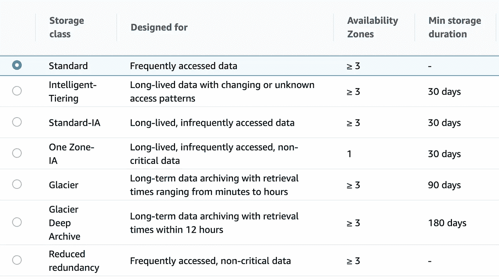

# 对开发人员隐藏的 AWS S3 的 5 个高级功能

> 原文：<https://betterprogramming.pub/5-advanced-features-of-aws-s3-that-are-hidden-from-developers-11a7f8f55975>

## 以更低的成本获得更高的性能和安全性

梅根·罗杰斯在 [Unsplash](https://unsplash.com?utm_source=medium&utm_medium=referral) 上的照片

2006 年，AWS 推出了第一批服务。简单存储服务(如今被称为 S3)是其中之一。但是与其他服务不同的是，这个服务确实很简单。它的主要目的是存储对象:各种文件，档案，备份，甚至网站。在那里放一个文件，几分钟后，它就可以在云系统中使用了。还有比这更简单的吗？

随着时间的推移，越来越多的功能被添加到这项服务中。他们让它变得有弹性和耐用。然而，并不是每个人都知道这一点。它仍然是存放文件和在需要时访问它们的地方。它有很多好东西，我们现在正在探索它们。

# 1.各种存储类别

一开始，S3 按照同样的逻辑存储所有的对象。后来，工程师们发现某些文件比其他文件被更频繁地访问。由于计费是基于存储和传输的数据量，因此拥有专用类型的存储是有意义的。

S3 根据访问模式提供不同的存储类别。像归档和备份这样的文件通常不经常被访问。在下载它们的情况下，等待更长时间也是可以的。作为回报，储存它们的价格会明显降低。

S3 的存储等级

默认情况下，存储类别为*标准*。您可以在对象级别更改它，无论它在哪个存储桶中。每一类都有一定的限制，例如最小存储持续时间或检索时间。

如果您正确评估 S3 的每个文件，您就有很大机会优化成本和资源。例如，备份可以转到 Glacier，而用户的个人资料图片可能在智能分层中。

# 2.版本控制

在软件开发的现代世界中，版本控制听起来很合理。保存文件的历史记录通常是一种好的做法，即记录文件的更改时间和方式。如果有不完整的更改，可以恢复到以前的版本。

S3 有一个选项可以为该时段启用版本控制。该服务将开始跟踪 bucket 中每个文件的更改。这个特性在大型团队中很方便，因为文件可能会意外损坏。即使对象被删除，仍有可能恢复它。事实上，它并没有被物理删除。最新版本将被标记为*已删除*。

除了版本控制，还有一个安全级别。当涉及到实际的文件删除时，它们不仅受到权限的保护。多因素身份验证可应用于每个删除操作。

# 3.加密

出于对数字世界安全的担忧，毫无疑问，S3 不会提供任何东西。在 S3，加密意味着桶中的所有对象都被加密。每次我们上传一个对象，它都会被加密。在请求一个对象时，它将被解密。S3 的加密很简单，由 AWS 负责。

但是你应该知道一些关于 S3 加密的事情。可以使用客户提供的密钥进行加密。AWS 不拥有它们，你将负责管理它们。使用客户提供的密钥无法通过 AWS 控制台上传对象。您应该使用 CLI 或 SDK，其中必须提供加密密钥。

# 4.克-奥二氏分级量表

你可能会问，但这和 S3 有什么关系？这是可能的主机上 S3 的静态网站。如果内容很少改变，并且不是动态的，那么在哪里托管它没有什么区别。但是在某些情况下，我们需要从其他地方加载某些内容。为了防止执行导致钓鱼资源的可疑脚本，发明了跨源资源共享(CORS)。

> 跨源资源共享(CORS)是一种基于 HTTP 头的机制，它允许服务器指出浏览器应该允许从其自身以外的任何源(域、方案或端口)加载资源— Mozilla

所以 S3 不仅允许你托管一个简单的静态网站，还提供了一个额外的安全层。我们可以指定允许的方法、头和来源。如果你把网站搬到 S3，缺失的 CORS 配置可能是检查某个部分是否损坏的第一个地方。

# 5.访问日志

访问日志提供关于对存储桶的访问操作的信息。这对审计和安全目的非常有用。每当有人访问 S3 存储桶上的文件时，就会创建一个相应的条目。它将包含关于用户、执行的操作、访问的对象等等的信息。

这个特性有一些细节。启用该功能时，访问日志也将被写入存储桶。我们需要小心，不要为访问日志选择相同的存储桶。否则，我们会大大增加成本。

当对象上发生任何操作时，都会生成并存储日志条目。这将产生另一个日志条目，因为访问日志的修改是另一个操作。正如您所猜测的，这可能会导致无限循环，因为生成访问日志会产生更多的日志。因此，为访问日志选择不同的 S3 存储桶。

# 最后的想法

Amazon 在构建一个简单的存储对象的服务方面做得很好。随着方便的 SDK 在云端管理文件，基础设施从来没有那么容易。如果您应用 S3 的这些高级功能，您将能够获得更好的性能、安全性和优化的成本。