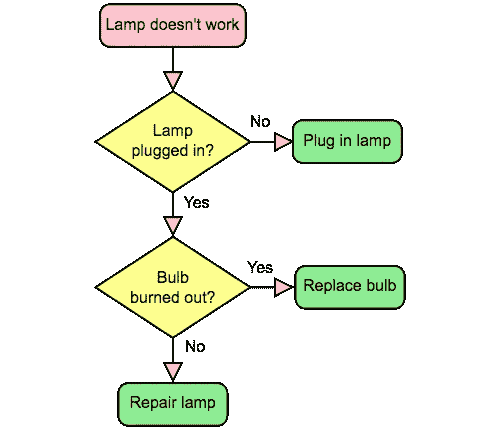

# 条件分支的“If”语句的 5 种替代方法

> 原文：<https://betterprogramming.pub/5-alternatives-to-if-statements-for-conditional-branching-6e8e6e97430b>

## 用 JavaScript 示例实现条件分支的概念



Booyabazookaoriginal 的 SVG 巴布亚新几内亚由 Wapcaplet / CC BY-SA

*条件* *分支*是基于条件执行或评估一段代码，通常使用`if...else`构造来实现。

例如:

```
if (customerPaid)
{
    sendThankYou()
}
else
{
    sendReminder();
}
```

在这里，如果`customerPaid`是`true`，那么`sendThankYou()`将被调用；否则`sendReminder()`就会被召唤。

在编程社区中有一些想法认为`if`应该被认为是有害的或者代码气味。不管这种说法是否正确，可能会有这样的情况，即`if`不是分支的最佳方法，或者应该完全避免分支。

因此，在本教程中，我将展示六种`if...else`的替代方案，并讨论何时可以选择使用它们。

示例是用 JavaScript 编写的，但是概念也适用于许多其他语言。

# 1.三元运算符

我最喜欢的`if...else`的替代品之一是*三元运算符。*

其形式如下:

```
condition ? expressionIfTrue : expressionIfFalse
```

如果`condition`评估为`true`，则`expressionIfTrue`将被评估；否则将评估`expressionIfFalse`。

三元运算符的美妙之处在于它们可以用在赋值的右边。

例如:

```
const labelText = customerPaid ? "Thank You!" : "Payment Overdue";
```

如果客户已经付款，这将把`labelText`设置为`“Thank You!”`；否则你会得到`“Payment Overdue”`。

# 2.`Switch`声明

`switch`语句的结构如下:

`break`语句是可选的，将导致`switch`程序块退出。如果省略了`break`，那么执行将进行到下一个`case`语句。

`switch`适用于基于一组同质值的分支。

例如:

# 3.跳台

*跳转表*是一种使用查找表分支到新函数或块的条件分支方法。

从技术上讲，在 C 语言中，这将被实现为函数指针的[数组。然而，除非我们非常需要数组查找的效率，否则我们可以将其推广到任何类型的键控函数查找。](https://en.wikipedia.org/wiki/Branch_table#Jump_table_example_in_C)

例如，上面的`switch`语句可以重构为 JavaScript 中的跳转表，如下所示:

```
const handleColour = 
{
    'red'               : stop,
    'amber'             : stop,
    'green'             : go,
    'flashing amber'    : go
}
```

这里的`stop`和`go`是函数对象。让我们把它充实一下，以便弄清楚这种方法在上下文中是如何工作的:

这里，我们的代码基于`colour`变量的值有条件地分支。语义与我们的`switch`示例相同，但是我们的代码更少。而且(可以说)读起来更清晰。

# 4.动态调度

使用`if`语句的另一种选择是*动态分派。这包括根据对象的类型选择调用哪个[多态](https://en.wikipedia.org/wiki/Polymorphism_(computer_science))方法。*

它可以用于有条件的分支，就像这样:

这里，根据传递给`handleShape`函数的对象类型，采用不同的代码路径。在我们的例子中，`Shape`是一个`Square`，因此该区域被记录为`4`。

这种方法会产生更多的代码，但是对于它的用法有一些争论。当代码已经使用了`OOP`时，这种模式通常是合适的；然而，试图总是使用多态性来设计分支似乎有些矫枉过正。

# 5.`try' and 'catch' statements`

我把这个包括进来是为了完整性，因为`try` / `catch`应该很少用于控制流。

关于为什么这是一个坏主意，已经有很多文章写了，但是我个人认为`try` / `catch`是为处理异常而设计的，所以通过将它们用于控制流，我们的意图就变得不清楚了。

无论如何，这里有一个使用异常的条件分支的例子:

这里，`item`将被赋值给`previousItem`，如果它存在的话；否则，将抛出一个`ReferenceError`异常，并分配一个新的`Item`对象。

# 6.模式匹配

当谈到分支时，模式匹配是一个新的领域。它通常受到那些喜欢更函数式编程风格的人的欢迎。

模式匹配可以被认为是基于值而不是类型的动态分派(见上文)。

一个经典的例子是使用两个函数实现一个[阶乘](https://en.wikipedia.org/wiki/Factorial)函数:

```
factorial(0) ::= 1
factorial(n) ::= n * factorial(n-1)
```

如果传入的值为零，则调用第一个函数，在这种情况下，返回`1`。如果传入的值是非零的，则调用第二个函数——在这种情况下，返回表达式`n * factorial(n-1)`的结果。

有些语言内置了模式匹配。在 JavaScript 中，需要使用外部库—例如，[Z(JavaScript 的模式匹配](https://z-pattern-matching.github.io))。

阶乘函数可以用 Z 写成如下:

```
var factorial = number => {
  return number.matches (
    (x = 0) => 1,
    (x)     => x * factorial (x - 1)
  )
}

factorial(6) // returns 720
```

可以说，在 JavaScript 中计算阶乘有更具可读性和表达性的方法，但是模式匹配作为一种条件执行方式的潜力远远超出了这个简单的例子。

有一个[提议](https://ponyfoo.com/articles/pattern-matching-in-ecmascript)在 JavaScript 语言中构建一个模式，值得一读。

# 结论

条件分支会给程序带来复杂性。

嵌套的`if`和`switch`语句会降低代码的可读性，并可能导致错误。其他形式的分支会导致过度工程化的代码库。如果有可能完全避免分支，这通常是一个好的起点。

然而，如果我们确实需要有条件的分支，最好选择最合适的工作机制。希望在这篇文章中，我提供了一些有用的选项供参考。