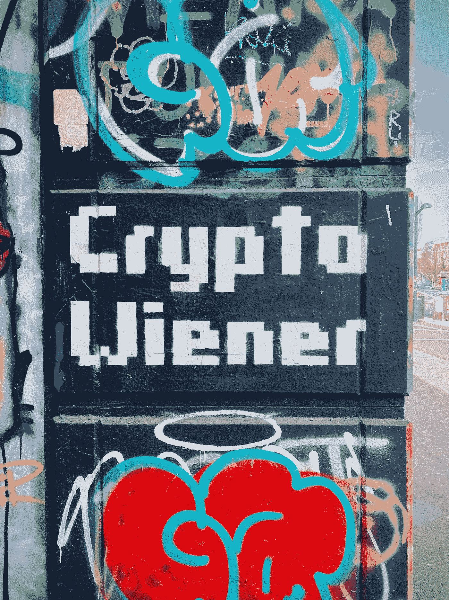
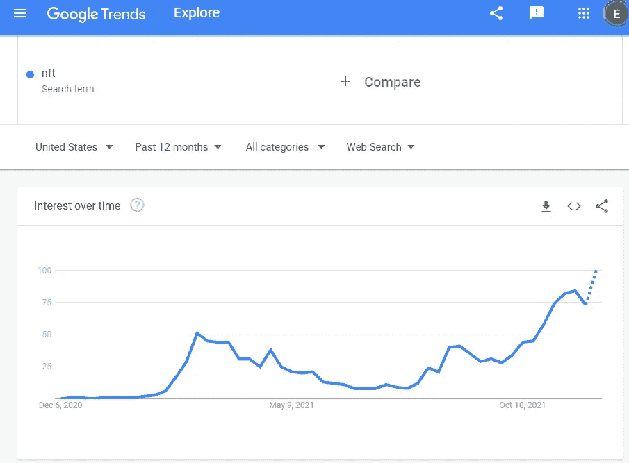

# 5 个神奇的 NFT YouTube 教程，让你在一个下午启动你的项目

> 原文：<https://betterprogramming.pub/5-amazing-nft-youtube-tutorials-learn-how-to-launch-your-project-in-and-afternoon-1d93fcddb272>

## 即使你不会编码，也要利用这个热门趋势



阿诺·塞纳尔在 [Unsplash](https://unsplash.com?utm_source=medium&utm_medium=referral) 拍摄的照片

# NFT 依然火热

加密货币的价格正在下降，但不要让这愚弄你。这是学习如何利用最热门的市场之一:NFTs 的最佳时机。查看谷歌趋势，你会发现人们的兴趣仍然很高:



谷歌趋势

不可替代代币(NFT)正处于起步阶段，可用于各种数字应用，如游戏、艺术、音乐、社交媒体和社交俱乐部。真正激起我对这个领域兴趣的是当我听说[说唱歌手托里·兰兹以 NFT](https://thesource.com/2021/08/11/tory-lanez-reportedly-sells-1-million-copies-of-1-nft-album-in-57-seconds/) 的身份发行了他的最新专辑。稍加挖掘，你会发现从安东尼·霍普金斯到《时代》杂志，每个人都在参与 NFTs。

我现在一直在做几个不同的 NFT 项目，每次都学到越来越多关于区块链和智能合约的知识。如果你有兴趣开始你自己的 NFT 项目，这些教程将教你一切你想知道的从开始到全面启动项目。

我与这些产品或教程没有任何关系。我只是分享我在学习 NFT 发展的旅程中使用的资源。

如果您是区块链、加密和 NFTs 的新手，请从查看这些资源开始:

*   [meta mask——最流行的加密钱包之一](https://metamask.io/)
*   [opensea . io——最受欢迎的 NFT 市场之一](https://support.opensea.io/hc/en-us)
*   [坚固性、区块链和智能合约课程——初级到专家 Python](https://www.youtube.com/watch?v=M576WGiDBdQ) 作者 [Patrick Collins](https://medium.com/u/589c510eb216?source=post_page-----1d93fcddb272--------------------------------) (如果你想学习编码方面)。

# NFT 教程

你不需要成为计算机程序员来制作 NFT。任何拥有元蒙版的人都可以上传一张图片到 opensea.io 并创建一个 NFT 收藏。如果你不编码，不要担心。我把 NFT 教程分成了两组:

*   编码教程
*   无代码教程

我个人是做代码的，花了大部分时间看与代码相关的内容。然而，我发现了一些向我展示一些技巧和诀窍的无代码教程，所以我也想把它们包括进来。

# 代码教程

我建议回顾所有的教程，因为它们都有独特的风格和方法。我从每个人身上学到了新的东西。此外，回顾每一个可以让你接触到不同的艺术引擎和更多的代码示例。

## [1。哈希表](https://www.youtube.com/c/HashLipsNFT/featured)

这个 NFT 频道有关于创建 NFT 的惊人内容。

感恩节周末，我按照这个指南启动了我自己的 NFT 造币应用程序。

散列表引导你从头到尾创建一个 NFT 项目。这个 2.5 小时的教程从使用 HashLips 创成式艺术引擎开始。

一旦艺术品制作完成，他会解释如何使用 Remix 来撰写和推出 NFT 智能合约。他深入探讨了如何通过 Polyscan 验证合同。本教程最后回顾了如何配置使用 React 构建的 minting 应用程序模板。

如果你熟悉一点 JavaScript，本教程将是一件轻而易举的事情，并且是学习如何启动 NFT 项目的完美地方。一旦你阅读了 HashLips 终极指南，请查看这些教程，了解更多关于 NFT 智能合约开发的信息:

*   [如何克隆任何智能合同](https://www.youtube.com/watch?v=18TSUZ53m1Q&t=848s)
*   [如何创建动态 NFT](https://www.youtube.com/watch?v=dNRd_ym0WeQ)
*   [如何创建奖励系统 NFTs](https://www.youtube.com/watch?v=Ovt2Xwof3VQ&t=1477s)

## [2。Moralis.io](https://www.youtube.com/watch?v=tBMk1iZa85Y)

如果你还没有听说过 Moralis，并且想开发去中心化的应用程序，我很乐意告诉你这个。

一旦你对区块链和 web3 开发有所了解，你会发现许多开发生态系统和技术栈很难学习和整合。

[Moralis web3 开发平台](https://moralis.io/)允许您构建无服务器的 web3 应用，因此您不必担心后端基础设施。他们也有一些令人惊奇的非 NFT 教程。在幕后，它使用非 SQL 数据库来存储。

这个 NFT 教程只有 2 个多小时，充满了精彩的信息。

这个和 HashLips 的区别之一是，本指南关注 ERC 1155 令牌，而另一个关注 ERC 721 令牌。

它从创建智能合约和上传兼容的元数据开始。然后介绍如何在 opensea.io 上部署合同和查看 NFT。最后介绍如何使用 Moralis 构建一个 NFT 仪表板，其中包含 Mint 和 Transfer 功能。

道德频道也有币安智能链 NFT 教程！
[如何制作 BSC NFT(使用 Moralis) —智能合同编程](https://www.youtube.com/watch?v=02VnfTIomn8)

Moralis web3 是一个很棒的平台，我推荐你去看看他们提供的东西。

## [3。Kie 代码](https://www.youtube.com/watch?v=GAFh2Z5VtgM&list=PLuZkwckxno0o7_GZoOBp2gnX5DfakVcxy)

Kie 开始接受挑战。他想学习如何编写一个不可替换的令牌 ERC721，给了自己三天时间。在没有任何线索或先验知识的情况下，他决定从头开始编写所有代码，并与社区共享成果。总的来说，该系列涵盖了什么是 NFT 加密令牌，以及整个以太坊生态系统及其所有的分散应用程序或 dApps。

本教程分为 3 个视频，只有大约 30 分钟。不管怎样，它包含了一些有用的信息，尤其是如果你是第一次来区块链。

第一个视频主要涉及区块链基础知识和设置开发环境。第二个视频对 NFT 进行了分解，介绍了如何创建 ERC 721 智能合同，以便在 opensea.io 上查看。最后一个视频介绍了如何创建一个申请 NFT 的应用程序，以及如何在 mainnet 上启动它。

# 没有代码教程

即使你不写代码，我也建议你至少看一本与代码相关的教程，这样你就能更深入地了解 NFT 能做什么。但是，如果您需要在没有编码技能的情况下启动项目，请查看以下两个教程:

## [4。里科·科普兰](https://www.youtube.com/watch?v=_Z99COgONYQ)

请注意，您将需要 photoshop 来充分利用本教程。他讲述了在哪里可以找到图层的资源，如何给艺术作品分层，以及如何在 Photoshop 中生成组合。

不幸的是，本教程并没有真正涵盖在市场上发布作品，但这可以很容易地手动完成，使用代码相关的教程，或通过创建一个宏。

无论如何，我认为它可能对想要进入 NFT 艺术创作的艺术家有用，因为它打破了这个过程。

[](https://www.youtube.com/channel/UCJt1pAEFPYtXN14CF2jjJpg) [## 里科·科普兰

### 欢迎来到我的旅程！什么旅程？我的教育、设计、商业和学习如此简单，以至于任何地方的任何人…

www.youtube.com](https://www.youtube.com/channel/UCJt1pAEFPYtXN14CF2jjJpg) 

## [5。路易斯爵士——如何一步一步在 Opensea 上打造 NFT 系列](https://www.youtube.com/watch?v=iB_LtRYtAEA)

本教程将带您了解如何在 opensea.io 平台上创建一个集合。

如果你是 opensea.io 的新手，这是一个很好的入门教程，因为它向你介绍了从头开始收集背后的许多核心概念。他简要地谈到了 NFTs 的营销，以及 eth 和 polygon 链之间的一些差异。

本教程不到 15 分钟，所以如果你还在观望，不需要花太多时间来观察和决定创建 NFTs 是否适合你。

# 奖金

如果你不是一个程序员，也没有 Photoshop，看看[https://nft-generator.art/](https://nft-generator.art/)，它允许你上传你的 NFT 图层，生成类似于编码教程的艺术作品。它甚至可以让你设置稀有等级！

最后，如果你正在主持一个项目，看看 DigitalOcean.com[的简易应用程序托管功能。只要你知道如何使用 GitHub，托管一个 JavaScript 应用程序就像点击几下鼠标一样简单。这是托管您在编码教程中构建的 minting dapp 的最佳方式。](https://digitalocean.com)

# 选择一个教程，并运行它

区块链、加密、NFTs，所有这些仍然只是在社会的边缘，即使采用已经达到整个国家的规模。现在是学习技术的最佳时机，这样你就可以利用太空中不断增长的趋势。

除此之外，如果你对编码有所了解，你会发现几个小时之内你就可以在 opensea.io 上轻松启动一个 NFT 项目，并有可能成为百万富翁。

```
**Want to Connect With Author?**Analyze Data using Python? Check out my [website](https://pythondashboards.com/). And let’s connect on [LinkedIn](https://www.linkedin.com/in/erickleppen01/).
```