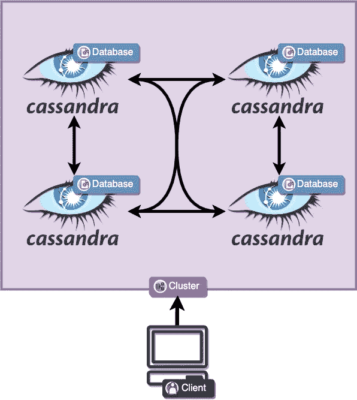
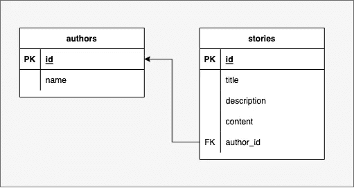
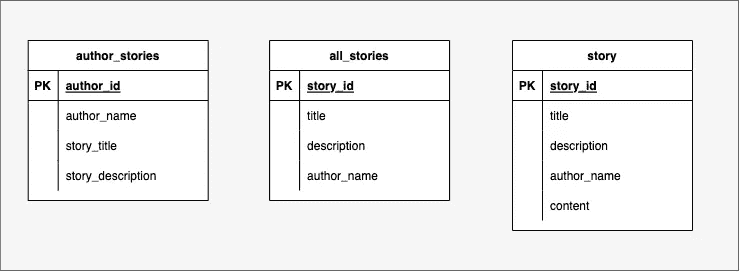
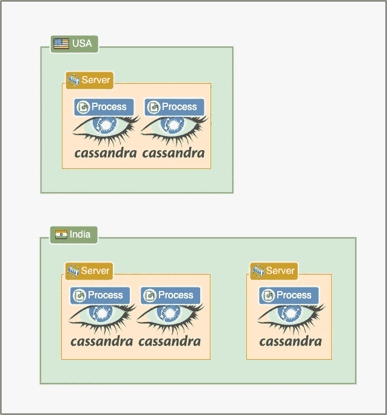
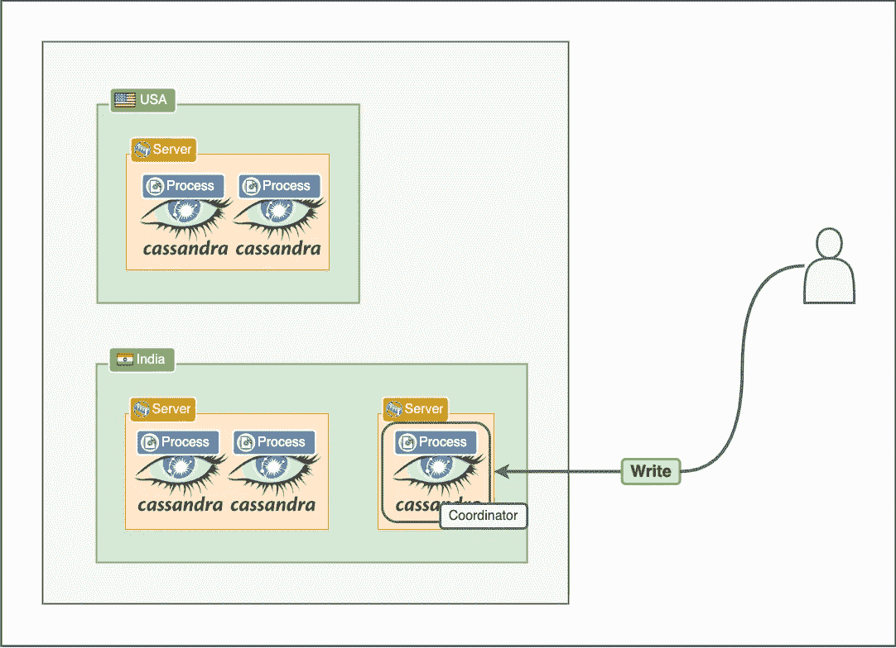
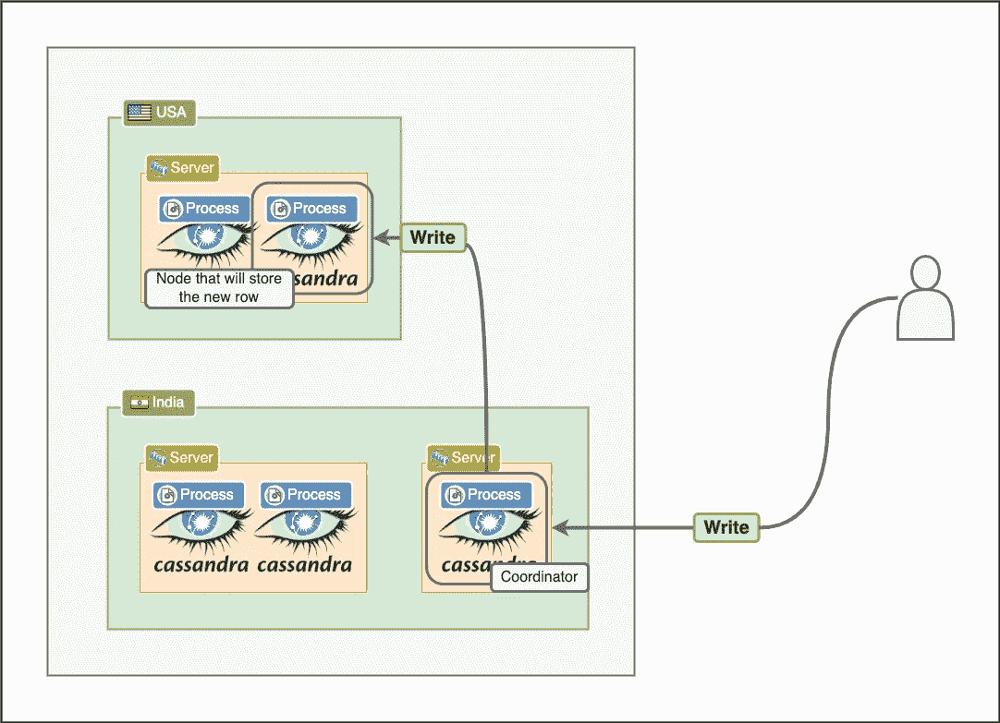
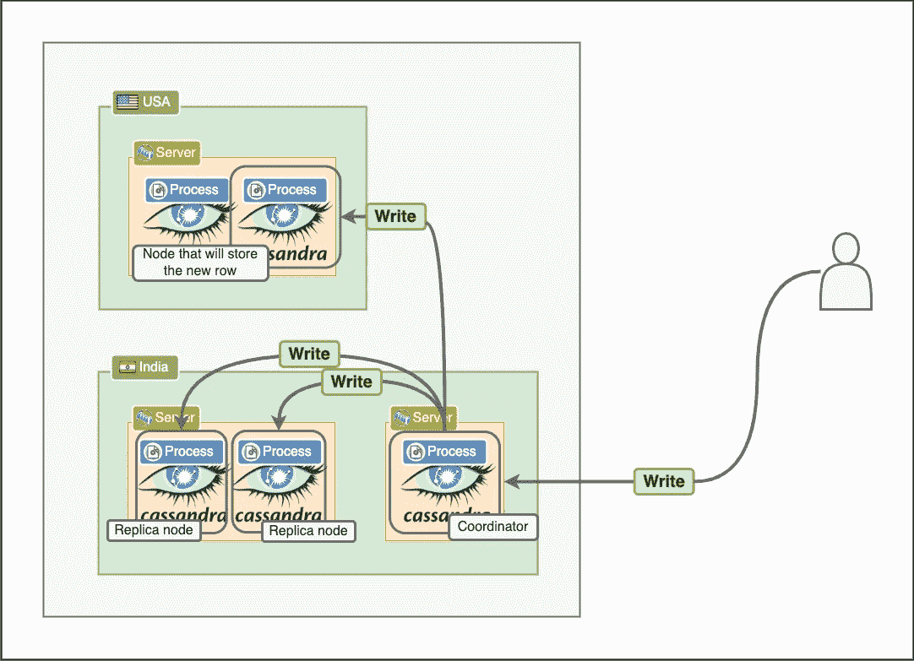
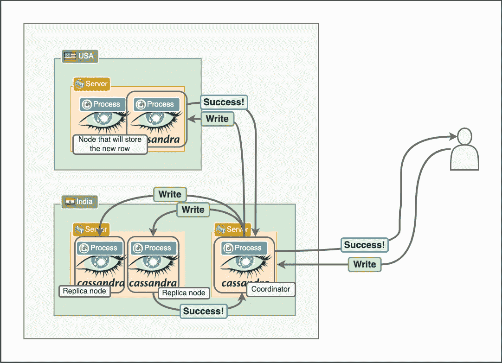
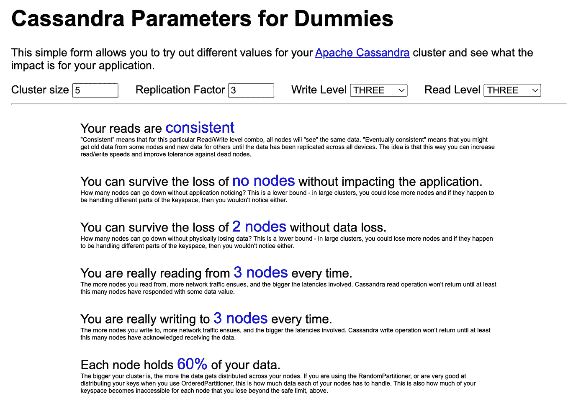

# 六个月前我不知道的关于卡珊德拉的 5 件神奇的事

> 原文：<https://betterprogramming.pub/5-amazing-things-i-didnt-know-about-cassandra-six-months-ago-acff300a280e>

## 这使它有别于其他数据库


# 卡珊德拉是什么？

Cassandra 是一个受著名的 Dynamo 论文启发的流行的分布式 NoSQL 数据库。

其核心在于它能够处理大规模数据，同时仍能提供快速性能。它具有容错性和高可用性。它依赖于比关系数据库更简单的数据模型，并且为了高可伸缩性和高性能而牺牲了许多 ACID 属性。

# 闲话

在我以前的帖子中，我们探索了 Cassandra 集群。



如果你没读过，集群就像卡珊德拉节点的集合。这些节点相互通信，并且它们知道群集。

集群中节点的通信方式非常有趣。他们通过闲聊来相互交流。八卦协议是特定类型的协议，与人们在现实生活中的八卦方式非常相似。它是一种对等协议，在该协议中，节点随机与其他节点对话，并交换彼此的信息。

因此，集群中的每个节点每秒都会挑选一组节点与之聊天。然后，它向这些选定的节点发送它所拥有的关于其他节点和它自己的数据。

想象一个普通的卡珊德拉星团。这些节点不断地相互交谈，交换彼此的信息。

如果某个节点出现故障，那么最终，某个节点会意识到这个节点是不可达的。在下一次闲聊中，它会告诉每个它闲聊的人，在不可到达的节点上可能会发生故障。

此时，您可能会想，为什么要使用这种八卦协议呢？为什么我们不把所有节点的信息存储在一个中心位置？原因是 Cassandra 应该是一个分散的容错系统。将关于节点状态的信息存储在单个位置会给系统带来漏洞。

# 线性可扩展性

我之前已经广泛讨论过 Cassandra 是如何线性扩展的。

这与大多数数据库不同，因为数据库通常是非线性扩展的。这意味着在数据库中执行的操作的性能取决于数据库的大小和规模。例如，向一千万行的表中插入一行要比向十行的表中插入一行花费更长的时间。

因此，随着数据库的增长，其性能会下降。如果你存储了多少注册用户，这可能没问题，因为它可能达到数百万，但永远不会增长到 10 亿或更多(除非你是脸书)。

但是，如果您正在存储日志数据或点击流事件，它可以非常容易地非常快速地进入数十亿个项目。过去需要 50 毫秒的数据库查询，一个月后可能需要 100 毫秒，一个月后可能需要 200 毫秒。

为什么会这样？原因是大多数传统的关系数据库都很复杂。每次写入或更新时，它们都会执行大量操作。一个简单的例子是约束。如果对某列有唯一约束，那么每次添加新行时，数据库都必须检查该列是否存在。如果表中有更多的行，那么它需要检查更多的行。它还需要检查外键约束是否有效，等等。

这就是卡珊德拉的用武之地。Cassandra 和其他受发电机启发的数据库是为线性扩展而构建的。这意味着，如果您给它提供所需的硬件，它的性能不会随着您向它添加更多数据而下降。

那么，他们是怎么做到的呢？在 MySQL 做不到的情况下，Cassandra 如何执行更快的插入或线性伸缩？建造卡珊德拉的工程师更聪明吗？不，他们只是在规模上优先考虑速度和性能，而不是传统关系数据库中的外键和约束以及其他花哨功能。

例如，Cassandra 不会让您选择创建外键或复杂的约束，作为回报，它承诺了规模和性能。

想象一下，卡珊德拉是一辆 F1 赛车，而波斯特格里斯是劳斯莱斯幽灵。


F1 赛车不会有大触摸屏、气候控制，甚至可能没有劳斯莱斯会有的空调(我不太了解赛车)，但当你踩下油门时，它会把幽灵远远抛在后面。然而，你也不能真的开着 F1 赛车去上班。

重要的是要记住没有一个比另一个更好。两者只是专注于解决不同的问题。


网飞的这篇文章解释了他们如何对 Cassandra 进行线性水平可伸缩性的基准测试。

# 鼓励反规范化和复制

当使用 SQL 数据库时，我们经常听到的一个重要方面是规范化。这实质上意味着我们应该避免数据重复，并使用外键将数据条目链接在一起。

例如，让我们假设我们想要建立一个新闻网站。我们希望支持三个特性:

1.  用户应该能够看到当天的所有故事。每个故事都应该有标题、简短描述和作者姓名。
2.  他们可以点击任何一个故事，看到一个详细的视图，有相同的标题，相同的简短描述，相同的作者，还有故事的完整文本。
3.  最后，用户应该能够进入作者页面，看到该作者写的所有故事。

关系数据模型可能看起来像这样:



然后，我们可以运行简单的查询，如:

```
SELECT a.name, s.title, s.description FROM stories s
    INNER JOIN authors a ON a.id = s.author_id
    WHERE a.id = 1001;
```

为作者获取所有带有标题和描述的故事。

这是一个很容易理解的例子，但是让我们更深入地看一下。这个例子代表了关系数据库的一个基本设计哲学，与 Cassandra 所遵循的相反。

关系数据库希望最小化数据冗余和重复，因此编写和更新更便宜、更容易。对于足够小的数据，这在单节点系统中行得通，但是当您处理绝对大量的数据时，这是 Cassandra 通常使用的地方，并且当您的表彼此相距数百英里并且它们包含数百万行时，这些连接可能会非常慢。

Cassandra 根本不支持连接。

使用 Cassandra 时，您的数据模型应该表示您想要运行的查询，而不是数据的最规范化形式。我在一个关于堆栈溢出的随机回答中发现了一个非常好的总结，它总结得非常好:

> 使用 SQL，您可以构建您的表以规范化您的数据，并使用索引和连接进行查询。使用 Cassandra，您无法做到这一点，因此您需要构建自己的表来服务于您的查询，这需要非规范化。

因此，对于上述操作，我在 Cassandra 中的数据模型可能如下所示:



要获取一个作者的所有故事，我只需通过`author_id`查询`author_stories`。为了获取数据的所有故事，我查询`all_stories`。为了获取某个故事，我查询了`story`表。

当我想创建一个新的故事时，我需要将它写在三个不同的表中，所以我必须围绕写数据做更多的工作，但读数据更简单。

这符合发电机纸的设计理念。写入成本很低，所以数据写入三次也没问题。一个故事可能在几毫秒内存在于一个表中，而不存在于另两个表中，但这也是我们愿意做出的权衡，最后，也是最重要的，读取将会很便宜，因为我们是从具有分区键的单个节点读取。

关系数据建模的一个根本转变是我们设计数据库的顺序。在关系模型中，我们关注需要存储的实体以及它们之间的相互关系，一旦我们完成了这些，我们就试图为我们想要对这些数据进行的操作编写查询。在 Cassandra 中，我们必须首先考虑我们想要运行的查询，然后设计我们的数据模型。

# 可调一致性

Cassandra 提供了一个可调的一致性模型。大多数时候，我总是把 Cassandra 作为一个 AP 系统，并支持最终的一致性。

这并不完全正确。Cassandra 通常用作 AP 系统，具有最终的一致性，但事实上，它可以作为具有强一致性的 CP 系统工作。

此外，作为开发人员，我们可以描述我们希望在一致性上牺牲多少性能。事实上，我们也可以在每个查询的基础上定义它。因此，我们可以决定对某些查询要求严格的一致性，而对其他查询要求弱一致性但高可用性。

那么，这是如何工作的呢？

为了更好地理解它，让我们从一个简单的集群开始:



在这个集群中，我们有五个 Cassandra 节点。当用户插入一行时，操作会转到任何一个节点。用户可以将该请求发送到它想要的任何节点。

该节点成为“协调者”节点。



每一行都存在于 Cassandra 的某个节点中。这是由分区键决定的。该节点的职责是找到需要插入新项目的正确节点，并向其发送插入操作。



这被进一步分发到将基于复制因子存储查询的其他节点。复制因子决定了某个数据项存储的次数。例如，将其设置为三意味着它应该存储在三个不同的节点上。这确保了如果某个节点发生故障，其数据仍然可以通过复制它的其他节点获得。



注意，此时没有一个节点回复协调器，协调器也没有回复用户。

这就是一致性级别发挥作用的地方。一致性级别表示在将响应返回给用户之前必须有多少节点响应查询。因此，例如，如果将其设置为`2`，那么在协调器向用户响应写入成功之前，三个节点中的任意两个必须同步响应写入成功。



请注意其中一个节点还没有响应。在它响应之前，我们的系统处于不一致的状态。

最有可能的是，它将在几毫秒后响应它也完成了写入，但是它可能无法完成写入请求。可能它的磁盘已满，可能存在网络问题，或者可能存在其他问题。

将写一致性级别设置为“ALL”将保证所有节点都响应，但用户将不得不等待更长时间的响应，如果选择作为副本的任何节点关闭，则请求将失败。这意味着我们牺牲了可用性以获得更高的一致性。

我们可以将一致性级别设置为“一”，这样协调器节点将等待单个节点响应，然后将响应返回给用户。这使得可用性优先于一致性。

读取数据时也是如此。我们可以指定在数据返回给我们之前，必须有多少节点成功响应我们对协调器节点的读取请求。

[这个在线计算器](https://www.ecyrd.com/cassandracalculator/)非常有助于我们了解一致性和可用性如何随写入级别、读取级别和复制因子而变化。

例如，通过将复制因子设置为`3`(就像我们在示例中所做的那样)，并将写级别和读级别的一致性也设置为`3`，我们得到以下输出:



稍微改变一下，复制因子在`4`，写和读级别在`2`，我们得到了最终的一致性。


# 快速写入


Cassandra 可以快速写入数据，并且它有一些很好的技巧来做到这一点。你会问，那些把戏是什么？

要理解 Cassandra 中的写操作，我们必须理解写操作是如何在单个节点上发生的，以及写操作是如何在整个集群上发生的。

让我们从单个节点开始。想象一下，Cassandra 作为一个简单的进程在一台服务器上运行。它可以在系统上打开、写入和关闭文件，还可以在网络上发送和接收数据。除此之外，它还可以在存储在 RAM 中的堆内存中创建变量，差不多就是这样。

Cassandra 的要求很简单，当它收到写一些数据的请求时，持久地存储它，以便在服务器出现故障时可以恢复，尽快响应用户，并在未来的读取中使用这些新数据。

为了快速存储数据，它使用提交日志。提交批次是所有事务的顺序日志，存储在磁盘上。它们非常类似于你使用`console.log`时的日志。每个事务都记录在一个与磁盘同步的文件中，它们是不可变的。这是存储数据的第一步。但是为什么需要呢？这是因为任何持久的东西都应该同步到磁盘上。

它还会将这些数据存储在内存中，然后最终以特定的时间间隔将这些数据同步到磁盘。

该架构如何在数据库中存储数据非常复杂，Cassandra 使用三种不同的数据结构来管理它，即提交日志、memtables 和 SSTables。架构、权衡和配置都非常有趣，但它们值得单独发布，所以我改天会更深入地讨论它们。

现在，请理解 Cassandra 并没有直接对存储在磁盘上的表进行更新。事实上，它只是存储用户在只附加日志中插入了一个新行，并将响应返回给用户。在某个时候，它会用这个新数据异步更新它在磁盘中的表。

这使得写入速度非常快，因为仅追加日志是将数据持久保存在磁盘上的最快方式。

它在集群中的工作方式略有不同。我们已经知道，协调器节点不需要回复所有节点来响应用户。这加快了请求的速度，因为即使某些节点可能还没有完成数据插入，用户也会得到响应。

# 结论

这标志着我在 Cassandra 上的帖子结束了。我真的很喜欢了解它，以及它是如何在引擎盖下工作的。如果你还没有看过我以前的帖子，并且你喜欢这篇，我强烈建议你看看:

[](https://medium.com/geekculture/system-design-solutions-when-to-use-cassandra-and-when-not-to-496ba51ef07a) [## 系统设计解决方案:何时使用 Cassandra，何时不使用

### 关于何时使用 Cassandra，何时不使用 Cassandra，您需要知道的一切

medium.com](https://medium.com/geekculture/system-design-solutions-when-to-use-cassandra-and-when-not-to-496ba51ef07a) [](/system-design-concepts-dynamo-16-sheets-of-paper-that-changed-the-world-fd2cba6585e3) [## 系统设计概念:发电机，改变世界的 16 张纸

### 了解如何在系统设计中使用 Dynamo 系列、AWS DynamoDB、Cassandra 和 SimpleDB

better 编程. pub](/system-design-concepts-dynamo-16-sheets-of-paper-that-changed-the-world-fd2cba6585e3) 

现在，我在寻找新技术。让我知道我接下来应该写什么——任何新的或令人兴奋的数据库，或队列，或 orchestrator，或几乎任何东西。

让我知道你对这篇文章的想法，请继续关注！

