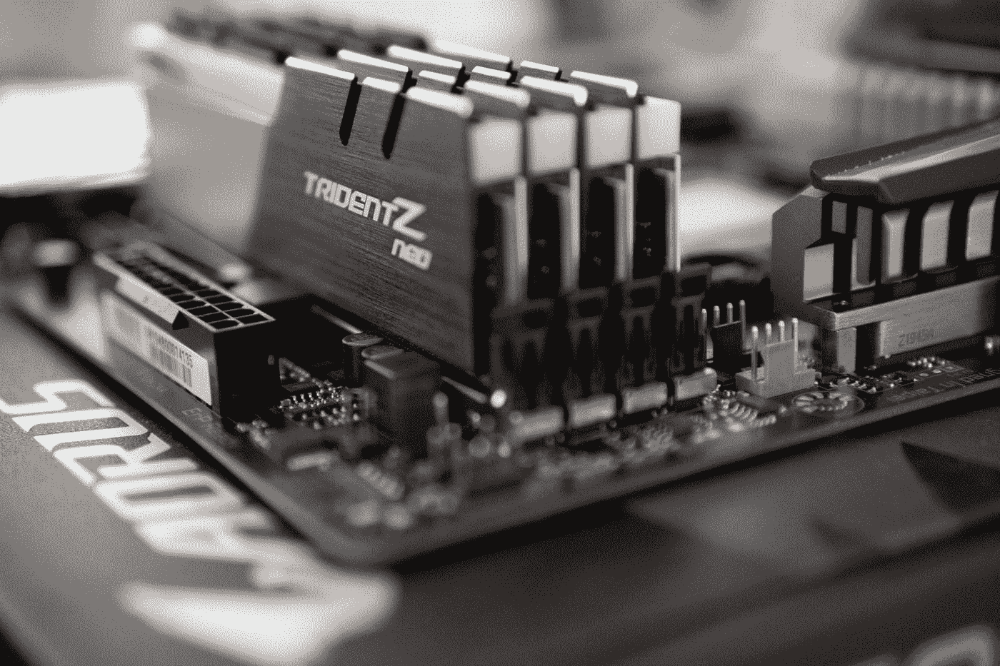
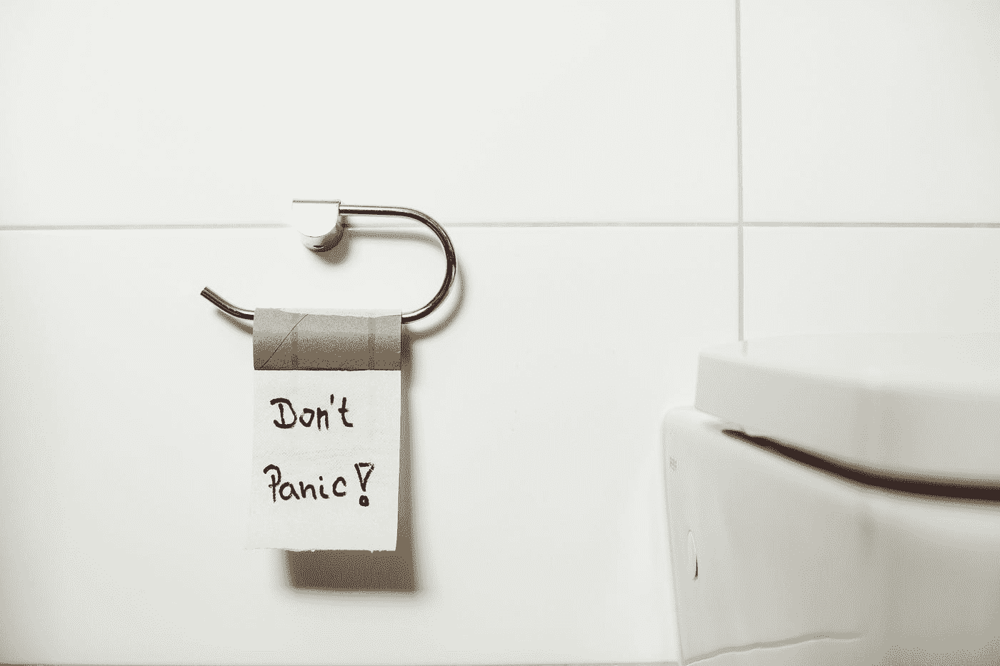

# 我职业生涯中犯过的 5 个有趣的面试错误

> 原文：<https://betterprogramming.pub/5-amusing-job-interview-blunders-ive-made-in-my-career-10ba0f734d2b>

## 包括我在厕所接招聘电话的那次

照片由[你好我是尼克](https://unsplash.com/@helloimnik?utm_source=medium&utm_medium=referral)在 [Unsplash](https://unsplash.com?utm_source=medium&utm_medium=referral)

当我写这篇文章的时候，是夏天的开始，软件工程师的就业市场非常火爆。应届大学毕业生、新兵训练营成员，甚至终身工程师都加入了这个行动。似乎每隔一天，我都会在 Twitter 或 LinkedIn 上看到有人被录用或跳槽的帖子。许多人正在寻找成功，庆祝他们在社交媒体上的胜利。

但是也有很多人正在经历面试的另一面。

虽然每年都是这样，但这一次我更清楚了，因为我是一些求职者的导师。我亲眼目睹了他们的挣扎，他们让我想起了我自己找工作的苦恼。不管是你第一次找工作还是第五次找工作，你都会有倒霉的日子。你将经历一场糟糕的面试，之后感觉糟糕透了，并思考“我怎么了？”即使是高级工程师也有这些经历。

为了表示对我的学员和其他经历求职痛苦的人的支持，我想讲述一些我面试中最大的失误、失误和失态。我希望它们至少能让你对自己的情况感觉好一点。

# 法国宗教裁判所

照片由[塞巴斯蒂安·赫尔曼](https://unsplash.com/@officestock?utm_source=medium&utm_medium=referral)在 [Unsplash](https://unsplash.com?utm_source=medium&utm_medium=referral) 上拍摄

我参加的第一次科技面试是在一家法国科技公司。在通过他们的带回家的项目后，我被邀请到一个技术屏幕前，这应该是通过与 CTO 的视频进行的。然而，当我加入通话时，我意识到 CTO 并不孤单。他带了另外三名工程师参加了一次小组面试。这是我第一次涉足科技领域的面试，我感觉自己面对的是一门大炮。

说我搞砸了未免太轻描淡写了。15 分钟后，几个问题，几个结结巴巴的回答，首席技术官缩短了面试。他说他会和其他小组成员讨论，在他们讨论后给我回电话。然而，审议似乎更像是一种形式，因为我收到了不到五分钟后的回电，告诉我他们不会继续与我合作。

我把拒绝当作一个机会，向他询问一些我一直在纠结的问题，以及他们一直在寻找的答案。对于我问的每一个问题，他首先回答说，“哦，这是一个简单的问题。”作为半个法国人，我可以说法国人，尤其是巴黎人，并不以好客著称。但是该死的，如果没有什么比一个首席技术官当面暗示你是个白痴更让你感觉糟糕的了。

# 不是抄袭，是开源

马库斯·斯皮斯克在 [Unsplash](https://unsplash.com?utm_source=medium&utm_medium=referral) 上的照片

我对带回家的挑战有意见。我从来没有喜欢过他们。我对他们最大的问题是，他们是一个时间水槽。每个公司都低估了他们需要多长时间来完成。理解需求、设置样板文件、阅读文档，然后最终编写该死的代码，这些都需要时间。但是每个面试官只是把这些细节放在一边，说:“应该只需要几个小时。”

2018 年，我在一家公司面试，该公司让我在短短两天内创建一个完整的全栈实时聊天应用程序。如果我有一个完全空的时间表，我可能会成功。但是在找工作的时候，我每天都在申请、学习和面试，这似乎是不可能的。

但是因为我没有工作，我没有资格太挑剔。所以我默许了，希望出现奇迹。你瞧，奇迹出现了。

在研究我可以用来实现聊天功能的 web socket 库时，我意识到 Socket.io 有一个[演示聊天应用](https://socket.io/demos/chat/)，其代码可在他们的 [GitHub](https://github.com/socketio/socket.io/tree/master/examples/chat) 上获得。我最后只是从演示中复制代码并提交它。公司还是不知道，我进入了下一轮。有些人可能称之为抄袭，但我称之为开源。

不出所料，那次代码挑战最终成为我经历过的最糟糕面试的开始。

 [## 我经历过的最糟糕的工作面试

### 以及给我这份工作的公司是如何陷入困境的

better 编程. pub](/the-worst-job-interview-ive-ever-had-4e15f380f387) 

# 全是股票，没有实质内容

照片由 [NeONBRAND](https://unsplash.com/@neonbrand?utm_source=medium&utm_medium=referral) 在 [Unsplash](https://unsplash.com?utm_source=medium&utm_medium=referral) 上拍摄

即使你在面试中表现出色并得到了一份工作，也不总是阳光和彩虹。我记得有一次去面试一家公司，我完全搞定了。我轻松地通过了所有的编码挑战，所有的面试官都喜欢我。我收到了其他公司对其他中层职位的长期邀请，但无论从哪方面来看，这似乎都是一个很好的匹配。

招聘经理甚至告诉我，因为我的其他提议，他们会超出他们通常的工资范围。我屏息等待报价细节。

然而，当他们打电话给我正式报价时，是一个入门级的职位，比市场价格低了整整 2 万美元，也比我的最高报价低了 6 万美元。我记得我为面试我的其他工程师感到难过。如果这份工作超出了他们的工资范围，那么他们的工资都很低。

我感谢他们的提议，但告诉他们价格太低，我不打算接受。但是因为我在面试中表现得很好，他们不想轻易放弃。他们提高了报价。然而，他们没有增加工资，而是增加了 9 万份股票期权。

招聘经理承诺，公司正在考虑很快上市，这一股票组合将价值不菲。虽然听起来很诱人，但我还是决定不去。

那么，谁想要这家拥有丰厚股票的公司呢？我在心里把它们称为“全是股票，没有实质”，但你可能知道它们是 WeWork。

# **技术上的真相**

[栾卓卡](https://unsplash.com/@luangjokaj?utm_source=medium&utm_medium=referral)在 [Unsplash](https://unsplash.com?utm_source=medium&utm_medium=referral) 上拍照

在面试中可能会有这样的时候，你会觉得需要…可以说是即兴发挥。但是，我一直主张，当你不知道一些事情的时候，要说实话，要承认。面试官总能看出你在即兴发挥，也许会叫你出来——尽管有时你可能会走运。

在一次系统设计面试中，面试官让我在白板上写下我将如何设计一个类似于 Bitly 的 URL 缩短器。像任何优秀的受访者一样，我从一个简单的 web 服务器和数据库开始。当谈到数据库的伸缩策略时，我提到一种方法是使用一个缓存，比如 Redis，来减少来自数据库服务器的流量并加快数据检索。

借着测试我的数据库知识的机会，面试官问道:“那么为什么 Redis 比关系数据库快呢？”

这个问题我已经问过很多次了，我的回答是:“Redis 是一个键值存储，所以它有 O(1)的数据检索。”

大多数面试官对这个答案很满意，所以我准备继续——但是这个面试官不满意。他又拦住了我。“使用 JSON blobs 和索引，关系数据库也可以实现 O(1)的数据检索。不过 Redis 还是比较快。为什么？”

我的大脑一片空白。我以前从未被问过这个问题。我确信在我的内心深处，我知道他在寻找的答案。然而，那一刻，我什么也想不起来。我停下来思考的时间越长，面试官看起来就越担心。所以我用了唯一的办法:扯淡。

“好吧……”我犹豫了。“并非所有 O(1)解决方案都在相同的时间内运行。Redis 的 O(1)需要的步骤更少。所以更快。”

感觉到我在兜圈子，哪儿也不去，采访者愤怒地叹了口气。"这是因为 Redis 将数据存储在内存中，而数据库将数据存储在磁盘上."

那时，我还很幼稚，对内存和磁盘的区别还很模糊。为了认真学习，我问面试官:“为什么内存比磁盘快？”

“内存中的数据存储在 RAM 中，RAM 在物理上更靠近 CPU。采访者停顿了一下，意识到自己在说什么，“与磁盘相比，从内存中检索数据需要更少的跳跃。”他以为我问这个问题是为了表明自己的观点，于是补充道:“说得好。”

在我试图胡说八道的时候，我无意中给出了一个从技术上来说是事实的答案。然而，这并没有阻止我第二天收到拒绝邮件。

# **招聘电话打了水漂**

由[马库斯·斯皮斯克](https://unsplash.com/@markusspiske?utm_source=medium&utm_medium=referral)在 [Unsplash](https://unsplash.com?utm_source=medium&utm_medium=referral) 上拍摄的照片

对于面试中所有关于算法、数据结构和系统设计的讨论，有一项技能没有被讨论的那么多:时间管理。当你同时应付多个正在进行的面试时，这一点尤其重要。

虽然平衡多重面试是一个好问题，但它仍然是一个问题。我采用的一个策略是将面试安排在一起。这样，我就有更好的机会获得多个报价，可以用来作为谈判筹码。为了做到这一点，我在同一天批量筛选电话和招聘人员的电话，以摆脱它们。这个问题是，有时你最终会有几天都是电话屏幕，这就是我上次找工作时发生的事情。

特别是有一天，我安排了六个电话面试，其中三个紧接着另一个。不想整天被困在我的公寓里，我去了附近的咖啡店。我在那里连续接受了三次采访，同时喝下了大量的咖啡因和水。到最后一个批量电话结束时，我已经在咖啡店呆了一个半小时。我决定走回我的公寓去参加今天的最后一次面试，这样之后我就可以躺在沙发上放松了。

然而，在离开咖啡店后不久，我的膀胱开始感觉到喝了大量咖啡因和水的影响。压力起初慢慢增加，然后像潮水一样涌来。幸运的是，在接到招聘人员的电话之前，我有足够的时间走回我的公寓，方便一下。不幸的是，招聘人员提前打来电话。

就在我进入我的公寓大楼时，我感到口袋里有嗡嗡声，知道是手机屏幕。我想忽略它，但我不想以后可能不得不重新安排电话，所以我回答了它。这个电话本来只持续 15 分钟，所以我想我可以一直等下去。

通话五分钟后，我后悔了自己的决定。压力越来越大，以至于我很难思考和回答招聘人员的问题。直到今天，我仍然不知道为什么我没有直接问，“嘿，我需要使用洗手间，你能稍等一会儿吗？”

部分原因是我无法思考。另一部分是我找不到一个自然的停顿来插话。招聘人员正在给我讲公司的背景，我不想打断他们。所以我采用了 b 计划。

我冲到浴室，尽我所能掩盖声音。我把手机放在离我尽可能远的地方，尽可能地往马桶里靠，让浴室的门开着，以抑制任何回音。我看起来像骑着一头机械公牛，除了没穿裤子和羞愧。但就像我之前提到的，我住在纽约，那里的浴室很小，音响效果相当不错。尽管我做了各种尝试，但还是无法掩盖水流进更多水的明确无误的声音。

招聘人员停顿了一下，我知道我已经被抓了个正着——真的。幸运的是，他们继续着，就像他们什么也没听到一样，尽管他们的声音里带着不相信的神情。我不得不把它交给招聘人员，他们是真正的专业人员。面试很快就结束了，招聘人员听起来有点太兴奋了，不想挂断电话。不出所料，我在一天结束前收到了一封拒绝邮件。虽然每当我回忆起这段记忆时，我仍然会感到一阵羞愧，但这对我们俩来说都是一个有趣的故事。

虽然我犯了更多的面试错误，但这些只是更引人注目和有趣的。我知道失败的面试可能看起来像一个单一的事件，让你质疑自己的能力。但要知道你并不孤单。每个人都会经历。抬起你的头向前冲。记住，让招聘人员使用洗手间总是没问题的。

[*订阅我的个人资料*](https://medium.com/subscribe/@SunnyB) *如果你想在我上传新故事时得到通知。*