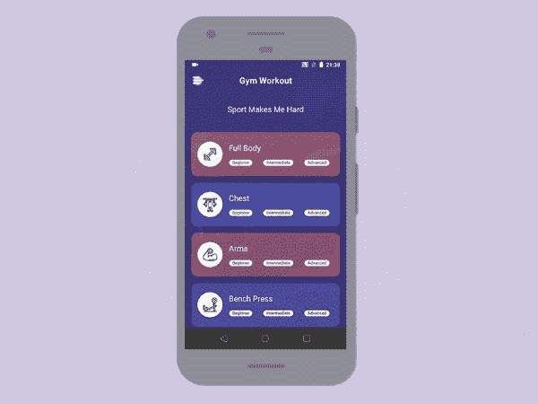
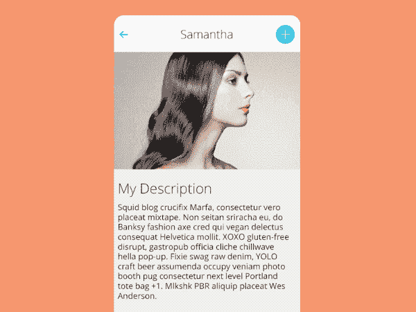
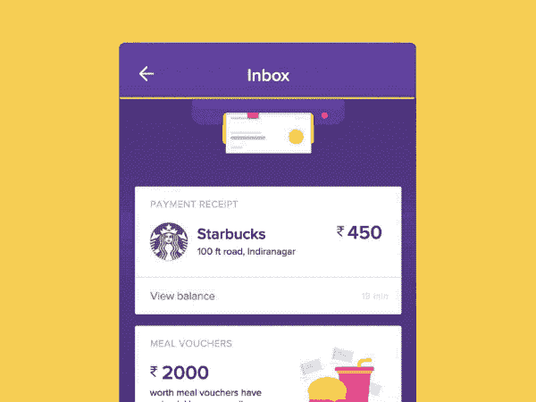
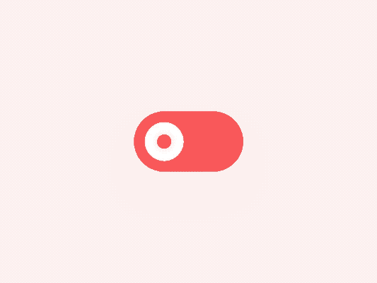

# 5 个 Android 库，激发你的设计灵感

> 原文：<https://betterprogramming.pub/5-android-libraries-to-inspire-the-designer-in-you-bbe000286cb9>

## 一些在 Android 中实现良好的 Dribbble 设计


斯蒂芬·弗兰克在 [Unsplash](https://unsplash.com?utm_source=medium&utm_medium=referral) 上拍摄的照片

虽然材料设计是谷歌的强项，每个 Android 开发人员都应该对[指南](https://material.io/design/introduction/)了如指掌，但当他们被要求在应用程序中遵循特定的 UI/UX 流程时，往往会发现他们中的许多人都有所欠缺。Dribbble 是最受欢迎和最有用的资源，可让您随时了解业内最新的设计趋势。通过代码将 Dribbble 设计变为现实是每个前端开发人员所珍视的。

接下来的部分是关于激励你在你的 Android 应用程序中编写令人敬畏的 Dribbble 设计。我们将通过一些令人敬畏的 Dribbble 设计及其开源实现来展示，目的是启发您将自己喜爱的 UI 设计转换为代码。我们开始吧！

# 1.健身挑战

首先，我们有一个来自健身应用原型的 [Dribbble 设计](https://dribbble.com/shots/6621611-Fitness-app-design-implementation)的[实现](https://github.com/bitvale/FitnessChallenge)，它展示了流畅的运动、淡入淡出动画以及用户交互的过渡效果。



# 2.上下文菜单

接下来，我们有一个在 Android 中实现的动画上下文菜单设计[。这是一个相当不错的迷你侧导航抽屉的替代品。](https://github.com/Yalantis/Context-Menu.Android)



# 3.拉至刷新—打印机

这里有一个很大的吸引力来刷新 [android 实现](https://github.com/vaigunth/card-printer)一个非常有创意的 Dribbble shot，它带有对 RecyclerView 内容的翻译和缩放效果。



# 4.光进展

接下来，我们有一个进度条和微光效果的混合。这个[库](https://github.com/bitvale/LightProgress)允许你在文本上创建一个很酷的灯光动画。

```
<com.bitvale.lightprogress.LightProgress
    android:id="@+id/light"
    android:layout_width="wrap_content"
    android:layout_height="wrap_content"
    android:textSize="@dimen/text_size"
    android:textColor="@color/text_color"
    android:text="@string/light_text"
    app:light_color="@color/light_color"/>
```


# 5.调车机车

最后，我们有一个超级酷的开关设计[实现](https://github.com/bitvale/Switcher)，对你的应用中的任何切换选项都很有用。



一旦添加了 Gradle 依赖项，您需要做的就是在 XML 中添加以下视图，为各种状态设置颜色，并在 Kotlin 代码中处理状态的变化。

```
<com.bitvale.switcher.SwitcherX
    android:id="@+id/switcher"
    android:layout_width="wrap_content"
    android:layout_height="wrap_content"
    app:switcher_on_color="@color/on_color"
    app:switcher_off_color="@color/off_color"
    app:switcher_icon_color="@color/icon_color" />
```

# 结论

我们看到了一系列不同的 Dribbble 设计，以及它们在 Android 中的对应实现。我希望这些设计概念在代码中变成现实，激发你开发自己的 Dribbble shots 实现，让你的应用程序焕然一新。

暂时就这样了。