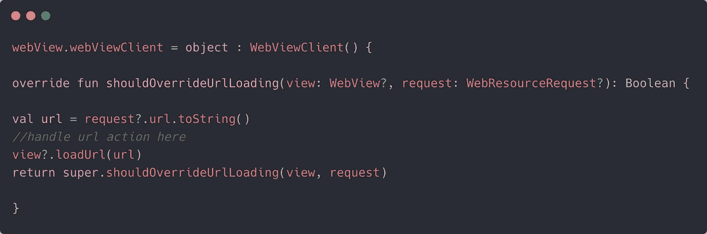
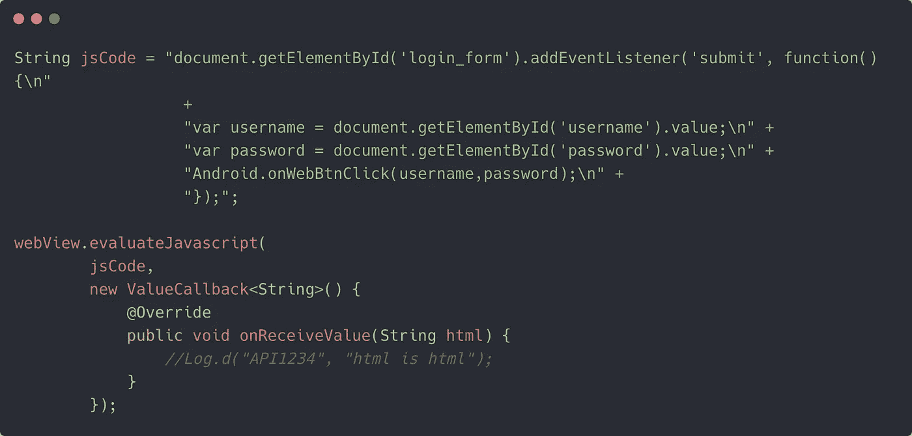
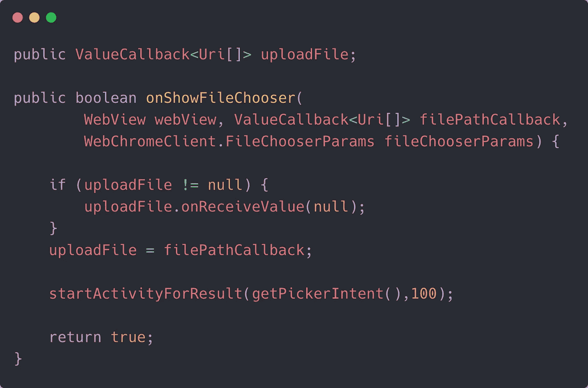

# 你(可能)不知道的 5 个 Android WebView 秘密

> 原文：<https://betterprogramming.pub/5-android-webview-secrets-you-probably-didnt-know-b23f8a8b5a0c>

## 显示文件选择器，调用 JavaScript 代码，等等


杰夫·卡德斯汀在 [Unsplash](https://unsplash.com?utm_source=medium&utm_medium=referral) 上拍摄的照片。

如今是应用程序不可或缺的一部分。它们让您可以利用 web 开发团队的技能，快速添加一个方便的 UI 屏幕。

最近，我在开发一款智能浏览器应用，发现`WebViews`不仅仅可以显示网页。

在接下来的几节中，我将列出一些鲜为人知的技巧和诀窍，帮助 Android 开发人员增强他们的`WebViews`，并从他们的原生 Java/Kotlin 代码库对 JavaScript 代码进行更好的控制。

让我们直接开始吧。

# 1.拦截 URL

通过在`WebViewClient`的初始化过程中实现方法`shouldOverrideUrlLoading`，我们可以在导航过程中使用模式匹配来拦截中间 URL。

通过这种方式，您可以控制是否应该加载 URL 或者使用 intents 打开某个活动/服务。

以下代码片段显示了您需要实现的实际方法:



科特林代码

# 2.基本 Web 身份验证

许多网页会提示用户输入登录凭据。当你第一次在 Android 中设置`WebView`时，你可能会错过这个，并最终在页面加载时出现 401 验证错误。

幸运的是，通过实现以下方法，您可以在 Android `WebView`中顺利执行基本认证:

```
override fun onReceivedHttpAuthRequest(
            view: WebView,
            handler: HttpAuthHandler,
            host: String,
            realm: String) {
            handler.proceed("username", "password")
}
```

或者，对于自动登录，您可以在`loadUrl`函数中将额外的授权数据作为`Map`数据结构进行传递。

# 3.为 WebView 按钮和编辑文本设置侦听器

有时，您可能希望将来自`WebView`表单的某些数据原生存储在 Android 中。或者，当点击 Android `WebView`中的一个按钮时，您可能想要执行一个本地操作。

幸运的是，我们可以利用 Android-JavaScript 的互操作性。

如果您知道 HTML 中视图/小部件的 ID，那么基于`WebView`交互在您的 Android 代码中执行相关操作是相当简单的。

只需使用`evaluateJavaScript`方法，并将 JS 代码作为字符串传递。理想情况下，这应该在`onPageLoadFinished`方法中完成:



Java 代码

现在上面的代码是为了在点击按钮时捕获`WebView`表单的细节，并将它们传递给`Android.onWebBtnClick`本地方法。为了让它完全工作，您需要为 JavaScript 接口创建一个类，并将其设置在`WebView`上。

以下是如何做到这一点:

```
class WebAppInterface {
    Context mContext;WebAppInterface(Context c) {
        mContext = c;
    }@JavascriptInterface
    public void onWebBtnClick(String username, String password) {
       //handle the data captured from webview}
}
```

现在，只需将其设置在`WebView`上，如下所示:

```
webView.addJavascriptInterface(new WebAppInterface(this), "Android");
```

太好了，我们设法在 Android 和 JavaScript 之间建立了一个接口桥梁。这对于监听网页中的 UI 变化并相应地触发原生 Android 方法非常有用。

# 4.从 Android 触发 JavaScript 警告提示

默认情况下，来自 JavaScript 的提示不会在 Android 中显示。因此，我们需要覆盖`WebChromeClient`接口中的`onJsAlert`、`onJsPrompt`和`onJsConfirm`方法，以便在提示中显示 JavaScript 的`alert()`和其他用于确认或文本输入的函数。

```
webView.getSettings().setJavaScriptEnabled(true);
webView.setWebChromeClient(new MyWebChromeClient());
```

通过实现以下功能，您可以提供 Android 的对话框 UI 弹出窗口，为用户提供更自然的体验:

```
final class MyWebChromeClient extends WebChromeClient {
    @Override
    public boolean onJsConfirm(WebView view, String url, String message, final JsResult result) {
       //implement AlertDialog here
        return true;
    }
}
```

# 5.从 WebView 显示 Android 文件选择器

JavaScript `<input>`代码允许您上传文件。现在，这在 iOS 中相当简单，因为你什么都不用做。

但是在 Android 中，我们需要在`WebChromeClient`中实现`onShowFileChooser`方法，其中你必须设置本地文件选择器。

本质上，我们需要使用 WebKit 的 [ValueCallBack](https://developer.android.com/reference/android/webkit/ValueCallback) 接口来帮助将数据从 Android 文件选择器传递到 JavaScript 代码。

以下是`onShowFileChooser`方法的一瞥:



为了简洁起见，我省略了文件选择器对话框代码。

在`onActivityResult`中，一旦获得图像数据，只需通过以下方式将其传递给`uploadFile`实例:

```
uploadMessage.onReceiveValue(results);
```

太棒了，代码成功地将从 Android 中选取的图像传递给 JavaScript 代码。

# 结论

在 Android 中，实现起来可能看起来最简单，但是有很多细节需要考虑。

通过利用 JavaScript-Android 互操作性，我们可以将数据从原生 Android 代码传递到`WebViews`,反之亦然。

这一次到此为止。感谢阅读。