# Kubernetes CKAD 练习题的 5 个答案

> 原文：<https://betterprogramming.pub/5-answers-to-kubernetes-ckad-practice-questions-3fa1c72a6b5d>

## 当我们回顾几个假设的 CKAD 问题以及可能的解决方案时，了解名称空间、pod、部署等等


[安迪李](https://unsplash.com/@andasta?utm_source=unsplash&utm_medium=referral&utm_content=creditCopyText)在 [Unsplash](https://unsplash.com/s/photos/containers?utm_source=unsplash&utm_medium=referral&utm_content=creditCopyText) 上拍照

在使用 [Kubernetes](https://kubernetes.io/) (K8s)进行一些工作以及准备认证 Kubernetes 应用程序开发人员(CKAD)考试时，我在 Matthew Palmer 的网站上看到了一个名为“[认证 Kubernetes 应用程序开发人员(CKAD)认证](https://matthewpalmer.net/kubernetes-app-developer/articles/ckad-practice-exam.html)的练习考试”的页面，其中包含五个练习题，我将在这里进行介绍。如果你对我下面做的任何事情有问题，包括低效的解决方案，请在评论中告诉我。

我们不仅要展示每个问题的可能解决方案，还要验证我们的工作。

由于我们在进行该测试时仅限于使用 [Kubernetes](https://kubernetes.io/) 网站，因此在适当的地方会引用该网站。特别是， [kubectl 备忘单页面](https://kubernetes.io/docs/reference/kubectl/cheatsheet/)是一个不错的起点，我们也可以在那里搜索我们需要的内容。

最后，对于每一个问题，我们都需要特别注意名称空间需求。

本文依赖于运行在 Ubuntu 上的 minikube 和 Oh My Zsh shell。

*k 指令*定义如下:

```
alias k='kubectl'
```

我们来看看第一个问题。

# 问题 1。

帕尔默练习考试[1]的第一个问题如下:

> "在集群中创建一个名为 ggckad-s0 的命名空间。
> 在此名称空间中运行以下 pod。
> 
> 1.一个名为 pod-a 的 pod 有一个运行`kubegoldenguide/simple-http-server`映像的容器
> 
> 2.一个名为 pod-b 的容器，其中一个容器运行`kubegoldenguide/alpine-spin:1.0.0`映像，另一个容器运行`nginx:1.7.9`
> 
> 记下 ggckad-s0 名称空间的`kubectl get pods`的输出。"

我们可以手工拼凑一个 pod，也可以自动生成，这应该是首选，因为如果可以避免的话，我们不想浪费时间。以下命令可用于自动生成每个 YAML 文件:一个用于`kubegoldenguide/simple-http-server`容器，一个用于`kubegoldenguide/alpine-spin:1.0.0`容器，一个用于`nginx:1.7.9`容器。

```
kubectl run nginx --image=kubegoldenguide/simple-http-server --dry-run=client -o yaml > simple-http-server.yamlkubectl run nginx --image=kubegoldenguide/alpine-spin:1.0.0 --dry-run=client -o yaml > alpine-spin.yamlkubectl run nginx --image=nginx:1.7.9 --dry-run=client -o yaml > nginx.yaml
```

我们可以使用这些文件来创建这个问题所需的 pod-a 和 pod-b YAML 文件。

pod-a 的配置文件如下所示:

pod-b 的配置文件如下所示:

认证 Kubernetes 应用程序开发人员(CKAD)认证问题 1.2 配置 Yaml 的模拟考试

我们需要首先按照说明创建名称空间:

```
k create namespace ggckad-s0
```

接下来，我们可以应用此配置:

```
kubectl apply -f pod-[a or b].yaml --namespace ggckad-s0
```

这个问题的最后一条指令指出，我们需要“写下 ggckad-s0 名称空间的`kubectl get pods`的输出”这通过以下方式实现:

```
k get pods --namespace ggckad-s0
```

这会产生以下结果:

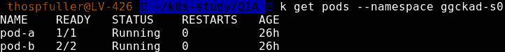

运行“k get pods–命名空间 ggckad-s0”的结果。

## 验证我们的解决方案

下面是我们在这个例子中使用的整个脚本。我们检查所有容器的日志，以查看它们是否正确运行。

```
k create namespace ggckad-s0
k apply -f pod-a.yaml --namespace ggckad-s0
k logs pod-a --namespace ggckad-s0
k apply -f pod-b.yaml --namespace ggckad-s0
k logs pod-b alpine-spin-container --namespace ggckad-s0
k logs pod-b nginx-container --namespace ggckad-s0
```

运行该脚本应该会产生以下输出:

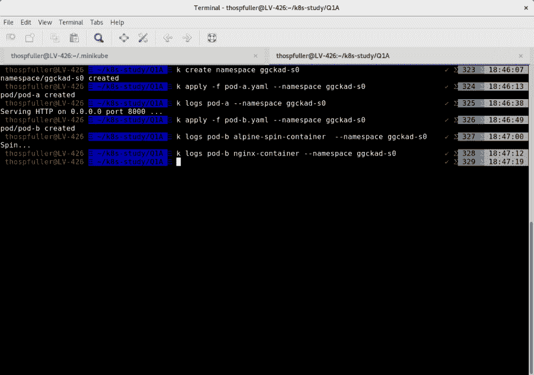

在这个例子中，k 被定义为“别名 k='kubectl '”。

我们可以使用`get events`命令来查看收集到的事件。

```
k get events --namespace ggckad-s0
```

运行该命令应该会产生以下输出:

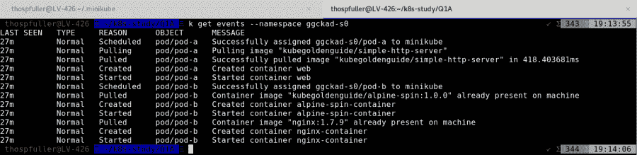

设置 pod-a 和 pod-b 时在名称空间 ggckad-s0 中收集的事件的输出

注意`nginx-container`已经启动；然而，日志中没有消息表明它实际上正在运行，所以我们将通过将本地机器上的端口 19999 映射到 pod-b pod 中的端口 80 来检查这一点，pod-b pod 应该指向在端口 80 上运行 nginx web 服务器的`nginx-container`。

```
kubectl port-forward pods/pod-b 19999:80 --namespace ggckad-s0
```

当我们执行上面的行时，输出应该如下所示:

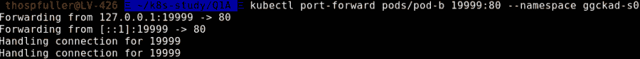

最后，我们现在可以通过浏览 localhost:19999 来测试 nginx 是否正在运行。

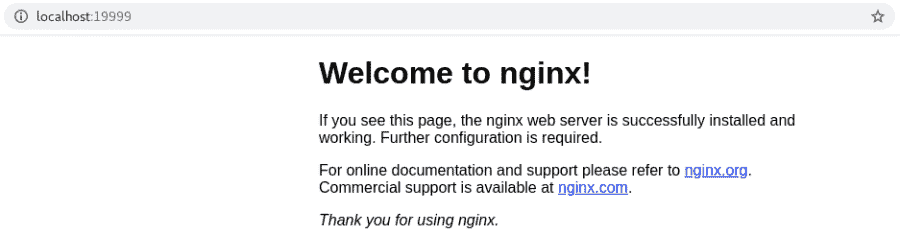

这个问题到此为止。

# 问题 2。

帕尔默练习考试的第二个问题[1]如下:

> "此问题中的所有操作都应在 ggckad-s2 命名空间中执行。
> 
> 创建一个名为 app-config 的配置映射，其中包含以下两个条目:
> 
> “connection_string”设置为“localhost:4096”
> 
> “外部 url”设置为“google.com”
> 
> 使用运行`kubegoldenguide/alpine-spin:1.0.0`映像的单个容器运行一个名为 question-two-pod 的 pod，并将这些配置设置作为环境变量暴露在容器中。"

我们需要首先按照说明创建名称空间:

```
k create namespace ggckad-s2
```

我们需要一个[配置映射](https://kubernetes.io/docs/concepts/configuration/configmap/)，可以通过 CLI 创建，如下所示:

```
kubectl create configmap app-config --from-literal connection_string=localhost:4096 --from-literal external_url=[google.com](http://google.com/) --dry-run -oyaml --namespace ggckad-s2
```

这在以下要点中定义:

接下来，我们可以应用此配置，确保包含指定的名称空间:

```
k apply -f ./app-config.yaml --namespace ggckad-s2
```

问题 2-pod 的配置文件如下所示:

我们需要应用 pod 配置文件，我们通过以下命令来实现:

```
k apply -f ./question-two-pod.yaml --namespace ggckad-s2
```

最后，我们需要验证我们的工作。

## 验证我们的解决方案

验证这个解决方案很简单:在第一步中，我们将获得对容器的 CLI 访问，在第二步中，我们将检查环境。如果已经设置了环境变量，那么我们就完成了。

第一步如下所示:

```
k exec -it question-two-pod -c web --namespace ggckad-s2 -- /bin/sh
```

第二步可以通过使用`env`命令并目视检查结果来完成。

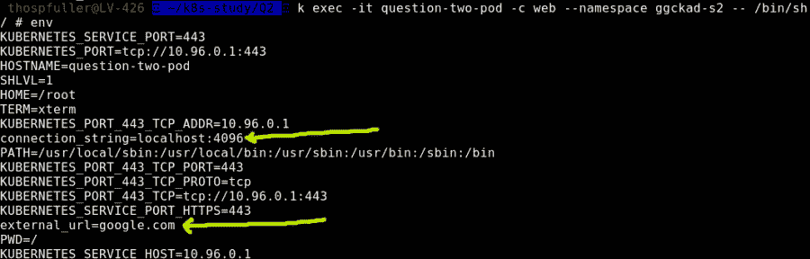

这个问题到此为止。

# 问题 3。

帕尔默练习考试的第三个问题[1]如下:

> "此问题中的所有操作都应在 ggckad-s2 命名空间中执行。创建一个有两个容器的 pod。两个容器都应该运行`kubegoldenguide/alpine-spin:1.0.0`图像。第一个容器应该以用户 ID 1000 运行，第二个容器应该以用户 ID 2000 运行。两个容器都应该使用文件系统组 ID 3000。

我们需要首先按照说明创建名称空间:

```
k create namespace ggckad-s2
```

下面显示了三个问题的配置文件——查看名称空间声明。这允许我们通过命令行(CLI)应用配置文件，而不包括名称空间；此外，更重要的是，要特别注意`fsGroup`和`runAsUser`键/值对:

我们可以如下应用此配置:

```
k apply -f ./question-three-pod.yaml
```

最后，我们需要验证我们的工作。

## 验证我们的解决方案

我们需要让 CLI 访问我们的容器，然后验证设置是否正确。可以使用以下命令来做到这一点:

```
k exec -it question-three-pod -c alpine-spin-[a or b] --namespace ggckad-s2 -- /bin/sh
```

一旦我们有了访问权限，我们就可以检查`fsGroup`和`runAsUser`键/值对是否设置正确。我们将通过使用`[id](https://man7.org/linux/man-pages/man1/id.1.html)` [命令](https://man7.org/linux/man-pages/man1/id.1.html)来获取这些信息。

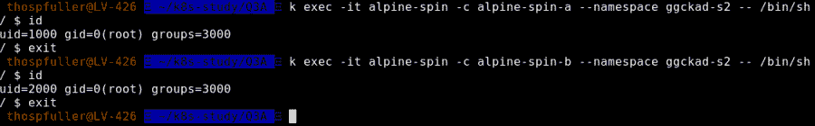

这个问题到此为止。

# 问题 4。

帕尔默练习考试的第四个问题[1]如下:

> "此问题中的所有操作都应在 ggckad-s4 命名空间中执行。这个问题将要求您创建一个运行图像`kubegoldenguide/question-thirteen`的 pod。这幅图像是在 hub.docker.com 的主码头仓库。
> 
> 此映像是一个 web 服务器，其健康终结点位于“/health”。web 服务器监听端口 8000。(它运行 Python 的 SimpleHTTPServer。)当应用程序运行正常时，它会返回 200 状态代码响应。应用程序通常需要 60 秒才能启动。
> 
> 创建一个名为 question-13-pod 的 pod 来运行这个应用程序，确保定义使用这个健康端点的活动和就绪探测器。"

与之前的问题不同，这个问题明确告诉我们`kubegoldenguide/question-thirteen image`在位于[hub.docker.com](https://hub.docker.com/)的主 Docker 存储库中。根据 Kubernetes[Images:Image Names](https://kubernetes.io/docs/concepts/containers/images/)文档，“如果您不指定注册表主机名，Kubernetes 会认为您指的是 Docker 公共注册表”，因此对于这个细节不需要采取进一步的措施。

这个问题特别需要*活跃度*和*就绪度*探测器，为了方便起见，我们在下面包括了每个探测器的定义。

活跃度—“应用程序不再为请求提供服务，K8s 将重启有问题的 pod”[4]。

就绪—“应用程序已准备好接收流量”[4]。根据[6]:“如果准备就绪探测失败，端点控制器将从所有匹配 Pod 的服务的端点中删除 Pod 的 IP 地址。”

根据标题为[定义活跃度 HTTP 请求](https://kubernetes.io/docs/tasks/configure-pod-container/configure-liveness-readiness-startup-probes/#define-a-liveness-http-request)的部分，“任何大于或等于 200 且小于 400 的代码都表示成功。”因此，在我们的解决方案中不需要任何操作，因为当应用程序运行正常时，运行在 question-thirty 容器中的服务器将返回一个 HTTP 状态响应代码 200。

在我们提出的解决方案中，我们将添加一个缓冲区，并在 75 秒时启动`livenessProbe`，这比典型的预期启动时间晚 15 秒，如问题 4 中的详细信息所示。15 秒的缓冲时间是一个任意选择的数字，假设实际上服务器应该已经启动了；类似的例子出现在[5]中，也可参考[7]和[8]。

请注意，从 Kubernetes 1.16 开始，可以定义一个`startupProbe`，以便在返回初始 OK 之前`livenessProbe`不会启动。

我们的吊舱配置可以在这里看到。

最后，我们需要验证我们的工作。

## 验证我们的解决方案

在本例中，我们应该可以看到在 pod 启动后大约 75 秒内`readinessProbe`的日志消息，此时我们应该可以看到*`readinessProbe`*和`livenessProbe`的日志消息。**

```
**kubectl logs question-13-pod -c question-thirteen --v 4 --namespace ggckad-s4**
```

**不幸的是，这个命令的输出没有告诉我们哪个探测器正在调用端点。**

**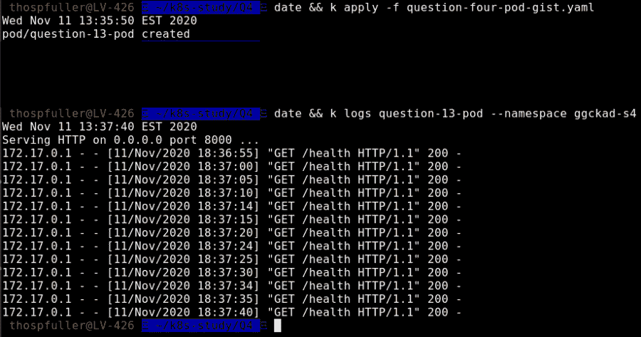**

**问题四验证**

**作为读者的一个练习，我们能准确地确定哪个探测器正在调用健康端点吗？Kubernetes 文档似乎表明这是可能的。然而，目前我还没有一个例子来证明这一点。**

**这个问题到此为止。**

# **问题 5。**

**帕尔默练习考试的第五个问题[1]如下:**

> **"此问题中的所有操作都应在 ggckad-s5 命名空间中执行。创建一个名为 question-5.yaml 的文件，在 ggckad-s5 名称空间中声明一个部署，其中有六个副本运行`nginx:1.7.9`映像。**
> 
> **每个 pod 都应该有标签`app=revproxy`。部署应该有标签`client=user`。配置部署，以便在更新部署时，在创建新的 pod 来替换它们之前，现有的 pod 会被终止。"**

**我们需要检查部署和 pod 的标签，然后我们需要按照[1]“配置部署，以便当部署更新时，在创建新的 pod 来替换它们之前，现有的 pod 会被删除。”**

**我们有两种可用的部署策略:`RollingUpdate`(默认)，和`Recreate` [14]。给定`RollingUpdate`和`Recreate`的定义，在这种情况下，我们不想使用默认值，而是需要将`Recreate`分配给`.spec.strategy.type`。**

**我们的部署配置可以在这里看到:**

**我们可以像在上一个问题中一样应用文件:**

```
**k apply -f ./question-5.yaml**
```

**最后，我们需要验证我们的工作。**

## **验证我们的解决方案**

**我们需要检查部署和 pod 的标签，并且我们还需要确保在更新部署时，在创建新的 pod 来替换它们之前，现有的 pod 会被删除。**

**我们可以使用以下命令来查看部署标签:**

```
**k get deployments --show-labels --namespace ggckad-s5**
```

**我们可以使用以下命令来查看各种 pod 标签:**

```
**k get pods --show-labels --namespace ggckad-s5**
```

**下面我们可以看到应用`question-5.yaml`文件然后执行这两个命令的输出。黄色箭头表示标签已经按照规格进行了设置:**

**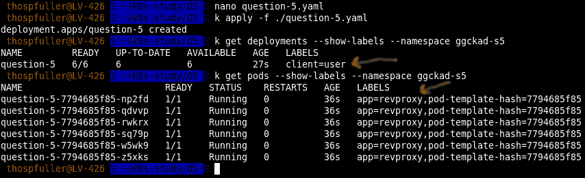**

**注意，我们的部署依赖于`nginx:1.7.9`映像。这个映像是旧的，所以如果我们将它更新到`nginx:latest`并再次应用`question-5.yaml`文件，那么我们会看到新的容器被部署，而旧的容器被逐渐终止。下图演示了这种行为:**

**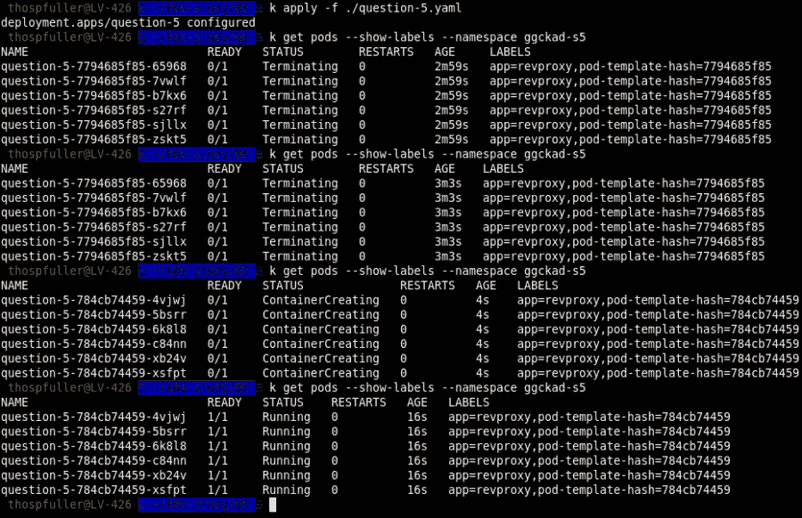**

**使用重新创建策略应用部署**

**接下来，我们重复同样的练习，只是这里我们使用下面的命令[11]检查`rollout status`:**

```
**kubectl rollout status deployment.v1.apps/question-5 --namespace ggckad-s5**
```

**我们可以从不同的角度看到，旧的副本正在终止，而新的副本正在开始。**

**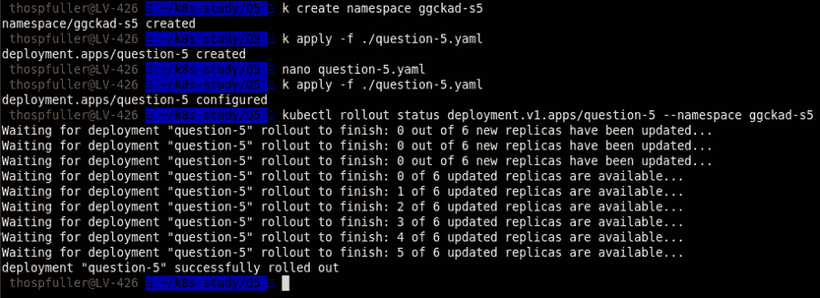**

**最后，我们可以通过执行以下命令来重现相同的行为:**

```
**kubectl rollout restart deployment question-5 --namespace ggckad-s5**
```

**在这种情况下，我们甚至不需要在`question-5.yaml file`中更新 nginx 版本。**

**让我们看看部署策略类型设置为`RollingUpdate`时的更新。这是默认设置，也是给定规范的错误选择。**

## **不正确的解决方法**

**同样的例子，但是使用`RollingUpdate`部署策略是不正确的。为了便于比较，我们在下面包含了这个例子的输出。**

**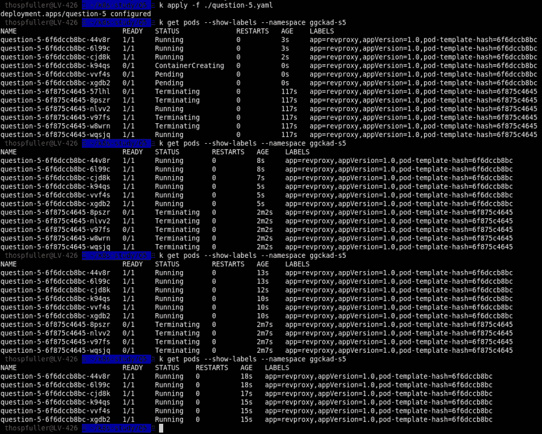**

**接下来，我们重复同样的练习，只是这里我们使用下面的命令[11]检查`rollout status`:**

```
**kubectl rollout status deployment.v1.apps/question-5 --namespace ggckad-s5**
```

**我们可以从不同的角度看到，旧的副本正在终止，而新的副本正在开始。**

**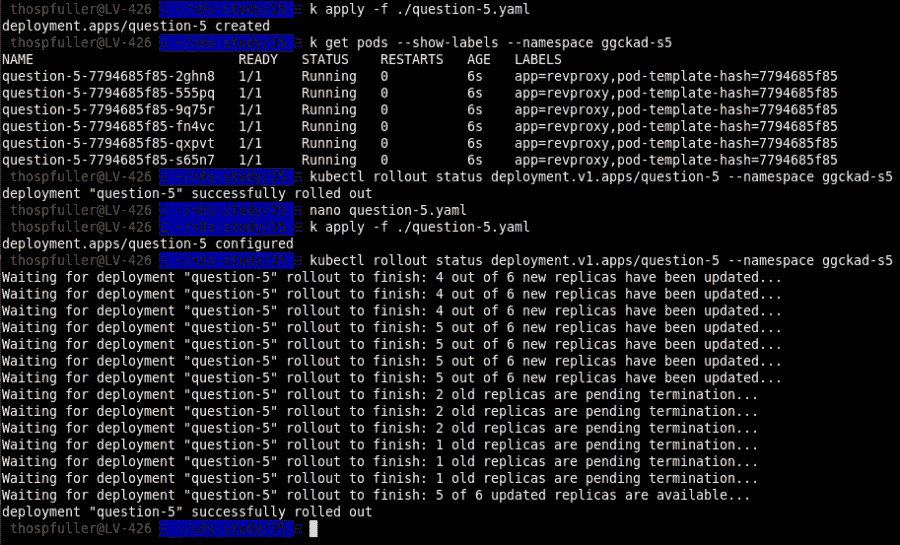**

**Nginx 从 1.7.9 更新到最新版本时的首次展示状态**

**这个问题就到此为止，这篇文章也是如此——直到结论！**

# **结论**

**这篇文章花了几个小时来写，部分是作为对如何解决这些问题的调查，作为对我学习 CKAD 考试的介绍。**

**如果你开始准备这个认证的过程，你会发现有几篇好文章提供了关于考试结构和如何为考试学习的指导。我在下面加入了几个链接。**

**如果你有其他有助于准备考试的资源或参考资料，请在评论中注明。**

# **测验和笔记**

1.  **参考问题 1:当`alpine-spin-container`和`nginx-container` 都依赖于`containerPort 80`时，为什么我们不需要在`port-forward`命令中包含特定的容器，为了方便起见复制如下？**
2.  **kubectl 端口转发 pod/pod-b 19999:80-名称空间 ggckad-s0**
3.  **注意:`port-forward`只允许我们指定 pod，不允许我们指定 pod +容器。**
4.  **参考问题 1:如果我们试图启动 pod-b，但我们有两个`nginx-container`而不是`alpine-spin-container`，会发生什么？**
5.  **一个`Recreate`与`RollingUpdate`并列的部署策略有什么区别？**

# **帽尖**

**[Rishi Malik](https://www.linkedin.com/in/rishilmalik/) ， [Ed McDonald](https://www.linkedin.com/in/ed-macdonald-7037006/) ， [Aaron 弗列尔](https://www.linkedin.com/in/aaronfriel/)， [Scott Lowe](https://www.linkedin.com/in/scottslowe/) 和 [Andy Suderman](https://www.linkedin.com/in/sudermanjr/)**

# **参考**

1.  **【Kubernetes 应用程序开发员(CKAD)认证模拟考试**
2.  **[凯尔西高塔/库伯内特斯-艰难的方式](https://github.com/kelseyhightower/kubernetes-the-hard-way)**
3.  **[连接应用程序和服务](https://kubernetes.io/docs/concepts/services-networking/connect-applications-service/)**
4.  **[配置活性、就绪和启动探针](https://kubernetes.io/docs/tasks/configure-pod-container/configure-liveness-readiness-startup-probes/)**
5.  **[Kubernetes 活跃度和准备度调查:如何避免搬起石头砸自己的脚](https://blog.colinbreck.com/kubernetes-liveness-and-readiness-probes-how-to-avoid-shooting-yourself-in-the-foot/)**
6.  **[Pod 生命周期](https://kubernetes.io/docs/concepts/workloads/pods/pod-lifecycle/)**
7.  **[Kubernetes 最佳实践:使用就绪性和活性探测器设置健康检查](https://cloud.google.com/blog/products/gcp/kubernetes-best-practices-setting-up-health-checks-with-readiness-and-liveness-probes)**
8.  **[用启动探针保护慢启动容器](https://kubernetes.io/docs/tasks/configure-pod-container/configure-liveness-readiness-startup-probes/#define-startup-probes)**
9.  **[定义一个活跃度 HTTP 请求](https://kubernetes.io/docs/tasks/configure-pod-container/configure-liveness-readiness-startup-probes/#define-a-liveness-http-request)**
10.  **[配置 Pod 以使用配置图](https://kubernetes.io/docs/tasks/configure-pod-container/configure-pod-configmap/)**
11.  **[翻车(也就是飞行中的多次更新)](https://kubernetes.io/docs/concepts/workloads/controllers/deployment/#rollover-aka-multiple-updates-in-flight)**
12.  **[Kubernetes 部署策略](https://blog.container-solutions.com/kubernetes-deployment-strategies)**
13.  **[比例缩放](https://kubernetes.io/docs/concepts/workloads/controllers/deployment/)**
14.  **[部署:战略](https://kubernetes.io/docs/concepts/workloads/controllers/deployment/#strategy)**
15.  **[苦尽甘来](https://github.com/kelseyhightower/kubernetes-the-hard-way)**
16.  **[如何重启 Kubernetes Pods](https://phoenixnap.com/kb/how-to-restart-kubernetes-pods)**