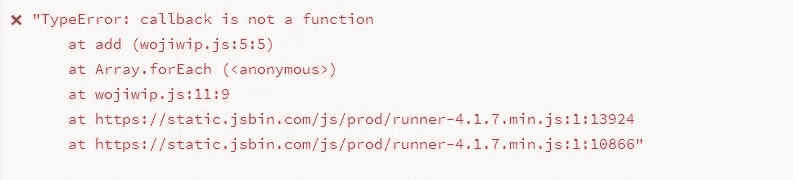
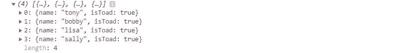
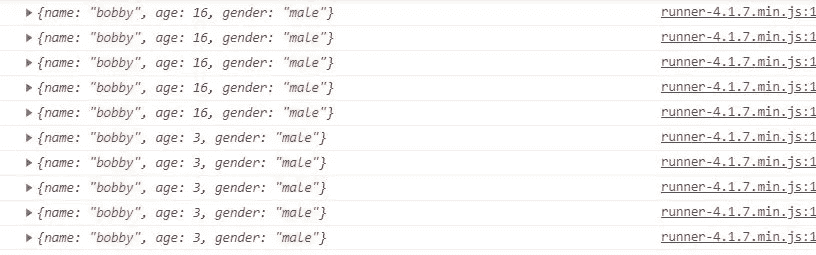
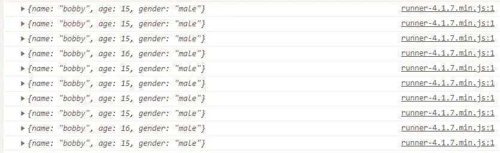

# 在 JavaScript 中使用集合时要避免的 5 个反模式

> 原文：<https://betterprogramming.pub/5-anti-patterns-to-avoid-when-working-with-collections-in-javascript-4e3bbd0a75d3>

## 为了更好、更容易理解的 JavaScript，避免这些陷阱


*照片由* [*菲利普*](https://unsplash.com/@fantasyflip) *上* [*下*](https://unsplash.com/)

在 JavaScript 中使用集合可能会成为一项令人震惊的任务——尤其是当一个函数块中有很多事情要做的时候。

你有没有想过*为什么*一些项目的代码看起来比其他的好很多？或者，当一个看似困难的项目最终变得如此之小时，你的思维就像疯了一样，不知道他们是如何做到既简单又健壮的？

当一个项目在保持良好性能的同时易于阅读时，您可以确信代码中可能应用了非常好的实践。

当代码写得乱七八糟时，很容易变成相反的情况。在这一点上，很容易出现这样的情况:修改少量代码最终会给应用程序带来灾难性的问题——换句话说，抛出的错误会使网页崩溃，无法继续运行。当迭代集合时，看着糟糕的代码运行会变得很可怕。

实施更好的实践是关于抑制自己走捷径，这反过来有助于获得保证。这意味着从长远来看，使你的代码尽可能可维护是有赖于你的。

本文将讨论在 JavaScript 中使用集合时要避免的五种反模式

本文中的许多代码示例将体现一种叫做 [*函数式编程*](https://en.wikipedia.org/wiki/Functional_programming) 的编程范式。正如 Eric Elliot 解释的那样，*“函数式编程是通过组合纯函数、避免共享状态、可变数据和副作用来构建软件的过程。”*在这篇文章中，我们会经常提到副作用和突变。

以下是 JavaScript 中使用集合时要避免的五种反模式:

# 1.过早地将函数作为直接参数传递

我们要学习的第一个反模式是过早地将函数作为直接参数传递给在集合中循环的数组方法。

这里有一个简单的例子:

那么为什么这是一个反模式呢？

大多数开发人员，尤其是那些更喜欢函数式编程的开发人员，可能会发现这是一种干净、简洁、性能最好的方法。我是说，看看它。与其这样做:

看起来更好的方法是直接输入函数名，然后就到此为止:

```
const numbers = [[1, 2], [2, 2], [18, 1], [4, 5], [8, 9], [0, 0]]numbers.forEach(add)
```

在一个完美的世界里，这将是用 JavaScript 处理我们所有函数的完美解决方案，而不需要费一点力气。

但事实证明，过早地以这种方式传递处理程序会导致意外的错误。例如，让我们继续，回头看看我们之前的例子:

我们的`add`函数需要一个数组，其中第一个和第二个索引是数字，将它们相加，检查是否有回调，如果存在就调用它。这里的问题是`callback`可能最终被作为`number`调用，并导致错误:



# 2.依赖于迭代器函数的排序。地图和。过滤器

JavaScript 的基本函数按照元素在数组中的顺序处理集合中的元素。然而，你的代码应该*而不是*依赖于此。

首先，迭代的顺序在每种语言和每个库中都不是 100%稳定的。将每个迭代函数视为在多个进程中并发运行是一个很好的实践。

我见过这样的代码:

在大多数情况下，这完全没问题。但是如果我们仔细观察，这并不是最安全的方法，因为全局范围内的任何东西都可以更新`count`。如果发生这种情况，并且`count`在代码的某个地方意外地被递减，那么`window.alert`将*永远不能*运行！

在异步操作中，情况会变得更糟:

结果是:


那些对 JavaScript 更有经验的人可能会知道为什么我们在控制台上记录了四个数字`4`而不是`1, 2, 3, 4`。重点是最好使用第二个参数(通常称为当前的`index`)，大多数函数在迭代集合时都会收到这个参数，以避免并发:

```
promises.forEach((promise, index) => {
  promise(index).then(() => {
    console.log(index)
  })
})
```

结果是:


# 3.过早优化

当你寻求优化时，你通常必须选择是更喜欢可读性还是速度。有时候，把更多的注意力放在优化应用程序的速度上，而不是提高代码的可读性，真的很诱人。毕竟，众所周知，网站速度很重要。但这实际上是一种*的不良做法*。

首先，JavaScript 中的集合通常比您想象的要小，处理每个操作所花费的时间也比您想象的要快。这里要遵循的一条好规则是，除非你*知道*某件事会很慢，否则不要试图让它变快。这被称为*过早优化*，或者换句话说，试图优化可能已经在速度上最优的代码。

正如 Donald Knuth 所说，“真正的问题是程序员在错误的地方和错误的时间花了太多的时间担心效率；*过早优化是编程中所有罪恶*(或者至少是大部分罪恶)的根源。”

在很多情况下，在代码最终变得稍微慢一点的情况下，应用更好的速度比在一片混乱中维持快速工作的代码更容易。

我建议优先考虑可读性，然后再进行度量。如果您使用一个分析器，它报告您的应用程序中有一个瓶颈，只优化那个位，因为现在您*知道*它实际上是一个很慢的代码，而不是*试图*优化您*认为*它可能很慢的代码。

# 4.依靠国家

状态在编程中是一个非常重要的概念，因为它使我们能够构建健壮的应用程序。但是，如果我们不够注意自己，它也会破坏我们的应用程序。

以下是在集合中处理状态时的一个反模式示例:

这是一个 [*副作用*](https://hackernoon.com/javascript-and-functional-programming-pt-3-pure-functions-d572bb52e21c) 的例子，这是一定要小心的，因为它可能会导致如下问题:

*   产生意想不到的副作用(*真的*危险！)
*   增加内存使用
*   降低应用程序的性能
*   让你的代码更难阅读/理解
*   这使得测试您的代码更加困难

那么，在不产生副作用的情况下，有什么更好的方法来写这个呢？或者，我们如何使用更好的实践来重写这一点？

当我们在处理集合时，我们需要在操作过程中处理状态，记住我们可以利用某些方法*为我们提供一些新的引用*(比如对象)。

一个例子是使用`.reduce`方法:

```
const toadsCount = frogs.reduce((accumulator, frog) => {
  if (newFrog.skin === 'dry') {
    accumulator++
  }
  return accumulator
}, 0)
```

这里发生的事情是，我们正在与它的块中的某个状态*进行交互，但是我们还利用了`.reduce`的第二个参数，其中的值可以在初始化时新创建。这比前面的代码片段使用了更好的方法，因为我们没有改变范围*之外的任何东西*。这使得我们的`toadsCount`成为使用不可变集合和*避免副作用*的一个例子。*

# 5.多变的论点

某物意味着在形式或性质上的改变。这是 JavaScript 中需要密切关注的一个重要概念，尤其是在函数式编程的环境中。可变的可以改变，不可变的*不能*(或者*不应该*)改变。

这里有一个例子:

我们期望`toToads`的值返回一个新的`frogs`数组，通过将它们的`isToad`属性翻转为`true`，它们都被转换为蟾蜍。

但这就是它变得有点令人不寒而栗的地方:当我们通过这样做来变异一些`frog`对象:`frog.isToad = true`时，我们*也无意中变异了`frogs`数组中的*对象！

我们可以看到`frogs`现在都是*蟾蜍*，因为它发生了突变:



这是因为 JavaScript 中的*对象都是通过引用*传递的！如果我们在代码中的 10 个不同位置分配相同的对象会怎么样？

例如，如果我们在整个代码中将这个引用分配给 10 个不同的变量，然后我们在代码中的某个时间点变异了变量 7，*所有在内存中保存对这个相同指针的引用的其他变量*也会变异*:*

结果是:



相反，我们可以做的是在每次想要改变引用时创建新的引用:

结果是:



# 结论

这篇文章到此结束！我发现你发现这是有价值的，并期待在未来更多！