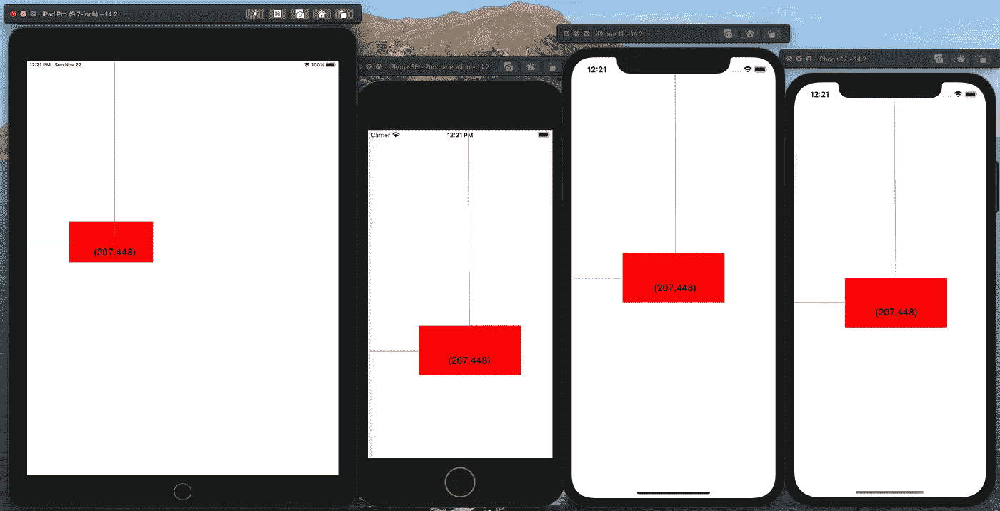
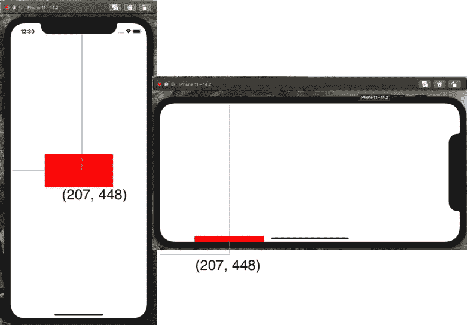
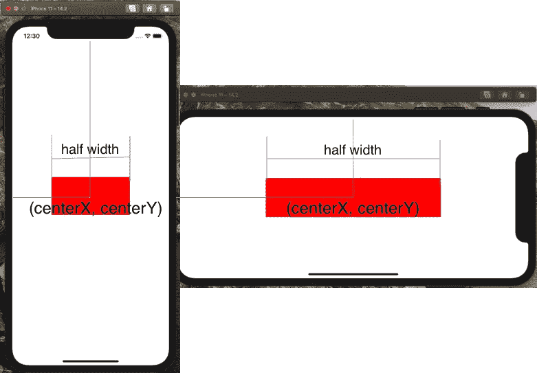
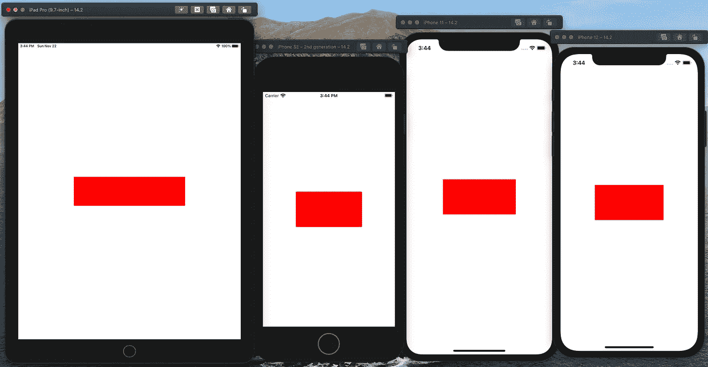
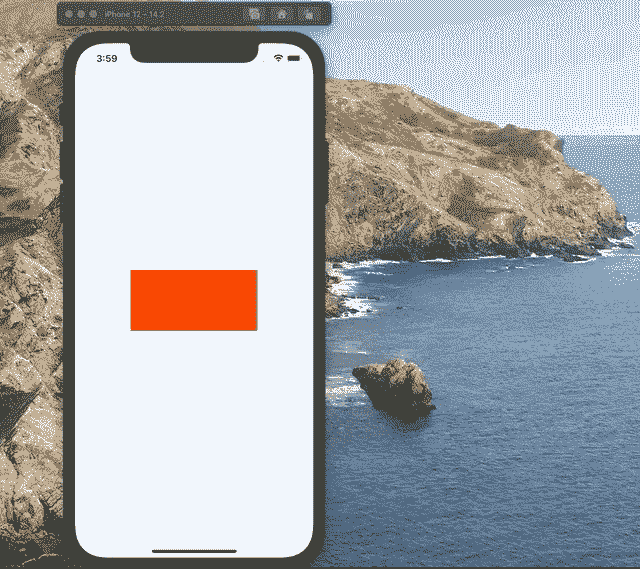
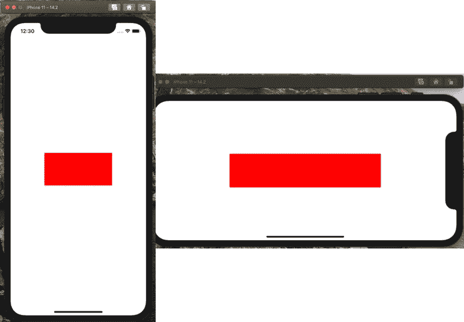

# Swift 中的 5 种自动布局方法

> 原文：<https://betterprogramming.pub/5-auto-layout-approaches-at-swift-b229cf396ee2>

## NSLayoutConstraint、可视化格式语言等等


照片由 [Brenda Godinez](https://unsplash.com/@cravethebenefits?utm_source=medium&utm_medium=referral) 在 [Unsplash](https://unsplash.com?utm_source=medium&utm_medium=referral) 上拍摄。

为了创建一个自适应的 UI 来适当地响应屏幕大小和设备方向的变化，我们使用了自动布局，这是一个基于约束的布局系统。本文概述了以编程方式添加约束的五种不同方法。

# 为什么是自动布局？

如果不使用自动布局，添加到视图中的子视图的位置是固定的。如果我们将具有红色背景的子视图添加到 iPhone 11 的中心，则中心 X 在点 207 处被硬编码，而中心 Y 在点 448 处被硬编码，因为 iPhone 11 的屏幕由水平 414 个点(或 828 个像素)和垂直 896 个点(或 1792 个像素)组成。

当使用 iPhone SE、8、12 和 iPad pro 模拟器运行它时，您将得到子视图不居中的结果:



没有自动布局的不同设备—作者提供的照片

在 iPhone 11 上旋转时，子视图会超出屏幕:



# 1.使用`NSLayoutConstraint`自动布局

`NSLayoutConstraint`使用以下格式的线性方程定义两个用户界面对象之间的关系:

```
item1.attribute1 = multiplier × item2.attribute2 + constant
```

*   `attribute1`和`attribute2`是自动布局在解决这些约束时可以调整的变量。例如:`left`、`right`、`top`、`bottom`、`leading`、`trailing`、`width`、`height`、`centerX`、`centerY`、`lastBaseLine`等。
*   `multiplier`和`constant`定义了两个属性的相对位置。

对于示例子视图，我们使用以下代码添加自动布局:

*   `translatesAutoresizingMaskIntoConstraints`被设置为`false`以忽略由视图的自动调整大小遮罩指定的行为。它还忽略了使用`frame`、`bounds`和`center`属性对视图大小和位置的修改。
*   该代码通过指定属性的相对位置来创建宽度、高度、中心 x 和中心 y 约束。



`NSLayoutConstraint Auto Layout`

# 2.利用可视化格式语言实现自动布局

大多数在真实用户界面中有用的约束都可以用自动布局可视化格式语言来表达。可视格式字符串语法可在[自动布局指南](https://developer.apple.com/library/archive/documentation/UserExperience/Conceptual/AutolayoutPG/VisualFormatLanguage.html)中找到。

*   `views`定义层次结构中每个视图的键值对。
*   我们使用`metrics`来动态计算子视图的`width`。
*   `H`指定水平约束，`V`指定垂直约束。



视觉格式语言

# 3.使用`AutoresizingMask`自动布局

> `AutoresizingMask`确定当其超级视图的边界改变时，接收控件如何调整自身的大小。当视图的边界改变时，该视图根据每个子视图的自动调整大小掩码自动调整其子视图的大小。通过使用 C 位 OR 运算符组合`[UIView.AutoresizingMask](https://developer.apple.com/documentation/uikit/uiview/autoresizingmask)`中描述的常量来指定该掩码的值。结合这些常量，您可以指定视图的哪些维度应该相对于超级视图增长或收缩。根据[苹果的开发者文档](https://developer.apple.com/documentation/uikit/uiview/1622559-autoresizingmask?changes=_4)。

`AutoresizingMask`

*   要使用`AutoresizingMask`，将`translatesAutoresizingMaskIntoConstraints`设置为`true`很重要。
*   我们指定`subView`边界，并将其置于`superView`的中心。
*   我们在顶部、左侧、右侧和底部给它灵活的边距，以保持`subView`的大小和居中。



`AutoresizingMask`

# 4.使用`NSLayoutAnchor`自动布局

> `NSLayoutAnchor`从一个视图对象开始构建约束，并选择该对象的一个锚点属性。这些属性对应于自动布局中使用的主`[NSLayoutConstraint.Attribute](https://developer.apple.com/documentation/uikit/nslayoutconstraint/attribute)`值，并提供了一个合适的`NSLayoutAnchor`子类，用于为该属性创建约束。根据[苹果的开发者文档](https://developer.apple.com/documentation/uikit/nslayoutanchor)。

AddNSLayoutAnchor



AddNSLayoutAnchor

# 5.使用`intrinsicContentSize`自动布局

`intrinsicContentSize`是`UIView`的独享属性。

> 它允许自定义视图根据其内容向布局系统传达想要的大小。这种固有的大小必须独立于内容框架，因为没有办法根据变化的高度将变化的宽度动态地传递给布局系统。使用`intrinsicContentSize`的唯一方法是子类化`UIView`。根据[苹果的开发者文档](https://developer.apple.com/documentation/uikit/uiview/1622600-intrinsiccontentsize)。

`intrinsicContentSize`


`Using intrinsicContentSize`

# 结论

本文描述了在 Swift 中实现自动布局的五种不同方法。上面提到的代码可以在这个 [GitHub repo](https://gist.github.com/ericleiyang/c4fbfdb6c7ba827cc9b7b3abe3d47929) 中找到。

感谢阅读。我很想听听你们的想法，回答你们可能有的任何问题！