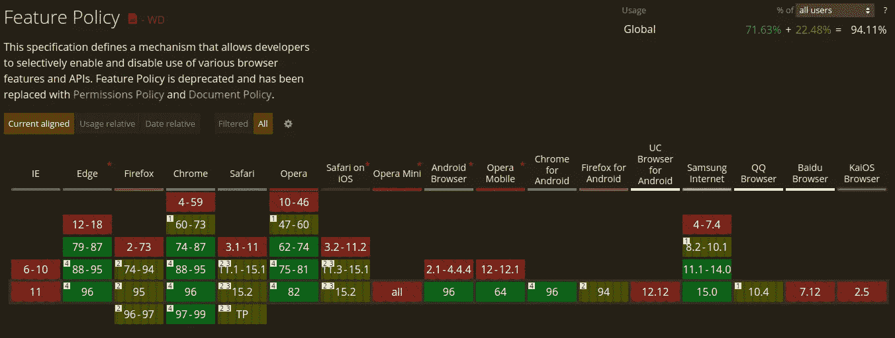

# Web 开发人员应该掌握的 5 个非常棒的 HTTP 头

> 原文：<https://betterprogramming.pub/5-awesome-http-headers-web-developers-should-master-332a1a332084>

## 以更简洁的方式提高页面安全性和性能


由 rawpixel.com/弗里皮克设计的

HTTP 头是服务器和客户端传递一些信息的一种方式。头本身不是元数据，而是存储元数据的位置。

头是键值条目，可以分为请求、响应、表示和有效负载。这里我们将主要关注响应头。这些可以用来提示客户关于我们页面的信息。

它们有很多常见的用法:身份验证、缓存、关于内容的信息、cookies、缓存……然而，还有更多。

在很多用例中，它们可以取代 HTML 甚至 JavaScript 代码。我们可以把代码从繁重的工作中抽离出来，把它放在 DevOps 区域，这是它应该在的地方。

我们会防止应用配置分散在不同的地方，很难找到，很难改变。我们可以使配置适应我们的环境，只需声明一次，就可以在任何地方使用。

在这篇文章中，我们将看到最有用的标题，当谈到有一个安全和高性能的 web 体验。

# 1.严格的运输安全

用户数据的安全性始终至关重要。尤其是当他们试图通过公共网络访问我们的网站时。当使用不安全的协议`http`时，大多数浏览器会提供一组警告。然而，这些很容易被忽略。

通过使用`Strict-Transport-Security`响应头，通常缩写为`HSTS`，我们可以明确地告诉浏览器我们的站点需要加密。如果用户想要访问它，他们将被迫使用`https`协议。

指令:

*   `max-age`:它应该在 HSTS 排行榜上记住这个标题多久。
*   `includeSubdomains`:表示子域也应受到影响的标志。
*   `preload`:应该包含在浏览器的 HSTS 预加载列表中。否则，在第一次成功的安全连接发生之前，浏览器不会受到保护。这是主流浏览器共有的特性。你可以在这里检查[你的域是否配置好支持这个。](https://hstspreload.org/)

上面的指令让我们微调如何设置我们的 HSTS 行为。

让我们来看一个用法示例:

```
// ✅ will be rememberer for 1 year in the HSTS list with subdomains enabled and preloaded.**Strict-Transport-Security**: max-age=31536000; includeSubDomains; preload
```

首先，子域包含可能有点棘手。你如何才能最好地选择加入和包括子域名？

我们可以添加`Strict-Transport-Security`响应头，并逐步增加`max-age`。我们可以从增加一个 2 分钟的`max-age=20`开始。如果一切顺利，我们可以将其增加到 1 周`max-age=604800`和 1 个月`max-age=2592000`。如果一切顺利，你可以设置一个更长的持续时间，比如 2 年左右。

# 2.内容-安全-策略

就安全性而言，这是最重要的标头之一。它让我们能够细化和配置我们的 web 应用程序将如何处理资源。它让我们决定如何加载和阻止字体、内容和脚本。因此，我们可以阻止任何不想要的有害脚本。

它可以通过使用一个`<meta>`标签在 DOM 中进行配置。

```
// ✅ example of loading resources only from https<**meta** http-equiv="**Content-Security-Polic**y" content="default-src https:">
```

尽管那个头球很有力量，但是很难做对。我们如何确保我们设置的规则过于严格？我们不想最终破坏我们的网站。

为此，我们可以使用一个特殊的标题`Content-Security-Policy-Report-Only`。这个标题将模仿`Content-Security-Policy`的行为，但只是给我们警告。

因此，无需向我们的网站添加任何额外代码，我们就可以:

*   在舞台/生产中使用`Content-Security-Policy`
*   在我们的开发环境中使用`Content-Security-Policy-Report-Only`。要使用这个，我们必须使用`report-uri`来告诉浏览器应该将警告发送到哪里。

```
// ✅ without report-uri we won't get any warning reported and it will be uselessContent-Security-Policy-Report-Only: default-src https:; **report-uri /csp-violation-report-endpoint/**
```

我们可以利用 CSP 做很多事情。让我们看看一些关键的安全特性:

*   保护我们免受跨站点脚本攻击。
*   升级到 HTTPS 的连接。
*   防止我们的网站在 Iframe 中显示。
*   限制来源于图像/代码/媒体/工人…

假设我们想要阻止我们的页面在`<iframe>`中显示。我们可以通过两种方式做到这一点:

```
✅ Old way, through dedicated header
**X-Frame-Options**: DENY✅✅ New way
**Content-Security-Policy**: frame-ancestors 'self';
```

让我们看看另一个更完整的 CSP 示例:

```
// ✅ only loading resources from https and upgrading http requests to http. Form should target only https also**Content-Security-Policy**: default-src https:; upgrade-insecure-requests; form-action https:
```

# 3.推荐人-策略

当我们用链接把流量从我们的网站上赶走时，协议就暴露了一些来自引用站点的信息。Referrer 策略功能帮助我们管理在这些出站请求中应该包含多少信息。我们可能有一些我们不想分享的用户敏感数据。

推荐者策略特性有三种类型:

*   作为元标签:

```
<**meta** name="referrer" content="origin">
```

*   作为 HTTP 头:

```
**Referrer-Policy:** no-referrer
```

*   作为`a`标签中的一个属性:

```
<a href="http://example.com" **referrerpolicy="origin"**>
```

我们可以用`no-referrer`、`no-referrer-when-downgrade`、`origin`、`origin-when-cross-origin`、`same-origin`、`strict-origin`、`strict-origin-when-cross-origin`、`unsafe-url`对信息进行粒度配置。

我们可以选择暴露什么以及暴露给谁。这将防止我们的 web 应用程序向其他站点泄漏任何不需要的数据。

使用该功能的好策略是什么？我们可以用`Feature-Policy`响应头控制所有应用程序级的作用域特性。如果需要，我们可以通过使用`referrerpolicy`锚元素属性增加更多的粒度。

优先级由以下因素决定:

*   1.元素级策略
*   2.页面级策略
*   3.浏览器默认值

# 4.环

HTTP `Link`头提供了与`<link>` HTML 元素相同的机制。它定义了当前文档和外部资源之间的关系。

让我们检查一下它的语法

```
**Link**: <uri-reference>; param1=value1; param2="value2"
```

它可能包含一个或多个链接，使用`,`来分隔这些链接。

为什么很酷？我们可以使用它来配置性能优化，如预加载、预取或预连接资源。

# 5.特征策略

特性策略是一种机制，它明确地声明我们的 web 应用程序将使用哪些功能。我们可以允许或拒绝浏览器在自己的框架中或通过 iframe 托管时的特性。

对它的支持是什么样的？



我们如何使用它？我们有两种方式选择加入该功能:

*   `<iframe>`元素上的`allow`属性
*   `Feature-Policy` HTTP 头。

虽然`allow`属性有更好的浏览器支持，但它只能控制 iframe 级别的特性。使用这个头文件，我们可以使用:`*`、`'self'`、`src (iframe allow attribute only)`、`'none'`、`<origins(s)>` allowlist 来控制应用程序和 iframe 的使用。

⚠️这个 HTTP 报头还处于实验阶段。在规格中已经更名为 `*Permissions-Policy*` *。这个名字最终可能会改变。*

它的用法很简单:

```
Feature-Policy: **<directive>** **<allowlist>**
```

为什么标题如此重要？它有助于进一步确保我们的 web 应用程序的安全性。我们可以在应用程序级别实施功能规则。我们可以轻松确保没有第三方使用我们的麦克风。

```
Feature-Policy: **microphone** 'none'
```

但是我们可以更细化。我们只能允许在自己的域中使用麦克风。因此，如果任何人嵌入了我们的应用，他们将无法使用麦克风:

```
Feature-Policy: **microphone** self
```

# 包裹

我们已经看到了大量的 HTTP 头，它们可能有助于我们提高页面安全性和性能。尽可能多地在 HTTP 上配置似乎是合理的，因为这使我们的应用程序更具可读性。

我们可以从我们的元素中转移配置，并将该方面委托给另一个团队。这是否意味着我们不应该再使用 HTML 元素属性了？不，我们需要意识到所有的选项都在我们的支配之下，以及哪个团队应该负责管理我们的 web 应用程序的关键方面。

# 有关系的

[](https://blog.bitsrc.io/is-the-future-of-javascript-doomed-2993373f0f36) [## JavaScript 的未来注定了吗？

### 展望 2022 年及以后的 JavaScript 状态

blog.bitsrc.io](https://blog.bitsrc.io/is-the-future-of-javascript-doomed-2993373f0f36)