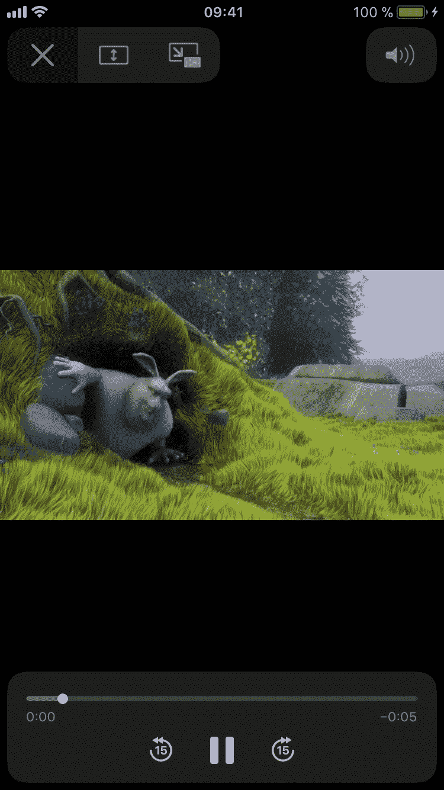
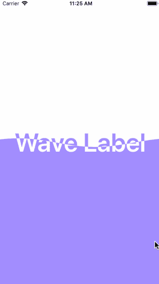
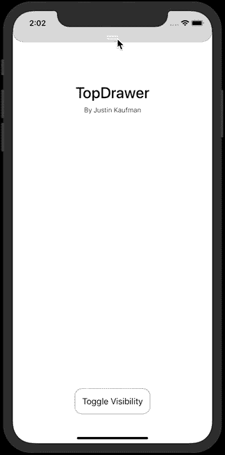
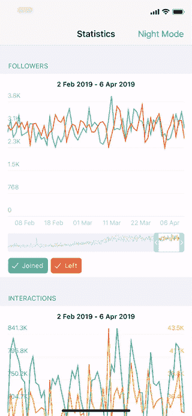
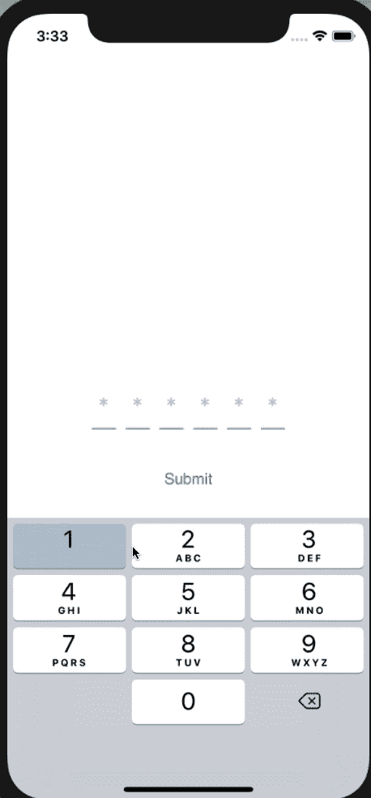
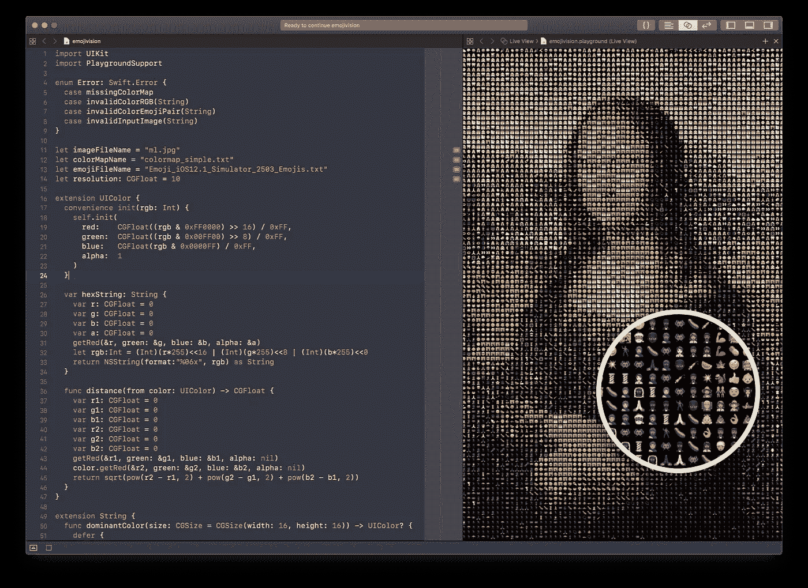

# 五个非常棒的新 iOS 库，可以在您的项目中使用

> 原文：<https://betterprogramming.pub/5-awesome-new-ios-libraries-to-use-on-your-projects-ca474e540582>

## 表情艺术、画中画、飞溅的波浪等等

威廉·艾文在 [Unsplash](https://unsplash.com/search/photos/mobile?utm_source=unsplash&utm_medium=referral&utm_content=creditCopyText) 上的照片

# 画中画

让我们从许多使用视频的不同类型的应用程序的最有用的功能之一开始。我们说的是[画中画](https://developer.apple.com/documentation/avkit/avpictureinpicturecontroller)！

[这个库](https://github.com/ky1vstar/PiPhone)只需几行代码，就能为你的应用添加一个我们已经在 YouTube、Telegram 和 WhatsApp 等著名应用上看到的功能。

 [## ky1vstar/PiPhone

### PiPhone 是一个嵌入式解决方案，支持画中画(用户启动的视频播放，可调整大小…

github.com](https://github.com/ky1vstar/PiPhone) 

# 波浪飞溅

[本库](https://github.com/anonymity-du/WaveLabelDemo)添加一个彩色波浪覆盖自定义文本并改变其颜色。

这个美丽的动画可以用于你的应用程序的启动画面或在应用程序加载过程中。

 [## 匿名-du/WaveLabelDemo

### 此时您不能执行该操作。您已使用另一个标签页或窗口登录。您已在另一个选项卡中注销，或者…

github.co](https://github.com/anonymity-du/WaveLabelDemo) 

# 社会最上层

添加一个[顶部抽屉](https://github.com/JUSTINMKAUFMAN/TopDrawer)，通过一个简单的手势就可以在屏幕上拉起或拉下！

 [## JUSTINMKAUFMAN/TopDrawer

### 可以在屏幕上拉起/拉下的顶部抽屉，用 Swift 书写。抽屉可见性可以打开/关闭…

github.com](https://github.com/JUSTINMKAUFMAN/TopDrawer) 

# 图表

简单而有用的[图表库](https://github.com/iBlacksus/BSChart)可以在许多不同的应用环境中使用。

这个强大的库完全用 Swift 编写，允许你轻松地创建图表和管理类别、颜色和视图。

 [## iBlacksus/BSChart

### BSChart 是一个在 Swift - iBlacksus/BSChart 上编写的简单而有用的图表库

github.com](https://github.com/iBlacksus/BSChart) 

# 密码视图

[这个简单的视图](https://github.com/krishnads/KPassCode)可用于密码或动态口令。可以快速定制不同的类，非常容易使用，只需添加两行代码就可以立即开始。

 [## krishnads/KPassCode

### 用于密码或 OTP 字段的简单 StackView。完全可定制的单独的类和非常容易…

github.com](https://github.com/krishnads/KPassCode) 

# 表情像素艺术

[Emojivision](https://github.com/gabrieloc/emojivision) 是一个[游乐场](https://www.apple.com/swift/playgrounds/)代码，允许你为每个像素定制一个 emoji，就像马赛克一样。

> 它是这样工作的:
> 
> 遍历图像的每几个像素(由`resolution`指定),并获取该像素的颜色
> 
> 将每种颜色的 rgb 视为 3d 向量，将该颜色的欧几里德距离与提供的调色板中的每种颜色进行比较，并获得距离最近的颜色
> 
> 从预先计算的表情符号颜色字典中获取与该颜色值相关的表情符号
> 
> 在当前像素占据的矩形中绘制表情符号，尺寸由`resolution`指定

 [## gabrieloc/emojivision

### 一个有 200 多条线的 Swift 游乐场，用于将图像渲染成表情符号。文件的顶部是几个常量…

github.com](https://github.com/gabrieloc/emojivision) 

问题或建议？下面让我知道！