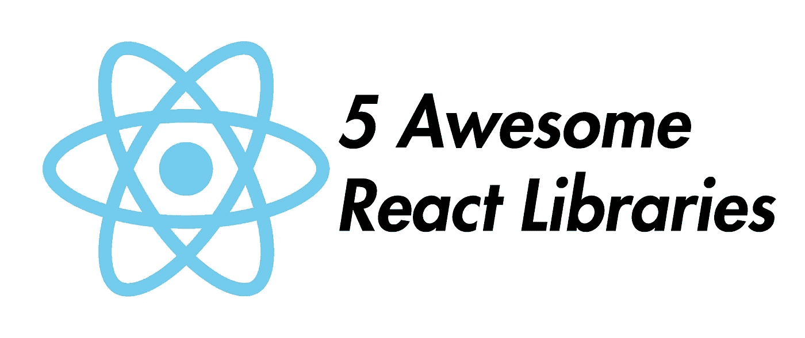

# 你应该知道的 5 个很棒的 React.js 库

> 原文：<https://betterprogramming.pub/5-awesome-react-js-libraries-you-should-know-about-ef0274fe4a56>

## react-portal、react-toastify 等等



图片鸣谢:我。

React 在过去几年变得越来越流行。随之而来的是越来越多的库的发布，给我们带来了新的可能性，但最重要的是让事情变得更容易。

在这篇文章中，我将向你展示我认为你应该知道的五个库。

感谢您的精彩反馈。我刚刚发布了第二部分:

[](https://medium.com/javascript-in-plain-english/5-awesome-react-packages-you-need-to-try-out-20a156d3d73e) [## 你需要尝试的 5 个很棒的 React 包

### 预渲染，有用的钩子，加载动画，颜色选择器&访问头部区域。由 5 位伟大的…

medium.com](https://medium.com/javascript-in-plain-english/5-awesome-react-packages-you-need-to-try-out-20a156d3d73e) 

# 1.react-门户

我认为 React 中的门户网站对大多数人来说都很熟悉，即使他们很少使用。下面是在 [React 文档](https://reactjs.org/docs/portals.html)中对它们的描述:

> “门户提供了一种一流的方式来将子组件呈现到父组件的 DOM 层次结构之外的 DOM 节点中。”

通常，我们的整个 React 应用程序只在 HTML 中的一个 DOM 节点中呈现。但是有了门户，我们可以定义额外的节点，在那里我们可以挂载应用程序的一部分，比如单独的组件。

然而，在官方文档中，门户是以一种相当麻烦和复杂的方式描述的，这就是为什么 [react-portal](https://www.npmjs.com/package/react-portal) 提供了一个解决方案。

我们是这样做的:

```
import { Portal } from ‘react-portal’<Portal node={document && document.getElementById(‘portal’)}>
  <p>This is portaled into the portal div!</p>
</Portal>
```

只需在 HTML 代码中使用典型的 JavaScript 选择器，如`getElementById`，就可以了。

在 React.js 应用程序的`public/index.html`文件中:

```
<div id=”root”></div><div id=”portal”></div>
```

如您所见，每个 React 应用程序需要的根元素照常存在，您可以用这个很酷的库创建的门户当然可以在根元素之外。

进一步提示:您可以切换您的门户，因为它最终只是一个 React 组件:

```
{this.state.show ? (
  <Portal node={document && document.getElementById(‘portal’)}>   
    <p>Portal content</p>
  </Portal>
) : null}
```

# 2.反应迟钝

在现代 web 开发中，在网站上向最终用户提供动态信息是绝对必要的。不幸的是，对于这个目的，JavaScript 中的`alert()`函数并不是一个好的选择，我认为这一点对每个人来说都是绝对清楚的。

这就是 [react-toastify](https://www.npmjs.com/package/react-toastify) 的用武之地——一个小但非常可定制的库，用于在浏览器中输出实用且好看的祝酒词。在我们深入研究代码之前，先看看这个官方演示。

下面是如何在 React 项目中使用它:

让我们一点一点来看这件事:

*   当然，我们首先导入库本身，但是之后导入所需的 CSS 也很重要。
*   然后我们可以配置我们的吐司。`autoClose`表示多长时间后吐司自动消失。
*   通过使用`toast()`函数，我们可以让 toast 出现。

## 更多酷炫功能

你可以把 JSX 放在烤面包片之内:`const notify = () => toast(<h1>Big Text</h1>)`。

`autoClose`可以替换为`false`，这样它就永远不会自动关闭。

# 3.反应-上下文菜单

很难想象真正的软件没有上下文菜单，但在网站上，这是相当不寻常的。现在不会了，因为越来越多的网络应用程序接近真正的桌面应用程序，它们通常已经提供了类似的良好性能和许多多年前你从未想到的功能。

其中一个特征是用户对右键点击的评价，这在网站上越来越多的被使用。当然，那些是有许多 UI 元素的更复杂的。

我个人几乎只从 Google Sheets 和 iCloud Keynote 上知道这个功能，在那里我不想再不用右键单击了，因为它为最终用户提供了如此多的新可能性。

主要用于显示所谓的上下文菜单，有一个非常方便的 [React.js 库](https://www.npmjs.com/package/react-contextmenu)正好用于这个目的，我现在将向您介绍它。

让我们深入研究代码:

`<ContextMenuTrigger>`将是我们需要右击来切换菜单的组件。菜单本身是在`<ContextMenu>`包装器中定义的。对于每个条目，都有一个`<MenuItem>`组件，我们可以给它一个`onClick`事件来处理我们的用户输入。

# 4.反应迟缓加载图像组件

在我们的网站上显示大量图片可能需要一段时间。通常，已经加载好的突然出现的图片会给用户带来不愉快的用户界面体验，这当然是我们想要避免的。

一个为用户优化所有关于图像的库是[react-lazy-load-image-component](https://www.npmjs.com/package/react-lazy-load-image-component)。我们不仅可以创建一个漂亮的模糊效果，就像我下面的例子一样，来桥接图像的加载，而且我们还可以延迟加载图像(也就是说，让它们只在需要的时候加载到网站上)。这可以从下面的[官方举例](https://www.albertjuhe.com/react-lazy-load-image-component/)中看出:


以下是加载图像时模糊效果的示例:

# 5.反应-点击外部

UI 设计的一个重要规则是评估尽可能多的用户认真输入的内容。每个人都应该清楚这一点，但有时很难用代码实现这样的东西。

一个可能的例子是用户折叠的菜单。
如果你想再次关闭它，90%的用户倾向于简单地点击网站的“死”区域(即点击那些自己不会做出反应的元素)。在几乎所有的专业网站上，这都是一模一样的。要关闭菜单，您只需再次点击它旁边的按钮，而不是直接点击它来切换它。

对这种意图做出反应的一个库是 [react-onclickoutside](https://www.npmjs.com/package/react-onclickoutside) ，它允许我们处理实际元素之外的点击事件。

在下面的例子中，您可以看到我们如何为一个简单的 h1 和按钮实现这一点。只有当您单击除这两个选项之外的任何选项时，才会输出 console.log。准确处理该事件的函数必须被称为`handleClickOutside`。

## [加入我的邮件接收一切，你感兴趣的](http://eepurl.com/hacY0v)