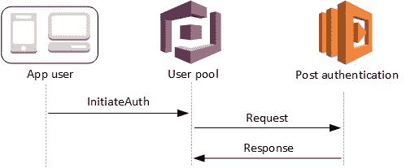
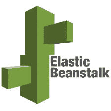
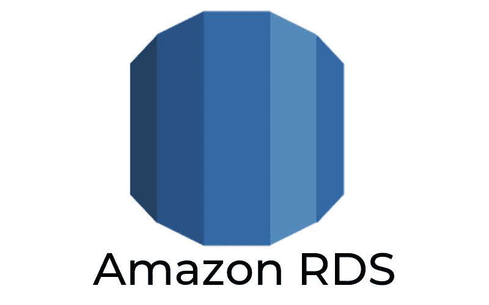
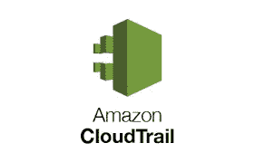

# 让您的生活更轻松的 5 项 AWS 技术

> 原文：<https://betterprogramming.pub/5-aws-technologies-thatll-make-your-life-easier-d2eee1bfc500>

## Cognito、Elastic Beanstalk、EventBridge、CloudTrail 和 RDS

由 [Unsplash](https://unsplash.com/s/photos/cloud?utm_source=unsplash&utm_medium=referral&utm_content=creditCopyText) 上的 [Pero Kalimero](https://unsplash.com/@pericakalimerica?utm_source=unsplash&utm_medium=referral&utm_content=creditCopyText) 拍摄的照片

在过去的十年中，亚马逊网络服务(AWS)简化了许多开发者的工作流程和开发。

AWS 允许工程师指挥和控制基于云的基础设施、数据和基础设施的其他技术部分，而没有从头开发整个框架的麻烦。

最初，AWS 的推出是为了照顾亚马逊的在线零售业务，但它已经成为使用最多的云服务提供商之一。

对于小型、中型和大型企业来说，与 AWS 推出的所有新服务保持同步可能是至关重要的，因为您永远不知道什么服务可能会简化您团队的开发。

在这篇文章中，我们希望涵盖过去几年中发现的一些非常有用的服务，以帮助[开发和部署解决方案。](https://www.theseattledataguy.com/data-engineering-and-automation/)

# 认知

从身份验证到授权，这项技术为您的 web 应用程序提供了完整的用户管理。Cognito 可以帮助您简化身份验证工作流程。

它甚至跟踪像用户登录这样的事情，所以你可以跟踪出于安全原因登录的用户。

亚马逊的 Cognito 服务将用户的个人资料信息收集到用户池中，web 应用程序使用这些信息来配置对 AWS 资源的访问。数据同步功能允许用户从任何设备访问信息。这些数据也可以在脱机时保存在本地。

它还可以与来自脸书和谷歌的认证和授权 API 和插件配对，进一步简化管理。

**定价:**费用基于同步存储和同步操作中的数据量。使用免费版本，公司可以保存高达 10 GB 的数据，并在 1 年内执行 100 万次操作。一旦管理员完成这一年期，Cognito 将收取 15 美分/GB 的同步存储和 15 美分/10，000 次同步操作的费用。

## 弹性豆茎

你是否曾经希望只需点击部署就可以在线查看你的网站，而无需太多的配置？使用 AWS Beanstalk 服务，您可以轻松地部署用 Java、Python、.NET，PHP。和其他几种语言，而不必花太多时间配置服务器。

Elastic Beanstalk 服务用于部署和扩展使用 Apache、Nginx 和 IIS 等服务器的应用程序。为了使用这项服务，您只需在 AWS 上上传代码，所有的部署过程——如自动伸缩、应用程序监控以及容量供应和平衡——都由 beanstalk 自动处理。

**支持的平台:** Elastic Beanstalk 为开发者提供了多种平台，包括 Docker 容器上的 NodeJS、Java、PHP、Python 和 Ruby，以及 Puma 和 Tomcat 等应用服务器。

**定价:**运行 Beanstalk 的费用取决于用于处理 web 流量的 EC2 实例的数量和应用程序消耗的带宽。使用免费版本，用户可以在 12 个月内使用一个 100 MB 的存储库。之后，公司的计划从每月 50 美元开始，提供 12 GB 存储、40 个用户、10 台服务器和 50 个存储库。个体自由职业者可以以每月 15 美元的价格访问一个包，该包提供 3 GB 的存储空间，包含 5 个用户、3 个服务器和 10 个存储库。

# 事件桥

Amazon EventBridge 充当管理层，通过使用带有规则驱动路由器的事件总线来协调不同无服务器模块之间的事件。

EventBridge 通过使用相同的服务 API 和相同的端点构建在 CloudWatchEvents 之上。该服务提供了无缝连接来自 SaaS 提供商和客户应用程序的数据的方式。

对于那些已经构建了无服务器应用程序的人来说，这个服务允许你轻松地管理你的所有不同的模块。

通过 EventBridge 提供的直接链接，用户可以体验特定服务的高可用性和更快的速度。EventBrige 的简单设置包括零编码，它不仅增强了性能，还增强了安全性。它的部署只需要开发人员一周的时间。目前，唯一的担忧是它在 SaaS 供应商中的有限采用。

**支持平台:**目前大约有 10 家 SaaS 合作伙伴支持 EventBridge。其中包括:赛门铁克、ZENData、SugarCRM、OneLogin、Segment、Saviynt、SignalFx 和 Whispir

**定价计划:**亚马逊 EventBridge 尚未在线提供该服务的定价信息。

# 无线电数据系统

使用 Amazon RDS 服务，您可以在几分钟内为您的数据库生成专用实例。这些实例由 AWS 的支持团队提供支持，该团队也能够支持多种不同的数据库引擎，如 SQL Server、PostgreSQL 和 MySQL。

这消除了每次需要启动新实例时都需要购买新服务器的麻烦。需要测试或开发实例吗？完成了。

关系数据库服务(RDS)允许用户创建和操作可通过任何 AWS 管理控制台管理的关系数据库。此外，使用 RDS 允许您从任何地方以非常经济高效和高度可伸缩的方式访问数据库和文件。RDS 为主实例提供了高可用性—主实例与辅助实例同步，因此您可以故障转移到发生问题的确切位置。

**支持平台:**亚马逊 RDS 目前支持 MariaDB、Oracle、MySQL、PostgreSQL、微软 SQL server。每个数据库引擎都有自己的支持功能。

**定价:**免费层有效期为 12 个月，在此期间，您可以获得 5 GB 的存储空间、750 RDS 小时和 25 GB 的 DynamoDB。之后，根据您选择的服务和存储进行定价。

# 云迹

亚马逊的 CloudTrail 服务使企业能够对其 AWS 帐户进行运营审计、风险审计、合规性和治理。

通过这项服务，您可以监控和保留整个 AWS 基础架构中的帐户活动。整体服务简化了故障排除、安全分析和资源跟踪。

通过多区域配置特性，您可以使用单个亚马逊 S3 存储桶将日志文件交付到多个区域，这将在所有区域一致地应用配置。

一旦启用，CloudTrail 服务就会一直运行，因为它会在创建时记录帐户活动。您可以查看/下载最近 90 天的文件并修改操作，而不必手动设置 Amazon CloudTrail 服务。

**支持平台:** CloudTrail 支持几乎所有 AWS 服务的日志事件，包括 Alexa、Amazon API Gateway、App Mesh、Amazon Athena、AppStream 2.0 和 Cloud9。

**定价:**cloud trail 服务免费 90 天——你可以查看、下载、过滤这段时间的账户活动。之后，您可以获得 2/100，000 美元事件的管理事件，记录 0.10/100，000 美元事件的数据事件，并获得 0.35/100，000 美元事件分析的见解。

# **最终想法**

AWS 还提供更多的服务，但本文的主要目的是强调亚马逊向云用户提供的一些众所周知和鲜为人知的服务。

目前，如果有一些多余的任务开发者需要不断地重复做，这是一个麻烦，AWS 可能有一个服务。