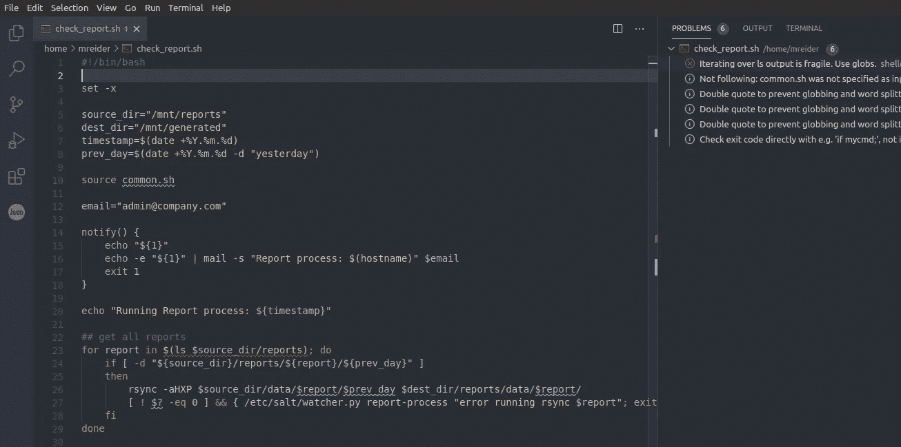
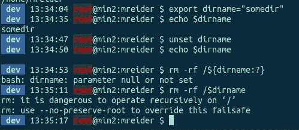

# Bash 脚本的 5 个强大技巧

> 原文：<https://betterprogramming.pub/5-bash-scripting-power-tips-bfd919b619c1>

## Bash 脚本是一种艺术形式



使用 Shellcheck VS 代码扩展的 Bash 脚本

编写 bash 脚本需要多层次的掌握，我仍在学习新的语法和技巧。我总是很惊讶你能和巴什一起深入兔子洞。

在本文中，我想分享五个技巧，它们使 bash 检查更加强大，并使您的 bash 脚本更易于阅读和防错。

# 1.防止变量出错

假设您想基于一个变量做一些事情—可能删除一个名为`somedir`的文件夹，您用:

```
export somedir="/home/user/somedir"
```

但是你也要确保你的脚本退出以防这个`$somedir`被复位或者`null`，例如，如果你正在做:

```
rm -rf /$somedir
```

如果你以 root 用户身份运行并且`$somedir`未设置(并且你有一个没有故障保护的旧内核)，你就麻烦了，因为这将清除`root “/”`。

对变量始终使用以下语法:

```
rm -rf /${somedir:?}
```

`:?`检查变量是否存在并被设置。否则，它将退出脚本。

这是一个在虚拟机上完成的演示:



运行时:

```
rm -rf /${dirname:?}
```

bash 脚本知道退出，因为变量未设置。

当运行它而没有这样做时，您仍然会被内核故障保护所拯救。但是对于更老的内核(比 3.10 更老)，你不会有这个选项。

# 2.跳过冗长的 if-else 语句

假设您运行一些命令。例如，我想将某个文件`rsync`到另一个主机，但也想让我的脚本在出现错误时退出，而不是继续执行脚本的下一部分。

通常，我会这样做:

`if-else`有 5 行长，读起来会很头疼——尤其是如果你有很多检查要做的话。

相反，使用这个一行程序:

```
[ ! $? -eq 0 ] && { echo "error with rsync"; exit 1; } 
```

`{}`括号基本上是由`;`分隔的`then`语句。

这个一行程序更容易阅读，占用的代码空间更少。

您还可以在一行代码中链接多个条件:

```
[[ -z "${v1}" && -z "${v2}" ]] && { echo "need v1 and v2"; exit 1; }
```

# 3.不要依赖于经过的论证

有时候你想让用户给你的脚本传递参数。例如:

```
#!/bin/bash
name=$1
age=$2echo "your name is $name and you are $age years old"
```

但这并不能保证你的论点会被正确解读。用户可以混淆这些值，也可以什么都不提供。

您想要的是类似 Python 中的`argparse`的东西——也可以检查输入是否正确的键值参数。

为此，复制这个函数，在脚本中找到它，并调整您的参数:

假设你的主脚本叫做`main.sh`。

```
#!/bin/bash
## reads in name and age, has boolean flag "--reset" which changes age to be 1
```

将上面链接中的脚本保存为`functions.sh`。

更新`main.sh`以获取该脚本，并使用`get_params “${@}”`初始化所有变量:

```
#!/bin/bash
## reads in name and age, has boolean flag "--reset" which changes age to be 1source functions.shget_params "${@}"
```

这将为您提供所有作为变量传递的参数。例如:

```
NAME="joe"
AGE="25"
RESET="true"
```

无论用户如何输入值，该函数都将为您提供正确的值:

```
./main.sh --name joe --reset --age 25
./main.sh --age 25 --name joe --reset
```

这些都将返回正确的参数值。

# 4.轻松检查您的位置参数

如果您想通过 position(即`$1`、`$2`)直接获取脚本参数，而不使用额外的函数，一个简单的方法就是通过这个一行程序:

```
name=${1:?"Error: parameter missing Name"}
age=${2:?"Error: parameter missing Age"}
```

如果缺少一个参数，这将导致 param 消息出错:

```
./main joe
Error: parameter missing Age
```

# 5.为变量创建默认值

有时变量可以不设置或设置为`null`。

如果您想为变量添加默认值，这是一个简单的一行程序:

```
echo "enter your name"read namename=${name:-Unknown}
```

如果用户输入空白，您的`$name`将被设置为`Unknown`。冒号后的破折号提供默认的回退值。