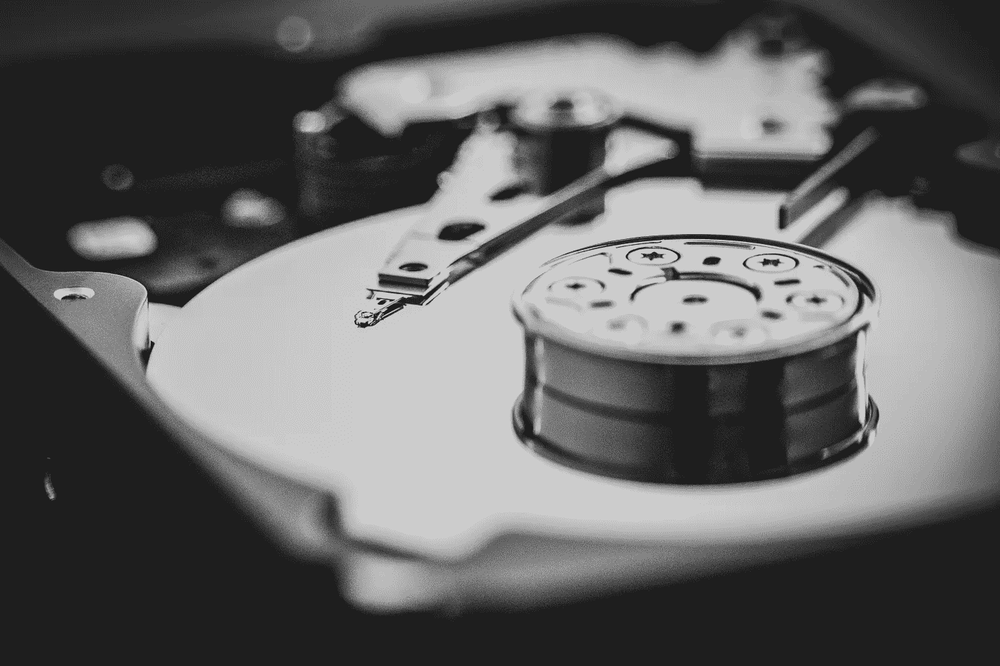

# 您应该知道的 5 个基本 Linux 磁盘管理命令

> 原文：<https://betterprogramming.pub/5-basic-linux-disk-management-commands-you-should-know-ee47c49ce6e6>

## 轻松地在 Linux 生态系统中移动您的珍贵文件



照片由[丹尼·米勒](https://unsplash.com/@redaquamedia?utm_source=unsplash&utm_medium=referral&utm_content=creditCopyText)在 [Unsplash](https://unsplash.com/s/photos/hard-drive?utm_source=unsplash&utm_medium=referral&utm_content=creditCopyText) 拍摄

如果您不熟悉命令行，在 Linux 中管理文件、可移动介质和磁盘驱动器可能是一项艰巨的任务。如果您习惯于在 GUI 中工作，那么在 CLI 中处理数据存储可能会有点可怕。

只需几个简单的命令，您就可以迅速揭开不确定性的面纱，成为在 Linux 中处理数据的专家。在这篇文章中，我们将探索一些基本的东西，如安装驱动器，复制数据，擦除磁盘和目录。

我们来看看吧！

*注意:其中一些命令可能需要 root 权限，因此您可能需要使用* `*sudo*` *来运行它们。*

# 1.安装可移动驱动器

关于 Linux，你可能注意到的第一件事是，当你插入一个可移动驱动器时，它不会自动出现在任何地方。这是因为(除非你使用的是桌面发行版)你必须自己安装驱动器，并告诉操作系统把文件放在哪里。

这其实并没有那么难，用两个简单的命令就可以解决。首先，插入驱动器后，您需要弄清楚设备标签是什么。您可以通过运行以下命令来实现:

```
fdisk -l
```

您应该会看到类似如下的输出:

```
Disk /dev/sda: 50 GiB, 53687091200 bytes, 104857600 sectors
Units: sectors of 1 * 512 = 512 bytes
Sector size (logical/physical): 512 bytes / 512 bytes
I/O size (minimum/optimal): 512 bytes / 512 bytes
Disklabel type: gptDevice       Start       End   Sectors  Size Type
/dev/sda1  262144 104857566 104595423 49.9G Linux filesystem
/dev/sda14   2048      8191      6144    3M BIOS boot
/dev/sda15   8192    262143    253952  124M EFI SystemPartition table entries are not in disk order.Disk /dev/sdb: 200 GiB, 214748364800 bytes, 419430400 sectors
Units: sectors of 1 * 512 = 512 bytes
Sector size (logical/physical): 512 bytes / 512 bytes
I/O size (minimum/optimal): 512 bytes / 512 bytes
```

在上面的输出中，您可以看到两个不同大小的不同磁盘。每个磁盘都有一个标签，如:`/dev/sda`或`/dev/sdb`。

在机器的输出中，您应该找到与您的可移动驱动器相对应的磁盘标签。确保大小匹配，并且设备上存在预期的分区。

当您准备好挂载磁盘时，执行以下命令，将下面的磁盘标签替换为您自己的标签。第一个命令将创建一个空目录来装载，第二个命令将驱动器装载到该目录中:

```
mkdir -p /media/usb/my_drive
mount /dev/<label> /media/usb/my_drive
```

现在，您应该能够浏览到`/media/usb/my_drive`目录并查看新安装的文件。

使用完驱动器后，只需发出以下命令卸载它:

```
umount /dev/<label>
```

# 2.格式化新驱动器

如果你想安装一个全新的驱动器，那么你可能需要格式化它。这确保了 Linux 和其他操作系统可以读取和使用磁盘。如果您要向系统添加新的固定磁盘，这一点尤其重要。

使用我们之前学习的方法，运行以下命令来查找新的磁盘标签:

```
fdisk -l
```

找到新添加的驱动器后，让我们使用相同的实用程序对其进行格式化:

```
fdisk /dev/<label>
```

这将启动一个提示驱动版本的`fdisk`,它将询问你一些关于你希望如何格式化驱动器的基本问题。

*确保您选择了正确的磁盘，并且首先备份了磁盘上的所有现有数据！*

如果您正在重用现有的驱动器，那么您需要先擦除它。使用以下命令查看、删除然后写入分区表:

*   " p "显示已有的分区表
*   “d”通过标签删除分区
*   “w”将更改写入分区表

在大多数情况下，如果您只想格式化一个空磁盘以用于当前的 Linux 系统，那么您可以在提示中回答以下参数:

*   “n”创建新分区
*   “p”创建主分区(在“n”之后)
*   “1”表示使用分区号 1
*   “p”在写入前检查分区表
*   “w”写分区表

一旦你将新的分区表写到磁盘上，你就准备好放置文件系统了。

虽然您已经创建了一个新的分区，但是您仍然需要告诉操作系统如何使用它，以及数据将以什么格式存储。

我们再次假设这个驱动器将主要由 Linux 系统使用，并使用`ext4`文件系统对其进行格式化。下面的命令将为您处理这个问题:

```
mkfs.ext4 /dev/<label>
```

一旦完成，您现在应该有一个新格式化的驱动器，可以立即用于 Linux。如果您在此过程中遇到任何障碍，请务必参考`fdisk`的[手册页](https://linux.die.net/man/8/fdisk)。

# 3.使用 dd 复制驱动器

`dd`实用程序是 Unix 程序的绝对经典。这种恐龙已经存在[超过 47 年了](https://en.wikipedia.org/wiki/Dd_%28Unix%29)，但是在复制文件甚至原始数据块方面有多种用途。由于其出色的灵活性和特性集，它至今仍被经常使用。

克隆磁盘驱动器的最简单方法之一是使用 dd。你只需把两个驱动器都插上，然后把`dd`对准它们，就可以开始比赛了。

让我们来看一个简单的例子，看看如何将一个 USB 驱动器克隆到另一个大小相同或更大的驱动器:

```
dd if=/dev/<source_label> of=/dev/<dest_label> status=progress
```

通过这个简单的命令，我们将源驱动器克隆到目标驱动器。`if`参数接受我们的来源，而`of`参数接受我们的目的地。

我们还指定我们想要一个进度指示器(默认情况下不会发生)。

如果您只想克隆固定数量的源驱动器，可以指定`bs`和`count`参数。块大小(`bs`)允许您告诉`dd`每个块要复制多大(以字节为单位),而`count`参数概述了应该克隆多少块。使用这种方法，您可以告诉`dd`只复制一定量的源卷。

如果您想要拷贝到更大的目标，但只需要来自源的 8GB 数据，下面是一个示例:

```
dd if=/dev/<source_label> of=/dev/<dest_label> status=progress bs=10M count=800
```

现在，您已经将 8GB 的块级数据直接克隆到了目标驱动器上。这对于克隆可引导介质特别有用，因为您需要保留分区表和现有数据才能正确引导。

# 4.用 rsync 镜像目录

假设您插上了驱动器，装载了数据，现在您想要同步到本地目录。这是一个非常常见的任务，使用`rsync`实用程序可以很容易地解决。

这个`rsync`工具最初被开发用于[通过网络](https://en.wikipedia.org/wiki/Rsync)同步文件，但是也可以很好地保持本地文件同步。

为了在两个目录之间镜像，您可以执行下面的`rsync`命令:

```
rsync -a --delete <src>/ <dest>
```

这个命令的魔力来自于`-a`和`--delete`标志:

*   `-a`标志告诉`rsync`您想要使用“存档”模式。这将保留权限、修改时间等内容。使用此标志时，您可以确保同步的文件保持其原始属性。
*   `--delete`标志告诉`rsync`删除目标目录中的任何无关文件。这将确保如果您删除源目录中的文件，它也会从目标目录中删除。

*只要确保你没有将目标目录用于任何其他不在源文件中的文件存储！*

还要注意源目录上的结尾`/`和目标目录上的结尾`/`。这将告诉`rsync`将源目录中的所有内容(*而不是目录本身*)镜像到目标目录中。如果你省略了结尾的`/`，那么`rsync`将会把所有的东西*包括*包含的目录镜像到目标的内部。

# 5.用查找快速擦除目录

有时你有很多数据，有时你想让它们消失，有时你想让它们快速发生。试图使用`rm`来擦除万亿字节的数据，尤其是如果有很多小文件，可能要花很长时间。

这就是为什么如果你有一个巨大的数据目录，你应该使用不同的东西。有很多有趣的方法可以清除目录，但是我发现最简单和最快的方法是使用`find`实用程序:

```
find <directory_path> -type f -delete
```

我们不用执行`rm`来删除我们所有的文件，而是使用`find`实用程序来“找到”我们目录中的所有文件，并对它们执行`delete`。这对于处理大量文件来说要快得多，并且会让你免去一两个小时坐在那里看着挂起的`rm`提示符的头痛。

查看这篇 [Slashroot.in](https://www.slashroot.in/which-is-the-fastest-method-to-delete-files-in-linux) 文章，了解更多细节和一些额外的快速清理 Linux 中文件的方法。

感谢阅读！我希望您喜欢学习这些简单的 Linux 命令。想要更多的 Linux 优点吗？检查:

[](/5-linux-utilities-that-will-make-you-smile-b582684b3090) [## 5 个让你会心一笑的 Linux 工具

### 有趣的小宝石添加到您的曲目

better 编程. pub](/5-linux-utilities-that-will-make-you-smile-b582684b3090)