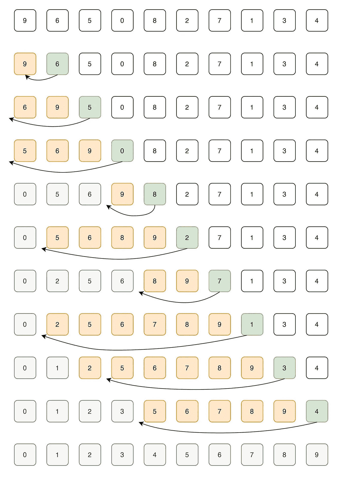
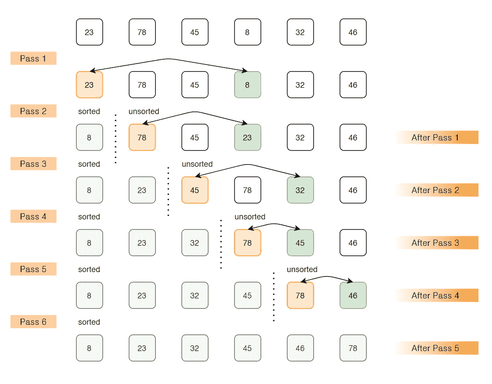
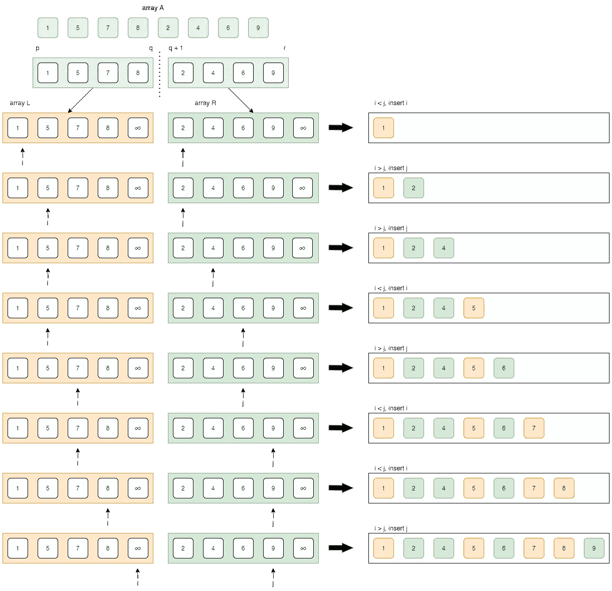
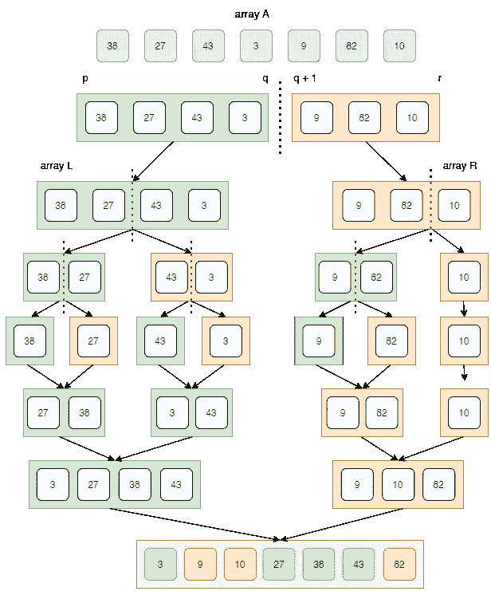
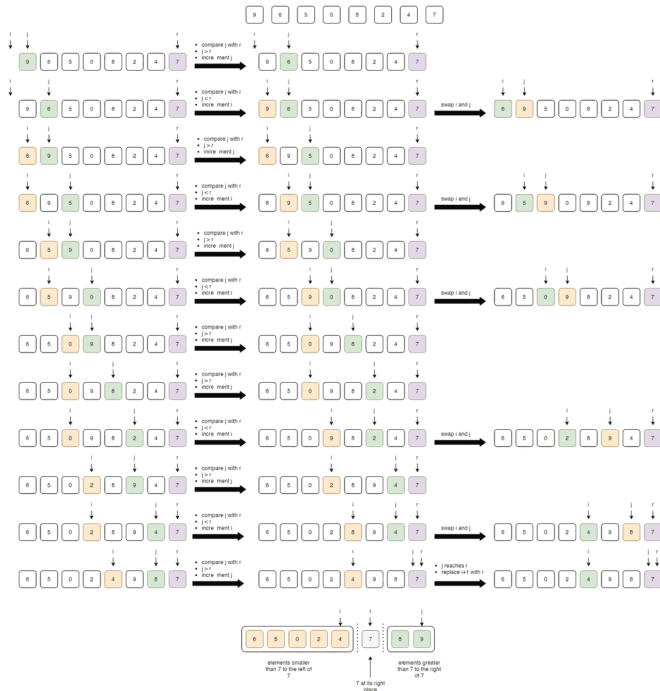
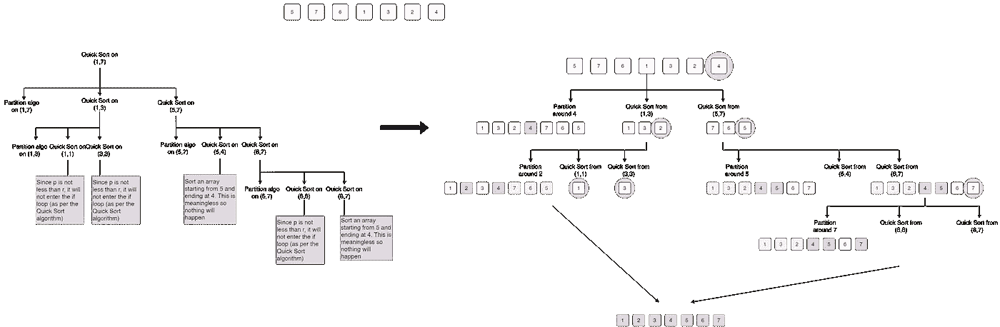

# 每个程序员都应该知道的 5 种排序算法

> 原文：<https://betterprogramming.pub/5-basic-sorting-algorithms-you-must-know-9ef5b1f3949c>

## 插入、选择、冒泡、合并和快速排序


罗伯特·尼克森在 [Unsplash](https://unsplash.com?utm_source=medium&utm_medium=referral) 上的照片

有没有想过，当你应用从低到高、从高到低或按字母顺序的过滤器时，亚马逊或任何其他电子商务网站上的产品是如何排序的？排序算法在这类网站中起着至关重要的作用，在这些网站中，你有大量的产品上市，你必须使客户互动变得容易。

排序算法用于根据元素上的比较运算符重新排列给定的元素数组或列表。比较运算符用于决定各个数据结构中元素的新顺序。主要有五种基本算法，你可以用这些基本算法推导出多种算法。这些算法各有利弊，可以根据要处理的数据大小进行有效选择。

1.  插入排序
2.  选择排序
3.  冒泡排序
4.  合并排序
5.  快速排序

*获取完整的数据结构和算法 cheatsheet，叉本*[*GitHub*](https://github.com/adwiteeya3/dsa-cheatsheet)*repo。*

# 1.插入排序

插入排序是一种简单的排序算法，其工作方式类似于您对手中扑克牌的排序。该阵列实际上被分成排序的和未排序的部分。未排序部分的值被拾取并放置在排序部分的正确位置。当问题规模很小时(因为它的开销很低)，或者当数据接近排序时(因为它是自适应的)，插入排序是快速且最适合的。

```
**Example:** 
elements: 9, 6, 5, 0, 8, 2, 7, 1, 3, 4
i       : 0, 1, 2, 3, 4, 5, 6, 7, 8, 9
Let us loop for i = 1 (second element of the array) to 9 (last element of the array)*i=1*. Since 6 is smaller than 9, move 9 and insert 6 before 9
**6*,* 9,** 5, 0, 8, 2, 7, 1, 3, 4*i=2*. Since 5 is smaller than 6 and 9, move 5 before 6 and 9
**5, 6, 9,** 0, 8, 2, 7, 1, 3, 4*i=3*. Since 0 is smaller than 5,6 and 9, move 0 before 5,6,9
**0, 5, 6, 9,** 8, 2, 7, 1, 3, 4*i=4*. Since 8 is smaller than 9, move 8 before 9
**0, 5, 6, 8, 9,** 2, 7, 1, 3, 4*i=5*. Since 2 is smaller than 5,6,8 and 9, move 2 before 5,6,8,9
**0, 2, 5, 6, 8, 9,** 7, 1, 3, 4*i=6*. **0, 2, 5, 6, 7, 8, 9,** 1, 3, 4
*i=7*. **0, 1, 2, 5, 6, 7, 8, 9, 3, 4** *i=8*. **0, 1, 2, 3, 5, 6, 7, 8, 9, 4** *i=9*. **0, 1, 2, 3, 4, 5, 6, 7, 8, 9**
```



插入排序

```
**Algorithm:**Insertion-Sort(A)
{
 for j=i to A.length
     key = A[i];
     // insert A[i] into sorted sequence A[1,2,3,..,i-1]
     j= i-1;
     while (j>0 and A[j]>key)
         A[j+1] = A[j]
         j= j-1
     A[j+1] = key
}
```

# 2.选择排序

选择排序算法通过从未排序的部分中重复查找最小元素(考虑升序)并将其放在开头来对数组进行排序。该算法在给定的阵列中保持两个子阵列:

*   已经排序的子数组
*   未排序的剩余子数组

在选择排序的每次迭代/传递中，从未排序的子数组中选取最小元素(考虑升序)并将其移动到排序的子数组中。选择排序具有最小化交换次数的特性。所以在对换成本较高的情况下是最佳选择。

```
**Example:** arr[]= 23 78 45 8 32 46***Pass 1***
// Find the minimum element in arr[0...5] and place it at beginning
8 78 45 23 32 46***Pass 2***
// Find the minimum element in arr[1...5] and place it at beginning of arr[1...5]
8 23 45 78 32 46***Pass 3***
// Find the minimum element in arr[2...5] and place it at beginning of arr[2...5]
8 23 32 78 45 46***Pass 4***
// Find the minimum element in arr[3...5] and place it at beginning of arr[3...5]
8 23 32 45 78 46***Pass 5***
// Find the minimum element in arr[4...5] and place it at beginning of arr[4...5]
8 23 32 45 46 78
```



选择排序

```
**Algorithm:**void SelectionSort (int a[], int n)
{
 int i,j, temp, min;
 for (i=0; i<n-1; i++)
 {
    min = i;
    for (j=i+1; j<n; j++)
      if (a[j] < a[min])
      {
        min = j;
      }
    temp = a[i];
    a[i] = a[min];
    a[min] = temp;
 }
}
```

# 3.冒泡排序

冒泡排序是一种排序算法，如果相邻元素的顺序不对，它会重复交换相邻元素。在每次迭代或传递之后，最大的元素到达末尾(在升序的情况下)，或者最小的元素到达末尾(在降序的情况下)。重复遍历列表，直到列表被排序。该算法不适合大数据集，因为它的平均和最坏情况复杂度是ο(n^2，其中 *n* 是项目的数量

```
**Example:**
64 34 25 12 22 11 90***Iteration 1:***
(**64 34** 25 12 22 11 90) -> (**34 64** 25 12 22 11 90), Here, algorithm compares the first two elements, and swaps since 64 > 34.
(34 **64 25** 12 22 11 90) -> (34 **25 64** 12 22 11 90), Swap since 64 > 25
(34 25 **64 12** 22 11 90) -> (34 25 **12 64** 22 11 90), Swap since 64 > 12
(34 25 12 **64 22** 11 90) -> (34 25 12 **22 64** 11 90), Swap since 64 > 22
(34 25 12 22 **64 11** 90) -> (34 25 12 22 **11 64** 90), Swap since 64 > 11
(34 25 12 22 11 **64 90**) -> (34 25 12 22 11 **64 90**), Now, since these elements are already in order (90 > 64), algorithm does not swap them.***Iteration 2:***
(**34 25** 12 22 11 64 90) -> (**25 34** 12 22 11 64 90), Swap since 34 > 25
(25 **34 12** 22 11 64 90) -> (25 **12 34** 22 11 64 90), Swap since 34 > 12
(25 12 **34 22** 11 64 90) -> (25 12 **22 34** 11 64 90), Swap since 34 > 22
(25 12 22 **34 11** 64 90) -> (25 12 22 **11 34** 64 90), Swap since 34 > 11
(25 12 22 11 **34 64** 90) -> (25 12 22 11 **34 64** 90), Now, since these elements are already in order (64 > 34), algorithm does not swap them.***Iteration 3:*** (**25 12** 22 11 34 64 90) -> (**12 25** 22 11 34 64 90), Swap since 25 > 12
(12 **25 22** 11 34 64 90) -> (12 **22 25** 11 34 64 90), Swap since 25 > 22
(12 22 **25 11** 34 64 90) -> (12 22 **11 25** 34 64 90), Swap since 25 > 11
(12 22 11 **25 34** 64 90) -> (12 22 11 **25 34** 64 90), Now, since these elements are already in order (34 > 25), algorithm does not swap them.***Iteration 4:*** (**12 22** 11 25 34 64 90) -> (**12 22** 11 25 34 64 90)
(12 **22 11** 25 34 64 90) -> (12 **11 22** 25 34 64 90), Swap since 22 > 11
(12 11 **22 25** 34 64 90) -> (12 11 **22 25** 34 64 90)***Iteration 5:*** (**12 11** 22 25 34 64 90) -> (**11 12** 22 25 34 64 90), Swap since 12 > 11
(11 **12 22** 25 34 64 90) -> (11 **12 22** 25 34 64 90)***Iteration 6:*** (**11 12** 22 25 34 64 90) -> (**11 12** 22 25 34 64 90)Now, the array is already sorted, but our algorithm does not know if it is completed. The algorithm needs one **whole** pass without **any** swap to know it is sorted.
***Iteration 7:***
(**11 12** 22 25 34 64 90) -> (**11 12** 22 25 34 64 90)
(11 **12 22** 25 34 64 90) -> (11 **12 22** 25 34 64 90)
(11 12 **22 25** 34 64 90) -> (11 12 **22 25** 34 64 90)
(11 12 22 **25 34** 64 90) -> (11 12 22 **25 34** 64 90)
(11 12 22 25 **34 64** 90) -> (11 12 22 25 **34 64** 90)
(11 12 22 25 34 **64 90**) -> (11 12 22 25 34 **64 90**)
```


冒泡排序

```
**Algorithm:**Bubble_Sort(int a[], n) 
{
 int swapped, i, j;
 for (i=0; i<n; i++)
 {
   swapped = 0;
   for (j=0; j<n-i-1; j++)
   {
     if (a[j] > a[j+1])
     {
       swap (a[j], a[j+1]);
       swapped = 1;
     }
   }
   if (swapped == 0)
     break;
 }
}
```

# 4.合并排序

与上述三种排序算法不同，该算法基于分治技术。它将输入数组分成两半，为这两半调用自身，然后合并排序后的两半。合并排序的核心是`merge()` 函数，用于合并两半。merge(A，p，q，r)是一个关键过程，它假设 A[p..q]和 A[q+1..r]被排序并将两个排序的子数组合并成一个。

当你需要一个稳定的 O(N log N)排序时，合并排序是唯一的选择。

## merge()函数

合并过程也称为错位过程



merge()函数

```
**Algorithm:**merge(A, p, q, r)
{
  n1= q-p+1
  n2= r-q
  Let L[1:n+1] and R[1:n2+1] be new arrays
  for (i=1:n1)
    L[i]= A[p+i-1]
  for (j=1:n2)
    R[j]= A[q+j]
  L[n1 + 1]= infinity
  R[n2 + 1]= infinity
  i=1, j=1
  for (k=p:r)
  {
    if (L[i] <= R[j])
      A[k] = L[i]
      i= i+1
    else
      A[k] = R[j]
      j= j+1
  }
} 
```

## 合并排序:

整个合并排序的工作方式如下:



合并排序

```
**Algorithm:**Merge_Sort(A, p ,r)
{
  if p<r
    q= [(p+r)/2]
    Merge_Sort(A, p ,q)
    Merge_Sort(A, q+1, r)
    merge(A, p, q, r)
}
```

# 5.快速排序

快速排序也是一种分治算法。它选取一个元素作为轴心，并围绕所选取的轴心对给定的数组进行分区，使得所有较小的元素都位于轴心的左侧，而所有较大的元素都位于轴心的右侧。有许多不同版本的 quickSort 以不同的方式选择 pivot:

*   总是选择第一个元素作为轴心。
*   总是选择最后一个元素作为轴心(在下面实现)。
*   选择一个随机元素作为轴心。
*   选择中间值作为支点。

快速排序的关键过程是`partition()`方法。分区的目标是，给定一个数组和数组中的一个元素 r 作为支点，将 *r* 放在一个排序数组中的正确位置，并将所有较小的元素(小于 *r* )放在 *r* 之前，将所有较大的元素(大于 *r* )放在 *r* 之后。所有这些都应该在线性时间内完成。

对于小输入，与合并排序相比，快速排序是最好的算法。当你不需要一个稳定的排序，并且一般情况下的性能比最差情况下的性能更重要时，就选择快速排序。先来看划分算法及其实现。

## partition()算法

我们从最右边的元素开始，跟踪更小(或等于)元素的索引，记为 *r* 。

*   如果我们发现一个元素 *j* 小于 *r* ，那么我们增加 *i* 指针并交换 I 和 j 的元素
*   如果我们发现一个元素 *j* 大于 *r* ，那么我们简单地增加 *j* 指针。



快速排序

```
**Algorithm:**partition(A, p, r)
{
 x= A[r]
  i= p-1
  for (j= p:r-1)
  {
   if (A[j] <= x)
    {
     i= i+1
     exchange A[i] with A[j]
    }
  } 
  exchange A[i+1] with A[r]
  return i+1  
}
```

## 快速分类

整个快速排序的工作方式如下:

*   它检查条件*p*r。如果为真，则进入 If 循环，否则退出循环
*   然后，应用划分算法，以便选择枢轴元素并将其放在正确的位置。
*   在分区算法之后，整个数组被分成两半，这样，所有比 pivot 元素小的元素都在它的左边，所有比 pivot 元素大的元素都在它的右边。
*   快速排序应用于两半。
*   整个循环继续将数组分成两部分，直到我们找到一个元素，使得 *p* > *r* 。

```
**Algorithm:**Quick_Sort(A, p ,r)
{
  if (p<r)
  {
    q= partition(A, p, r)
    Quick_Sort(A, p, q-1)
    Quick_Sort(A, q+1, r)
  }
}
```



快速排序