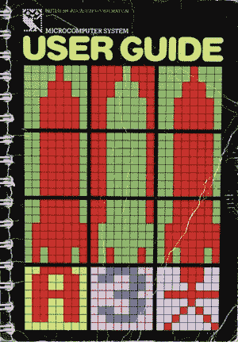
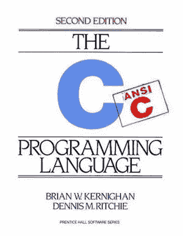
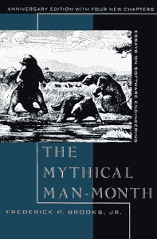
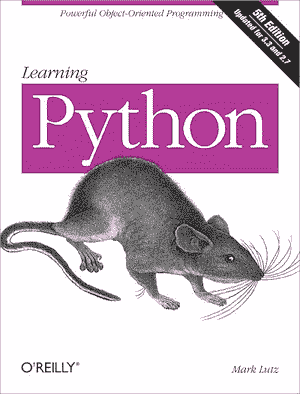
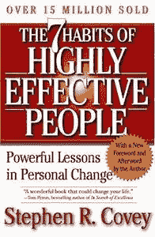

# 改变我编码方式的 5 本书

> 原文：<https://betterprogramming.pub/5-books-that-changed-the-way-i-code-73caffec6f0b>

## 这些不一定是关于编程的书。相反，这些书影响了我的编程实践

在 [Unsplash](https://unsplash.com/) 上由[伊尼基·德尔·奥尔莫](https://unsplash.com/photos/NIJuEQw0RKg)拍摄的照片

在这篇文章中，我将分享一些对我的编码方式产生切实影响的书籍。

# 1.英国广播公司微型用户指南

这可能是有史以来最令人兴奋的计算机书籍！早在 80 年代，我还是个孩子时就开始编程了。就我记忆所及，这本指南是作为 BBC 型微型计算机的一种手册来的。[BBC 用户指南](http://bbc.nvg.org/doc/BBCUserGuide-1.00.pdf)“真的为我打开了一个全新的世界，并为我以后的生活设定了计算潜力的参数。

状态:*游戏规则改变者*。

# 2.C 编程语言

这本书密不可分。这是一本我推荐任何用任何语言编写计算机程序的人至少读一遍的书。如果你打算学习 C 语言，我建议你读两到三遍，做所有的练习。这种风格现在已经非常过时了，即使以 C 的标准来看也是如此，但是我想不出比这更好的语言介绍了。对我来说，它打开了编写自己的音频软件的可能性。

地位:*圣经*。

# 3.神话中的人月

这不是一本关于编程的书，而是一本关于软件开发——特别是软件项目管理的书。如果你在从事任何大型项目，基本的项目管理意识是必不可少的。这本书通过使我成为一个更好的整体开发人员，使我能够计划和做出更好的决策，改变了我的编码方式。

地位:*永恒的经典*。

# 4.学习 Python

我通过在两次长途飞行中阅读这本书(第三版)学习 Python，没有参考笔记本电脑——是*写得好。除了对 C 有一个基本的了解，对 Python 的掌握也是你锦囊妙计中的一个有用工具。C 是低级编程的首选语言，Python 非常适合编写快速脚本，它正迅速成为事实上的机器学习语言。在写这篇文章的时候，《学习 Python》在亚马逊的畅销书排行榜上排名第四。*

状态:*瑞士军刀*。

# 5.高效人士的 7 个习惯

像《人月神话》一样，这不是一本关于编程的书。然而，阅读它从根本上改变了我对待生活中几乎所有事情的方式，包括编程。我不怎么看自我提升的书，但我发现这本书改变了我的生活。它提供了关于如何思考计划、社会互动以及设定和实现目标的实用和节奏良好的课程。最好是长时间阅读和消化。我在阅读他们的前六个习惯和第七个“磨利锯子”之间留了一年时间，因为我需要时间来准备。

状态:*生活教练*。

我想如果这些书有什么共同点的话，那就是它们不提供快速解决方案或快速修复。我从事编码工作已经超过 30 年了，但我仍然认为自己是一个相对的初学者。技术发展如此之快，以至于我们无法保持领先，但如果我们建立了一套强大的个人价值观，对核心原则的理解，并保持我们的工具锋利，我们至少给自己一个实现目标的机会。