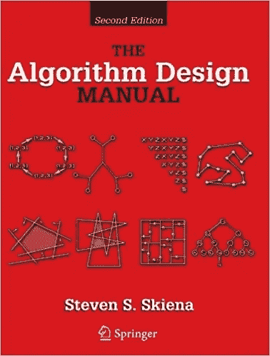
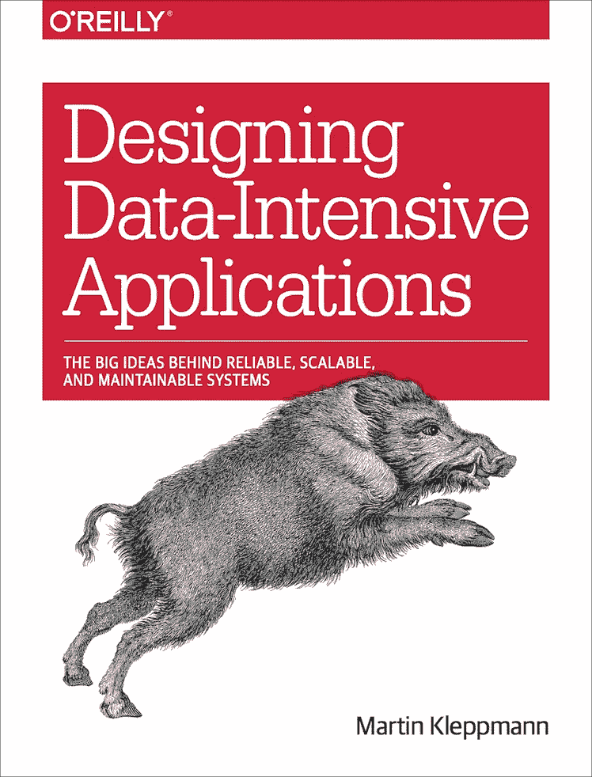
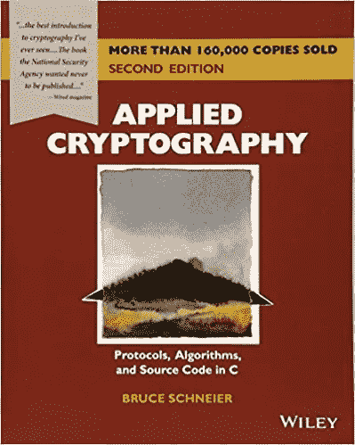
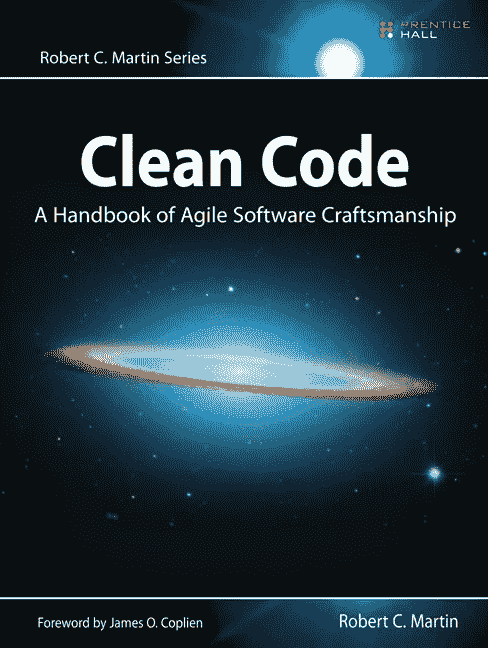
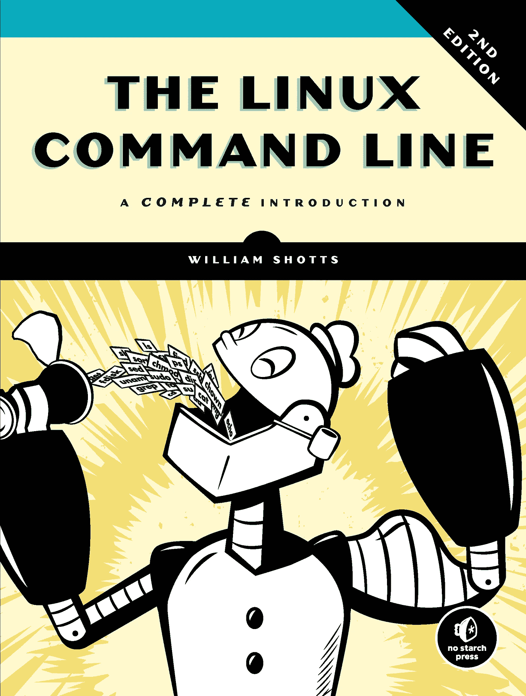

# 你可以阅读 5 本书来提高你的计算机科学知识

> 原文：<https://betterprogramming.pub/5-books-you-can-read-to-boost-your-computer-science-knowledge-during-self-quarantine-5f2172f321fc>

## 利用你的休息时间，读一些好的东西

戴维·伊斯坎德尔在 [Unsplash](https://unsplash.com/s/photos/reading?utm_source=unsplash&utm_medium=referral&utm_content=creditCopyText) 上拍摄的照片

我希望你好好照顾自己的健康，保持社交距离，以帮助拉平新型冠状病毒感染的曲线。

在这段艰难的日子里，我们别无选择，只能呆在家里，但我们可以把这段时间投资在自己身上，以便更好地走出疫情。

我认为列出几本书来帮助你加强和提升你的计算机科学知识是很好的。从初学者到高级专业人员，每个人都可以从这些书中提升自己。

# 1.《算法设计手册》作者*史蒂文·斯基纳*

算法设计手册

史蒂文在计算机科学领域有 30 多年的经验，是石溪大学的杰出教授。

他写这本书时，牢记一个简单的哲学:当牛肉到来时，每个声音程序员都应该能够在他们的项目中使用和扩展已经开发的有效算法。

史蒂文反思了这样一个事实，即世界上大多数程序员沉迷于公司世界，与算法研究脱节。

这阻止了他们将这些可用的算法实际应用到他们的项目中，并最终使用低效的、强力的解决方案来解决琐碎的问题。

这本书涵盖了 big-O 复杂性、树形数据结构、搜索和排序、图形、动态编程等主题。

本书的第 2 部分引用了当今广泛使用的各种算法和数据结构，可以帮助您快速搜索算法来解决编程中的问题。

探索全部内容[目录](https://www.springer.com/gp/book/9781848000698)

# 2.Martin Kleppmann*设计数据密集型应用*

设计数据密集型应用程序

马丁从事软件工作已经十多年了。他联合创立并出售了几家初创公司，现在他正在从事分布式系统研究。

我是去年在研究实现分布式锁定的一些方法时认识他的，发现了他对[红锁](https://redis.io/topics/distlock)的分析[以及马丁和红锁作者之间有趣的对话。](http://martin.kleppmann.com/2016/02/08/how-to-do-distributed-locking.html)

在[的书](https://amzn.to/2xIwpFJ)中，他涵盖了过去十年中出现的许多技术和工具，并带你深入了解它们的核心是如何实现的，向你指出为这些主题撰写的第一批研究论文。

这本书的重点是分布式系统和各种算法和系统的发展，以解决这些系统的问题。

我认为，如果你要处理大量的流量和数据，这本书是你的必读之作。

如果你试图深入理解书中的主题，这本书实际上可能需要很长时间才能完成。所以，我建议你记笔记，试着慢慢来，也许需要几个月。

探索完整的[目录](https://www.oreilly.com/library/view/designing-data-intensive-applications/9781491903063/)

# 3.布鲁斯·施奈尔**的应用密码学**

应用密码学

你们中的大多数人可能已经通过 Bruce 著名的博客 [Schneier on Security](https://www.schneier.com/) 认识了他。他是互联网安全领域的资深人士，写过各种与该主题相关的书籍。

当我想了解我将要在即将到来的项目中使用的各种加密算法时，我找到了这本书。这本书将涵盖大多数广泛使用的算法，以确保您的计算机在互联网上进行的交换的安全，以及这些算法背后的数学原理。

随着越来越多的用户数据来自您的应用程序，隐私是一个主要问题。Bruce 提供了一些建议，告诉你哪种算法可以帮助你以最好的方式保护用户的隐私。

浏览完整的[目录](http://schneier.com/books/applied_cryptography/toc.html)。

# 4.罗伯特·c·马丁又叫鲍勃大叔

干净的代码

罗伯特在程序员中非常有名，一方面是因为他对《敏捷宣言》的贡献，另一方面是因为《T21》这本书本身。

在本书中，Robert 强调了一些有益于从程序员到经理的所有人的关键实践。他为设计灵活敏捷的代码奠定了坚实的原则，这种代码需要最少的修改，并且具有很大的可扩展性。

他强调了利益相关者的需求是如何随着时间的推移而变化的，程序员需要提前一步考虑，并为代码提供可扩展性，而不必更改代码的每一行。

我希望我在职业生涯开始的时候读过它，但是我去年才读完它。如果你还没有鲍勃叔叔的智慧，现在你应该有了。

探索完整的[目录](https://www.oreilly.com/library/view/clean-code/9780136083238/)。

# 5.Linux 命令行由*威利安出手*

大多数开发和部署服务器都是基于 Linux 操作系统的。因此，不讨论 Linux 指南是不明智的。

即使你用的是 macOS，你从这本书中学到的大部分东西也会适用于你。

威利安从事 Linux 系统工作已经超过 15 年了，在本书中，他试图涵盖所有重要的主题，这些主题应该满足程序员 90%的需求。

我在大学里上过一门课，这门课教会了我 Linux 命令行技能，这让我在加入第一家公司时的生活变得轻松多了。

这本书将涵盖初学者的主题，如在目录间导航、编写高级 shell 脚本和自动化。它经历了权限、正则表达式、文件搜索、网络等等。

探索完整的[目录](https://nostarch.com/tlcl2)。

# 结论

我试着在这里涵盖最重要主题的书籍，如果你认为我错过了什么，请在评论中告诉我，或者如果你有任何建议。

在那之前，呆在家里，注意安全。