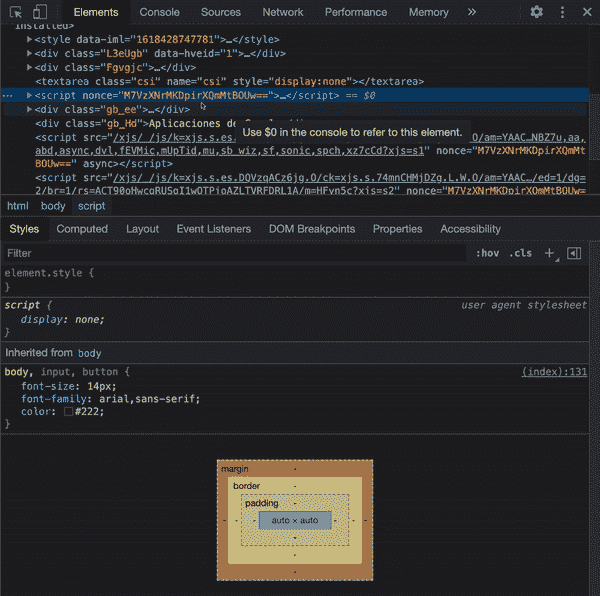
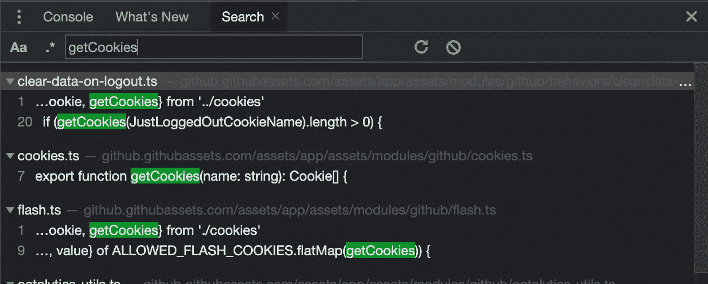
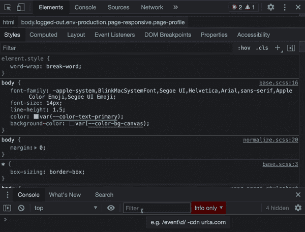
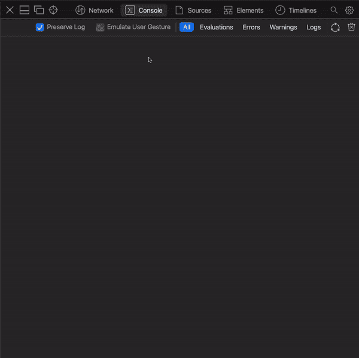
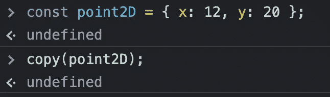
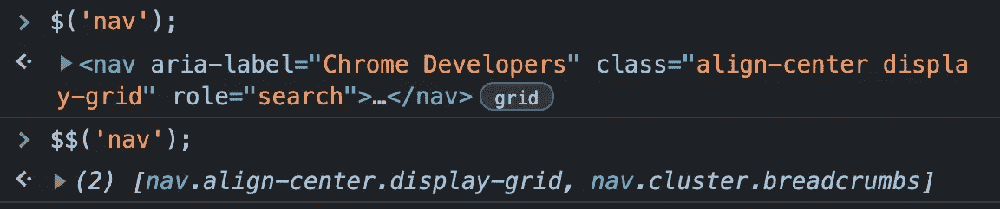
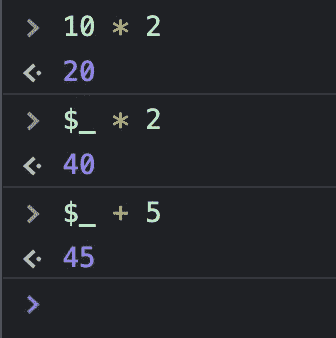
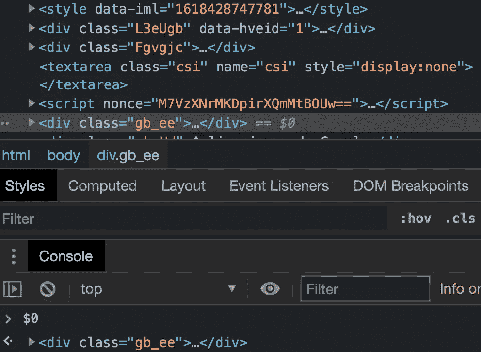
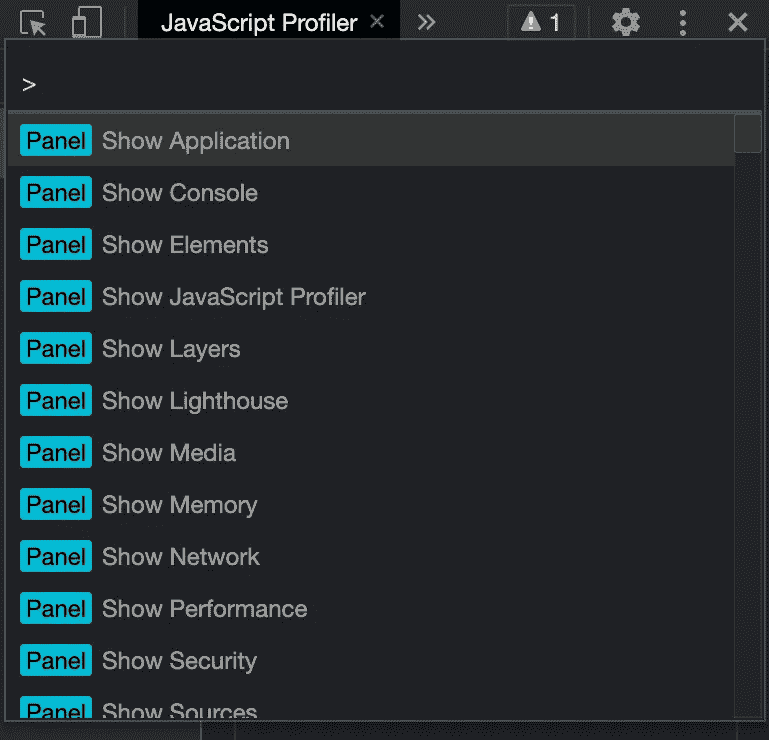
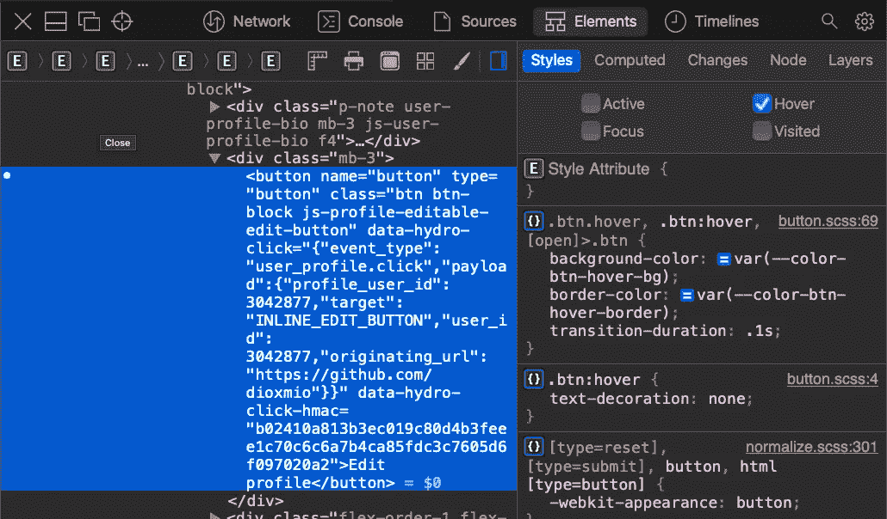

# 5 个浏览器开发工具提示，提升你的 Web 开发技能

> 原文：<https://betterprogramming.pub/5-browser-dev-tools-tips-to-ace-your-web-development-skills-8d1e9dcdd21d>

## 提升你的浏览器编码技能

照片由[西格蒙德](https://unsplash.com/@sigmund?utm_source=medium&utm_medium=referral)在 [Unsplash](https://unsplash.com?utm_source=medium&utm_medium=referral) 上拍摄

作为 web 程序员，浏览器开发工具对于我们的工作已经变得至关重要。多年来，供应商一直在添加越来越多的工具来简化我们的开发工作。每个浏览器都有自己的怪癖和特点，但大多数都有共同点。不幸的是，对我们来说，基于 Blink 的浏览器是功能最丰富的，其他的还有很多要介绍。

你对浏览器开发工具了解多少？您是否投入了一些时间来熟悉新功能？在本文中，我将展示五个最有用和未知的开发工具的特性，使您的日常开发更加容易和高效。

开始之前，请在下面找到每个供应商的键盘快捷键文档参考的完整列表:

*   [勇敢，铬，和边缘](https://support.google.com/chrome/answer/157179?co=GENIE.Platform%3DDesktop&hl=en#zippy=)
*   [火狐](https://developer.mozilla.org/en-US/docs/Tools/Keyboard_shortcuts)
*   [Safari](https://support.apple.com/guide/safari/keyboard-and-other-shortcuts-cpsh003/mac)

# 1.查找 CSS 属性的源

*在 Brave/Chrome/Edge/Firefox/Safari 中工作*

CSS 基于级联算法。这使得很难确定财产是从哪里继承的。

> “**级联**是一种算法，它定义了如何组合来自不同来源的属性值。它是 CSS 的核心，顾名思义:*级联*样式表。这篇文章解释了什么是级联，CSS[声明](https://developer.mozilla.org/en-US/docs/Web/API/CSSStyleDeclaration)级联的顺序，以及这对你这个 web 开发人员的影响。— MDN

幸运的是，使用浏览器工具很容易。你需要做的只是遵循一些步骤:

*   选择要检查的元素。
*   选择计算选项卡。
*   导航到要了解其来源位置的属性。
*   单击箭头导航到 CSS 类。
*   按住 command 键单击或 ctrl 键单击导航到属性的 CSS 源声明。
*   要更好地查看文件，请按底部的{}按钮，这将使文件更美观，更易于阅读。

使用 Chrome 开发工具的示例

“计算”选项卡是一个有用的工具，它将帮助您了解什么应用于您的元素。当试图理解元素的布局时，这通常是一个很好的起点。

# 2.查找特定的 JavaScript 代码

*在勇者/Chrome/Edge/火狐/Safari 中工作*

有时候在浏览器中找到你的代码是一件很困难的事情。有一些繁琐的方法可以做到这一点，比如导航到源代码并查看您的源代码是否在那里。

有两种快速的方法:

**a)** 使用快捷键进行全局搜索:option+command+F 或 ctrl+shift+F...>Blink 浏览器的“搜索”菜单选项。在 Safari 上，只需在开发工具栏上寻找搜索图标。

对于这个例子，我将[github.com/dioxmio](https://github.com/dioxmio)并寻找一个`getCookies`方法。您可以看到我们是如何获得多个搜索结果的。现在的问题是要经历它们。

使用全局搜索的屏幕截图

**b)** 使用 command+P 或 ctrl+P 快捷键。这将打开一个文件搜索，就像在你最喜欢的 IDE 上一样。如果您的源地图在那里并且链接到您的 JavaScript 文件，您将能够找到您正在寻找的文件。如果它最初是在 TypeScript 中，您可以查找那个`.ts`文件。让我们去 github.com/dioxmio，再次搜索 cookie 模块:

使用 Chrome 开发工具捕获

使用 Safari 开发工具采集

在 Firefox 上，你必须在调试器标签下才能工作。

# 3.控制台实用程序

*在 Brave/Chrome/Edge/Firefox/Safari 中工作，有一些变化*

开发人员控制台工具记录与网页相关的信息，如 JavaScript、网络请求和安全错误。要检查所有的控制台日志潜力，检查我的文章[这里](/mastering-the-art-of-console-logging-7518fead4e1a)。然而，控制台不仅仅能够打印日志。

让我们检查一些功能:

*   最常用的方法之一是`clear()`方法，它将简单地清除控制台输出。
*   `copy`方法会将您传递给它的对象/图元复制到剪贴板。

剪贴板现在将包含{ x: 12，y: 20}

*   我们通常使用文档对象来检查 DOM 并执行查询。然而，有一些别名方法可以节省您大量的输入。您可以使用`$`或`$$`来查询 DOM JQuery 样式。`$`是`document.querySelector`功能的别名。`$$`是`document.querySelectorAll`的别名。

使用 Chrome 开发工具捕获

*   `$_`别名将返回最后一个求值的表达式。让我们用一些例子来验证一下:

使用 Chrome 开发工具捕获

*   `$0`、`$1`、`$2`和`$4`变量将包含对元素选项卡中最后选择的节点的引用。根据浏览器的不同，您可能只有`$0`或几个寄存器。当可用时，它们将作为已用节点的堆栈工作。您可以在`elements`视图中选择一个元素，然后使用别名来访问它，而不是花费时间在右边的选择器中。这是一个非常方便的省时方法。

使用 Chrome 开发工具捕获

# 4.命令菜单

*在 Brave/Chrome/Edge 中工作*

这是基于 Blink 的浏览器特有的特性。命令菜单上的可能性是无穷无尽的。有大量的实用工具值得探索。按 command+shift+P 或 ctrl+shift+P 可以调出命令菜单。

使用 Chrome 开发工具捕获

你可以在这里找到详细参考[。](https://developer.chrome.com/docs/devtools/command-menu/)

# 5.切换元素的状态

*在 Brave/Chrome/Edge/Firefox/Safari 中工作*

有时很难检查基于悬停/聚焦/活动/已访问状态的元素。这就是为什么几乎所有浏览器的开发工具都包含了切换元素状态的方法。这将有助于您立即可视化您的元素的行为，并检查它们的 CSS 属性。

在下面的例子中，我选择了一个按钮元素并检查了`hover`状态，这样我可以更好地检查它。

使用 Safari 开发工具采集

# 包裹

如前所述，浏览器现在包含了许多功能。追踪所有东西可能很有挑战性。养成好奇地检查开发工具的习惯将会对你的日常工作生活产生积极的影响。了解你的工具是必须的。

一些浏览器会不时在控制台上宣布一些功能变化。请务必花点时间阅读这些公告。他们会帮助你跟上时代，学习新的东西。

干杯

# 有关系的

 [## 5 个常见的 JavaScript 内存错误

### 避免应用程序内存泄漏的技巧

better 编程. pub](/5-common-javascript-memory-mistakes-c8553972e4c2)