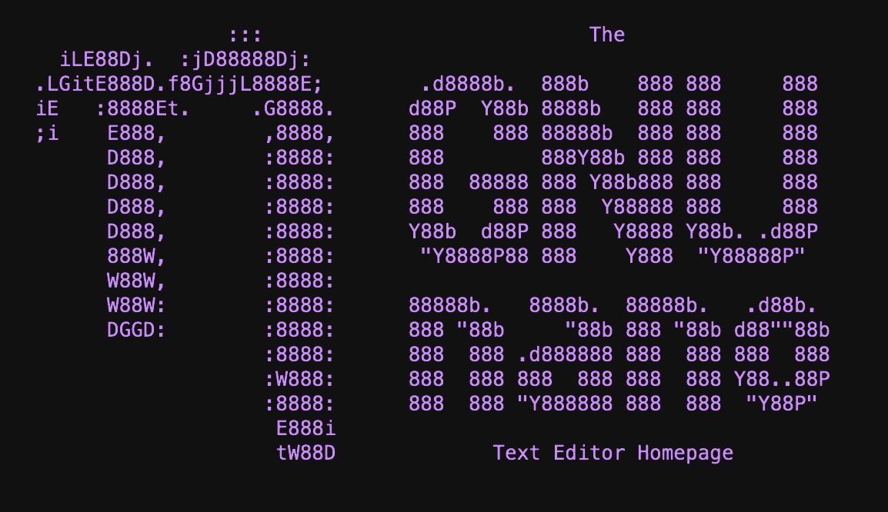

# 在 Linux 中编辑文件的 5 种内置方法

> 原文：<https://betterprogramming.pub/5-built-in-ways-to-edit-a-file-in-linux-c39b2f0b99b2>

## 和几十年前一样管用的经典作品


彼得·冈博斯在 [Unsplash](https://unsplash.com/s/photos/code?utm_source=unsplash&utm_medium=referral&utm_content=creditCopyText) 上的照片

包管理器和第三方插件可以是生产力的惊人奇迹。它们节省时间，并提供简单的方法来扩展应用程序和操作系统的功能。但是当这些工具不可用时会发生什么呢？当你必须完全依赖你的操作系统的时候？当你的网络连接消失时。

在 Linux 世界中，许多发行版都预装了各种奇妙的程序和实用程序。如果您在紧要关头使用离线机器工作或者受到严重限制(空间、政策等)。)可以安装什么软件，那么使用标准工具可能是唯一的选择。

在本文中，我们将探索一些缺省的 Linux 工具，供您处理文本文件。其中一些工具将是真正的文本编辑器，而其他的则是具有广泛特性的通用程序和语言。学习这些永恒的工具将帮助你在有限的系统上工作时更加灵活。

## 1.六(男)


Vim 徽标。[来源](https://upload.wikimedia.org/wikipedia/commons/thumb/9/9f/Vimlogo.svg/128px-Vimlogo.svg.png)。

这是一个经典的、永远有用的编辑器，已经存在超过 45 年了。vi 编辑器提供了一个快速、灵活的可视文本编辑器，您可以用许多不同的方式来扩展和定制它。最棒的是，这个编辑器在几乎所有的 Linux 发行版中都是默认可用的。

一开始使用 vi 可能会令人望而生畏，但是一旦你熟悉了基本的命令集，你很快就能在文件中穿梭自如。下面是一些基本的 vi 命令，可以帮助您入门:


基本 vi 命令。

尽管大多数用户都熟悉 vim，但默认情况下这并不总是可用的。有时 vim 必须通过包管理器单独安装。出于这个原因，熟悉基本的 vi 用法是有益的，不管怎样，大多数 VI 用法都可以直接转化为 vim。

vi 的官方手册页是[,可以在这里找到](https://linux.die.net/man/1/vi)。

## 2.一项 Linux 指令

sed(或“流编辑器”)工具甚至比 vi 还要老( [1974](https://en.wikipedia.org/wiki/Sed) )。这个巧妙的高级程序能够以许多不同的有趣的方式处理文本。尽管 sed 的学习难度很高，但是一旦掌握了定制语法，可能性几乎是无穷无尽的。

为了处理一个文件，sed 循环遍历每一行，并根据用户期望的条件应用不同的操作。sed 中甚至包含了一点编程语言，用于提供复杂的替换和其他精确的选择器。

假设您有一个包含以下文本的文件:

```
# file.txt
foo
bar
baz
foo
bar
baz
```

如果您想要更改某些行并用新文本替换它们，该怎么办？借助 sed，您可以轻松做到这一点。使用就地编辑功能 sed 将只替换匹配`foo`的行:

```
sed -i 's/foo/FOO/' file.txt
```

您可以通过管道在命令行上进行更改，直接调用 sed 进行就地编辑(使用`-i`)或者将 sed 构建到另一个程序中以利用其文本处理能力。有很多方法可以使用这个非常方便的工具。

官方 sed 手册是[这里有](https://www.gnu.org/software/sed/manual/sed.html)。

## 3.毫微；纤（10 的负九次方）



GNU 纳米标志。[来源](https://www.nano-editor.org/)。

虽然不如其功能更丰富的版本 vi 受欢迎，但 nano editor 非常简单，易于上手。这个编辑器很简单，甚至在主窗口的底部包含了基本的使用信息，以防你需要提醒。


主窗口中的基本 nano 帮助信息。

启动并运行 nano 只需要很少的记忆。对于那些只想快速修改文件然后继续前进的初学者来说，这是非常好的。Nano 最适合快速编辑，但由于其有限的功能，不太适合成熟的开发。

查看官方的 nano 文档[，这里有](https://www.nano-editor.org/docs.php)。

## 4.回声

接下来，我们有几乎在任何地方都可以得到的可靠的`echo`实用程序。这不是一个编辑器，但它是一种覆盖或追加文本到文件的快捷方式。如果你想以编程方式向一个文件中添加条目，或者你很着急，你可以`echo`将它们放入。

要用新文本覆盖文件的所有内容，您可以执行如下命令:

```
echo "my cool text" > file.txt
```

如果您只想追加到文件中，您可以运行:

```
echo "some more text" >> file.txt
```

如果您在命令行上处理其他程序的输出，并希望将它保存到一个文件中，并添加一些内容，您也可以这样做:

```
echo "the current date is: $(date)" > file.txt
```

虽然您没有真正的文本编辑器或解析语言的全部灵活性，但是您确实能够毫不费力地将文本保存到文件中。

echo 的非常简洁的手册页是[，可以在这里找到](https://linux.die.net/man/1/echo)。

## 5.AWK


[来源](https://upload.wikimedia.org/wikipedia/commons/thumb/d/d5/The-AWK-Programming-Language.svg/320px-The-AWK-Programming-Language.svg.png)。

《AWK》绝对经典( [1977](https://en.wikipedia.org/wiki/AWK) )，也是另一个有自己专用语言的节目。与 sed 类似，AWK 允许您处理文本文件并操纵其内容。AWK 语言比 sed 语言更健壮，允许更高级的数据提取技术。有了 AWK，你可以很容易地开发一套广泛的规则来精确定位文件中极其特殊的模式。

让我们来看看前面的同一个文本文件:

```
# file.txt
foo
bar
baz
foo
bar
baz
```

假设我们只想获取包含`foo`的行。有了 AWK，我们只需传递一个正则表达式就可以做到这一点:

```
awk '/foo/' file.txt
```

这将输出:

```
foo
foo
```

很简单，对吧？AWK 的优势在于表格数据。假设您有一个包含多列的文件，如下所示:

```
# file2.txt
foo    foo2
bar    bar2
baz    baz2
foo    foo2
bar    bar2
baz    baz2
```

如果你只想得到第二列，你可以这样做:

```
awk '{ print $2 }' file2.txt
```

这将输出:

```
foo2
bar2
baz2
foo2
bar2
baz2
```

虽然 AWK 没有像 sed 一样提供默认的就地编辑文件的方法，但是可以非常容易地将输出通过管道传输到一个新文件。要操作现有文件的内容并保存新文件，您可以使用以下代码片段:

```
awk '{ print $2 }' file2.txt > results.txt
```

现在在`results.txt`文件中，你将只能看到 AWK 的输出。

查看 GNU Awk 用户指南[获取大量关于构建表达式和开始使用 Awk 的文档。](https://www.gnu.org/software/gawk/manual/gawk.html)

感谢阅读！如果你喜欢这篇文章，请看看下面我写的其他几篇 Linux 文章:

*   [*管理服务器应该记住的 5 条 Linux 命令*](/linux-commands-you-should-memorize-if-you-manage-servers-1b7d371237ac)
*   [*使用这些命令*](/become-a-better-apt-user-with-these-commands-ecd7b13fd502) 成为更好的“apt”用户
*   [*用 Ansible*](/build-a-useful-linux-login-banner-on-aws-with-ansible-4c000aba1258) 在 AWS 上搭建一个有用的 Linux 登录 Banner