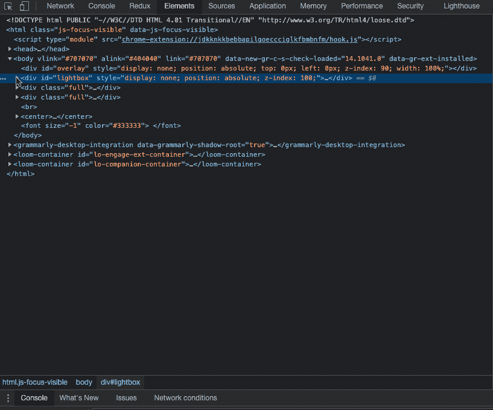
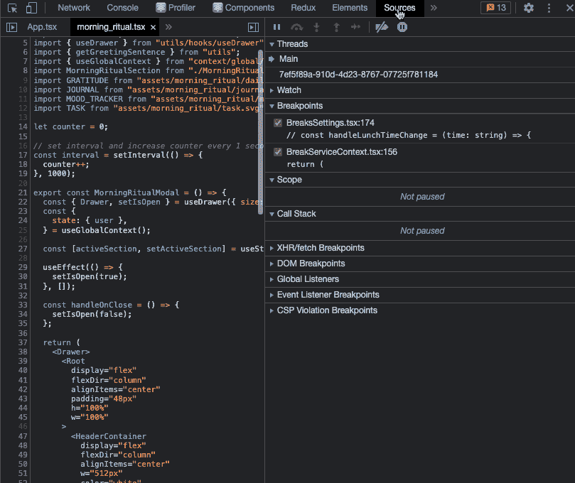
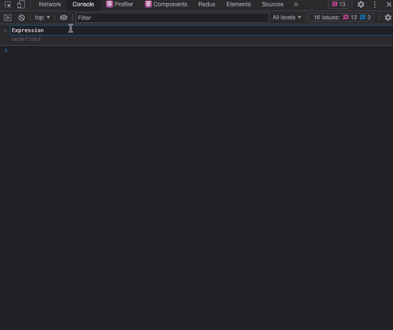
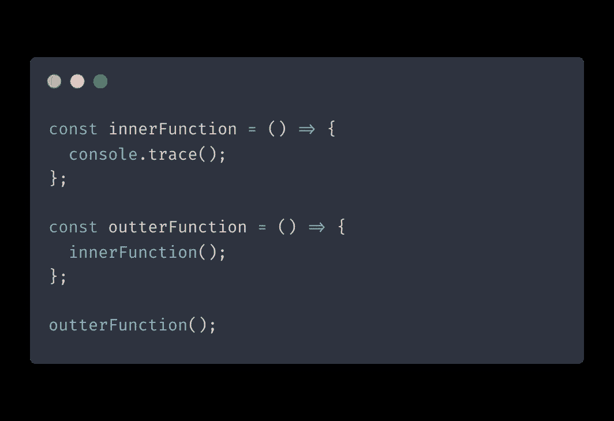
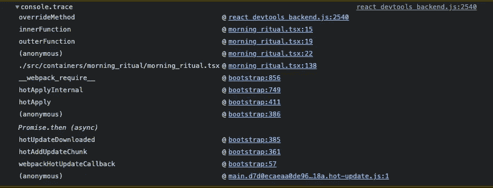

# 让你的生活更简单的 5 个 Chrome DevTools 技巧

> 原文：<https://betterprogramming.pub/5-chrome-devtools-tips-that-will-make-your-life-easier-92e46cebb3f8>

## 我们大多数人都知道 Chrome 的基础知识——比如如何检查页面上的元素——但是在表面之下隐藏着更多的东西

作者图片

Chrome DevTools 是 web 开发人员最好的朋友，它有很多技巧和不太明显的功能，但并不是每个人都知道。

大多数开发人员都知道一些基础知识，比如如何检查页面上的元素，但是在它的表面之下隐藏着更多的功能。本文的目标是揭开一些最有用的鲜为人知的特性的神秘面纱，并向您展示它们能为您的开发过程做些什么。

# 参考 HTML 元素

Chrome DevTools 的一个鲜为人知的特性是引用 HTML 元素的能力。这可以通过两个简单的步骤来完成:

1.  打开 Chrome DevTools 并导航到`Elements`视图。
2.  右键单击您想要引用的元素并选择`Store as global variable`。

现在您有了对 HTML 元素的引用，您可以在控制台中访问和检查它。

# 对数点

日志点是一种向控制台提供调试信息的方式，而不必求助于`console.log()`。自从我第一次听说这个特性，我就一直在使用 Logpoints，它们允许我清理掉我的代码库中的`console.log`语句的碎片。

您可以通过右键单击 DevTools 的 sources 选项卡中的任何一行并指定您想要记录的表达式来添加新的 Logpoint。当该行被执行时，您将在控制台中获得它的值。

# 现场表情

实时表达式是一种在表达式变化时显示其值的功能。这有助于追踪代价高昂的表达式(如动画中使用的表达式)或那些变化很大的表达式(例如，如果您正在迭代一个数组)。

你所需要做的就是点击`Create live expressions`按钮，指定你想要监控的表达式，然后它会自动显示它的值。

# console.trace()

`console.trace()`是一个实用程序，可以让您知道在哪里对某个函数进行了特定的调用。想象一下，你有一个内部函数，在不同的地方被使用，并且引起了一个问题。要根除这个问题，首先必须找出代码中哪个位置调用了它。

`console.trace()`提供了这些信息，因此您所要做的就是将它插入到您想要跟踪的函数中。

注意我们的堆栈跟踪如何显示对`innerFunction`的调用先于对`outterFunction`的调用。

这是解决问题和找出代码中问题所在的好方法。

# 控制台实用程序

控制台实用程序是 Chrome 开发工具功能不可或缺的一部分。控制台实用程序 API 包含一组用于常见任务的便利函数。你可以在这里阅读更多细节[。](https://docs.microsoft.com/en-us/microsoft-edge/devtools-guide-chromium/console/utilities)

两个非常有用的是`$()`和`$$()`，分别代替`document.querySelector()`和`document.querySelectorAll()`。

这些函数返回您期望的节点列表，并将结果转换成数组，这样您就可以使用`map()`和`filter()`。

# 结论

这些只是一些鲜为人知的 Chrome DevTools 特性，可以让你的开发过程变得更容易。通过一点探索，您将能够找到更多有助于简化工作流程的技巧。编码快乐！

*原载于 2021 年 12 月 16 日 https://isamatov.com**的* [*。*](https://isamatov.com/chrome-devtools-tips/)