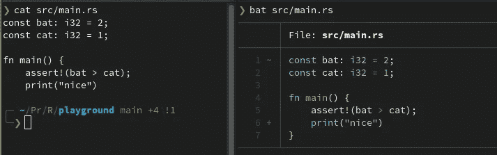
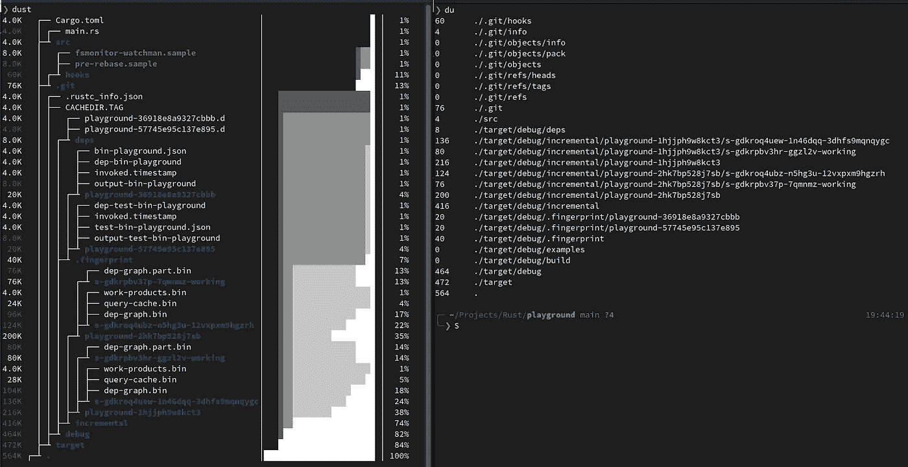
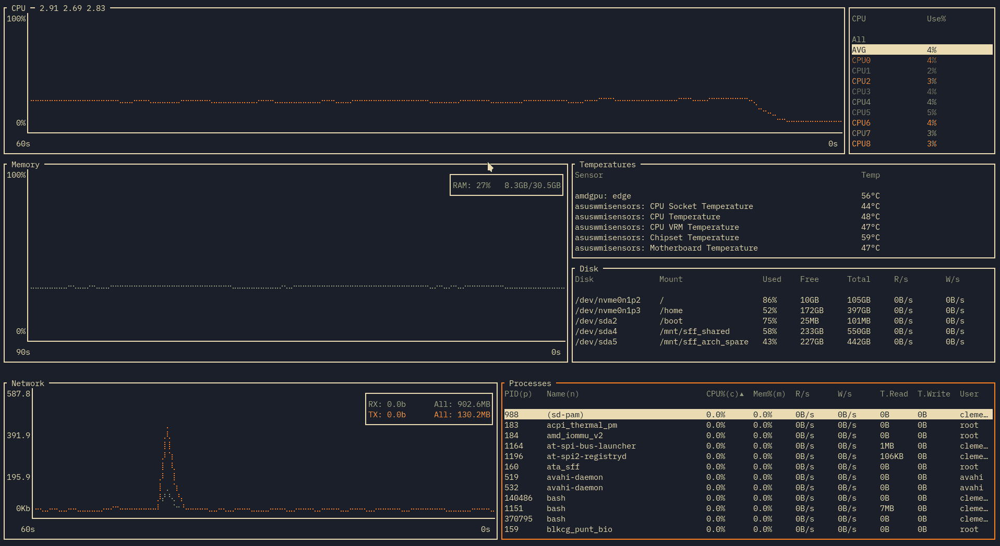
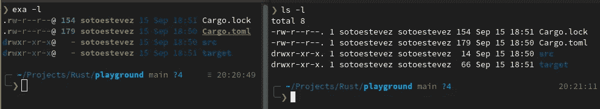

# 5 用 Rust 制作的 CLI 工具来改进已经流行的工具

> 原文：<https://betterprogramming.pub/5-cli-tools-made-with-rust-to-improve-already-popular-tools-506af07b6d54>

## 升级你的一些日常工具


照片由 [Seyed Sina Fazeli](https://unsplash.com/es/@sinaciscox?utm_source=medium&utm_medium=referral) 在 [Unsplash](https://unsplash.com?utm_source=medium&utm_medium=referral) 上拍摄

Rust 开始流行时，社区给它的一个主要目的是重新创建一些更流行的命令行工具。只要你用 Rust 开发了第一个命令行应用，就很容易理解其中的原因。低级语言与 crap[clap](https://crates.io/crates/clap)、 [structopt](https://crates.io/crates/structopt) 或 [console](https://crates.io/crates/console) 等板条箱的结合，以及发布和安装带有货物的板条箱的简易性，使得开发这种类型的软件成为一种乐趣。

今天，我们将看到 Rust 中重写的五个命令行工具，它们带来的改进将吸引您的眼球。

# 蝙蝠

唯一比猫好的东西是什么？一只蝙蝠。嗯，也许不是，至少如果我们谈论的是哺乳动物(虽然我仍然喜欢蝙蝠)，但在终端的背景下，我更喜欢`bat` 而不是`cat`。

[bat](https://github.com/sharkdp/bat) 是一个与 UNIX 内置`cat`相同的命令，但它具有语法突出显示的特点，并与 git 集成，显示文件的差异。因此，对于像我们这样的开发人员来说，这是对一个非常常见的工具的一个很好的改进。



她告诉你不要担心的猫和动物

要安装`bat`，你可以按照[他们的自述](https://github.com/sharkdp/bat#installation)或者直接走 Rustacean 的路。

```
cargo install bat
```

# 里格雷普

T21 速度很快，快得惊人。这是我对它的最佳描述。单从名字上，你就能看出这个箱子的作用:替换`grep`。这些都是大词，因为`grep`是 UNIX 中一个非常方便的递归搜索文本的工具，但是 ripgrep 和它一样，但是更快。

它最初是由 Andrew Gallant 创建的，在其 GitHub 页面上有超过 300 名贡献者。它支持许多编码，可以区分大小写，也可以不区分。git 忽略内容，等等。看看[一些基准](https://blog.burntsushi.net/ripgrep/)它的创建者提供知道我在说什么。

```
cargo install ripgrep
```

# 灰尘

如果说`ripgrep`在速度的基础上升级了`grep`，那么 [dust](https://github.com/bootandy/dust) 就成了专注于简洁、商品和可视化的`du`的替代品。如果您过去使用过`du`，您就会知道该命令是大量文件夹日志记录和关于缺少权限的消息的同义词。

另一方面，运行`dust`，它会给你一个基于终端高度的结果，包括文件夹树，甚至是一个显示磁盘使用情况的图形。一个简单的`dust`电话通常就能提供你需要的所有信息，而不需要添加标记或者让你的终端淹没在文本行中。

它最初是由 Andy Boot 发起的，在 GitHub 上有 30 多个贡献者。

```
cargo install du-dust
```



**dust** 和 **du** 的输出比较

# 底部

现在，如果说与`du`相比，`dust`在数据可视化方面已经是一个很好的跳跃，那么[底部的](https://github.com/ClementTsang/bottom)所完成的甚至更疯狂。这一点上，我不会说什么，只是让图像照顾销售这个可怕的工具给你。



来自 GitHub 库的演示 GIF

你可以在他们的[网页](https://clementtsang.github.io/bottom/nightly/)上获得安装和使用指南。

```
cargo install bottom
```

# 穰（等于 10 的 18 次方）

最后，作为这篇文章的结尾，我们将会看到 UNIX 之王仅次于全能的`ls`。很少有命令我们写得比好的 ol' `ls`多，以至于[哦，我的 zsh](https://ohmyz.sh/) 已经有了很多别名来写得更快，像`l`或`la`。

最后一种情况是唯一一种我没有切换到新的现代工具的情况，但是 [exa](https://github.com/ogham/exa) 可以通过它的额外功能非常有用，比如为不同类型的文件着色或者它与 Git 的兼容性。



**exa** 和 **ls** 左右摇摆

与所有其他工具一样，您可以在该工具的[自述文件](https://github.com/ogham/exa#installation)中找到说明，或者与 cargo 一起使用。

```
cargo install exa
```

仅此而已。我希望你喜欢它，并找到一些日常使用的新工具。回头见！