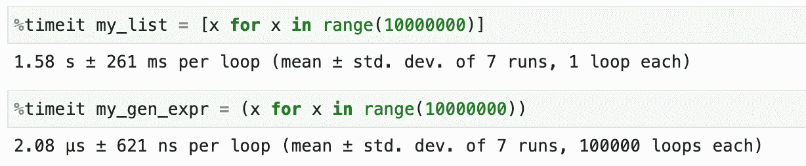
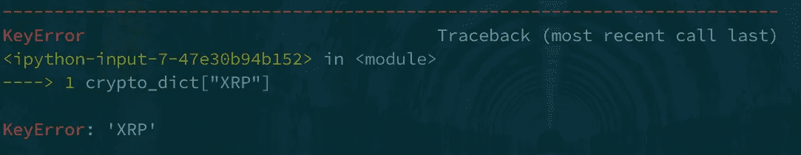

# Python 中的 5 种常见反模式

> 原文：<https://betterprogramming.pub/5-common-anti-patterns-in-python-a9d6443fabe4>

## 当输入量很大时，避免使用列表理解


照片由[卢卡·布拉沃](https://unsplash.com/@lucabravo?utm_source=medium&utm_medium=referral)在 [Unsplash](https://unsplash.com?utm_source=medium&utm_medium=referral) 上拍摄

> “光有代码是不够的。”罗伯特·马丁

Python 是 2021 年最受欢迎的语言之一。

简单的语法使它成为新手程序员的流行选择。

由于动态性和灵活性，Python 开发人员有时很容易编写出错误的、低效的代码。

本文将向读者介绍 Python 中常见的反模式，并提出一些修复方法，这些方法将带来更好的开发实践。

# 1.对可迭代对象使用 map()和 filter()

内置的`map`和`filter`通过[函数式编程](https://www.geeksforgeeks.org/functional-programming-paradigm)的原理帮助我们转换 Python 中的可迭代对象。

这两种方法都接受函数和 iterable 作为参数，并返回相应的对象。

通过将这个对象作为参数传递给 Python 中内置的`list`构造函数，可以将它转换成一个列表。

我们经常使用`lambda`函数作为`map`、`filter`函数的参数:

代码看起来相当笨拙和不清楚。获得相同结果的更好方法是使用 [**列表理解**](https://www.w3schools.com/python/python_lists_comprehension.asp) :

lambda 函数的缺乏使得列表的理解更加易读和简洁。

# 2.大量输入时使用列表理解

列表理解对于编写清晰、简洁的代码来说是非常棒的。

然而，列表理解总是创建 iterable 中每个值的列表。当输入非常大时，这会导致内存问题；它会导致你的机器崩溃。

**G**

要创建它们，你所要做的就是用`()`括号替换列表理解中的`[]`括号。



生成器表达式不是创建一个全新的列表，而是创建一个迭代器。

这个**降低了创建**的速度，而**优化了内存分配**。您可以通过使用`next`函数或循环访问生成器表达式的每个后续元素。

**注意:**
生成器表达式是有状态的，所以在试图重用它们时要小心。如果打算多次使用迭代器，可能需要重新创建它。

阅读 Brett Slatkin 的“[有效的 Python: 90 种编写更好的 Python(第二版)](http://effectivepython.com)的具体方法”中的第 31 项，以便很好地了解如何做到这一点。

# 3.不使用 range()的情况

`range`函数对于整数的迭代很有用。

当迭代列表等可迭代的数据结构时，您可以完全依赖 for 循环语法来访问每一项。代码如下:

然而，当想要访问索引和元素时，我们可以在列表长度上使用`range`方法，如下所示:

代码看起来不可读，因为您必须调用列表上的`len`，然后使用`range`包装输出。为了使它更加 Pythonic 化，我们必须提高代码的可读性。

更好的方法是调用 list 对象上的`enumerate`函数。这将创建一个生成器，生成列表项的索引和值。

这个看起来是不是干净多了？

# 4.缺少字典键的问题是

字典具有快速访问、赋值、插入和删除的能力，这使得它成为一种非常流行的数据结构。

当**试图访问字典**中不存在的键时，新手开发者经常会遇到问题。



处理这种情况的一种方法是检查字典中是否存在该键，下面的代码可以帮助您:

另一种实现方法是使用 try/except 块，如下所示:

上面的代码确实实现了我们的目标，但是我们可以通过使用字典方法`get`来进一步改进它。

您可以使用`get`方法来获取相应键的值，而不是使用方括号`[]`来访问字典的键。

另外，如果键不存在，`get`方法返回`None`，这是有利的，而不是抛出一个`KeyError`。如果没有键而没有`None`，您也可以向`get`方法传递一个参数来获得一个默认值。

# 5.惰性关键字和位置参数设计

Python 函数能够接受**位置**和**关键字**参数。

> 位置参数是后面没有等号(=)和默认值的名称。
> 
> 关键字参数后跟一个等号和一个给出其默认值的表达式。

由于这种设计，python 函数的创建和重用非常灵活。

然而，定义函数时糟糕的设计选择会导致代码中难以修复的错误。

让我们以计算[复利](https://www.investopedia.com/terms/c/compoundinterest.asp)的函数为例:

调用函数时出现的一个问题是，末尾的两个布尔参数`compounded_monthly`和`to_string`很容易混淆。这可能会导致难以跟踪的问题。

我们可以通过如下方式更改函数定义来提高可读性:

通过将两个布尔参数指定为关键字参数，函数调用方可以显式指定他们想要设置的布尔值，这些值将覆盖默认值。

然而，这仍然会导致问题的主要原因是关键字参数是可选的，因此，没有什么会强制调用者使用它们作为关键字参数。

因此，仍然可以使用旧方法调用该函数:

`calculate_compound_interest(100, 5, 2, False, False)`

解决此问题的方法是仅在定义函数时将布尔参数强制为关键字:

我们看到,`*`符号表示位置参数的结束和只有关键字的参数的开始。

现在这样称呼它:

`calculate_compound_interest(100, 5, 2, False, False)`

将导致一个错误:

```
---------------------------------------------------------------------------
TypeError                                 Traceback (most recent call last)
<ipython-input-32-faf75d2ad121> in <module>
----> 1 print(calculate_compound_interest(1000, 5, 2, False, False))TypeError: calculate_compound_interest() takes 3 positional arguments but 5 were given
```

但是，关键字参数及其默认行为仍将保持不变，如下所示:

然而，还有一个问题。

假设调用者决定对前三个必需的参数(`principal`、 `rate`、 `time_in_years`)混合使用位置和关键字。

如果这三个参数的函数参数名称被更改，我们将看到 Python 解释器报错。它会显示如下内容:

```
---------------------------------------------------------------------------
TypeError                                 Traceback (most recent call last)
<ipython-input-36-42e7ec842cd5> in <module>
----> 1 calculate_compound_interest(principal=1000, rate=5, time_in_years=2)TypeError: calculate_compound_interest() got an unexpected keyword argument 'principal'---------------------------------------------------------------------------
TypeError                                 Traceback (most recent call last)
<ipython-input-37-1bc57c40980f> in <module>
----> 1 calculate_compound_interest(1000, 5, time_in_years=2)TypeError: calculate_compound_interest() got an unexpected keyword argument 'time_in_years'
```

因为我们没有考虑调用者显式使用位置参数，所以我们的代码会中断。

Python 3.8 中引入了一个解决方案，我们可以使用`/`参数重新定义函数，该参数指示了位置唯一参数的结束位置。代码如下:

现在像这样调用函数会产生正确的结果:

但是，如果这样叫:

```
calculate_compound_interest(p=1000, r=5, t_in_y=2)
```

然后显示相应的错误:

```
---------------------------------------------------------------------------
TypeError                                 Traceback (most recent call last)
<ipython-input-21-883e876a7e8b> in <module>
----> 1 calculate_compound_interest(p=1000, r=5, t_in_y=2)
      2TypeError: calculate_compound_interest() got some positional-only arguments passed as keyword arguments: 'p, r, t_in_y'
```

我希望这篇文章能帮助你们提高用 Python 开发的工程技能！😃

我将在下面列出一些资源，您可以在这些资源中找到更多这样的反模式示例以及如何使用它们。

下次见！✋

# 资源:

[](https://effectivepython.com/) [## 有效的 Python 书籍:第二版

### 《有效的 Python:第二版》中的每一章都包含了一系列广泛但相关的内容。随意在…之间跳来跳去

effectivepython.com](https://effectivepython.com/) [](https://www.oreilly.com/library/view/fluent-python/9781491946237/) [## 流畅的 Python

### Python 的简单性让您很快变得高效，但这通常意味着您没有使用它必须的一切…

www.oreilly.com](https://www.oreilly.com/library/view/fluent-python/9781491946237/) [](https://realpython.com/products/python-tricks-book/) [## Python 技巧:书-真正的 Python

### 我知道有一个很有才华的 Python web 开发人员——我称他为“Mark”。马克是一个自学成才的程序员，初出茅庐…

realpython.com](https://realpython.com/products/python-tricks-book/)