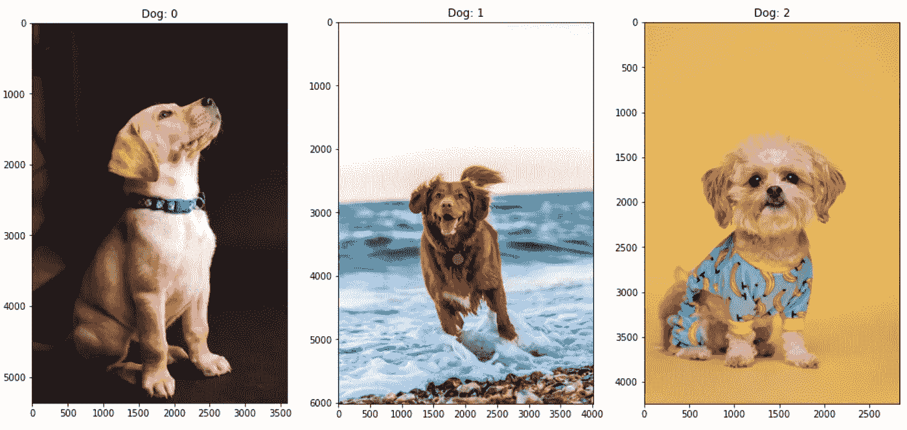
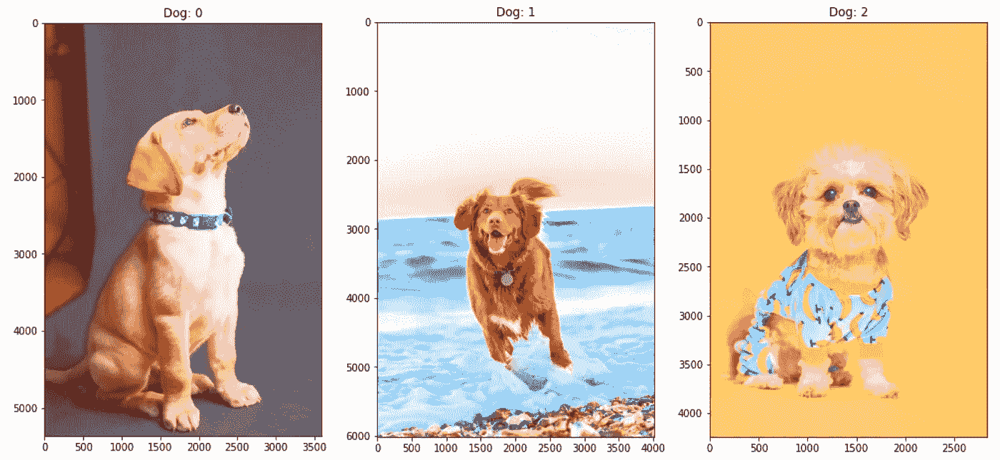
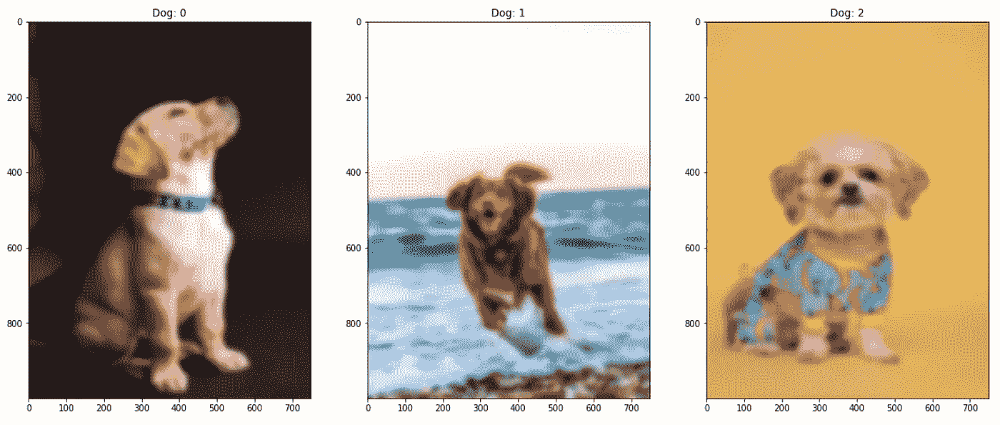
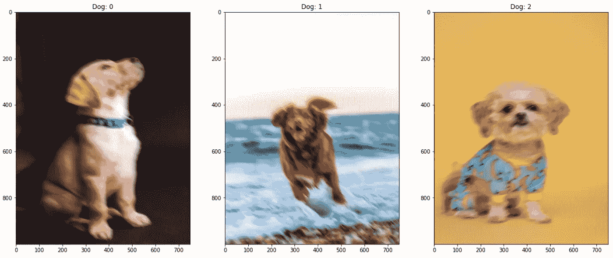
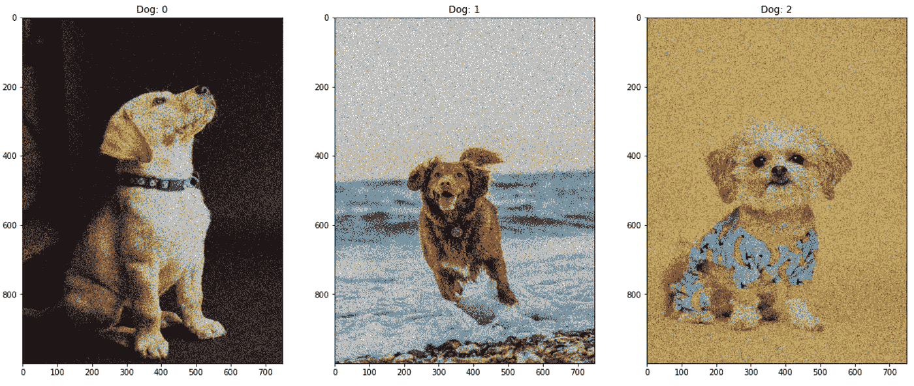
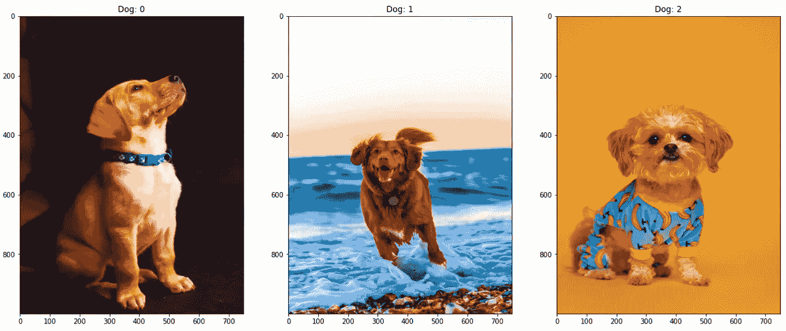
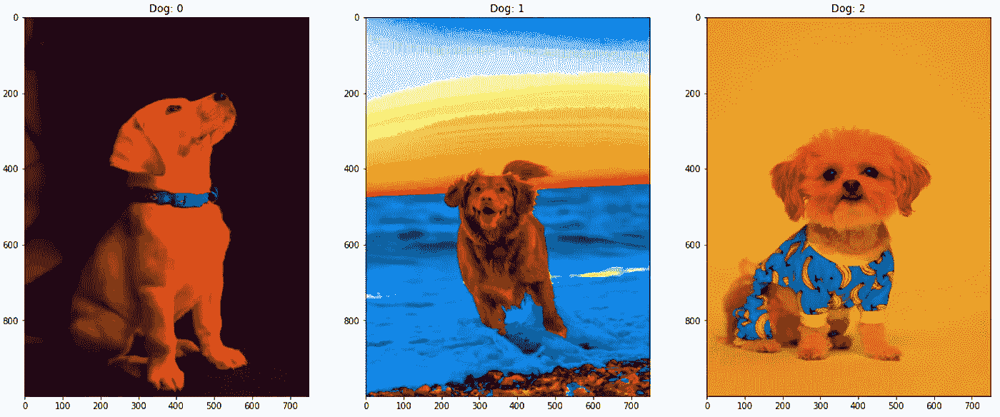
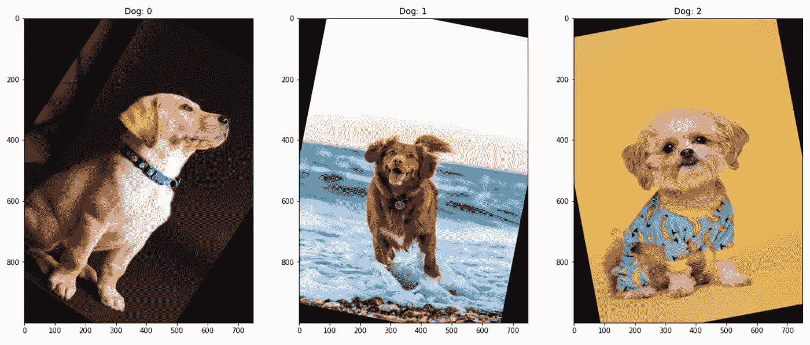
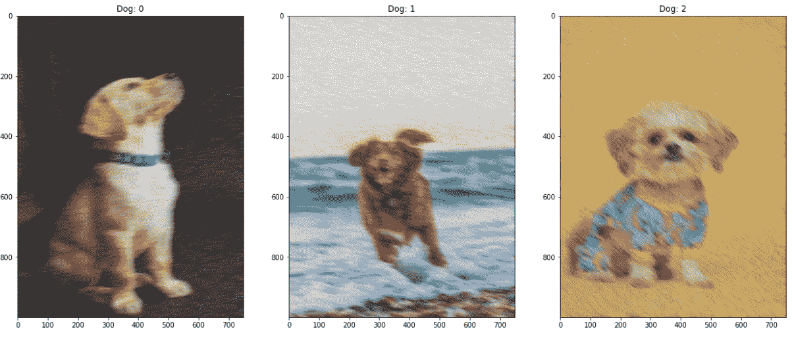

# 5 使用“imgAug”的图像增强机器学习技术

> 原文：<https://betterprogramming.pub/5-common-image-augmentations-for-machine-learning-c6b5a03ebf38>

## 增强从未像现在这样容易进行模型训练


[制作者 UX 设计工作室](https://unsplash.com/@weareprocreator?utm_source=medium&utm_medium=referral)在 [Unsplash](https://unsplash.com?utm_source=medium&utm_medium=referral) 上拍摄的照片

根据维基百科，“数据增强”是指

> 用于增加数据量的技术，方法是添加已有数据的略微修改的副本或从现有数据中新创建的合成数据。

因此，数据扩充需要生成额外的代表性数据。从[机器学习](https://searchenterpriseai.techtarget.com/definition/machine-learning-ML)的角度来看，这些数据扩充是为了减少训练过程中的过拟合数据。

基于现有实例，增强生成修改的训练数据。图像增强提高了模型性能，特别是在短数据集和类不平衡的情况下。

增强是一种非常有效的技术，可以增强我们模型的性能，而不需要额外的数据收集。我们根据原始照片制作新版本的照片，但包含故意的瑕疵。

对于程序员来说，从零开始为大量的训练数据创建复杂的增强函数可能是一项复杂的任务。这就是库`[imgaug](https://github.com/aleju/imgaug)`发挥作用的地方，它非凡的功能被明确设计来帮助图像增强。

本文将深入探讨模型训练中常用的三种流行且必要的扩充。

我们走吧！

# 装置

可以通过以下方式使用 pip 安装`imgaug`库:

```
pip install imgaug
```

或者使用以下方式直接安装最新版本:

```
pip install git+https://github.com/aleju/imgaug.git
```

# 原始图像

在本教程中，我将使用三张取自 Unsplash 的图片。

图片来源:[狗 1](https://images.unsplash.com/photo-1583511655826-05700d52f4d9?ixid=MnwxMjA3fDB8MHxzZWFyY2h8Nnx8ZG9nfGVufDB8fDB8fA%3D%3D&ixlib=rb-1.2.1&auto=format&fit=crop&w=500&q=60)
图片来源:[狗 2](https://images.unsplash.com/photo-1586671267731-da2cf3ceeb80?ixid=MnwxMjA3fDB8MHxzZWFyY2h8N3x8ZG9nfGVufDB8fDB8fA%3D%3D&ixlib=rb-1.2.1&auto=format&fit=crop&w=500&q=60)
图片来源:[狗 3](https://images.unsplash.com/photo-1587300003388-59208cc962cb?ixid=MnwxMjA3fDB8MHxzZWFyY2h8NHx8ZG9nfGVufDB8fDB8fA%3D%3D&ixlib=rb-1.2.1&auto=format&fit=crop&w=500&q=60)



狗的原始图像

# 1.亮度增强

HSV(色调、饱和度、值)是由 A. R. Smith 在 1978 年基于直观的颜色属性开发的颜色空间，通常被称为 Hexcone 模型。这个模型的颜色参数是色调(H)、饱和度(S)和亮度(V)。

使用这个`imgAug`，我们可以调整图像的 V 值。让我们看看下面的片段:

通过调整严重性参数，我们可以增加图像的亮度



亮度随着严重性 2 而增加

# 2.模糊增强

通过计算和分析快速傅立叶变换获得模糊度。傅立叶变换识别图像中存在的频率。如果高频不多，图像就会模糊。由你来定义“低”和“高”

使用这个`imgAug`，我们可以应用不同的图像模糊方法。让我们看看下面的片段:



应用高斯模糊



应用了运动模糊


应用了缩放模糊

# 3.高斯噪声

高斯噪声是一种具有高斯分布的噪声，例如通常观察到的白噪声。它有一个随机值，并处于脉冲状态。

然而，随机值脉冲噪声可以有多种分布。

使用`imgAug`，我们可以使用下面的片段给图像添加不同的噪声方法:


高斯加性噪声



散粒噪声

# 4.饱和增强

饱和度增强类似于色调增强，因为它调整图像的鲜明度。灰度图像是完全去饱和的，部分去饱和的图像具有柔和的颜色，正饱和度会使色调更接近原色。

当野外的颜色不同时(例如，如果使用不同的白平衡)，调整图像的饱和度可以帮助您的模型执行得更好。

使用`imgAug`，我们可以使用下面的代码片段控制图像本身的饱和度:



严重性为 3 的饱和度增加



严重性为 5(最大值)的饱和增强

# 5.旋转

随机旋转是一种常用的数据扩充技术。将源图片顺时针或逆时针随机旋转指定的度数会改变项目在框架中的位置。

也许照片是在整个图像收集阶段水平拍摄的，但在制作过程中，对象可能会以任何一种方式倾斜。随机旋转可以帮助您增强模型，而无需收集和标记额外的数据。

使用`imgAug`，我们可以使用下面的代码片段控制图像本身的旋转级别:



应用于图像的 45 度旋转

# 额外奖励——多次增强

以上所有说明了我们如何对一批图像进行放大。这些图像然后可以被简化成[机器学习](https://searchenterpriseai.techtarget.com/definition/machine-learning-ML)训练。

但是收集增强效果怎么样？

在上面的代码中，我们应用了裁剪增强来从 0 到 16px 之间的任意边裁剪单个图像，这是随机选择的。

高斯噪声和运动模糊以严重性值 5 应用。下面是添加组合增强后的图像。



应用于图像的裁剪、运动模糊和高斯增强

# 能学到什么？

在机器学习中，图像增强技术，如几何变化、翻转、颜色改变、裁剪、旋转、噪声注入和随机擦除，被用于不过度提供模型大量的训练数据。

这使得我们的模型能够学习整体外观，而不是在我们的训练数据中记忆对象的确切外观。

在大多数情况下，增强对于改善训练过程中对真实世界数据的学习是必不可少的，这将适应外部世界不断变化的环境。

我希望这篇短文能启发读者使用上面提供的指南进行数据扩充实验。

*我想连接上* [*LinkedIn*](https://www.linkedin.com/in/premstrk/) *。一定要看看我的网站*[https://www.premstroke.com/](https://www.premstroke.com/)。